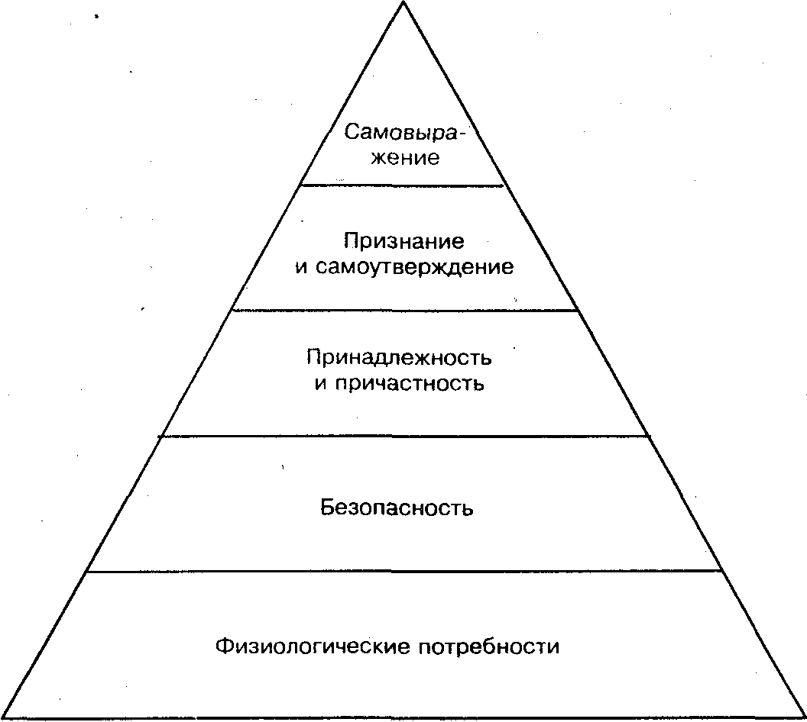
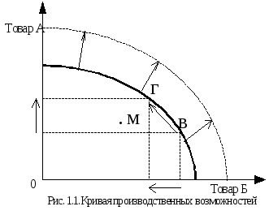
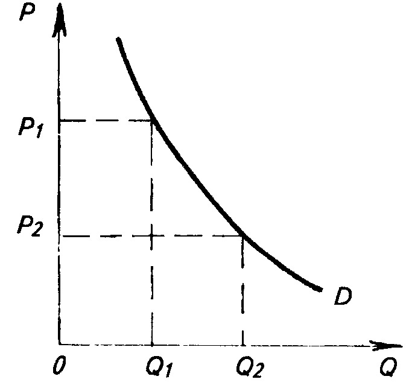
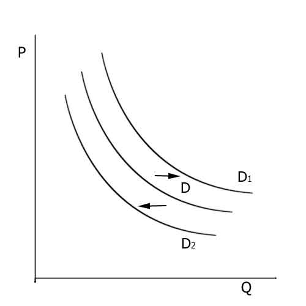
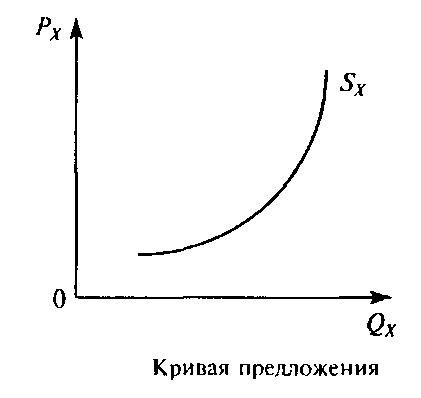
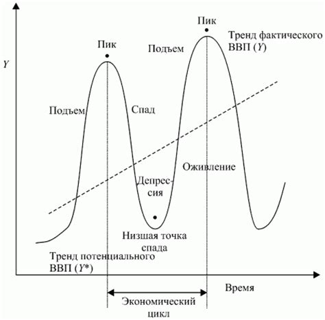
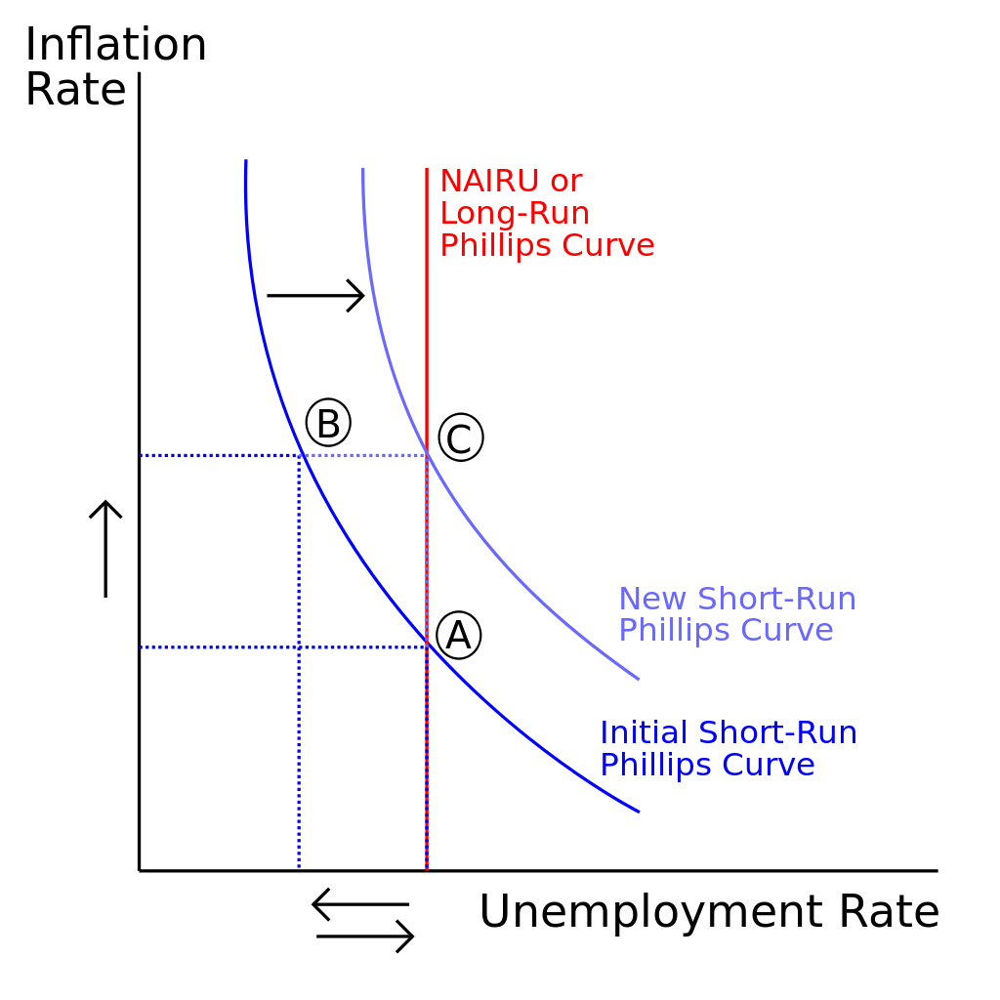

# Экономика

[TOC]

***
[date]: # (4.09.18)

**Современная экономическая теория** — это наука о наиболее общих фундаментальных экономических принципов в жизни общества.

К основным **функциям** экономической теории относятся:

- Познавательная. Заключается в познании экономических явлений и процессов;
- Практическая. Заключается в оценке текущего состояния и обоснования текущей государственной политики;
- Прогностическая. Заключается в разработке научных прогнозов и выявлении перспектив общественного развития;
- Критическая. Заключается в выявлении преимуществ и недостатков в тех или иных экономических процессах;
- Методологическая. Определяет связь экономической теории с другими науками.

## Предмет экономической теории

К предмету экономической теории относят:

### Экономические законы и категории

**Закон** — устойчивая взаимосвязь экономических явлений и процессов. Бывают общие и специальные.

**Экономическая категория** — основное понятие, определяющее суть того или иного экономического процесса.

**Экономические отношения** — отношения, которые складываются между экономическими агентами в процессе экономической деятельности.

**Экономические агенты** делятся на четыре группы: государства, предприятия, банки и домохозяйства.

Структура экономических отношений включает организационно-экономические и социально-экономические отношения.

### Экономические системы

Это совокупность взаимосвязанных элементов, образующих экономическую основу жизнедеятельности общества. Выделяют пять типов экономических систем.

- Чисто рыночная. На практике не существует;
- Современная рыночная (смешанная);
- Командно-административная. На данный момент только в КНДР;
- Переходная. Большинство бывших советских республик;
- Традиционная. Слабо развитые страны.

Основная проблема, стоящая перед любой экономической системой — проблема разрешения противоречия между безграничными потребностями членов общества и ограниченными ресурсами.

Три фундаментальных вопроса, решаемых экономической системой:

- Что производить?
- Как производить?
- Для кого производить?

***
[date]: # (11.09.18)

### Основные формы хозяйствования

- **Натуральное хозяйство** — это форма хозяйствования, при которой продукция производится для внутреннего потребления;
- **Товарное производство** — это форма хозяйствования, при которой экономические отношения между субъектами складываются через куплю-продажу результатов их труда. В современной практике существует две формы товарного производства: простое и расширенное.

В современной практике главными отношениями собственности являются отношения собственности на средства производства. Основная категория товарного производства — товар.

**Товар** — это результат труда, предназначенный для продажи или обмена. Любой товар обладает двумя свойствами.

1. **Потребительная стоимость (полезная)**. Это способность товара удовлетворять какую-либо потребность.
2. **Меновая стоимость**. Это способность товара к обмену.

**Услуга** также является товаром, поскольку обладает его свойствами — потребительной стоимостью и меновой стоимостью. Основные особенности услуги как товара:

- Она не имеет вещественной формы, а проявляется в полезном эффекте;
- Услугу нельзя накопить, т. к. момент производства совпадает с моментом потребления;

### Ресурсы и потребности

**Потребность** — это объективная нехватка чего-либо, нужда в чём-либо. По объектам делятся на первичные и вторичные. Особенность первичных потребностей состоит в том, что их нельзя заменить одну на другую. Вторичные потребности можно заменить одну на другую или их совместить.

*Основное свойство потребностей* — безграничность.

Для удовлетворения потребностей необходимы средства, которые называются благами. Блага, которые находятся в распоряжении общества в ограниченном количестве, называются экономическими. Для производства экономических благ необходимы средства, называемые ресурсами. *Основное свойство ресурсов* — ограниченность.

Все ресурсы делятся на четыре группы:

1. Природные
2. Материальные
3. Людские (человеческие)
4. Финансовые

### Общественное производство и его факторы

**Общественное производство** — это целесообразная деятельность экономических субъектов, направленная на удовлетворение их потребностей. В экономической теории категория производства рассматривается в двух аспектах. В узком смысле производство — это процесс создания материальных благ и социальных услуг. В широком смысле производство включает четыре фазы:

- Собственно производство;
- Распределение;
- Обмен;
- Потребление.

Непрерывно возобновляемый процесс производства называется процессом воспроизводства. Количественно воспроизводство бывает суженным, простым и расширенным.

**Факторы производства** — это элементы, без которых производство в принципе невозможно.
К основным факторам производства относятся:

- Труд;
- Земля;
- Капитал;
- Предпринимательская способность;
- Информация.

### Технологический выбор и граница производственных возможностей

В условиях ограниченных ресурсов в любой экономической системе стоит проблема выбора между производством тех или иных товаров. Этот выбор называется технологическим и обусловлен границами производственных возможностей.

#### Граница производственных возможностей:

Точка М означает, что ресурсы используются не полностью.
Граница производственных возможностей зависит от количества и качества имеющихся ресурсов и от уровня технологий, в том числе — ресурсосберегающих. Чем выше уровень имеющихся технологий, тем больше возможностей у национальной технологии эту границу расширить.

### Методы экономической теории
Это способы, с помощью которых познаётся экономическая действительность. Делятся на две группы:

- Универсальные (общие):
    - Диалектический. В его основе идея о том, что всё развивается и это развитие происходит через борьбу противоположностей;
    - Научная абстракция. Учёный, исследуя определенный экономический процесс, акцентирует внимание на определенной характеристике этого процесса, абстрагируясь от всего остального, так как по его мнению именно эта характеристика определяет сущность данного процесса;
    - Дедукция. От общего к частному. Сначала выдвигается гипотеза, которая затем проверяется на конкретных факторах;
    - Индукция. От частного к общему. Анализируются конкретные факты, а затем делается вывод;
    - Единство исторического и логического. Заключается в переносе исторического опыта на современность с учётом изменяющейся действительности (логики развития);

***
[date]: # (11.09.18)

- Частные:
    - Статистический. Основан на усредненных показателях или на выборочных исследованиях;
    - Математический. Как правило, используется в двух вариантах: как графическое дополнение к теоретическому утверждению или как дополнение в виде формул
    - Системный подход. Экономические процессы рассматриваются как система, имеющая определенную структуру, на которую влияют определенные факторы;
    - Экономический эксперимент. Это воспроизведение экономического процесса с целью его изучения в наиболее благоприятных условиях.

В российской науке используют микро- и макро-подход к изучению экономики. Микроанализ — это исследование экономических процессов на уровне хозяйствующих субъектов, макро- — исследование на уровне национальной экономики. В американской науке используют понятия позитивной и нормативной экономики.

### Рыночные принципы хозяйствования

1. Рынок и рыночная инфраструктура
2. Спрос и предложение. Закон спроса и предложения
3. Эластичность спроса и предложения
4. Рыночная цена и рыночное равновесие

### Рынок и рыночная инфраструктура

Предпосылки возникновения рынка:

- Развитые формы общественного разделения труда
- Частная собственность на средствах производства
- Экономическая обособленность товаропроизводителей
- Свободный обмен ресурсами
- Развитая сфера обмена

**Рынок** — это система экономических отношений, возникающих на основе устойчивого взаимодействия товарного и денежного обращения

Виды рынков:

1. По экономическому назначению
    - Рынок товаров
    - Рынок услуг
    - Рынок капитала
    - Рынок труда
    - Рынок ценных бумаг
 
2. По пространственному признаку
    - Муниципальный
    - Региональный
    - Национальный
    - Международный

3. По степени ограничения конкуренции
    - Монопольный
    - Олигополистический
    - Свободный
  
4. По отраслевому признаку
    - Автомобильный
    - Компьютерный
    - Сельскохозяйственной продукции
    - и т. д.
  
5. По характеру продаж
    - Оптовый
    - Розничный
 
6. С точки зрения соответствия действующему законодательству
    - Легальный
    - Нелегальный

**Рыночная инфраструктура** — это совокупность организационных структур, функционирующих в пределах определенных рынков и обеспечивающих условия для их развития.

| Рынок                    | Инфраструктура                                    |
| ---                      | ---                                               |
| Финансовый               | Банки, страховые компании, фондовые биржи         |
| Труда                    | Биржи труда, центр занятости, кадровые агентства  |
| Потребительских товаров  | Рынок потребительских товаров                     |

Функции рынка:

- Посредническая. Рынок выступает посредником между производителем и потребителем, между продавцом и покупателем;
- Ценообразующая. Рыночная цена устанавливается под воздействием спроса и предложения;
- Информирующая. Рынок через цены несёт определённую информацию для производителей и потребителей;
- Стимулирующая. Рынок стимулирует дополнительной прибылью производителей, предлагающих более качественный товар либо товар, который пользуется постоянным спросом;
- Оздоравливающая (санирующая). Рынок очищает экономику от неэффективных видов деятельности.

Преимущества рынка:

- Свобода выбора;
- Максимальное удовлетворение потребностей покупателя;
- Мобильность рынка;
- * На рынке действует суверенитет покупателя.

[date]: # (25.09.18)

Недостатки рынка:

- Рынок не способствует сохранению невостребованных ресурсов;
- Рынок не гарантирует полной занятости и стабильного уровня цен;
- Рынок порождает экологические проблемы;
- Рынок не заинтересован в производстве общественных благ;

Законы спроса и предложения

**Спрос** — это *платежеспособная* потребность.

**Величина спроса** — это то количество товаров и услуг, которое потребители готовы приобрести по определённой цене в течение определённого промежутка времени.

Закон спроса показывает обратно пропорциональную зависимость между ценой и величиной спроса. Графическая интерпретация закона спроса — кривая спроса:

Нисходящий характер кривой спроса объясняется двумя эффектами: 

- **Эффект дохода**: при снижении цены на товар покупательная способность дохода потребителя увеличивается и он может купить больше данного товара;
- **Эффект замещения**: при подорожании товара спрос на него падает, так как покупатель приобретает аналогичный товар, но более дешёвый

Как исключение из правил, зависимость между ценой на основной товар и спросом на *товар-субститут* прямая.

Товары, спрос на которые растёт по мере роста дохода, называются *нормальными* или *стандартными*. Товары, обладающие невысокими потребительскими качествами, часто называют *товарами Гиффена*. При росте цены на данные товары спрос также растёт, а при снижении цены спрос падает. 

#### Факторы, влияющие на величину спроса

- Ценовой фактор (цена). Влияние ценового фактора изображается движением точки по кривой.
- Неценовой фактор. К неценовым факторам относятся, например: доходы населения, реклама, сезон, мода, качество товара, количество покупателей, ожидания потребителей. Влияние неценовых факторов называется функцией спроса и выражается на графике смещением кривой спроса вправо или влево. 

    
Смещение кривой вправо всегда означает увеличение спроса, смещение влево всегда обозначает уменьшение спроса. 

**Предложение** — это то количество товара и услуг, которое производители готовы предложить по определённой цене в течение определённого промежутка времени.

Закон предложения показывает прямо пропорциональную зависимость между ценой и величиной предложения. Графическая интерпретация закона предложения носит название кривая предложения.

Факторы, влияющие на предложение, также делятся на две группы:

- Ценовой фактор (цена). Влияние ценового фактора на графике выражается движением точки по кривой.
- Неценовой фактор. К ним относятся: цены на ресурсы, технологии, налоги, количество продавцов, государственные субсидии, государственное вмешательство, ожидания производителей. Влияние неценовых факторов называется функцией предложения, на графике проявляется смещением кривой предложения вправо или влево.

***
[date]: # (09.10.18) 

**Олигополия**

- Господство нескольких крупных фирм;
- Контроль над ценами со стороны фирм-лидеров;
- Вход на рынок для конкурентов затруднен;
- Экономическое соперничество основано на неценовой конкуренции;
- Доступ к информации ограничен;
- На рынке олигополии действует принцип всеобщей зависимости, согласно которому ни одна из фирм-лидеров не может проводить независимую ценовую политику. В связи с этим на практике существует две формы взаимодействия между фирмами-лидерами:
    - Тайный сговор
    - Ценовая война

### Виды конкурентной борьбы

- *Ценовая* конкуренция — это борьба между товаропроизводителями за получение дополнительной прибыли за счёт снижения себестоимости без изменения ассортимента и качества продукции;
- *Неценовая* конкуренция — это борьба между товаропроизводителями за получение дополнительной прибыли за счёт улучшения качества продукции, расширения её ассортимента, использования прогрессивных технологий, проведения рекламных кампаний, оказания дополнительных послепродажных услуг и т. д.
- *Недобросовестная* конкуренция — любые действия хозяйствующего субъекта, направленные на получение конкурентных преимуществ и способные нанести материальный ущерб конкуренту либо моральный ущерб его деловой репутации. 

Методы недобросовестной конкуренции:

- Самовольное использование чужого товарного знака
- Распространение ложных сведений о конкуренте, способных нанести ущерб его деловой репутации
- Некорректное сравнение с товарами конкурента в процессе рекламных компаний
- Оказание силового давления на конкурента (*наезд*)
- Прямой обман заказчика (*кидалово*)
- Приобретение коммерческой тайны без согласия конкурента
- Распространение конфиденциальной информации
- Введение в заблуждение потребителя по поводу качества и места производства товара

***
[date]: # (16.10.18)

**Монополия** — господство одной фирмы-продавца. К основным признакам монополизма относятся:

- Высокая степень концентрации хозяйственной деятельности в руках одной фирмы или нескольких объединившихся фирм
- Установление монопольной цены

##### Виды монополий

- *Естественная* монополия — компания, деятельность которой связана с меньшими издержками, чем наличие нескольких компаний данной отрасли. К основным типам естественной монополии относятся:
    - природные — те, деятельность которых связана с добычей и переработкой природных ресурсов
    - технико-экономические — компании отраслей, наличие в которых единственной компании экономически оправдано (например, РЖД)
- *Административная* монополия — компании, которые создаются по решению органов власти и подчиняются отраслевым министерствам
- *Случайная* монополия. Возникает в результате временного превосходства спроса над предложением
- *Искусственная* или *экономическая* монополия. Возникает двумя способами:
    - Концентрация капитала и производства. Когда фирма проводит успешную деятельность, получает высокую прибыль и вкладывает её в своё развитие.
    - Централизация капитала и производства. Когда монополия возникает в результате слияния или поглощения.

##### Формы монополистических объединений

- **Картель** — это объединение фирм, функционирующих в одной отрасли, предусматривающее соглашение об объёмах производства, ценах и разделе рынка. При этом фирмы сохраняют свою производственную и коммерческую самостоятельность. Соглашение заключается устно, никакие бумаги не подписываются. 
- **Синдикат** — это объединение фирм, функционирующих в одной области, предусматривает соглашение о совместном сбыте продукции, а также согласование цен и квот. При этом фирмы сохраняют свою производственную, но теряют коммерческую самостоятельность.
- **Трест** — это объединение множества фирм, в рамках которого фирмы теряют и производственную и коммерческую самостоятельность. Хотя формально являются независимыми, реальная власть принадлежит либо головной компании, либо правлению треста.
- **Концерн** — это объединение десятков фирм, функционирующих в разных отраслях, которые формально остаются самостоятельными, а фактически зависят от головной компании через систему участия. Материнская компания обладает контрольным пакетом акций и контролирует дочерние, дочерние являются самостоятельными юридическими лицами.

#### Монополия и ценовая дискриминация

**Ценовая дискриминация** — это продажа одной и той же продукции по различной цене, или установление различной цены на одну и ту же продукцию. Различают три вида ценовой дискриминации:

1. Первой степени. Это продажа одной и той же продукции или услуг каждому покупателю по индивидуальной цене. 
2. Второй степени. Это установление различной цены на одну и ту же продукцию в зависимости от объёма продаж.
3. Третьей степени. Это установление различной цены на одни и те же товары или услуги в зависимости от эластичности спроса по доходу. 

#### Антимонопольное регулирование

Это система государственных мер правового, финансового, налогового и другого характера, направленных на установление эффективного равновесия между конкуренцией и монополией. 

Цели:

- Усиление и защита конкуренции путём создания препятствий для возникновения неэффективных монополий
- Определение правовых и экономических рамок функционирования необходимых монополий

В экономической теории выделяют два направления антимонопольного регулирования:

- Институциональное — в виде запретов или ограничений на создание самих монополий;
- Функциональное — в виде запретов на злоупотребление монопольной властью. 

В основе антимонопольного регулирования лежит антимонопольное законодательство. Условно все антимонопольные законы делятся на две группы:

- *Антитрестовые* законы направлены на противодействие различного рода объединениям, в рамках которых фирмы теряют свою самостоятельность;
- *Антикартельные* направлены на противодействие тайным сговорам.

***
[date]: # (23.10.18)

#### Методы монополизации экономики 

- Навязывание партнерам дискриминационных условий договора
- Изъятие из обращения товаров с целью создания искусственного дефицита
- Предварительный сговор об искусственном завышении цен
- Навязывание покупателю принудительного ассортимента в качестве условия покупки
- Совмещение руководящих постов одним и тем же лицом в нескольких фирмах

К основным методам борьбы с монополизацией экономики относятся:
- реорганизация фирмы
- ликвидация фирмы
- упрощение процедуры создания новой фирмы
- допуск на внутренний рынок иностранных компаний
- льготное кредитование малых фирм
- государственные субсидии
- налоговые льготы для фирм, впервые пришедших на рынок

## Влияние ценообразования на факторы производства

С точки зрения Маркса, **капитал** — это самовозрастающая стоимость, или стоимость, приносящая прибавочную стоимость. **Прибавочная стоимость** — это продукт, созданный за счёт неоплаченного труда работников, то есть, за счёт эксплуатации. `Д–Т–Д'` — всеобщая форма капитала. `Д'` > `Д` на величину прибавочной стоимости. С точки зрения современной экономической теории, **капитал** — это ресурс длительного пользования, способный в будущем принести доход. 

### Рынок капитала как фактора производства

Рынок капитала как фактора производства включает три сегмента: 

1. Рынок *реального капитала*, где продаются и покупаются производственные фонды
2. Рынок *услуг реального капитала*, где приобретаются или передаются в аренду производственные формы
3. Рынок *ссудного капитала* (рынок заёмных средств, рынок ригидных ресурсов), где приобретаются заёмные средства, необходимые для покупки или аренды производственных фондов

Структура реального капитала включает основной и оборотный капитал.

**Основной капитал** (основные производственные фонды) — это средства производства, участвующие в нескольких производственных циклах (сотни) и постепенно переносящие свою стоимость на конечный продукт. 

**Оборотный капитал** (оборотные производственные фонды) — это средства производства, участвующие в одном производственном цикле и сразу переносящие свою стоимость на конечный продукт. 

#### Кругооборот оборотного капитала

Представляет собой перемещение капитала из сферы обращения в сферу производства и обратно.

Формула кругооброта: 

    I_________   II  III____
    Д — Т — СП — П — Т' — Д'
          \ РС /

`Д` — первоначальный капитал
`Т` — товар
`СП` — средства производства
`РС` — рабочая сила
`П` — производство
`Т'` — результат производства (произведённый товар)
`Д'` — доход, полученный от реализации товара

Процесс кругооборота включает три стадии — I и III в сфере обращения, II в стадии производства — и сменяет три формы: На первой стадии капитал в денежной форме путём приобретения средств производства и рабочей силы превращается в производительную форму, на второй стадии в результате соединения средств производства и рабочей силы капитал из производительной формы превращается в товарную, на третьей стадии в процессе реализации произведённой продукции капитал из товарной формы опять превращается в денежную. Таким образом, капитал осуществляет полный кругооборот.

Капитал, прошедший три стадии и сменивший три формы своего движения, называется **промышленный капитал**.

Постоянно повторяющийся процесс кругооборота капитала называется **оборотом капитала**. При этом время одного кругооборота называется **время оборота капитала**. Это время включает время производства и время обращения. 

**Износ капитала** — это частичная и полная потеря или утрата средствами производства своих потребительских свойств. Различают *физический* и *моральный* износ. Физический износ появляется либо в процессе эксплуатации производственных фондов, либо под влиянием внешних факторов. Моральный износ — это устаревание оборудования в связи с внедрением более прогрессивной техники. Для обновления или восстановления основного капитала фирмы создают амортизационные фонды. **Амортизация** — это часть прибыли, предназначенная для восстановления или обновления основного капитала. Процесс замены изношенного основного капитала за счёт средств амортизационных фондов называется **реновация**.

***
[date]: # (30.10.2018)

#### Рынок ссудного капитала

Это рынок, где приобретаются заёмные средства, необходимые для покупки производственных фондов, основных и оборотных. 

Ценой ссудного капитала выступает *процент*. Основной формой движения ссудного капитала выступает кредит.

**Кредит** — это ссуда в товарной или денежной форме, предоставляемая на условиях срочности, платности и возвратности. Различают *номинальную* и *реальную* процентную ставку.

**Номинальная процентная ставка** — это текущая рыночная ставка процента без учёта инфляции. 

**Реальная процентная ставка** — это ставка процента с учётом инфляции.

Размер процентной ставки зависит от:

- размера ссуды
- срока, на который выдаётся ссуда
- степени риска капиталовложений
- степени монополизации рынка ссудного капитала

### Рынок земли и земельная рента

Земля как фактор производства в экономической теории рассматривается в широком и в узком смысле слова.

В широком смысле слова **земля** — это все природные ресурсы, включая полезные ископаемые, лесные и биологические ресурсы.

В узком смысле слова **земля** — это земельные участки. 

Особенностью рынка земли выступает абсолютно неэлластичное предложение. Основными факторами, определяющими предложение земли выступает плодородие почвы и местоположение земельного участка. По этим факторам все земельные участки делятся на три категории: лучшие, средние и худшие. 

Спрос на рынке земли включает два элемента:

- *сельскохозяйственный* спрос — это спрос на продукцию земледелия и животноводства. Ключевыми факторами выступает плодородие почвы и местоположение, то есть степень удалённости от рынков сбыта
- *несельскохозяйственный* спрос включает, во-первых, спрос на землю для строительства жилья и объектов инфраструктуры, во-вторых, промышленный спрос, то есть спрос на землю под производственные площади, в третьих, так называемый инфляционный спрос, когда растёт спрос на недвижимость в условиях высокой инфляции. Ключевой фактор — местоположение земельного участка

Земельная рента как факторный доход — это доход, получаемый собственником земельного участка. В экономической науке выделяют три основных вида земельной ренты:

- *абсолютная* (чисто экономическая) — доход, получаемый собственником земельного участка независимо от его плодородия и местоположения. Особенностью ценообразования на сельхозпродукцию является то, что общественная цена на неё устанавливается исходя из того, что эта сельхозпродукция произведена на худших землях. 
- *дифференциальная* (диф. рента) — это доход, получаемый собственником среднего и лучшего земельного участка. При этом различают:
    - *диф. рента I* — это доход, получение которого связано с экстенсивными методами ведения хозяйства, то есть увеличением количества используемых ресурсов
    - *диф. рента II* — это доход, получение которого связано с интенсивными методами ведения хозяйства, то есть улучшения качественных характеристик
- *монопольная* — доход, получаемый собственниками земельного участка, обладающего климатическими особенностями

***
[date]: # (06.11.2018)

Особенностью ценообразования на сельскохозяйственную продукцию является то, что общественная цена на нее устанавливается исходя из того, что эта продукция произведена на худших землях.

Земля как фактор производства имеет товарный характер, то есть продается и покупается. Однако, собственник земельного участка, продавая его, продаёт не почву как таковую, а право на получение с этого участка ежегодного дохода — ренты.

В теории цена на землю расчитывается по формуле: 

\\[P = \frac{R}{C} \cdot 100 \% , \\]
 
где `P` — цена, `R` — рента, `C` — ссудный процент.

На практике цена на землю зависит от соотношения спроса и предложения и цели будущего использования участка.

### Рынок труда и зарплата

**Рынок труда** — система социально-экономических отношений по поводу найма и использования рабочей силы в общественном производстве. 

#### Элементы рынка труда

1. Спрос на рабочую силу
2. Предложение рабочей силы
3. Рабочая сила 
4. Цена рабочей силы — зарплата
5. Конкуренция между работодателями за более квалифицированного работника 
6. Конкуренция между потенциальными работниками за лучшие рабочие места 
7. Инфраструктура рынка труда

#### Особенности рынка труда

- Бо́льшая продолжительность взаимоотношений между продавцом и покупателем
- На рынке труда играют большую роль так называемые неденежные факторы
- На рынке труда играют немаловажную роль различные институты (профсоюзы, миграционные службы)

#### Модели рынка труда

- Американская модель: основана на межфирменном перемещении рабочей силы
- Японская модель: основана на внутрифирменном перемещении рабочей силы
- Смешанная (скандинавская)

На рынке труда на его динамику оказывают влияние демографические, экономические, социальные, природно-климатические и правовые факторы.

#### Спрос на рынке труда

Это платежеспособная потребность работодателей в дополнительной рабочей силе. 

На спрос влияют 3 ключевых фактора:

- Уровень зарплаты
- Производительность труда
- Уровень развития НТП (научно-технического прогресса)

#### Предложение на рынке труда

Это совокупность экономически активного населения, предлагающего свою рабочую силу.

Предложение зависит от 3 ключевых факторов:

- Уровень зарплаты
- Демографическая ситуация
- Государственная социальная политика в сфере занятости

#### Зарплата как факторный доход

**Зарплата** — плата работнику за труд. 

На уровень зарплаты влияют следующие факторы:

1. Квалификация
2. Условия труда
3. Стаж
4. Уровень образования
5. Пол
6. Коэффициент уровня жизни (в Москве зарплата выше чем в Калуге)
7. Связи
8. Национальность
9. Место работы (уборщица в банке получает больше, чем уборщица в школе)

В экономической теории выделяют 2 вида зарплаты:

- *Номинальная* зарплата — то количество денежных средств, которое работник получает за свой труд. 
- *Реальная* зарплата отражает покупательную способность номинальной зарплаты и представляет собой то количество товаров и услуг, которое работник может купить на свою номинальную зарплату.

Реальная зарплата зависит от:

- размера номинальной зарплаты
- уровня цен
- налогов

Помимо видов в экономической теории различают 2 формы зарплаты:

1. *Повременная* зарплата. Зависит от количества отработанного времени. Единица измерения  — почасовая ставка. 
    - Простая повременная 
    - Повременно-премиальная
    - Повременно-прогрессивная 

2. *Сдельная* зарплата. Зависит от количества произведённой продукции. Единица измерения — норма времени, норма выработки, поштучная расценка. 
    - Прямая сдельная
    - Сдельно-прогрессивная
    - Сдельно-премиальная
    - Аккордная (на основе договора подряда)

***
[date]: # (13.11.18) 

## Макроэкономика

### Основные макроэкономические показатели и экономический рост

К основным макроэкономическим целям относятся:

- Экономический рост
- Экономическая безопасность
- Справедливое распределение доходов
- Стабильный уровень цен
- Полная занятость

#### ВНП и ВВП как основные макроэкономические показатели

**Валовой национальный продукт** (ВНП) рассчитывается по национальному признаку и представляет собой совокупную рыночную стоимость конечных товаров и услуг, произведённых национальными факторами производства как внутри страны, так и за её пределами. 

**Валовой внутренний продукт** (ВВП) рассчитывается по территориальному признаку и представляет собой совокупную рыночную стоимость конечных товаров и услуг, произведённых внутри страны, независимо от того, кому принадлежат факторы производства.

В закрытой экономике ВНП и ВВП равны. В открытой экономике они отличаются на величину *чистого факторного дохода* ЧФД:

\\[ВВП = ВНП - ЧФД\\]

**Чистый факторный доход** (ЧФД) — это разница между доходами от национальных факторов производства в других странах и доходами от зарубежных факторов производства внутри страны.

В экономической теории и практике различают номинальный и реальный ВВП.

*Номинальный* ВВП — это ВВП, рассчитанный в текущих рыночных ценах.

*Реальный* ВВП — это ВВП, рассчитанный в ценах базисного года. Реальный ВВП можно рассчитать с помощью дефлятора ВВП, который характеризует изменение среднего уровня цен на все товары за определённый период:

\\[ВВП_р = \frac{ВВП_н}{Д_{ВВП}}\\]

Дефлятор ВВП рассчитывается как отношение индекса цен текущего года к индексу цен базисного года:

\\[Д_{ВВП} = \frac{I_т}{I_б} = \frac{P_т \cdot Q_т}{P_б \cdot Q_б}\\]

##### Методы расчёта ВВП

В экономической теории и практике существует три метода расчёта ВВП:

1. Расчёт ВВП по расходам. При расчёте по этому методу суммируются потребительские расходы `C`, валовые частные инвестиции `I`, государственные закупки `G`, чистый экспорт `NX`. 
    - Потребительские расходы — это расходы населения на приобретение повседневных товаров, товаров длительного пользования и оплату услуг. Сюда не включается покупка населением ценных бумаг, а также расходы населения на приобретение жилья.
    - Валовые частные инвестиции представляют собой сумму чистых инвестиций `ЧИ` и амортизаций `А`.
        - Чистые инвестиции — инвестиции, которые приводят к росту реального капитала фирмы. Они включают инвестиции в оборудование, инвестиции в промышленное строительство, инвестиции в жилищное строительство и инвестиции в товарно-материальные запасы. При расчёте ВВП учитывается не стоимость товарно-материальных запасов, а изменения в запасах. Не учитываются при расчёте ВВП сделки с ценными бумагами.
    - Госзакупки — это расходы государства на закупку товаров и услуг для общественных нужд, на зарплату работников бюджетной сферы; сюда также включаются субсидии государственным предприятиям, а также государственные инвестиции. В госзакупки не включаются выплаты по госдолгу, сделки с ценными бумагами, а также трансферты населению. 
    - Чистый экспорт — это разница в денежном выражении между экспортом и импортом. 
2. Расчёт ВВП по доходам. При расчёте по этому методу суммируются факторные доходы `ФД` и косвенные налоги `КН`.
    - Факторные доходы включают: ренту, процент, зарплату, прибыль и доходы собственников. Это доходы (прибыль) некорпоративного сектора: Прибыль индивидуального предпринимателя, фермерских хозяйств, товариществ, партнёрств и так далее.
    - Косвенные налоги — налоги, которые включаются в цену товара.
3. Расчёт ВВП по добавленной стоимости. При расчёте по этому методу суммируется добавленная стоимость, произведённая всеми фирмами в стране \\(ДС_i\\). Этот метод используется в российской практике.
    - **Добавленная стоимость** — это разница между совокупной выручкой фирмы и её расходами на приобретение промежуточной продукции у других фирм.

#### Система национальных счетов

**Система национальных счетов** (СНС) представляет собой комплекс таблиц, имеющих форму бухгалтерских счетов, в которых отражаются процессы производства, распределения и перераспределения общественного продукта и национального дохода.

К основным показателям системы национальных счетов относятся:

- Чистый внутренний продукт `ЧВП` — разница между ВВП и амортизацией. Характеризует объемы национального производства в денежном выражении.
- Национальный доход `НД` — разница между ВВП и косвенными налогами. Характеризует, сколько общество заработало в результате экономической деятельности.
- Личный доход `ЛД` — национальный доход `НД` - налог на прибыль `НПр`, обязательные социальные взносы `ОбСВз`, нераспределённая прибыль корпораций `НПК` + трансферты `Тр`.
- Располагаемый доход `РД` — личный доход `ЛД` - индивидуальные налоги `ИН`: подоходный налог, налог на имущество, налог на наследство.

##### ВВП и чистое экономическое благосостояние

**Чистое экономическое благосостояние** (ЧЭБ) — показатель, предложенный для характеристики уровня благосостояния общества Нордхаусом и Самуэльсоном, который включает ВВП, теневую экономику `ТЭ`, самообслуживание `СО`, досуг `Дос`, минус экономические проблемы `ЭПр`. Теневая экономика включает в себя виды деятельности, не носящие деструктивный характер. Этот показатель используется только в экономической теории, поскольку не существует методики его расчёта.

#### Экономический рост. Понятие и типы

**Экономический рост** — это количественное и качественное совершенствование общественного продукта и факторов его производства. Главная цель экономического роста — рост благосостояния общества и национального дохода. Экономический рост измеряется двумя способами: 

1. Годовыми темпами роста ВВП
2. Годовыми темпами роста ЧВП

В экономической теории выделяют два основных типа экономического роста:

- *Экстенсивный* экономический рост — рост, реализующийся за счёт вовлечения в общественное производство дополнительных ресурсов — за счёт количества.
- *Интенсивный* экономический рост — рост, который обеспечивается за счёт улучшения качественных характеристик имеющихся ресурсов. Для высокоразвитых стран характерен интенсивный рост.
- *Смешанный* экономический рост — совмещает оба основных типа.

К факторам, влияющим на темпы экономического роста, относятся:

- природные ресурсы
- реальный капитал
- технологии
- труд
- человеческий капитал

***
[date]: # (27.11.18)

### Макроэкономическая нестабильность и её формы

Под **макроэкономической нестабильностью** подразумевается цикличность развития экономики. 

**Цикличность** — это такая форма развития национальной экономики, при которой происходит движение от одного макроэкономического равновесия к другому. 

Колебание уровня деловой активности и фактического ВВП, когда периоды спада сменяются периодами подъёма, называется **экономический цикл**.

Экономический цикл включает 4 фазы.

- I. Фаза оживления (подъёма)
- II. Фаза пика (бума)
- III. Фаза спада
- IV. Фаза кризиса

#### Безработица

**Безработица** — это социально-экономическое явление, при котором часть трудоспособного населения не занята в общественном производстве.

В общей численности населения выделяют категорию *трудоспособного* населения, которая, в свою очередь, делится на две части. Первая часть — общая численность рабочей силы. \\(L = E + U\\), где `E` — занятые, `U` — безработные. **Безработные** — это люди, которые не имеют работы, но активно её ищут. Вторая часть — не включаемые в численность рабочей силы `NL`. Это люди, которые не имеют работы и по той или иной причине не ищущие её. Сюда входят студенты дневной формы обучения, домохозяйки, инвалиды, заключённые, бродяги, лица, проходящие службу в ВС. 

##### Виды безработицы

- *Фрикционная*. Связана с поиском работы. Причина — несовершенство информационного обеспечения. Этот вид всегда присутствует в экономике. К фрикционным безработным относятся уволившиеся по собственному желанию, уволенные по решению администрации, нашедшие работу, но ещё не приступившие к ней. Разновидностью фрикционной безработицы является *сезонная* безработица, связанная с сезонными колебаниями спроса на рабочую силу.
- *Структурная*. Связана с изменениями в отраслевой структуре экономики. Причина — несоответствие структуры рабочей силы структуре рабочих мест. К структурным безработным относятся уволенные с работы и не нашедшие новую в силу узкой специализации и выпускники высших учебных заведений, впервые пришедшие на рынок труда, чья специальность уже не востребована. Разновидностью структурной безработицы является *технологическая* безработица, связанная с вытеснением живого труда.
- *Циклическая*. Связана с общим спадом производства. Причина — экономический кризис.

##### Показатели безработицы

**Уровень безработицы** — отношение количества безработных к общей численности рабочей силы

\\[ u = \frac{U}{L} \cdot 100 \% = \frac{U}{E+u} \cdot 100 \% \\]

**Естественный уровень безработицы** — это минимальный возможный уровень безработицы в стране

\\[ u* = u_{фр} + u_{стр} \\]

С этим показателем связано понятие **полная занятость** — когда фактический уровень безработицы в стране не превышает естественный.

**Фактический уровень безработицы** 

\\[ u_{факт} = u* + u_{цикл} \\]

##### Последствия безработицы 

Делятся на две группы:

- *Неэкономические*
    - Рост заболеваемости
    - Рост смертности
    - Рост преступности
    - Рост социальной напряжённости
- *Экономические*
    - Недовыпуск ВВП. Закон Оукена: \\( \frac{ВВП_ф - ВВП_п}{ВВП_п} \cdot 100 \% = -\beta ( u_ф - u* ) \\). Если фактический уровень безработицы в стране превышает естественный на 1 %, то недовыпуск ВВП составит 2,5 %. \\( ВВП_п \\)  — ВВП в условиях полной занятости. \\( \beta \\) — коэффициент Оукена. \\( \beta > 1 \\). Минус перед \\( \beta \\) означает обратную зависимость.
    - Сокращение совокупного спроса
    - Рост налогов

***
[date]: # (4.12.18) 

#### Инфляция

**Инфляция** — это процесс обесценивания денег. На практике проявляется в росте общего уровня цен. 

Причины инфляции

- Денежная эмиссия, не покрытая товарной массой
- Монополизм предприятий
- Дефицит госбюджета
- Наличие инфляционной спирали
- Система налогообложения

Классификация инфляции

- С точки зрения причин
    - *Инфляция спроса* — спрос превышает предложение, рост цен вызван дефицитом товара.
    - *Инфляция издержек* — рост цен провоцируется ростом цен на ресурсы.
- По темпам роста
    - *Умеренная*, *ползучая* — рост цен до 10 % в год.
    - *Высокая* — 10...20 %
    - *Галопирующая* — 20...200 %
    - *Гиперинфляция* — более 200 % в год.
- По ожидаемости
    - *Ожидаемая* прогнозируется заранее.
    - *Непредвиденная*
- По открытости
    - *Открытая*, когда имеет место запланированный рост цен.
    - *Скрытая* проявляется в дефиците.
- По сбалансированности
    - *Сбалансированная*
    - *Несбалансированная*, когда на различные товарные группы цены растут неравномерно. 

Основным показателем является **уровень инфляции**.

\\[ \pi = \frac{P_t - P_{t-1}}{P_{t-1}} \cdot 100 \% \\]

В качестве общего уровня цен используется ИПЦ — индекс потребительских цен, который рассчитывается на основе стоимости потребительской корзины. Чем меньше наименований входит в потребительскую корзину, тем менее реалистичная получается картина.

Последствия инфляции

- Снижение реальных доходов населения
- Скрытая конфискация денежных средств, то есть обесценивание сбережений
- Падение интереса к долгосрочному инвестированию
- Перераспределение доходов
- Ухудшение условий жизни у категорий населения, имеющей фиксированный доход

Издержки инфляции

1. *Издержки стоптанных башмаков* — в связи с поиском способов инвестиций.
2. *Издержки меню* — издержки, которые несут фирмы-продавцы.
3. Нарушение принципов налогообложения. 

Между уровнем безработицы и уровнем инфляции существует взаимосвязь — кривая Филлипса.

**Государственная антиинфляционная политика** — это система мер, направленная на регулирование инфляционных процессов. Выделяют *активную* направлена на ликвидацию причин, вызвавших инфляцию и *пассивную* или *адаптивную*, направленную на приспособление к инфляции и смягчение её последствий.

Меры активной политики: 

- Сокращение госрасходов
- Решение проблемы бюджетного дефицита
- Уменьшение денежной массы
- Увеличение ставки рефинансирования
- Увеличение нормы обязательных резервов

Меры адаптивной политики:

- Индексация доходов
- Заключение соглашения о замораживании цен с крупным бизнесом

#### Методы стабилизации денежного обращения

Это частичное или полное преобразование денежной системы.

**Дефляция** — это сокращение денежной массы путём изъятия из обращения избыточных денежных знаков.

**Деноминация** — это изменение нарицательной стоимости денежных знаков путём укрупнения.

**Девальвация** — уменьшение обменного курса национальной валюты по отношению к иностранной.

**Ревальвация** — обратный процесс, повышение обменного курса национальной валюты по отношению к иностранной.

**Нуллификация** — изъятие из обращения старых денежных знаков и выпуск новых.

***

