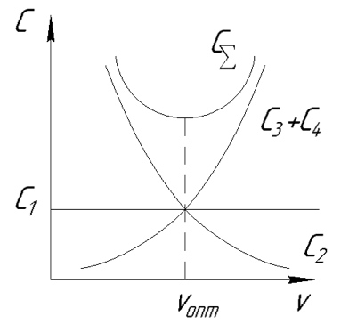

# Автоматизированные системы управления технологическими процессами

[TOC]

***
[date]: # (13.02.19)

## Введение

**Автоматическая система управления** (АСУ) – человеко-машинная система, обеспечивающая автоматизированный сбор и переработку информации, необходимой для оптимизации управления в различных аспектах человеческой деятельности.

**Автоматическая система управления технологическими процессами** (АСУ ТП) — автоматическая система управления для выработки и реализации управляющих воздействий на технический объект управления в соответствии с принятым принципом качества управления.

В процессе производства изделий ЭВМ (вычислительная техника) является в настоящее время главным техническим средством. Автоматизированы процессы конструирования изделий, проектирования технологии изделий, и возникает необходимость автоматизировать процесс изготовления изделий. В результате получается так называемое интегрированное производство, где все процессы, от конструирования до изготовления, автоматизированы. Появляется возможность безлюдных технологий, создание гибких производств. Поэтому задачей является выяснить возможности применения ЭВМ для целей управления технологией. Важно найти оптимизационный подход к созданию и эксплуатации АСУ ТП, то есть выбрать лучшую с точки зрения выбранного критерия систему управления. Может показаться, что создание АСУ ТП — чисто конструкторская задача, но необходимо исходить из того, что технолог выбирает критерии будущей АСУ ТП, то есть ставит задачу — чем надо управлять чтобы достичь оптимального значения критерия, а создатель АСУ ТП воплощает решение задачи материально, после чего технолог использует результаты проектировщиков.

## Понятие об управлении

Под **управлением** понимается процесс организации такого целенаправленного воздействия на объект, в результате которого объект переходит в требуемое (целевое) состояние. В нашем случае объектами являются технологические процессы обработки деталей на станках или сборки узлов и изделий. Цель — некоторые предполагаемые состояния процесса обработки, которых желательно достигнуть, и которые сами собой, без вмешательства человека (без управления), не реализуются. Целью, как правило, является производительность, себестоимость, точности и так далее. Источник цели, как правило, технолог, который знает потребности производства.

Воздействие на объект \\(X\\) переводить объект в состояние \\(Y\\). Если состояние \\(Y\\) объекта удовлетворяет потребителя, то никакого управления не требуется; если не удовлетворяет, необходимо организовать воздействие \\(X\\) на объект, которое переведёт его в новое состояние, удовлетворяющее потребителя. Это воздействие и есть управление. Коротко можно сказать: **Управление** — способ достижения поставленной цели.

Необходимо помнить, что за управление всегда надо платить. Это, прежде всего, затраты на сбор информации, выработку сигналов управления, реализацию управления и так далее. Если цели важны, то, как правило, идут на создание системы управления.

## Понятие о системах управления

Любой процесс управления включает следующие функции:
1. Получение (сбор) информации о состоянии объекта путём измерения выходной переменной \\(Y\\). Для этого, как правило, используются датчики.
2. Обработка информации о состоянии выходной переменной \\(Y\\) и сравнение полученного результата с требуемым. Используется вычислительная техника.
3. Принятие решения об изменении состояния объекта и реализации этого решения. Используются ЭВМ и исполнительные механизмы.
Таким образом система управления включает в себя ряд подсистем, выполняющих перечисленные функции: подсистема сбора информации, подсистема обработки информации, подсистема управляющих воздействий и так далее.

Система управления далеко не всегда реализуется в металле. она может быть реализована в виде правил, договоров, алгоритмов, которые реализуются в процессе управления.

Под **алгоритмом управления** понимают чёткое недвусмысленное правило, *что* и *как* надо делать, чтобы добиться заданной цели (например, инструкция по эксплуатации бытовой техники).

Таким образом, основными факторами, присущими любой системе управления, являются:

- цель управления
- информация о состоянии объекта и окружающей среды
- воздействие на объект
- алгоритм управления

Если из перечисленных факторов исключить хотя бы один, управление будет невозможным, а система управления — бессмысленной. Решение о создании системы управления и степени её автоматизации необходимо начинать с анализа сложности объекта управления. Управление простыми объектами в настоящее время не представляет труда, а управление сложными объектами (системами), как правило, требует создания системы управления.

## Технологический процесс как сложная система (сложный объект управления)

Современные технологии механической обработки и сборки в силу ряда причин следует рассматривать как сложные процессы. Основные из этих причин:

- обилие влияющих на процесс факторов
- неопределённость ряда параметров при резании
- случайный характер целого ряда факторов и параметров при резании и сборке
- нестационарность процесса резания, в первую очередь из-за износа инструмента

Наличие указанных причин вызывает трудность при аналитическом определении оптимальны условий резания. Отсюда, трудно обеспечить получение детали заданного качества при наименьших трудовых затратах и себестоимости изготовления. Возникает необходимость в системном подходе к решению задачи управления технологией обработки и сборки. Таким образом, процесс механической обработки (сборки) рассматривается как сложная стохастическая система.

Понятие «сложная система» широко используется в науке системотехнике. Используются системные методы анализа и исследования, широко применяя математическое моделирование, системотехника позволяет решать вопросы моделирования, создания, эксплуатации сложных систем. В системотехнике под **сложной системой** понимают объект, части которого (подсистемы и элементы) также можно рассматривать как системы, взаимосвязь которых образует целостные свойства объекта. Расчленение сложной системы на подсистемы и элементы является условным и, в принципе, сами элементы системы могут рассматриваться как сложные системы. В нашем случае такой сложной системой является система СПИД, которая состоит из подсистем, каждую из которых можно рассматривать как сложную систему. Необходимо помнить, что свойства сложной системы определяются не только простым суммированием свойств отдельных элементов, но и свойствами структуры, взаимодействием между подсистемами и рядом других свойств.

Отметим признаки процесса обработки резанием как сложной подсистемы:

1. Большое число взаимосвязанных и взаимодействующих между собой элементов
2. Сложность функции, выполняемой системой, направленной на достижение цели функционирования
3. Возможность разбиение системы на подсистемы, цели функционирования которых подчиняются общей цели функционирования всей системы
4. Наличие информации о процессе и необходимость управления им
5. Наличие взаимодействия с внешней средой и функционирование в условиях воздействия случайных факторов

Необходимость управления сложной системой является важной чертой процесса её функционирования, причём управление должно быть, в определённом смысле, наилучшим, или оптимальным.

## Трудности, связанные с созданием АСУ ТП

1. Полное или частичное отсутствие математического описания процессов, протекающих при механической обработке. Под математическим описанием подразумевается наличие алгоритма или формул вычисления состояния объекта \\(Y\\) под наблюдением его входов (воздействий). Воздействия могут быть управляемыми и неуправляемыми. Не зная математического описания процессов, имеем сложную систему типа «чёрный ящик». Так как АСУ ТП содержит для целей управления вычислительную технику, приходится создавать математические модели сложной системы, то есть, делать чёрный ящик более прозрачным.
2. Случайность (стохастичность) поведения сложных объектов управления. Поведение сложной системы порой бывает неожиданным для пользователя из-за действия случайных факторов. Иногда эти неожиданности не учитывают и считают второстепенными, или называют шумом. Нежелательно учитывать случайность при создании АСУ ТП.
3. Нетерпимость к управлению со стороны объекта управления. Сложный объект существует и функционирует независимо от нужд потребителя. Любой техпроцесс существует для производства продукции, а не для управления им. Из-за этого всякое управление нарушает функционирование объекта и заменяет его самостоятельное поведение, делает зависимым от потребителя. Цели управления могут не совпадать с собственными целями сложной системы, а часто и вступать в противоречие.
4. Нестационарность объекта управления. Характеристики объекта, как правило, дрейфуют, что вызвано износом, старением и рядом других причин. Изменение системы во времени создаёт серьёзные трудности при управлении. 

Перечисленный список трудностей можно продолжить, но уже ясно, что цель управления сложным объектом в полной мере никогда не достигается, то есть, создать идеальную АСУ ТП невозможно. Более того, учитываю, что АСУ ТП достаточно дороги, необходимо экономически обосновать из создание и эксплуатацию.

## Последовательность создания АСУ ТП

Создание происходит поэтапно:

1. Формулировка целей управления
2. Содержательное описание объекта управления
3. Математическое моделирование процесса
4. Создание алгоритма управления
5. Реализация системы управления и корректировка при необходимости

[date]: # (18.02.2019)

### 1. Формулирование целей управления

На этом этапе определяют цель или множество целей, которые должны быть реализованы в процессе управления. Слово «цель» используют в смысле некоторого предполагаемого состояния объекта, которое желательно потребителю, и которое не реализуется без вмешательства извне, то есть, управления. Основными целями управления механической обработкой являются:

- Обеспечение производительности
- Обеспечение экономичности
- Обеспечение качества продукции (точности)
- Обеспечение надёжности техпроцесса
- Обеспечение гибкости техпроцесса

Поскольку АСУ ТП обеспечивают оптимизацию техпроцесса, то перечисленные функции и цели лежат в основе создания АСУ ТП. Желательно чтобы функция была одна, так как использование двух и более резко усложняется задачу оптимизации и, как правило, приводит к компромиссному решению. Выбранная функция цели должна удовлетворять следующим целям:

- характеризовать не какую-то часть процесса, а весь его в целом
- обеспечивать возможность получения количественной оценки с требуемой достоверностью
- область изменения функции цели должна иметь чётко определённые границы

К примеру, функция цели представляет собой аналитическую зависимость между критериями оптимизации и подлежащими оптимизации факторами (чаще всего — режимы резания). Можно выделить следующие критерии:

- стоимостные: 
    - себестоимость единицы продукции;
    - наименьшие приведённые затраты: \\[С_{пр} = Е_{н.к.} \cdot К + С_п \cdot N_г \to min\\] где \\(Е_н\\) — нормативный коэффициент окупаемости капитальных вложений \\(К\\), \\(С_п\\) — полная себестоимость единицы продукции, \\(N_г\\) — годовая программа выпуска; полная себестоимость складывается из себестоимости, зависящей от режимов резания, и себестоимости, не зависящей от режимов резания: \\[С_п = С_р + С_н\\]
    - прибыль (или доход) от реализации единицы продукции \\(П(Д) \to max\\)
- временные:
    - штучное время \\(t_{шт} \to max\\)
    - производительность:
        - \\(Q = \frac{1}{t_{шт}} \to max\\)
        - \\(Q_о = V \cdot S \cdot t \, [\frac{мм^3}{мин}] \to max\\)
- качественные:
    - точность
    - шероховатость
    - волнистость   
    В этом случае система управления должна обеспечить минимальные отклонения размеров и формы или минимум параметров шероховатости.   
    - технологическая надёжность — способность обеспечивать в течении заданного времени выпуск деталей с установленными требованиями по точности и шероховатости. Технологическая надёжность привязывается к конкретному периоду времени, в течении которого управляемый объект должен нормально функционировать.

Наиболее слабым звеном системы СПИД является инструмент, поэтому различают специальные критерии оценивания АСУ ТП с точки зрения надёжности инструмента:

- критерий износа (\\(min\\) износа, например, задней поверхности резца)
- критерий, учитывающий силы резания (\\(min \, R\\) или \\(min \, P_z\\))
- критерий, учитывающий мощность резания
- критерий, учитывающий температуру в зоне резания и влияние её на температурную деформацию

Большинство из рассматриваемых функций тесно связаны с режимами обработки, поэтому подавляющее большинство АСУ ТП являются системами управления (стабилизации) с помощью режимов резания.

#### Связь различных целевых функций между собой

Рассмотрим, для примера, обработку резанием одним инструментом.

Себестоимость обработки складывается из нескольких статей затрат (везде в расчёте на одну деталь):

1. Непроизводственные затраты: установка-снятие, простой оборудования и так далее \\[С_1 = x \cdot Т_{пр}\\] где \\(x\\) — стоимость одной минуты времени обработки, \\(Т_{пр}\\) — суммарное время простоя
2. Стоимость машинного времени \\[С_2 = x \cdot Т_{маш} \; (Т_{маш} \approx t_о)\\]
3. Стоимость времени на смену инструмента \\[С_3 = x \cdot Т_{см} \left(\frac{Т_{маш}'}{Т}\right)\\] где \\(Т_{см}\\) — время смены инструмента, \\(Т_{маш}'\\) — действительное время обработки детали, \\(Т\\) — период стойкости
4. Затраты, связанные со стоимостью инструмента \\[С_4 = y \cdot \frac{Т_{маш}'}{Т}\\] где \\(y\\) — стоимость режущего лезвия.   
   Для напайного инструмента: \\[y = \frac{ст.инстр.}{кол.перет.} + 1\\]
   Для инструмента с СМП: \\[y = \frac{ст.пласт. + ст.держ.}{кол.реж.кр.}\\]
5. Сюда же можно добавить другие виды затрат \\(С_5\\), например, на СОЖ, изготовление инструмента, стоимость обрабатываемого материала и др., но \\(С_5\\) от режимов резания зависеть не будет, поэтому её можно не учитывать.

То есть: \\[С_п = x \left[Т_{пр} + Т_{маш} + Т_{см}\left(\frac{Т_{маш}'}{Т}\right)\right] + y \left(\frac{Т_{маш}}{Т}\right)\\]

Увеличение скорости резания снижает время обработки и уменьшает стойкость. Отсюда появляется оптимальное значение скорости, при которой себестоимость будет минимальной.

Производительность обработки на одну деталь: \\[t_{шт} = Т_{пр} + Т_{маш} + Т_{см}\left(\frac{Т_{маш}'}{Т}\right); \, Q = \frac{1}{t_{шт}}\\]

Таким образом, производительность будет зависеть от режимов резания и стойкости инструмента. Как правило, \\(V_{опт}^т > V_{опт}^с\\).

Прибыль, полученная в единицу времени: \\[П = \frac{Д - С}{t_{шт}} = \frac{Д - y \left(\frac{Т_{маш}}{Т}\right)}{Т_{пр} + Т_{маш} + Т_{ст} \left(\frac{Т_{маш}'}{Т}\right)} - x\\]

Таким образом, факторы, снижающие себестоимость и увеличивающие производительность, одновременно увеличивают и прибыль в единицу времени, но был рассмотрен случай обработки одним инструментом. В общем случае один и тот же фактор может по-разному влиять на различные целевые функции.

### 2. Содержательное описание объекта управления

В нашем случае объект управления — станок, группа станков, участок мехобработки (сборки), цех. На этапе содержательного описания ОУ чётко определяют все проблемы, связанные с управлением, устанавливают границы решения проблемы, выясняют действующие факторы, от которых зависит исследуемый процесс, определяют отношения (связи) между этими факторами. 

Этот этап является одним из важнейших, так как правильное решение любой проблемы зависит прежде всего от того, насколько верно понято, что в действительности представляет собой проблема и в чём её сложность. При выявлении действующих на объект факторов выделяют требуемые, управляемые и возмущающие.

К *требуемым* (заданным) относят марку обрабатываемого материала, метод мехобработки, требования по точности, качеству поверхности и так далее.

*Управляемые* (контролируемые) факторы допускают целенаправленный выбор или изменение в ходе обработки. Управление осуществляется изменением режущего материала, конструкции и геометрии инструмента, режимов обработки и так далее. 

Среди *возмущающих* факторов можно выделить систематические и случайные. К систематическим относятся закономерно изменяющиеся, например, стойкость, глубина резания, скорость резания. Они вызваны конструкцией, особенностями детали и кинематикой процесса резания. К случайным параметрам относят изменение химических свойств заготовки и инструмента, колебания припуска, жёсткость системы СПИД и так далее.

В результате проведения второго этапа создатель АСУ ТП должен ясно понимать цель и назначение АСУ ТП, выявить информацию об учитываемых параметрах внешней среды и объекта управления, установить совокупность допущений, которые возникнут при реализации управления.

### 3. Моделирование процессов, протекающих в управляемом объекте

Только с помощью моделирования функции объекта управления можно построить управление, переводящее сложную систему в требуемое (целевое) состояние. Без модели процесса управление можно реализовать только методом проб и ошибок, что неприемлемо при управлении сложным объектом. Кроме того, этот метод требует больших затрат времени и может привести к выходу из строя объекта управления.

Под моделью объекта управления (техпроцесса) будем понимать зависимость, которая связывает состояние объекта \\(Y\\) с входами, неуправляемыми \\(X\\) и управляемыми \\(U\\): \\[Y = F(X, U)\\] где \\(Y\\) — высказывание относительно связи между входами модели \\(X\\) и \\(U\\) и выходом \\(Y\\) на любом удобном языке. 

Процесс резания можно рассмотреть как сложный физико-химический механизм взаимодействия инструмента с обрабатываемым материалом в условиях рассеяния всех свойств технологической системы СПИД.

Для управления процессом необходимо раскрыть физическую природу явлений, происходящих в зоне обработки влияние явлений на неустойчивость резания и определить условия их стабилизации. В процессе резания происходит формоизменение заготовки в готовую деталь, то есть систему с набором одних характеристик переводит в систему с набором новых характеристик. Процесс перевода (переход) от заготовки к детали характеризуется рядом величин: временной деформацией, например, в обрабатываемом материале, температурой в зоне резания и так далее. Отсюда появляется возможность вести оценку процесса перехода по таким параметрам как мощность резания, силы резания, температура в зоне резания, износ поверхности инструмента и так далее.

Таким образом, под **математической моделью объекта управления** понимают зависимость, связывающую выходные параметры объекта управления с входными, в первую очередь с управляемыми.

Моделирование осуществляется в следующей последовательности:

- определяют вид зависимости \\(F\\) без учёта значений её параметров. Для этого \\(F\\) рассматривают как множество, состоящее из структуры и параметров: \\[F = \{S;P\}\\] Под структурой будем понимать вид элементов, из которых состоит объект управления, и отношений между этими элементами. Например, линейная структура: \\[y = F(X, U) = P_0 + P_1 X + P_2 U\\]
- После определения структуры необходимо отыскать параметры модели \\(P\\). Для этого используют идентификацию параметров. Она позволяет найти численные значения параметров \\(P\\). При идентификации объект управления работает в режиме нормального функционирования без организации специального управляющего воздействия. Исходной информацией при идентификации является структура и наблюдение за поведением входа \\(X\\) и выхода \\(Y\\) и его работой. Пассивное наблюдение не искажает естественного хода наблюдаемого процесса и позволяет выявить, как вход влияет на выход объекта управления: \\(Y = F(x)\\). 
- Для выяснения зависимости выхода от управляемых входов \\(U\\) необходимо проводить эксперименты с объектом, однако, как правило, сложный объект «не любит» экспериментов, нарушающих режимы его нормального функционирования, поэтому эксперимент, которого нельзя избежать, надо проводить так, чтобы минимально возмущая объект получить максимально возможную информацию о влиянии варьируемых параметров на выход \\(F\\). Для проведения эксперимента используют теорию планирования эксперимента. Создаётся план эксперимента, позволяющий с максимальной эффективностью определить параметры модели управления. В процессе планирования и проведения эксперимента может измениться представление о структуре модели, например, первая гипотеза о линейности будет заменена гипотезой о нелинейности. Это заставляет снова обращаться к синтезу структуры, проводя соответствующую коррекцию. Таким образом, на этапе планирования эксперимента определяются параметры модели, которые нельзя определить на этапе просто идентификации, а в некоторых случаях и корректируется структура модели. 

В результате осуществления всех этапов окончательно создаётся модель \\(F\\) объекта управления.

***
[date]: # (20.02.2019)

#### Требования к входным параметрам при моделировании техпроцесса

Так как модель создаётся для целей управления, то существенными являются те параметры, которые наиболее сильно влияют на достижение целей управления. Поэтому желательно из множества параметров выявить наиболее существенные. Входные параметры должны удовлетворять следующим требованиям:

- Должны влиять на реализацию целей управления. Для оценки влияния обычно проводят следующий мысленный эксперимент: Допустим, объект находится в состоянии \\(Y\\), которое соответствует заданной цели. Пусть теперь параметр \\(x_i\\), характеризующий состояние какой-то \\(i\\)-й связи, изменится. Если это изменение может изменить состояние объекта настолько, что цель управления не достигается, то параметр \\(x_i\\) существенен для управления.
- Параметры должны эффективно и просто измеряться. Если какой-то параметр не измеряется, например, жёсткость станка, или измерение требует больших затрат, этот параметр относят к случайным помехам — пренебрегают им. 

К параметрам, которые управляют объектам, кроме перечисленных предъявляют следующие: 

- Должны эффективно воздействовать на состояние объекта, то есть компенсировать негативные изменения этого состояния.

Выбор параметров обычно осуществляется экспертным методом, то есть, с привлечением специалистов, хорошо знающих объект управления и действие на объект окружающей среды.

К выходным параметрам предъявляется два естественных требования:

- Наличие информации о выполнении или невыполнении цели управления
- Возможность надёжно и оперативно контролироваться (измеряться)

На начальном этапе отбора параметров число их может быть больше, чем затем будет реализовано. Эта избыточность поможет осуществить эффективный отбор наиболее существенных из них на последующих этапах.

#### Виды структур моделей объектов управления

По виду структуры модели могут быть следующие:

- с точки зрения динамики объекта управления:
    - Статическая. В них не учитывают такой параметр как время.
    - Динамическая. Связывает выход со входом в процессе изменения их во времени. Время может меняться дискретно и непрерывно. 
- с точки зрения реакции на внешние воздействия
    - Линейный. Под линейным подразумевают такой объект, реакция которого на сумму двух любых внешних воздействий равна сумме реакции на эти воздействия: \\[F[x_1(t)+x_2(t)] = F[x_1(t)]+F[x_2(t)]\\].
    - Нелинейный. Система считается нелинейной, если хотя бы одно звено или элемент модели описывается нелинейным уравнением. Строго говоря, все реальные объекты нелинейны, но линейные уравнения проще, поэтому стараются перейти от нелинейных к линейным системам.
    - Случайный. Так как в управляемом объекте могут быть случайные процессы и случайные величины, структура модели чаще всего носит случайный (стохастический) характер: \\(Y = F[X, U, E(t)]\\), где \\(E(t)\\) — случайные параметры, влияющие на характер объекта или окружающей среды. Если случайный процесс не учитывается, то имеем детерминированную модель.

Процесс моделирования — творческий процесс и для создания модели используют различные разделы математики, даже специальные языки моделирования. 

После определения структуры модели необходимо установить неизвестные параметры \\(P_1, P_2, ..., P_k\\) этой модели. Можно сделать это двумя путями: идентификацией и проведением эксперимента с объектом управления.

#### Идентификация параметров модели

В первом случае можно определить связь входа и выхода объекта управления, если есть возможность наблюдения за их изменением в процессе нормальной эксплуатации. Так как объект не управляется, влияние \\(U\\) на выход не исследуется. Это упрощает задачу, так как остаются только неуправляемые параметры \\(X\\). В процессе идентификации используют данные, которые можно разбить на два класса — априорные, то есть известные заранее, и апостериорные, которые представляют собой результаты наблюдений за входом и выходом. Априорные данные обычно содержатся в структуре модели. 

В результате наблюдений получаем информацию: \\[I = (x_i; y_i)\\] где \\(i = 1...N\\). Промежуток времени между наблюдениями \\(\tau = \frac{T}{N-1}\\). Таким образом, процесс идентификации параметров сводится к определению параметров \\(P\\) по известной структуре \\(S\\) и информации о наблюдениях \\(I\\). \\[P = \varphi(S; I)\\] где \\(\varphi\\) — алгоритм идентификации, который позволяет найти \\(P\\), зная \\(S\\) и \\(I\\). Эти алгоритмы подразделяются на два класса — *неадаптивные* и *адаптивные*.

##### Неадаптивный алгоритм идентификации

Рассмотрим одномерный статический объект управления, то есть объект с одним выходом. 

\\[x \to ОУ \to y\\]

Полагаем, что в процессе идентификации случайные помехи отсутствуют и в данных эксперимента нет разброса. Для таких объектов в качестве модели чаще всего используют полином.

\\[y = a_0 + a_1 x + a_2 x^2 + ... + a_n x^n\\]

Параметры \\(a_0, a_1, ..., a_n\\) нам неизвестны. Оптимальной может считаться модель, у которой при определённых расчётом параметрах \\(a_0, a_1, ..., a_n\\) сумма квадратов отклонений расчётных  экспериментальных значений будет минимальной (метод наименьших квадратов):

\\[F(a_i) = min \sum_1^n (y_э-y_р)^2 (1)\\]

где \\(n\\) — число опытов.

Далее определяем частные производные функционала \\(F(a_i)\\) по каждому коэффициенту:

\\[\frac{\partial F(a_i)}{\partial a_i} = 0\\]

Решая совместно полученные уравнения относительно \\(a_i\\), получим такие значения \\(a_i\\), которые удовлетворяют условию (1)

\\[y = a_0 + a_1 x + a_2 x^2\\]
\\[F(a_1) = min \sum_1^n [y_э - (a_0 + a_1 x + a_2 x^2)^2 ]\\]

Берём три производных, приравниваем к нулю, решаем полученную систему и находим значения коэффициентов.

Таким образом, неадаптивный алгоритм идентификации позволяет получить искомые параметры сразу, используя всю информацию \\(I\\). Задача сводится к решению системы уравнений. 

Для идентификации сложных систем функционал \\(F(a_i)\\) и сама функция \\(y\\) могут быть достаточно сложными. Отсюда, решить задачу вручную, без использования ЭВМ, практически невозможно.

##### Адаптивный алгоритм идентификации

Под адаптивным понимают алгоритм, позволяющий уточнять значения параметров модели по мере получения дополнительной информации о работе объекта управления. Допустим, на \\(i\\)-м шаге были определены значения параметров: \\[P_i = (P_1^i, P_2^i, ..., P_n^i)\\]
 Далее в процессе идентификации была получена дополнительная информация: 
\\[I_{i+1} = (x_{i+1}; y_{i+1})\\]
Очевидно, что эта информация должна каким-то образом изменить имеющиеся значения \\(P_i\\) и получить значение \\(P_{i+1}\\) (более точное). Связь между \\(P_i\\) и \\(P_{i+1}\\) будет описываться алгоритмом \\(\varphi\\) адаптивной идентификации:

\\[P_{i+1} = \varphi(P_i; I_{i+1})\\]

Этот алгоритм позволяет определить последующие значения параметров исходя из старых значений параметров и новой информации. Таким образом, корректируем старые знания и получаем новые на основе получения новой информации.

Если этот метод идентификации используется в реальном времени, то его называют **метод самонастраивающейся модели**.

Таким образом, неадаптивный алгоритм позволяет сразу определить параметры \\(P\\), но он достаточно сложен и требует значительных вычислительных мощностей. Адаптивный алгоритм проще. Его легко программировать и отлаживать. Кроме того, его можно реализовать в специальном вычислительном устройстве, создавая самонастраивающиеся модели.

#### Планирование эксперимента для поиска параметров

Этап планирования экспериментов с объектом управления связан с необходимостью определения параметров модели в том случае, если управляемый вход в режиме нормальной эксплуатации мало меняется. Поэтому влияние этого входа не удаётся выяснить без специально спланированных экспериментов. Планирование экспериментов используют также при уточнении структуры модели. С помощью планируемых экспериментов можно выбрать наилучшую модель из набора конкурирующих и здесь же определить её параметры. Задача планирования заключается в таком _минимальном_ изменении входа, так как объект «не любит» управления, при котором полученная информация \\(Y\\) давала бы возможность наилучшим образом определить параметр \\(P\\).

Схема планирования напоминает схему Системы управления:

Сам эксперимент определяется планом, который представляет собой перечень состояний входа, которые должны быть реализованы в объекте. Ресурсы планирования состоят из выделенных на эксперимент средств (временных, материальных и т. п.). К ресурсам так же относят области планирования, в которых будет меняться \\(U\\). Критерий планирование определяет эффективность плана. Обычно в качестве критерия берут точность оценки параметров \\(P\\), то есть, минимум ошибки. 

При планировании эксперимента выбирают факторы \\(x_i\\), которые должны быть независимыми друг от друга. Затем по плану эксперимента принудительно меняют \\(x_i\\) в избранных пределах и фиксируют значения выхода \\(Y\\). План эксперимента устанавливает, в какой последовательности и в каких сочетаниях надо менять \\(x_i\\) чтобы при минимальном объёме эксперимента получить достаточно достоверные результаты. 

Планирование экспериментов позволяет получить параметры модели многомерных объектов (объектов с несколькими входами). Модель при этом может быть нелинейной и описываться полиномами различных степеней. 

### 4. Разработка алгоритма функционирования

На этом этапе принимают решение о том, каково должно быть управление \\(U\\) чтобы достигнуть заданной цели управления объектом. Решение опирается на имеющуюся модель объекта, заданную цель, полученную информацию о состоянии среды \\(X\\) и выделенные ресурсы управления. 

В общем случае управление представляет собой алгоритм (программу) изменения управляемых параметров во времени. Алгоритм должен показывать, какие управляющие действия и в каком порядке надо выполнить чтобы после конечного числа шагов получить оптимальные значения целевой функции. Для реализации алгоритма управления создают специальные устройства управления. Эти устройства используют знания, имеющиеся до начала функционирования системы управления (априорную информацию) и сигналы датчиков обратной связи о значениях \\(Y\\) (текущая информация), и реализуют алгоритм управления. 

Можно выделить две группы алгоритма управления: *алгоритмы управления состоянием объекта* и *алгоритмы управления сменой состояния*. 

В первом случае либо предварительно рассчитывают оптимальные значения параметров, а затем поддерживают это состояние на объекте, либо это состояние определяют в процессе функционирования. Такие алгоритмы ещё называют *алгоритмами стабилизации*. Сюда же можно отнести алгоритмы статической оптимизации, когда система управления автоматически находит такое сочетание параметров, при котором целевая функция оптимальна. 

К алгоритмам второй группы относят алгоритмы отработки заданной рациональной или оптимальной траектории. Эти алгоритмы позволяют отслеживать происходящие в объекте процессы и с помощью средств вычислительной техники осуществлять автоматический выбор оптимальной траектории процесса обработки. Если условия меняются, алгоритм реагирует автоматически на выбор новой траектории с целью сохранения значений целевой функции управления. 

### 5. Реализация управления и коррекции

Этот этап связан с практическим использованием алгоритма (программы) оптимального управления. Для реализации используют различные исполнительные механизмы (электродвигатели, гидро-, пневмоцилиндры, механические устройства и т. д.), а также средства вычислительной техники, и измерительные средства (датчики). Технические средства позволяют управлять приводами станков и оборудования с целью достижения цели управления. Реализовав управление и получив новое состояние объекта, можно обнаружить, достигнута поставленная цель или нет. Здесь вскрываются недостатки проработки задачи управления на предыдущих этапах. Даже если цель достигнута, необходимость обращения к предыдущему этапу, например, к изменению алгоритма управления, вызывается изменением состояния среды \\(X\\). Тогда вводится соответствующая коррекция: меняется программа управления либо модель. Коррекция, как правило, осуществляется всегда. 

***
