<!--
    ---
    title: Автоматизированные системы управления технологическими процессами
    toc:
      depth_from: 1
      depth_to: 4
      ordered: false
    export_on_save:
      html: true
    ---
-->

# Автоматизированные системы управления технологическими процессами

[TOC]

***
[date]: # (13.02.19)

## Введение

**Автоматическая система управления** (АСУ) – человеко-машинная система, обеспечивающая автоматизированный сбор и переработку информации, необходимой для оптимизации управления в различных аспектах человеческой деятельности.

**Автоматическая система управления технологическими процессами** (АСУ ТП) — автоматическая система управления для выработки и реализации управляющих воздействий на технический объект управления в соответствии с принятым принципом качества управления.

В процессе производства изделий ЭВМ (вычислительная техника) является в настоящее время главным техническим средством. Автоматизированы процессы конструирования изделий, проектирования технологии изделий, и возникает необходимость автоматизировать процесс изготовления изделий. В результате получается так называемое интегрированное производство, где все процессы, от конструирования до изготовления, автоматизированы. Появляется возможность безлюдных технологий, создание гибких производств. Поэтому задачей является выяснить возможности применения ЭВМ для целей управления технологией. Важно найти оптимизационный подход к созданию и эксплуатации АСУ ТП, то есть выбрать лучшую с точки зрения выбранного критерия систему управления. Может показаться, что создание АСУ ТП — чисто конструкторская задача, но необходимо исходить из того, что технолог выбирает критерии будущей АСУ ТП, то есть ставит задачу — чем надо управлять чтобы достичь оптимального значения критерия, а создатель АСУ ТП воплощает решение задачи материально, после чего технолог использует результаты проектировщиков.

## Понятие об управлении

Под **управлением** понимается процесс организации такого целенаправленного воздействия на объект, в результате которого объект переходит в требуемое (целевое) состояние. В нашем случае объектами являются технологические процессы обработки деталей на станках или сборки узлов и изделий. Цель — некоторые предполагаемые состояния процесса обработки, которых желательно достигнуть, и которые сами собой, без вмешательства человека (без управления), не реализуются. Целью, как правило, является производительность, себестоимость, точности и так далее. Источник цели, как правило, технолог, который знает потребности производства.

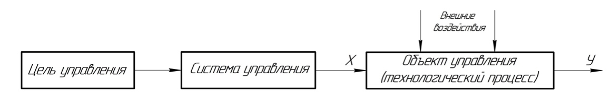

Воздействие на объект $ X $ переводит объект в состояние $ Y $. Если состояние $ Y $ объекта удовлетворяет потребителя, то никакого управления не требуется; если не удовлетворяет, необходимо организовать воздействие $ X $ на объект, которое переведёт его в новое состояние, удовлетворяющее потребителя. Это воздействие и есть управление. Коротко можно сказать: **Управление** — способ достижения поставленной цели.

Необходимо помнить, что за управление всегда надо платить. Это, прежде всего, затраты на сбор информации, выработку сигналов управления, реализацию управления и так далее. Если цели важны, то, как правило, идут на создание системы управления.

## Понятие о системах управления

Любой процесс управления включает следующие функции:

1. Получение (сбор) информации о состоянии объекта путём измерения выходной переменной $ Y $. Для этого, как правило, используются датчики.
2. Обработка информации о состоянии выходной переменной $ Y $ и сравнение полученного результата с требуемым. Используется вычислительная техника.
3. Принятие решения об изменении состояния объекта и реализации этого решения. Используются ЭВМ и исполнительные механизмы.

Таким образом система управления включает в себя ряд подсистем, выполняющих перечисленные функции: подсистема сбора информации, подсистема обработки информации, подсистема управляющих воздействий и так далее.

Система управления далеко не всегда реализуется в металле. она может быть реализована в виде правил, договоров, алгоритмов, которые реализуются в процессе управления.

Под **алгоритмом управления** понимают чёткое недвусмысленное правило, *что* и *как* надо делать, чтобы добиться заданной цели (например, инструкция по эксплуатации бытовой техники).

Таким образом, основными факторами, присущими любой системе управления, являются:

- цель управления
- информация о состоянии объекта и окружающей среды
- воздействие на объект
- алгоритм управления

Если из перечисленных факторов исключить хотя бы один, управление будет невозможным, а система управления — бессмысленной. Решение о создании системы управления и степени её автоматизации необходимо начинать с анализа сложности объекта управления. Управление простыми объектами в настоящее время не представляет труда, а управление сложными объектами (системами), как правило, требует создания системы управления.

## Технологический процесс как сложная система (сложный объект управления)

Современные технологии механической обработки и сборки в силу ряда причин следует рассматривать как сложные процессы. Основные из этих причин:

- обилие влияющих на процесс факторов
- неопределённость ряда параметров при резании
- случайный характер целого ряда факторов и параметров при резании и сборке
- нестационарность процесса резания, в первую очередь из-за износа инструмента

Наличие указанных причин вызывает трудность при аналитическом определении оптимальных условий резания. Отсюда, трудно обеспечить получение детали заданного качества при наименьших трудовых затратах и себестоимости изготовления. Возникает необходимость в системном подходе к решению задачи управления технологией обработки и сборки. Таким образом, процесс механической обработки (сборки) рассматривается как сложная стохастическая система.

Понятие «сложная система» широко используется в науке системотехнике. Используются системные методы анализа и исследования, широко применяя математическое моделирование, системотехника позволяет решать вопросы моделирования, создания, эксплуатации сложных систем. В системотехнике под **сложной системой** понимают объект, части которого (подсистемы и элементы) также можно рассматривать как системы, взаимосвязь которых образует целостные свойства объекта. Расчленение сложной системы на подсистемы и элементы является условным и, в принципе, сами элементы системы могут рассматриваться как сложные системы. В нашем случае такой сложной системой является система СПИД, которая состоит из подсистем, каждую из которых можно рассматривать как сложную систему. Необходимо помнить, что свойства сложной системы определяются не только простым суммированием свойств отдельных элементов, но и свойствами структуры, взаимодействием между подсистемами и рядом других свойств.

Отметим признаки процесса обработки резанием как сложной подсистемы:

1. Большое число взаимосвязанных и взаимодействующих между собой элементов
2. Сложность функции, выполняемой системой, направленной на достижение цели функционирования
3. Возможность разбиения системы на подсистемы, цели функционирования которых подчиняются общей цели функционирования всей системы
4. Наличие информации о процессе и необходимость управления им
5. Наличие взаимодействия с внешней средой и функционирование в условиях воздействия случайных факторов

Необходимость управления сложной системой является важной чертой процесса её функционирования, причём управление должно быть, в определённом смысле, наилучшим, или оптимальным.

## Трудности, связанные с созданием АСУ ТП

1. Полное или частичное отсутствие математического описания процессов, протекающих при механической обработке. Под математическим описанием подразумевается наличие алгоритма или формул вычисления состояния объекта $ Y $ под наблюдением его входов (воздействий). Воздействия могут быть управляемыми и неуправляемыми. Не зная математического описания процессов, имеем сложную систему типа «чёрный ящик». Так как АСУ ТП содержит для целей управления вычислительную технику, приходится создавать математические модели сложной системы, то есть, делать чёрный ящик более прозрачным.
2. Случайность (стохастичность) поведения сложных объектов управления. Поведение сложной системы порой бывает неожиданным для пользователя из-за действия случайных факторов. Иногда эти неожиданности не учитывают и считают второстепенными, или называют шумом. Нежелательно учитывать случайность при создании АСУ ТП.
3. Нетерпимость к управлению со стороны объекта управления. Сложный объект существует и функционирует независимо от нужд потребителя. Любой техпроцесс существует для производства продукции, а не для управления им. Из-за этого всякое управление нарушает функционирование объекта и заменяет его самостоятельное поведение, делает зависимым от потребителя. Цели управления могут не совпадать с собственными целями сложной системы, а часто и вступать в противоречие.
4. Нестационарность объекта управления. Характеристики объекта, как правило, дрейфуют, что вызвано износом, старением и рядом других причин. Изменение системы во времени создаёт серьёзные трудности при управлении.

Перечисленный список трудностей можно продолжить, но уже ясно, что цель управления сложным объектом в полной мере никогда не достигается, то есть, создать идеальную АСУ ТП невозможно. Более того, учитываю, что АСУ ТП достаточно дороги, необходимо экономически обосновать из создание и эксплуатацию.

## Последовательность создания АСУ ТП

Создание происходит поэтапно:

1. Формулировка целей управления
2. Содержательное описание объекта управления
3. Математическое моделирование процесса
4. Создание алгоритма управления
5. Реализация системы управления и корректировка при необходимости

[date]: # (18.02.2019)

### 1. Формулирование целей управления

На этом этапе определяют цель или множество целей, которые должны быть реализованы в процессе управления. Слово «цель» используют в смысле некоторого предполагаемого состояния объекта, которое желательно потребителю, и которое не реализуется без вмешательства извне, то есть, управления. Основными целями управления механической обработкой являются:

- Обеспечение производительности
- Обеспечение экономичности
- Обеспечение качества продукции (точности)
- Обеспечение надёжности техпроцесса
- Обеспечение гибкости техпроцесса

Поскольку АСУ ТП обеспечивают оптимизацию техпроцесса, то перечисленные функции и цели лежат в основе создания АСУ ТП. Желательно чтобы функция была одна, так как использование двух и более резко усложняется задачу оптимизации и, как правило, приводит к компромиссному решению. Выбранная функция цели должна удовлетворять следующим целям:

- характеризовать не какую-то часть процесса, а весь его в целом
- обеспечивать возможность получения количественной оценки с требуемой достоверностью
- область изменения функции цели должна иметь чётко определённые границы

К примеру, функция цели представляет собой аналитическую зависимость между критериями оптимизации и подлежащими оптимизации факторами (чаще всего — режимы резания). Можно выделить следующие критерии:

- стоимостные:
    - себестоимость единицы продукции;
    - наименьшие приведённые затраты:
    $$ С_{пр} = Е_{н.к.} \cdot К + С_п \cdot N_г \to min $$
    где $ Е_{н.к.} $ — нормативный коэффициент окупаемости капитальных вложений $ К $,  
    $ С_п $ — полная себестоимость единицы продукции,  
    $ N_г $ — годовая программа выпуска; полная себестоимость складывается из себестоимости, зависящей от режимов резания, и себестоимости, не зависящей от режимов резания: $$ С_п = С_р + С_н $$
    - прибыль (или доход) от реализации единицы продукции $ П(Д) \to max $
- временные:
    - штучное время $ t_{шт} \to min $
    - производительность:
        - $ Q = \frac{1}{t_{шт}} \to max $
        - $ Q_о = V \cdot S \cdot t \, \left[\frac{мм^3}{мин}\right] \to max $
- качественные:
    - точность
    - шероховатость
    - волнистость  
    В этом случае система управления должна обеспечить минимальные отклонения размеров и формы или минимум параметров шероховатости.
    - технологическая надёжность — способность обеспечивать в течении заданного времени выпуск деталей с установленными требованиями по точности и шероховатости. Технологическая надёжность привязывается к конкретному периоду времени, в течении которого управляемый объект должен нормально функционировать.

Наиболее слабым звеном системы СПИД является инструмент, поэтому различают специальные критерии оценивания АСУ ТП с точки зрения надёжности инструмента:

- критерий износа ($ min $ износа, например, задней поверхности резца)
- критерий, учитывающий силы резания ($ min \, R $ или $ min \, P_z $)
- критерий, учитывающий мощность резания
- критерий, учитывающий температуру в зоне резания и влияние её на температурную деформацию

Большинство из рассматриваемых функций тесно связаны с режимами обработки, поэтому подавляющее большинство АСУ ТП являются системами управления (стабилизации) с помощью режимов резания.

#### Связь различных целевых функций между собой

Рассмотрим, для примера, обработку резанием одним инструментом.

Себестоимость обработки складывается из нескольких статей затрат (везде в расчёте на одну деталь):

1. Непроизводственные затраты: установка-снятие, простой оборудования и так далее
    $$ С_1 = x \cdot Т_{пр} $$
    где $ x $ — стоимость одной минуты времени обработки,  
    $ Т_{пр} $ — суммарное время простоя
2. Стоимость машинного времени
    $$ С_2 = x \cdot Т_{маш} \; (Т_{маш} \approx t_о) $$
3. Стоимость времени на смену инструмента
    $$ С_3 = x \cdot Т_{см} \left(\frac{Т_{маш}'}{Т}\right) $$
    где $ Т_{см} $ — время смены инструмента,  
    $ Т_{маш}' $ — действительное время обработки детали,  
    $ Т $ — период стойкости
4. Затраты, связанные со стоимостью инструмента
    $$ С_4 = y \cdot \frac{Т_{маш}'}{Т} $$
    где $ y $ — стоимость режущего лезвия.  
    Для напайного инструмента:
    $$ y = \frac{ст.инстр.}{кол.перет.} + 1 $$
    Для инструмента с СМП:
    $$ y = \frac{ст.пласт. + ст.держ.}{кол.реж.кр.} $$
5. Сюда же можно добавить другие виды затрат $ С_5 $, например, на СОЖ, изготовление инструмента, стоимость обрабатываемого материала и др., но $ С_5 $ от режимов резания зависеть не будет, поэтому её можно не учитывать.

То есть:
$$ С_п = x \left[Т_{пр} + Т_{маш} + Т_{см}\left(\frac{Т_{маш}'}{Т}\right)\right] + y \left(\frac{Т_{маш}}{Т}\right) $$

Увеличение скорости резания снижает время обработки и уменьшает стойкость. Отсюда появляется оптимальное значение скорости, при которой себестоимость будет минимальной.

Производительность обработки на одну деталь:
$$ t_{шт} = Т_{пр} + Т_{маш} + Т_{см}\left(\frac{Т_{маш}'}{Т}\right); \, Q = \frac{1}{t_{шт}} $$

Таким образом, производительность будет зависеть от режимов резания и стойкости инструмента. Как правило, $ V_{опт}^т > V_{опт}^с $.

Прибыль, полученная в единицу времени:
$$ П = \frac{Д - С}{t_{шт}} = \frac{Д - y \left(\frac{Т_{маш}}{Т}\right)}{Т_{пр} + Т_{маш} + Т_{ст} \left(\frac{Т_{маш}'}{Т}\right)} - x $$

Таким образом, факторы, снижающие себестоимость и увеличивающие производительность, одновременно увеличивают и прибыль в единицу времени, но был рассмотрен случай обработки одним инструментом. В общем случае один и тот же фактор может по-разному влиять на различные целевые функции.

### 2. Содержательное описание объекта управления

В нашем случае объект управления — станок, группа станков, участок мехобработки (сборки), цех. На этапе содержательного описания ОУ чётко определяют все проблемы, связанные с управлением, устанавливают границы решения проблемы, выясняют действующие факторы, от которых зависит исследуемый процесс, определяют отношения (связи) между этими факторами.

Этот этап является одним из важнейших, так как правильное решение любой проблемы зависит прежде всего от того, насколько верно понято, что в действительности представляет собой проблема и в чём её сложность.

При выявлении действующих на объект факторов выделяют требуемые, управляемые и возмущающие.

К *требуемым* (заданным) относят марку обрабатываемого материала, метод мехобработки, требования по точности, качеству поверхности и так далее.

*Управляемые* (контролируемые) факторы допускают целенаправленный выбор или изменение в ходе обработки. Управление осуществляется изменением режущего материала, конструкции и геометрии инструмента, режимов обработки и так далее.

Среди *возмущающих* факторов можно выделить систематические и случайные. К систематическим относятся закономерно изменяющиеся, например, стойкость, глубина резания, скорость резания. Они вызваны конструкцией, особенностями детали и кинематикой процесса резания. К случайным параметрам относят изменение химических свойств заготовки и инструмента, колебания припуска, жёсткость системы СПИД и так далее.

В результате проведения второго этапа создатель АСУ ТП должен ясно понимать цель и назначение АСУ ТП, выявить информацию об учитываемых параметрах внешней среды и объекта управления, установить совокупность допущений, которые возникнут при реализации управления.

### 3. Моделирование процессов, протекающих в управляемом объекте

Только с помощью моделирования функции объекта управления можно построить управление, переводящее сложную систему в требуемое (целевое) состояние. Без модели процесса управление можно реализовать только методом проб и ошибок, что неприемлемо при управлении сложным объектом. Кроме того, этот метод требует больших затрат времени и может привести к выходу из строя объекта управления.

Под моделью объекта управления (техпроцесса) будем понимать зависимость, которая связывает состояние объекта $ Y $ с входами, неуправляемыми $ X $ и управляемыми $ U $:
$$ Y = F(X, U) $$
где $ Y $ — высказывание относительно связи между входами модели $ X $ и $ U $ и выходом $ Y $ на любом удобном языке.

Процесс резания можно рассмотреть как сложный физико-химический механизм взаимодействия инструмента с обрабатываемым материалом в условиях рассеяния всех свойств технологической системы СПИД.

Для управления процессом необходимо раскрыть физическую природу явлений, происходящих в зоне обработки влияние явлений на неустойчивость резания и определить условия их стабилизации. В процессе резания происходит формоизменение заготовки в готовую деталь, то есть систему с набором одних характеристик переводит в систему с набором новых характеристик. Процесс перевода (переход) от заготовки к детали характеризуется рядом величин: временной деформацией, например, в обрабатываемом материале, температурой в зоне резания и так далее. Отсюда появляется возможность вести оценку процесса перехода по таким параметрам как мощность резания, силы резания, температура в зоне резания, износ поверхности инструмента и так далее.

Таким образом, под **математической моделью объекта управления** понимают зависимость, связывающую выходные параметры объекта управления с входными, в первую очередь с управляемыми.

Моделирование осуществляется в следующей последовательности:

- определяют вид зависимости $ F $ без учёта значений её параметров. Для этого $ F $ рассматривают как множество, состоящее из структуры и параметров:
  $$ F = \{S;P\} $$ 
  Под структурой будем понимать вид элементов, из которых состоит объект управления, и отношений между этими элементами. Например, линейная структура: 
  $$ y = F(X, U) = P_0 + P_1 X + P_2 U $$
- После определения структуры необходимо отыскать параметры модели $ P $. Для этого используют идентификацию параметров. Она позволяет найти численные значения параметров $ P $. При идентификации объект управления работает в режиме нормального функционирования без организации специального управляющего воздействия. Исходной информацией при идентификации является структура и наблюдение за поведением входа $ X $ и выхода $ Y $ и его работой. Пассивное наблюдение не искажает естественного хода наблюдаемого процесса и позволяет выявить, как вход влияет на выход объекта управления: $ Y = F(x) $.
- Для выяснения зависимости выхода от управляемых входов $ U $ необходимо проводить эксперименты с объектом, однако, как правило, сложный объект «не любит» экспериментов, нарушающих режимы его нормального функционирования, поэтому эксперимент, которого нельзя избежать, надо проводить так, чтобы минимально возмущая объект получить максимально возможную информацию о влиянии варьируемых параметров на выход $ F $. Для проведения эксперимента используют теорию планирования эксперимента. Создаётся план эксперимента, позволяющий с максимальной эффективностью определить параметры модели управления. В процессе планирования и проведения эксперимента может измениться представление о структуре модели, например, первая гипотеза о линейности будет заменена гипотезой о нелинейности. Это заставляет снова обращаться к синтезу структуры, проводя соответствующую коррекцию. Таким образом, на этапе планирования эксперимента определяются параметры модели, которые нельзя определить на этапе просто идентификации, а в некоторых случаях и корректируется структура модели.

В результате осуществления всех этапов окончательно создаётся модель $ F $ объекта управления.

***
[date]: # (20.02.2019)

#### Требования к входным параметрам при моделировании техпроцесса

Так как модель создаётся для целей управления, то существенными являются те параметры, которые наиболее сильно влияют на достижение целей управления. Поэтому желательно из множества параметров выявить наиболее существенные. Входные параметры должны удовлетворять следующим требованиям:

- Должны влиять на реализацию целей управления. Для оценки влияния обычно проводят следующий мысленный эксперимент: Допустим, объект находится в состоянии $ Y $, которое соответствует заданной цели. Пусть теперь параметр $ x_i $, характеризующий состояние какой-то $ i $-й связи, изменится. Если это изменение может изменить состояние объекта настолько, что цель управления не достигается, то параметр $ x_i $ существенен для управления.
- Параметры должны эффективно и просто измеряться. Если какой-то параметр не измеряется, например, жёсткость станка, или измерение требует больших затрат, этот параметр относят к случайным помехам — пренебрегают им.

К параметрам, которые управляют объектам, кроме перечисленных предъявляют следующие:

- Должны эффективно воздействовать на состояние объекта, то есть компенсировать негативные изменения этого состояния.

Выбор параметров обычно осуществляется экспертным методом, то есть, с привлечением специалистов, хорошо знающих объект управления и действие на объект окружающей среды.

К выходным параметрам предъявляется два естественных требования:

- Наличие информации о выполнении или невыполнении цели управления
- Возможность надёжно и оперативно контролироваться (измеряться)

На начальном этапе отбора параметров число их может быть больше, чем затем будет реализовано. Эта избыточность поможет осуществить эффективный отбор наиболее существенных из них на последующих этапах.

#### Виды структур моделей объектов управления

По виду структуры модели могут быть следующие:

- с точки зрения динамики объекта управления:
  - Статическая. В них не учитывают такой параметр как время.
  - Динамическая. Связывает выход со входом в процессе изменения их во времени. Время может меняться дискретно и непрерывно.
- с точки зрения реакции на внешние воздействия
  - Линейный. Под линейным подразумевают такой объект, реакция которого на сумму двух любых внешних воздействий равна сумме реакции на эти воздействия: 
    $$ F[x_1(t)+x_2(t)] = F[x_1(t)]+F[x_2(t)] $$
  - Нелинейный. Система считается нелинейной, если хотя бы одно звено или элемент модели описывается нелинейным уравнением. Строго говоря, все реальные объекты нелинейны, но линейные уравнения проще, поэтому стараются перейти от нелинейных к линейным системам.
  - Случайный. Так как в управляемом объекте могут быть случайные процессы и случайные величины, структура модели чаще всего носит случайный (стохастический) характер:
    $$ Y = F[X, U, E(t)] $$
    где $ E(t) $ — случайные параметры, влияющие на характер объекта или окружающей среды.  
    Если случайный процесс не учитывается, то имеем детерминированную модель.

Процесс моделирования — творческий процесс и для создания модели используют различные разделы математики, даже специальные языки моделирования.

После определения структуры модели необходимо установить неизвестные параметры $ P_1, P_2, ..., P_k $ этой модели. Можно сделать это двумя путями: идентификацией и проведением эксперимента с объектом управления.

#### Идентификация параметров модели

В первом случае можно определить связь входа и выхода объекта управления, если есть возможность наблюдения за их изменением в процессе нормальной эксплуатации. Так как объект не управляется, влияние $ U $ на выход не исследуется. Это упрощает задачу, так как остаются только неуправляемые параметры $ X $. В процессе идентификации используют данные, которые можно разбить на два класса — априорные, то есть известные заранее, и апостериорные, которые представляют собой результаты наблюдений за входом и выходом. Априорные данные обычно содержатся в структуре модели.

В результате наблюдений получаем информацию:
$$ I = (x_i; y_i) $$
где $ i = 1...N $.

Промежуток времени между наблюдениями $ \tau = \frac{T}{N-1} $. Таким образом, процесс идентификации параметров сводится к определению параметров $ P $ по известной структуре $ S $ и информации о наблюдениях $ I $.

$$ P = \varphi(S; I) $$
где $ \varphi $ — алгоритм идентификации, который позволяет найти $ P $, зная $ S $ и $ I $.

Эти алгоритмы подразделяются на два класса — *неадаптивные* и *адаптивные*.

##### Неадаптивный алгоритм идентификации

Рассмотрим одномерный статический объект управления, то есть объект с одним выходом.

$$ x \to ОУ \to y $$

Полагаем, что в процессе идентификации случайные помехи отсутствуют и в данных эксперимента нет разброса. Для таких объектов в качестве модели чаще всего используют полином.

$$ y = a_0 + a_1 x + a_2 x^2 + ... + a_n x^n $$

Параметры $ a_0, a_1, ..., a_n $ нам неизвестны. Оптимальной может считаться модель, у которой при определённых расчётом параметрах $ a_0, a_1, ..., a_n $ сумма квадратов отклонений расчётных  экспериментальных значений будет минимальной (метод наименьших квадратов):

$$ F(a_i) = min \sum_1^n (y_э-y_р)^2 (1) $$
где $ n $ — число опытов.

Далее определяем частные производные функционала $ F(a_i) $ по каждому коэффициенту:

$$ \frac{\partial F(a_i)}{\partial a_i} = 0 $$

Решая совместно полученные уравнения относительно $ a_i $, получим такие значения $ a_i $, которые удовлетворяют условию (1)

$$ y = a_0 + a_1 x + a_2 x^2 $$
$$ F(a_1) = min \sum_1^n [y_э - (a_0 + a_1 x + a_2 x^2)^2 ] $$

Берём три производных, приравниваем к нулю, решаем полученную систему и находим значения коэффициентов.

Таким образом, неадаптивный алгоритм идентификации позволяет получить искомые параметры сразу, используя всю информацию $ I $. Задача сводится к решению системы уравнений.

Для идентификации сложных систем функционал $ F(a_i) $ и сама функция $ y $ могут быть достаточно сложными. Отсюда, решить задачу вручную, без использования ЭВМ, практически невозможно.

##### Адаптивный алгоритм идентификации

Под адаптивным понимают алгоритм, позволяющий уточнять значения параметров модели по мере получения дополнительной информации о работе объекта управления. Допустим, на $ i $-м шаге были определены значения параметров:

$$ P_i = (P_1^i, P_2^i, ..., P_n^i) $$

Далее в процессе идентификации была получена дополнительная информация:

$$ I_{i+1} = (x_{i+1}; y_{i+1}) $$

Очевидно, что эта информация должна каким-то образом изменить имеющиеся значения $ P_i $ и получить значение $ P_{i+1} $ (более точное). Связь между $ P_i $ и $ P_{i+1} $ будет описываться алгоритмом $ \varphi $ адаптивной идентификации:

$$ P_{i+1} = \varphi(P_i; I_{i+1}) $$

Этот алгоритм позволяет определить последующие значения параметров исходя из старых значений параметров и новой информации. Таким образом, корректируем старые знания и получаем новые на основе получения новой информации.

Если этот метод идентификации используется в реальном времени, то его называют **метод самонастраивающейся модели**.

Таким образом, неадаптивный алгоритм позволяет сразу определить параметры $ P $, но он достаточно сложен и требует значительных вычислительных мощностей. Адаптивный алгоритм проще. Его легко программировать и отлаживать. Кроме того, его можно реализовать в специальном вычислительном устройстве, создавая самонастраивающиеся модели.

#### Планирование эксперимента для поиска параметров

Этап планирования экспериментов с объектом управления связан с необходимостью определения параметров модели в том случае, если управляемый вход в режиме нормальной эксплуатации мало меняется. Поэтому влияние этого входа не удаётся выяснить без специально спланированных экспериментов. Планирование экспериментов используют также при уточнении структуры модели. С помощью планируемых экспериментов можно выбрать наилучшую модель из набора конкурирующих и здесь же определить её параметры. Задача планирования заключается в таком _минимальном_ изменении входа, так как объект «не любит» управления, при котором полученная информация $ Y $ давала бы возможность наилучшим образом определить параметр $ P $.

Схема планирования напоминает схему Системы управления:

Сам эксперимент определяется планом, который представляет собой перечень состояний входа, которые должны быть реализованы в объекте. Ресурсы планирования состоят из выделенных на эксперимент средств (временных, материальных и т. п.). К ресурсам так же относят области планирования, в которых будет меняться $ U $. Критерий планирование определяет эффективность плана. Обычно в качестве критерия берут точность оценки параметров $ P $, то есть, минимум ошибки.

При планировании эксперимента выбирают факторы $ x_i $, которые должны быть независимыми друг от друга. Затем по плану эксперимента принудительно меняют $ x_i $ в избранных пределах и фиксируют значения выхода $ Y $. План эксперимента устанавливает, в какой последовательности и в каких сочетаниях надо менять $ x_i $ чтобы при минимальном объёме эксперимента получить достаточно достоверные результаты.

Планирование экспериментов позволяет получить параметры модели многомерных объектов (объектов с несколькими входами). Модель при этом может быть нелинейной и описываться полиномами различных степеней.

### 4. Разработка алгоритма функционирования

На этом этапе принимают решение о том, каково должно быть управление $ U $ чтобы достигнуть заданной цели управления объектом. Решение опирается на имеющуюся модель объекта, заданную цель, полученную информацию о состоянии среды $ X $ и выделенные ресурсы управления.

В общем случае управление представляет собой алгоритм (программу) изменения управляемых параметров во времени. Алгоритм должен показывать, какие управляющие действия и в каком порядке надо выполнить чтобы после конечного числа шагов получить оптимальные значения целевой функции. Для реализации алгоритма управления создают специальные устройства управления. Эти устройства используют знания, имеющиеся до начала функционирования системы управления (априорную информацию) и сигналы датчиков обратной связи о значениях $ Y $ (текущая информация), и реализуют алгоритм управления.

Можно выделить две группы алгоритма управления: *алгоритмы управления состоянием объекта* и *алгоритмы управления сменой состояния*.

В первом случае либо предварительно рассчитывают оптимальные значения параметров, а затем поддерживают это состояние на объекте, либо это состояние определяют в процессе функционирования. Такие алгоритмы ещё называют *алгоритмами стабилизации*. Сюда же можно отнести алгоритмы статической оптимизации, когда система управления автоматически находит такое сочетание параметров, при котором целевая функция оптимальна.

К алгоритмам второй группы относят алгоритмы отработки заданной рациональной или оптимальной траектории. Эти алгоритмы позволяют отслеживать происходящие в объекте процессы и с помощью средств вычислительной техники осуществлять автоматический выбор оптимальной траектории процесса обработки. Если условия меняются, алгоритм реагирует автоматически на выбор новой траектории с целью сохранения значений целевой функции управления.

### 5. Реализация управления и коррекции

Этот этап связан с практическим использованием алгоритма (программы) оптимального управления. Для реализации используют различные исполнительные механизмы (электродвигатели, гидро-, пневмоцилиндры, механические устройства и т. д.), а также средства вычислительной техники, и измерительные средства (датчики). Технические средства позволяют управлять приводами станков и оборудования с целью достижения цели управления. Реализовав управление и получив новое состояние объекта, можно обнаружить, достигнута поставленная цель или нет. Здесь вскрываются недостатки проработки задачи управления на предыдущих этапах. Даже если цель достигнута, необходимость обращения к предыдущему этапу, например, к изменению алгоритма управления, вызывается изменением состояния среды $ X $. Тогда вводится соответствующая коррекция: меняется программа управления либо модель. Коррекция, как правило, осуществляется всегда.

***
[date]: # (27.02.19)

## Требования к АСУ ТП со стороны техпроцесса

- Так как для описания техпроцесса используются различные математические модели, не всегда до конца известные и точные, в составе системы управления необходимо иметь программные и технические средства, осуществляющие расчёт и построением математических моделей.
- Поскольку АСУ ТП длительное время может работать без вмешательства человека, математическая модель, лежащая в основе алгоритма управления, должна периодически корректироваться для учёта как естественных изменений объекта управления (например, износ), так и искусственных изменений (улучшение технологии, модернизация оборудования и т. д.).
- АСУ ТП должна обладать высокой надёжностью, а при возникновении неполадок должна отключаться, так как объект управления достаточно устойчив и некоторое время может давать продукцию и без системы управления.
- АСУ ТП должна обладать высоким быстродействием. Задержка выработки управлений снижает эффективность и качество системы.
- АСУ ТП должна быть защищена от воздействия окружающей среды. К ним относятся электромагнитные и электрические помехи, колебания температуры, влажности, запылённость и загазованность.

## Принципы создания и виды обеспечения АСУ ТП

- АСУ ТП создаётся как автоматизированная система (не автоматическая), поэтому наряду с ЭВМ и другими средствами в управлении участвует человек. Он осуществляет отбор факторов, разрабатывает программы управления, корректирует их и так далее.
- АСУ ТП — иерархическая система, то есть, состоит из целого ряда подсистем и элементов. Все они связаны между собой информационными и другими связями, обеспечивающими их единство.
- АСУ ТП — совокупность информационно согласованных подсистем, то есть все вычислительные средства в составе АСУ ТП решают задачи по информационно согласованным программам и часто выход одной подсистемы является входом для другой подсистемы.
- АСУ ТП — информационно-управляющая система, то есть система по переработке, передаче и воспроизведению информации, которая необходима для выполнения цели управления.

Для успешного функционирования АСУ ТП необходимо предусмотреть следующие виды обеспечения подсистем:

- *Методическое* — совокупность документов, устанавливающих состав и правила эксплуатации средств АСУ ТП.
- *Информационное* — совокупность сведений, необходимых для управления, представленных в заданной форме.
- *Математическое* — совокупность методов математических моделей и алгоритмов, необходимых для автоматизированного управления и представленных в заданной форме.
- *Лингвистическое* — совокупность языков программирования, необходимых для автоматизированного управления.
- *Программное* — совокупность программ управления, представленных в заданной форме.
- *Техническое* — совокупность взаимосвязанных и взаимодействующих технических средств, предназначенных для автоматизированного управления.

## Понятия об оптимальном и адаптивном управлении

**Оптимальная система управления** — автоматизированная система, обеспечивающая наилучшие технические и экономические показатели качества при заданных реальных условиях работы и ограничениях.

**Критерий оптимизации** (целевая функция) — оценка достижимости цели при управлении, представленная в формализованном виде.

Разработку наилучшей системы, позволяющей достичь целевой функции, называют задачей синтеза оптимальной системы. Возможны два варианта задач:

1. Известна структура системы управления, нужно найти её параметры:  
  
Неизвестны параметры устройства управления (СУ), при которых достигаются экстремальные значения $ y $. Такую задачу называют **задача синтеза параметров системы**.
2. Система управления неизвестна полностью:  
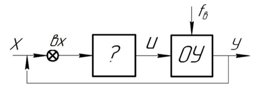  
Требуется определить и структуру и параметры системы управления так, чтобы она была оптимальной по принятому критерию. Такая задача называется **задача синтеза структуры системы управления**.

Наиболее распространённой является задача определения оптимальных управлений, обеспечивающих оптимальные процессы при начальных (заданных) и конечных значениях выходных переменных. Системы управления строятся для двух основных случаев:

- *Замкнутые* системы — с применением обратной связи, когда сигналы с выхода поступают на вход.
- *Разомкнутые* системы — без применения обратной связи.

В разомкнутой оптимальной системе устройство управления формирует закон управления, по заданным начальным условиям. При этом состояние $ y $ на выходе объекта управления не используется в формировании закона управления. В замкнутой системе состояние $ y $ используют.

Рассмотренные системы управления используют в случае простых задач управления, когда всё можно предусмотреть заранее. При этом необходим достаточно полный объём предварительных данных (априорная информация) о внутренних и внешних условий работы объекта и системы в целом.

Имеется широкий класс объектов управления, статические и динамические характеристики которых меняются в широких пределах заранее непредвиденным образом. При этом часто невозможно описать физические процессы, протекающие в объектах при функционировании. В связи с этим системы управления такими объектами будут работать в условиях неопределённости (недостаточной априорной информации). Для преодоления этих трудностей при разработке систем управления применяют принцип адаптации. Применение этого принципа позволяет искусственно создать эффект приспособления к изменяющимся условиям за счёт того, что часть функций по получению, обработке и анализу недостающей информации осуществляется самой системой управления в процессе её эксплуатации. Для этого создают адаптивные устройства управления.

**Адаптивная система управления** — система, в которой параметры управляющих воздействий или алгоритм управления автоматически или целенаправленно меняются для осуществления наилучшего управления объектом.

Таким образом, адаптивные системы управления представляют собой комплекс измерительных, преобразовательных и вычислительных устройств, а также усилительных и исполнительных элементов.

Таким образом, все АСУ ТП можно разделить на два класса:

- Системы с жёсткой настройкой, в которых неполнота информации не мешает достижению целей управления, так как все ситуации заранее предусмотрены проектировщиком.
- Адаптивные системы, в которых неполнота информации не позволяет достигнуть целей управления с заданной точностью без автоматического приспособления системы к условиям неопределённости.

## Классификация АСУ ТП

- по характеру управляемого техпроцесса:
    - системы управления непрерывными техпроцессами
    - системы управления дискретными техпроцессами
    - системы управления сборочными процессами дискретного производства
- по степени сложности управляемого объекта, в зависимости от общего числа параметров:
    - до 20
    - до 40
    - до 100
    - до 800
- по степени охвата управляемого процесса:
    - комплексные (СУ участком, цехом, гибким производством)
    - локальные (СУ отдельным станком или отдельным процессом)
- по архитектурному признаку (по числу уровней управления):
    - одноуровневые — в системе имеется лишь одна ЭВМ, имеющая связь со всеми источниками и приёмниками информации
    - многоуровневые — несколько ЭВМ для выполнения целей управления, как правило, объединяемых в сети
- по функционально-алгоритмическому признаку:
    - с жёсткой настройкой
        - по быстродействию — основным критерием является минимум времени отработки сигнала
        - по точности — минимум ошибки системы
        - комбинированные — какой-либо критерий, например, минимальная сила резания
    - с адаптивной настройкой
        - экстремальные — обеспечивается экстремум характеристики объекта при её дрейфе за счёт автоматического регулирования сигнала
        - самонастраивающиеся — осуществляется адаптация к условиям неопределённости, обеспечивающая заданный оптимальный режим за счёт изменения параметров и структуры
        - обучающиеся — используется адаптация, обеспечивающая заданный оптимальный режим в результате постепенного накапливания, запоминания, анализа информации о поведении объекта управления, используя полученную информацию, изменяются законы функционирования объекта в зависимости от приобретаемого опыта

## Функциональная структура АСУ ТП

Рассмотрим в начале функции человека в системе «Человек — объект управления». Для выполнения управления человек должен получить ряд сведений, которые называют внешней информацией. Эта неизменная информация хранится в памяти человека и включает основные характеристики, например, техпроцесса, и порядок выполнения операций управления. Очевидно, что отбор этой информации должен быть весьма тщательным, так как перегрузка памяти неизбежно приведёт к ухудшению качества управления. За изменением технологических характеристик, представляющих собой возмущающие управляющие воздействия, человек следит с помощью рецепторов — органов зрения, слуха. Человеку приходится наблюдать за показаниями приборов, фиксировать звуковые сигналы, и т. п. Отсюда воспринимается текущая информация, которая также должна быть ограничена. Сопоставляя исходную и текущую информацию, человек принимает решение с помощью центральной нервной системы. Она вырабатывает управляющую информацию в результате принятия решения и соответствующие сигналы. Сигналы реализуются с помощью рук, ног, голоса, осуществляя управление.

В результате имеем следующую структуру управления:

По аналогии со схемой управления «человек — объект управления» строится и функциональная схема АСУ ТП. При своей работе АСУ ТП выполняет две функции — информационную и управляющую. Информационную функцию АСУ ТП стандарт определяет как функцию, целью которой является сбор, преобразование и хранение информации об объекте управления, а также передачи её для последующей обработки. Управляющая функция АСУ ТП имеет целью выработку решений и осуществление управляющих воздействий на объект управления. Основную роль в исполнении задач информационной и управляющей функции играет процессор. Он совмещает переработку и хранение информации с выработкой управляющих воздействий.

***
[date]: # (04.03.19)

## Оптимизация как метод управления процессом резания

**Оптимизация** — это выбор такого варианта управления процессом, при котором достигается экстремальное значение критерия, характеризующего качество управления. При этом необходимо разделять два понятия — критерий оптимизации и критерий оптимальности.

**Критерий оптимизации** (целевая функция) — критерий, который определяет качество управления в общем — себестоимости, производительности и т. д.

**Критерий оптимальности** — заданная величина критерия оптимизации.

В общем случае задача оптимизации выглядит так:

Необходимо найти экстремальное значение функции $ z = F(x, U) $, где $ x \in D, U \in B $, $ D $ — множество допустимых значений переменной $ x $, $ B $ — переменной $ U $. Обычно эти множества задаются в виде ряда неравенств.

По своему назначению оптимизация бывает структурная, когда ищется оптимальная структура техпроцесса или операции и параметрическая — для назначения оптимальных режимов резания. Оптимизация может быть внешней, реализуемой вне системы управления, и внутренней, осуществляемой в процессе обработки. Оптимизация может быть выборочной, если оптимизируют 1 или 2 параметра обработки, и комплексной, если оптимизируют одновременно несколько параметров — геометрию инструмента, режимы резания, состав СОЖ и тому подобное. Оптимизация может выполняться в детерминированной (статической) постановке — при постоянных значениях всех параметров — и в стохастической (динамической) постановке, когда учитывается вероятностная природа процесса резания. Целевая функция $ z $ может быть не только аналитической, но и алгоритмической, то есть в виде алгоритма, позволяющего вычислять значение этой функции в любой заданной точке. Алгоритм чаще всего заключается в построении последовательности приближённых решений задачи, то есть, находят $ z(U_0), z(U_1), ..., z(U_N) $, где $ U_N = U_{N-1} + \Delta U_N $. Считают, что при большом количестве приближений получают $ z $, который можно рассматривать как решение задачи.

Для решения задач оптимизации используют раздел математики математическое программирование. Если целевая функция и ограничения линейны, получаем задачу линейного программирования; если хотя бы одна из функций нелинейна, получаем задачу нелинейного программирования. Линейные задачи решаются проще, но на практике чаще всего задачи нелинейны. Эти задачи решаются только численными методами и точного решения не имеют. Как правило, в этих задачах не совпадают локальный и глобальный экстремумы. Эти задачи решаются поисковыми методами с помощью специальных алгоритмов. В некоторых случаях ограничиваются поисками локального экстремума. Система управления в результате пошагового изменения переменных $ U $ должна обеспечить поиск и достижение экстремума целевой функции. Как правило, задача решается только с помощью ЭВМ.

<!--- Граница модуля, 13.03 к/р -->

## Типы систем управления станками

### Аналоговые системы управления

Разделяются на системы управления замкнутого типа с контролем по пути, времени, скорости и так далее, незамкнутые системы управления с одним потоком информации и копировальные системы управления со следящим приводом, имеющим обратную связь.

#### Системы замкнутого типа

Простейшая СУ замкнутого типа для токарного станка имеет следующий вид:

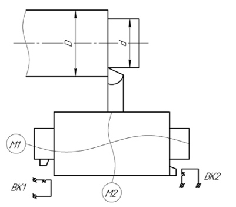

Программоносителем величин перемещений резца являются расставленные заранее при наладке станка упоры и конечные выключатели `ВК1` и `ВК2`. В расставленных определённым образом упорах заключается информация о требуемых размерах обработки. Резец перемещается продольно, обрабатывая диаметр `d`. Далее, упор воздействует на переключатель `ВК1`, который выключает двигатель продольного суппорта `М1` и включает двигатель поперечного суппорта `М2`. Поперечный суппорт будет перемещаться до тех пор, пока вершина резца не окажется на расстоянии $ \frac{D}{2} $ от оси вала. После этого упор воздействует на переключатель `ВК2`, поперечный суппорт останавливается и начинает перемещаться продольный суппорт, обрабатывая резцом поверхность диаметром `D`. Данная система работает в функции пути, которая проходит исполнительный механизм. Бывают также функции скорости, времени и других параметров. Достоинства таких систем — простота, небольшая стоимости, возможность дистанционного управления, простая переналадка, неограниченная величина перемещений. Недостатки — затраты времени на переналадку, недостаточная точности перемещений, что приводит к необходимости обработки пробных деталей, и невозможность получения сложных движений.

#### Системы управления незамкнутого типа

К ним относят системы со специальным приводом, обеспечивающим дозированное перемещение исполнительного узла а также копировальные системы управления прямого действия (без усилителя мощности). Всякая незамкнутая система предполагает наличие априорной информации. которая обеспечивает правильное функционирование такой системы управления. Обычно априорная информация берётся с чертежа обрабатываемой детали.

Простейшее устройство управления незамкнутого типа — кулачковый механизм:

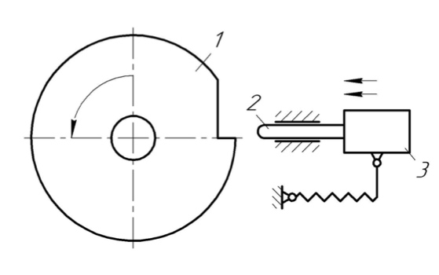

Кулачок `1` вращается непрерывно или периодически. Профиль кулачка выполнен таким образом, чтобы толкатель `2` обеспечивал дозированное перемещение исполнительного узла `3` и возврат его в исходное положение (для возврата используется пружина). За 1 оборот кулачка исполнительный узел совершает 1 цикл движений. Меняя профиль кулачка, можно получить любой закон перемещений и скорости движения. Если на одной оси расположены несколько кулачков с общей осью вращения, имеем так называемый распределительный вал, который позволяет управлять несколькими исполнительными узлами с точной синхронизацией их движений. В том числе такое устройство может обеспечить обработку криволинейной поверхности.

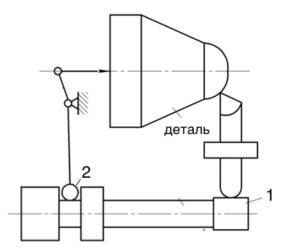

На общей оси находятся два кулачка — дисковый `4` и барабанный. При вращении распредвала `1` продольное и поперечное движение детали и резца накладываются друг на друга, в результате можно обрабатывать криволинейные поверхности. Кулачковые СУ очень надёжны, имеют высокую жёсткость а также точность повторения размеров. Стабильно поддерживают постоянную во времени синхронизацию цикла.

##### Копировальная система

Имеет следующий вид:

Резец `5` может перемещаться в поперечных `2` и продольных `1` салазках в зависимости от перемещений щупа `3` относительно копира `4`. Главным следящим движением является перемещение по оси $ x $. Поперечное движение $ y $ является следствием перемещения щупа `3` по копиру `4`. Программоносителем является копир. Эта схема имеет существенный недостаток, из-за которого используется редко: щуп воспринимает силы резания, как следствие, быстро изнашивается и деформируется.

##### Копировальные системы управления с усилителем мощности

Общий недостаток перечисленных систем — невозможность точной обработки криволинейных и объёмных профилей. Следящие системы позволяют использовать копирование на фрезерных, шлифовальных и других станках для обработки сложных конфигураций детали (лопасти гребных винтов, лопатки турбин, кулачки и т. д.). Электрокопировальные станки со следящей системой используют прерывистое и непрерывное управление. В станках с прерывистым управлением используют контактные копировальные приборы, в станках с непрерывным управлением — бесконтактные, индуктивные копировальные приборы, а также бесступенчатый привод подачи. Эти системы обеспечивают высокую точность обработки, высокое качество поверхности. В зависимости от типа копировального прибора и привода подачи станки классифицируют на следующие группы:

- электрические, когда копировальный прибор и привод электрические
- электрогидравлические, когда копировальный прибор электрический, а привод гидравлический
- фотоэлектрические, когда копировальный прибор фотоэлектрический, а привод электрический
- гидравлические, когда копировальный прибор и привод гидравлические
- пневмоэлектрические, когда копировальный прибор пневматический, а привод электрический

Рассмотрим в качестве примера схему электрокопирования на фрезерном станке с контактным измерительным прибором:

`1` — заготовка, `2` — инструмент, `3` — шпиндель, `4` — фрезерная бабка, `5` — копировальная головка, `6` — щуп, `8` — контактный рычаг, `9` — копир, `10` — стол, `11` — контактная группа. Щуп `6` через наконечник воздействует на рычаг `8`, который замыкает или размыкает контактную группу `11`. Если контакт `11` разомкнут, то щуп приближается к копиру, если контакт `11` замкнут, включается электродвигатель `М2` и щуп удаляется от копира. В результате периодических подводов и отводов появляется следящее движение $ S_c $. Заготовка вместе с копиром устанавливается на столе `10`, электродвигатель `М1` перемещает стол, обеспечивая ведущую подачу $ S $. Таким образом, два движения — продольное и поперечное — накладываются друг на друга. Складывая, получаем подачу $ S_р $. Такое копирование называют контурным. Если добавить ещё одну подачу перпендикулярно плоскости рисунка, то получим объёмное копирование. Копирование, при котором осуществляется управление только в одном направлении, называют однокоординатным; в двух и более направлениях — многокоординатным.

***
[date]: # (05.03.19)

### Системы числового программного управления станками

Общим недостатком рассмотренных аналоговых систем управления является их недостаточная универсальность и мобильность. Это связано с тем, что необходимо переставлять упоры, изготавливать копиры, кулачки, осуществлять переналадку и тому подобное. Стремление сделать универсальную систему управления для станков и необходимость повышения производительности труда привело к созданию станков с ЧПУ. Схема управления в таких станках выглядит следующим образом:

По технологическим признакам системы управления на таких станках делят на *позиционные*, *контурные* и *комбинированные*.

В свою очередь, станки с позиционными системами управления могут быть *с управлением положением отдельных точек*, когда операция обработки происходит после позиционирования инструмента (заготовки) и *с управлением в процессе перемещений вдоль отрезков прямых*, параллельных направляющим станка. В этом случае обработка осуществляется и в процессе перемещения.

В системах управления контурного типа сложная траектория обработки обеспечивается совместным и взаимосвязанным движением нескольких исполнительных механизмов, что позволяет получать криволинейные траектории перемещения инструмента (заготовки).

ЧПУ с позиционным управлением обозначаются в конце модели станка `Ф2`, а ЧПУ с контурным управлением - `Ф3`. Станки типа «обрабатывающий центр» имеют обозначение `Ф4`.

Показанная на рисунке система ЧПУ является системой *замкнутого* типа (с обратной связью). Существуют и *незамкнутые* системы управления (без обратной связи). В некоторых случаях используют системы ЧПУ с дополнительными потоками информации — от нескольких датчиков обратной связи.

### Адаптивные системы управления

Использование традиционных систем ЧПУ связано с рядом трудностей:

- ошибки при составлении программ
- необходимость в программоносителях и считывающих устройствах, что снижает надёжность работы станка
- использование неоптимальных скоростей резания и подач
- трудность изменения самого устройства управления

Части перечисленных недостатков можно избежать, если вместо традиционных устройств с ЧПУ использовать управление с помощью ЭВМ или микропроцессора. Одной из основных причин применения ЧПУ является тот факт, что оно уменьшает непроизводительные затраты времени: подвод, отвод, замену инструмента и т. д. Тем самым сокращается время простоев, но сравнительно мало сокращается сам процесс резания по сравнению с обычными универсальными станками.

Наиболее перспективный путь к сокращению времени обработки лежит на использовании адаптивного управления. Если при ЧПУ задаётся требуемая последовательность положений или траектория движения инструмента и режимы траектории, то система адаптивного управления определяет нужные скорости и подачи непосредственно в процессе обработки в зависимости от изменения твёрдости материала, глубины срезаемого слоя, ширины обрабатываемой поверхности и так далее. Адаптивное управление даёт возможность реагировать на эти изменения и компенсировать негативные их влияния в процессе обработки. ЧПУ такой возможностью не обладает.

Адаптивное управление целесообразно применять не для всех процессов мехобработки, а только в следующих случаях:

1. Когда время процесса резания занимает значительную долю в длительности цикла обработки (более 40 %)
2. Когда стоимость работы станка достаточно высокая из-за его собственной стоимости
3. При обработке высоколегированной стали, титана и других труднообрабатываемых сплавов
4. Когда значительно меняются условия резания: переменная глубина резания, твёрдость материала, жёсткость, пустоты на детали в процессе обработки

Таким образом, термин «**адаптивное управление**» в случае операции обработки на станках подразумевает использование такой системы управления, в которой производится измерение определённых выходных переменных процесса с тем, чтобы результаты этих измерений использовать для управления, в первую очередь, режимами резания — скоростью и подачей.

## Системы стабилизации режимов металлообработки

В этих системах при изменении возмущающих воздействий на объект управления (техпроцесс) основной задачей является поддержание одного или нескольких параметров в соответствии с выбранными технологическими законами управления.

Схема системы стабилизации выглядит следующим образом:

$$ U_{у1} = U_{з1} - U_{ос1} \, (HB; z) $$
$$ U_{у2} = U_{з2} - U_{ос2} \, (HB; z) $$

`ЭПШ` — электропривод шпинделя, `ЭПП` — электропривод подачи

Иногда такие системы управления называют экстремальными, потому что они поддерживают экстремальные значения скорости шпинделя и подачи. На вход регулятора `Р` поступает разность сигналов, определяемая разностью между заданными движениями $ U_з $ и напряжениями сигналов обратной связи $ U_{ос} $. В современных системах стабилизации роль регулятора выполняет микропроцессор.

Тогда схема устройства управления выглядит следующим образом:

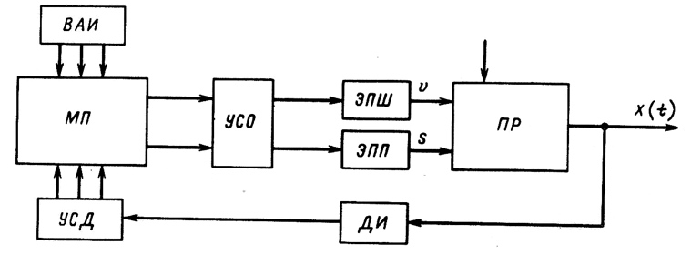

`УСО` — устройство связи с объектом управления

Информация о ходе техпроцесса поступает на вход микропроцессора `МП` от датчиков `ДИ` через устройство связи с датчиками `УСД`. В микропроцессор вводится также внешняя априорная информация `ВАИ`, которая хранится в запоминающем устройстве. Здесь осуществляется обратная связь по параметрам процесса резания. Предусматривается применение двух регулируемых приводом — главного движения `ЭПШ` и подачи `ЭПП`. Для упрощения схемы стабилизации на практике чаще используют изменение скорости только одного привода — привода шпинделя.

Для построения схемы стабилизации надо знать алгоритм функционирования системы. Чаще всего в качестве показателя эффективности работы системы берут производительность (штучное время). Далее считают, что показатель эффективность — производительность — прямо пропорционален скорости резания: $ Q = k \cdot V $. Действие возмущающих факторов (твёрдость, припуск) в этом случае компенсируется изменением скорости резания, причём таким образом, чтобы процесс обработки соответствовал заданному периоду стойкости, а связь между стойкостью и скоростью обратно пропорциональна: $ T^m = \frac{C_V}{V} $, то есть, имеем ограничение по скорости резания, которое связано со стойкостью инструмента. Датчик стойкости инструмента подключается к входу микропроцессора, в микропроцессоре априорная информация о заданной стойкости сравнивается с максимально допустимой скоростью вращения шпинделя и микропроцессор управляет приводом по алгоритму: $ V = \frac{C_V}{T^m} $, причём $ V < V_{max} $.

### Типовые схемы систем стабилизации

#### Система стабилизации скорости резания

Является одной из наиболее распространённых, широко используется в токарных, карусельных станках при обработке торцов, а также конических и сферических поверхностей. Может использоваться в шлифовальных станках для поддержания постоянной скорости резания по мере износа шлифовального круга. Использование системы стабилизации позволяет сократить машинное время, повышая производительность, и одновременно улучшить качество обработанной поверхности.

Рассмотрим в качестве примера обработку конической поверхности:

Рассмотрим обработку усечённого конуса, имеющего наименьший и наибольший радиусы $ R_1 $ и $ R_2 $. Длина образующей $ L $.

1. Угловая скорость шпинделя постоянная.
  $$ \omega_ш = const $$
  Тогда расчётная скорость резания:
  $$ \omega = \frac{\pi n}{30} \, (1) $$
  $$ V = \pi d_2 n $$
  $$ n = \frac{V}{\pi d_2} \, (2) $$
  $$ (2) \to (1): \, \omega = \frac{\pi V}{30 \pi d_2} = \frac{V}{60 R_2} $$
  $$ t_{M_\omega} = \frac{L}{n S} = \frac{\pi L}{30 \omega S} = \frac{60 \pi L R_2}{30 V S} = \frac{2 \pi L R_2}{V S} $$
  Здесь $ S $ — подача вдоль образующей.
1. Скорость резания постоянная.
  $$ V = const $$
  $$ t_{M_V} = \int^L_0 \frac{2 \pi r}{V S} dl $$
  $$ r = R_1 + l \sin{\alpha} $$
  $$ t_{M_V} = \frac{\pi L}{V S} (R_1 + R_2) $$
  Сокращение машинного времени за счёт применения системы стабилизации скорости резания:
  $$ \frac{t_{M_{\omega}} - t_{M_V}}{t_{M_{\omega}}} = \frac{1}{2} (1 - \frac{R_1}{R_2}) = \frac{1}{2}(1 - \frac{\omega_{min}}{\omega_{max}}) $$

Относительное сокращение машинного времени не зависит от длины $ L $ и полученное выражение правомерно также при обработке широких торцев. При достаточно большом перепаде диаметров $ 2R_1 $ и $ 2R_2 $ экономия машинного времени может приближаться к $ 50 \, \% $. Также происходит экономия при обработке сфер. Наиболее целесообразный с точки зрения повышения производительности диапазон изменения угловой скорости при обработке торцов и конических поверхностей — $ 6...10 $, а при обработке сферических — $ 3...4 $.

Для обеспечения требуемой шероховатости обрабатываемой поверхности необходимо поддерживать постоянную скорость резания на всём диапазоне изменения радиуса. Применение такой системы стабилизации примерно в два раза увеличивает стойкость инструмента. На практике скорость резания поддерживают постоянной при радиусе обработки больше некоторого минимально допустимого значения:

Для управления необходим сигнал, пропорциональный скорости резания, который используют как сигнал обратной связи. Поскольку непосредственное измерение скорости резания затруднено, измерение осуществляют косвенным путём — с помощью тахогенератора и потенциометрических схем.

#### Система стабилизации мощности резания

Повышает производительность обработки, улучшает использование главного привода и режущего инструмента. Стабилизация мощности резания может осуществляться двумя путями — за счёт управления скоростью главного движения и за счёт управления скоростью привода подачи. В принципе, возможен вариант одновременного управления.

Непосредственное измерение мощности, затраченной на резание, невозможно, поэтому для оценки мощности резания измеряют мощность, которая потребляется электроприводом главного движения, с учётом потерь мощности в самом двигателе и передачах станка.

$$ N_{рез} = N_{эл} - (\Delta N_{эл} + \Delta N_{пр}) $$
где $ N_{эл} $ — мощность электродвигателя станка,  
$ \Delta N_{эл} $, $ \Delta N_{пр} $ — потери в электродвигателе и приводе станка.

Датчик `Д` выполнен на базе ваттметрического устройство с трансформаторами тока и напряжения. После перемножения мгновенных значений тока и напряжения сигнал на выходе датчика оказывается пропорциональным активной мощности. Далее сигнал с датчика сравнивается с задающим сигналом с задающего устройства `ЗУ`, в результате рассогласования получаем управляющее напряжение, которое после усиления с помощью усилителя `У` через регулятор `Р` подаётся на двигатель главного движения `М`.

Сложность управления по мощности заключается в том, что могут меняться потери мощности по мере прогрева станка, изменения передаточных чисел в коробке и других причин. Эти изменения вносят погрешность в оцениваемую мощность, поэтому использование такой системы требует корректировки пороговых величин в задающем устройстве.

***
[date]: # (06.03.19)

#### Система стабилизации усилия резания

Предназначены для управления режимом резания путём контроля силы резания или любой её составляющей, например, $ P_y $.

Рассмотрим в качестве примера систему стабилизации силы резания при шлифовании шлицев вала.

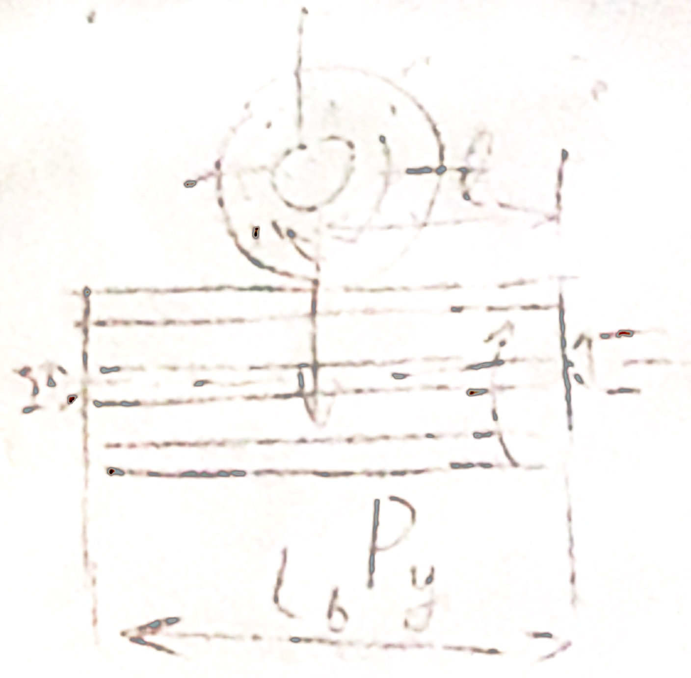

Сигнал, пропорциональный силе резания $ P_y $ получают с помощью динамометрических узлов, которые встраивают в звенья системы СПИД. В нашем случае динамометрическим узлом является задний центр станка:

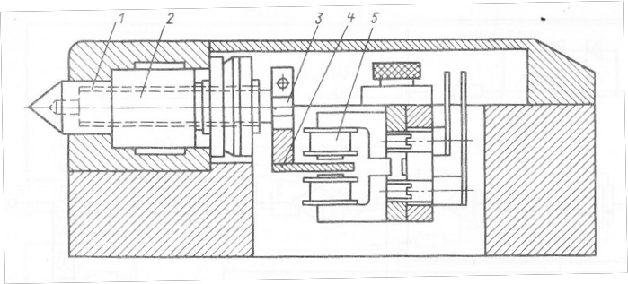

Динамометрическое устройство состоит из полого центра `1`, смонтированного в задней бабке. В непосредственной близости от конца центра запрессовывают измерительный стержень `2`, на свободном конце которого с помощью хомутика `3` крепят якорь `4` индуктивного датчика `5`. При нагрузке на центр консольная часть его деформируются вместе с измерительным стержнем `2` и якорем `4`. В результате меняется зазор $ \Delta $ в индуктивном датчике `5` и появляется напряжение, пропорциональное смещению центра. Таким образом, усилие на заднем центре преобразуется в электрический сигнал.

Зависимость между $ P_y $ и усилием на задней бабке определяется по формуле:

$$ P_y = F_{зб} \frac{L_в}{L_в - l} $$
где $ l $ — расстояние от оси шлифовального круга до заднего центра.

Для обеспечения зависимости $ P_y = f(l) $ движок линейного потенциометра механически связывают со столом станка. При перемещении стола меняется $ l $ и меняется величина отрицательной обратной связи по напряжению. Напряжение на выходе при этом будет пропорционально стабилизируемой силе $ P_y $.

В результате имеем следующую схему системы управления:

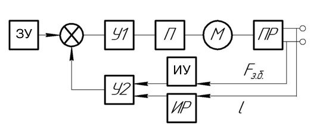

Схема содержит задающее устройство скорости перемещения стола `ЗУ`, усилители `У1` и `У2` и двигатель `М`. Процесс резания `ПР` осуществляется при контроле расстояния $ l $ и усилия на задней бабке $ F_{зб} $. Для фиксации этих величин используются соответствующие датчики. Изменяя скорость перемещения стола станка, данная система стабилизации поддерживает заданную радиальную силу резания, в 2...2,5 раза уменьшает машинное время по сравнению с обычным станком, обеспечивает заданную точность и шероховатость и отсутствие прижогов при шлифовании.

Кроме динамометрических центров в качестве средств измерения силы резания используют динамометрические резцедержатели (для токарных станков), динамометрические столы (для фрезерных) и другие средства.

#### Система стабилизации температуры резания

Применяется при продольном и торцевом точении заготовок со значительными колебаниями твёрдости, а также при фрезеровании и шлифовании.

Системы стабилизации температуры резания используют следующую зависимость:

$$ T = \left(\frac{C}{\theta}\right)^h $$

В системах стабилизации используется обратная связь по температуре режущей кромки инструмента, что позволяет наиболее полно отразить физический процесс резания. При этом изменения в процессе обработки ряда параметров (изменение твёрдости, износа и т. п.) немедленно оказывают влияние на режим резания.

Для оценки температуры используют естественную термопару «инструмент — деталь», которая обладает сопротивлением и в которой возникает термоток (термо-ЭДС):

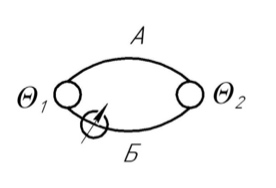

Проводники `А` и `Б` нагреты до разной температуры, возникает термо-ЭДС, пропорциональная разности температур. Желательно чтобы проводники обладали разными свойствами.

Схема стабилизации выглядит следующим образом:

В результате работы термопары «инструмент — деталь» образуется датчик температуры `Д`.

Существенным недостатком является то, что деталь и инструмент необходимо тщательно термоизолировать.

Если подрезается торец, угловая скорость шпинделя, как правило, неизменна, а скорость резания меняется от $ 0 $ в центре до $ max $ на периферии детали. В соответствии с этим в широких пределах будет меняться и температура резания, а значит и условия резания. В этом случае система стабилизации температуры при движении резца от периферии к центру будет автоматически увеличивать угловую скорость шпинделя, сохраняя неизменной заданную в начале температуру резания. Исчерпав весь диапазон регулирования, система начинает работать с постоянной частотой $ n = const $. Теперь скорость резания будет падать из-за уменьшения диаметра, уменьшая тем самым температуру в зоне резания.

Использование таких систем стабилизации повышает стойкость инструмента до трёх раз, сокращает машинное время примерно в полтора раза и колебания температуры при этом — не более $ 5 \, \% $ от заданной.

## Системы адаптивного оптимального управления

Оптимальное управление режимом обработки предполагает выбор критерия оптимизации и определение ограничений. Создание системы управления в этом случае необходимо для поиска и поддержания экстремального значения критерия при выполнении всех ограничений.

Адаптивное оптимальное управление предполагает широкий набор таких операций как запоминание и хранение информации датчиков, умножение и деление величин, и тому подобных операций, поэтому адаптивное оптимальное управление целесообразно при использовании устройств с ЧПУ, построенных на микропроцессорах.

Рассмотрим в качестве примера создание адаптивной беспоисковой системы управления токарной обработкой с аналитическим определением оптимального режима резания.

**Беспоисковая система** — такая, которая определяет оптимальные режимы резания без пробных управляющих воздействий, основываясь только на текущих вычислениях.

В качестве критерия оптимизации предлагается время (в станкоминутах), необходимое для снятия единицы объёма металла с учётом затрат времени на замену инструмента:

$$ \tau = \frac{1 + \frac{\tau_и}{T}}{V \, S \, t} \, (1) $$
где $ \tau_и $ — время на замену инструмента,  
$ T $ — период стойкости инструмента,  
$ Q_о = V \, S \, t $ — объёмная производительность.

Данное выражение удобно рассматривать совместно с другим, которое обычно фигурирует в нормативах режимах резания:

$$ V = \frac{C_V}{T^m \cdot S^{y_V} \cdot t^{x_V}}  $$

$$ C_v = V \cdot T^m \cdot S^{y_V} \cdot t^{x_V} $$

$$ \tau = \frac{1}{V S t} \left(1 + \frac{\tau_и}{С_V^{\mu}} \cdot V^{\mu} \cdot S^{\mu \, y_V} \cdot t^{\mu \, x_V}\right) \, (2) $$
где $ \mu = \frac{1}{m} $

Тогда алгоритм таков: Не меняя глубину резания $ t $ надо каким-либо образом установить оптимальное соотношение скорости резания и подачи, чтобы $ \tau \to min $. Если условия обработки изменились, необходимо определить новое оптимальное сочетание $ V $ и $ S $.

Однако, функция $ \tau = f(V; S) $ не имеет абсолютного экстремума. Таким образом, необходимо найти новый подход к поиску оптимальных значений $ V $ и $ S $. Используем для этого ограничения. Известно, что стремление к максимальной производительности (минимум $ \tau $) обязательно вступает в противоречие по мощности резания, по силам резания, по прочности инструмента и так далее. Все ограничения могут быть записаны в общем виде следующим образом:

$$ S = C_S \cdot V^{\beta} \cdot t^{\alpha} \, (3) $$
где $ C_S $, $ \alpha $, $ \beta $ — константы, известные из теории резания.

Например:

где значения $ x_P $, $ y_P $, $ x_V $, $ y_V $, $ n $ берутся из справочников режимов резания.

Таким образом, при $ t = const $ решаем совместно $ (2) $ и $ (3) $, приравниваем производную к $ 0 $ и получаем значение $ V_{опт} $. Найденное значение $ V_{опт} $ будет наивыгоднейшим при действии соответствующих ограничений. Подставив значение $ V_{опт} $ в соответствующее выражение, связывающее скорость со стойкостью, можно определить оптимальное значение стойкости инструмента.

Схема управления будет выглядеть следующим образом:

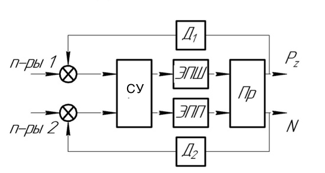

Беспоисковая система должна изменять параметры режимов резания $ V $ и $ S $ таким образом, чтобы несмотря на условия обработки новый режим по прежнему поддерживал оптимальную стойкость (скорость). Допустим, при определении оптимального режима было установлено, что ограничением является сила $ P $ и мощность резания $ N $. Тогда оптимальное управление будет сводиться к стабилизации параметров $ P $ и $ N $. Поскольку параметра два, такая система будет называться двухпараметрической.

## Самонастраивающиеся системы в АСУ металлообработкой

Экстремальные зависимости показателей производительности и себестоимости обработки позволяют построить систему, самонастраивающуюся на оптимальный режим работы. На основе выбранного показателя качества (целевой функции) разрабатывают систему управления, включающую датчики оперативной информации, устройство ввода априорной информации, микропроцессор, регулятор (оптимизатор) и исполнительные механизмы. Функции оптимизатора могут быть возложены на подпрограмму микропроцессора.

Рассмотрим в качестве примера процесс плоского шлифования деталей периферией круга на станке с прямоугольным столом.

Период стойкости шлифовального круга:

$$ T = \frac{C}{(V S_п S_в)^2} K_1 K_2 $$
где $ C $ — константа, зависящая от условий обработки  
$ K_1 $, $ K_2 $ — коэффициенты, зависящие от обрабатываемого материала и диамтера круга  
$ V $ — скорость перемещения стола  
$ S_п $ — поперечная подача, в долях от ширины круга $ B $  
$ S_в $ — вертикальная подача

Полагая неизменными подачи $ S_п $ и $ S_в $, получаем:

$$ T = \frac{K_T}{V^2} $$
где $ K_T = \frac{C}{(S_п S_в)^2} K_1 K_2 $

Производительность при грубом (черновом) шлифовании выражается в объёме металла, снятом за период стойкости круга и отнесённом к периоду стойкости с учётом времени правки круга:

$$ Q = \frac{V S_п S_в T}{T + t_п} $$

$$ Q = \frac{V K_T T}{T + t_п} $$
где $ T = f(V) $

Анализ и расчёты по последней формуле производительности показывают, что производительность шлифования обладает максимумом относительно скорости движения стола $ V $.

***
[date]: # (18.03.19)

Для поддержания оптимального критерия режима шлифования — производительности — воздействуют на электропривод движения стола станка, используя поисковую автоматизированную систему. Перед пуском системы в ячейки памяти управляющей ЭВМ записывают положительный шаг приращения скорости, который пропорционален приращению угловой скорости: $ \Delta V ~ \Delta \omega $. Положительный шаг приращения подаётся на задатчик скорости привода стола. Угловая скорость привода растёт. При этом осуществляется опрос датчиков параметров резания. По полученным данным производят вычисление текущих значений стойкости $ T $ и показателя эффективности — производительность $ Q $. Через $ n $-е количество тактов работы двигателя ЭВМ определяет значение приращения скорости движения стола $ \Delta V = V_N - V_{N-1} $. Здесь же определяют приращение производительности $ \Delta Q = Q_N - Q_{N-1} $. Дальнейшее изменение угловой скорости, а значит и скорости $ V $ привода стола производится в зависимости от сочетания знаков приращений, полученных после $ N $ тактов работы. Графически это выглядит так:

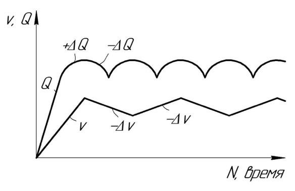

Таким образом система будет самонастраиваться. Логический блок ЭВМ выполняет анализ знаков приращений скорости движения стола и производительности. При движении рабочей точки к точке экстремума $ \Delta Q > 0 $ и $ \Delta V > 0 $. В процессе разгона система проходит точку экстремума, $ \Delta Q < 0 $, $ \Delta V > 0 $. Назначается новый шаг приращений, уже с $ - \Delta V $, то есть, движение привода замедляется. Рабочая точка опять движется к точке экстремума. При этом $ \Delta Q > 0 $, $ \Delta V < 0 $. В процессе замедления система опять проходит точку экстремума и продолжает двигаться от неё. Теперь $ \Delta Q < 0 $, $ \Delta V < 0 $. Даётся команда на разгон привода стола, назначается $ + \Delta V $. система опять будет двигаться к точке экстремума. Таким образом постоянно осуществляется поиск экстремального значения $ Q $. Использования управляющей вычислительной машины позволяет построить АСУ ТП в пределах цикла работы стабилизирующий технологический параметр, а между циклами — обеспечивающую поиск оптимального значения параметра. 

## Групповое управление станками от ЭВМ

Групповое управление станками осуществляется центральной ЭВМ (УВМ),  на которую возлагается расчёт и хранение управляющих программ, распределяемых по запросу со станков. Система представляет собой комплекс с многоуровневой структурой, объединяющей индивидуальные системы станков с ЧПУ. Возможны различные варианты схемы управления. 

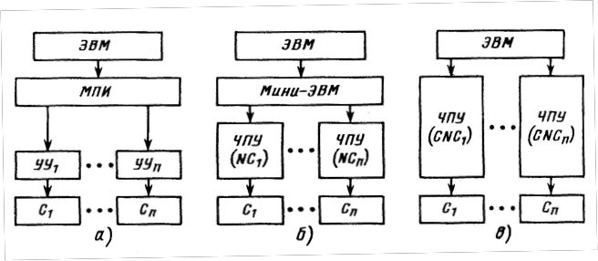

`ЭВМ` — управляющая вычислительная машина, `МПИ` — многопрограммный интерполятор, `Мини-ЭВМ` — устройство управления, `Ci` — станки. 

Система управления по схеме `а` состоит из УВМ, обеспечивающей хранение управляющих программ для работы всех станков участка. УВМ распределяет эти программы по запросам станков и с помощью интерполятора передаёт команды на устройства управления станками `УУi`, причём эти устройства могут быть в виде электроприводов, магнитов и т. д. Возможность одновременного управления несколькими станками требует высокого быстродействия ЭВМ и работы её в режиме разделения времени. Данная система управления экономична, однако есть существенные недостатки: отказ интерполятора приводит к остановке всех станков; а также мощность сигнала на выходе машины бывает недостаточно велика. 

По схеме `б` система управления сформирована из автономных устройств с ЧПУ, состоящих из Мини-ЭВМ и устройств, программы которым задаются от центральной ЭВМ. ЭВМ производит гранение, распределение и покадровую выдачу программ. На мини-ЭВМ и автономные устройства с ЧПУ возлагается интерполяция, усиление сигналов, поступающих на приводы станков. Подобная структура является положительной в том смысле, что может быть создана на базе уже работающих станков с ЧПУ без крупных капитальных вложений.

Наиболее высокой системной надёжностью обладает структура `в`. Здесь используют устройство ЧПУ типа `CNC`. Применение микропроцессоров в составе каждой системы ЧПУ непосредственно у станка позволяет сравнительно просто организовать обмен информацией между оператором и ЭВМ при обработке первой детали. При этом обеспечиваются различного рода корректировки, появляется возможность использования адаптивного управления, что расширяет технологические возможности станка. Центральная ЭВМ работает только во время передачи программы в память системы ЧПУ. В процессе обработки детали она не участвует. Использование группового управления станками от ЭВМ повышает производительность, гибкость использования оборудования, улучшает условия эксплуатации оборудования и повышает надёжность его работы. 

### Управление в условиях гибких производственных систем (ГПС)

В общем случае ГПС состоит из исполнительной системы, включающей технологическую, транспортную и складскую подсистемы, и системы управления, координирующей функционирование перечисленных подсистем. Исполнительная система осуществляет процесс изготовления, контроль, транспортировку деталей и стружки. Как правило, в ГПС входит от трёх станков с ЧПУ разных или одинаковых моделей. Использовать менее трёх станков экономически нецелесообразно, так как необходимо чтобы окупилась управляющая вычислительная машина. При небольшой номенклатуре деталей (3...6 наименований) схема расстановки оборудования следующая: 

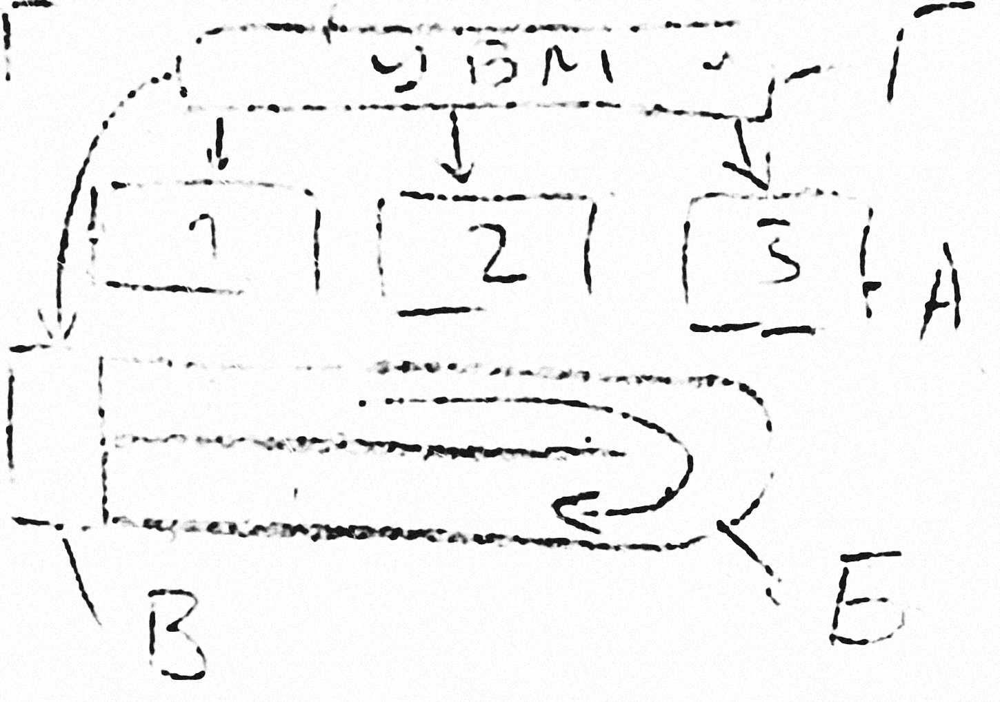

`А` — станки, `Б` — транспортная система, `В` — склад-накопитель, `Г` — управляющая центральная ЭВМ. 

При номенклатуре обрабатываемых деталей до 100 схема ГПС выглядит следующим образом: 

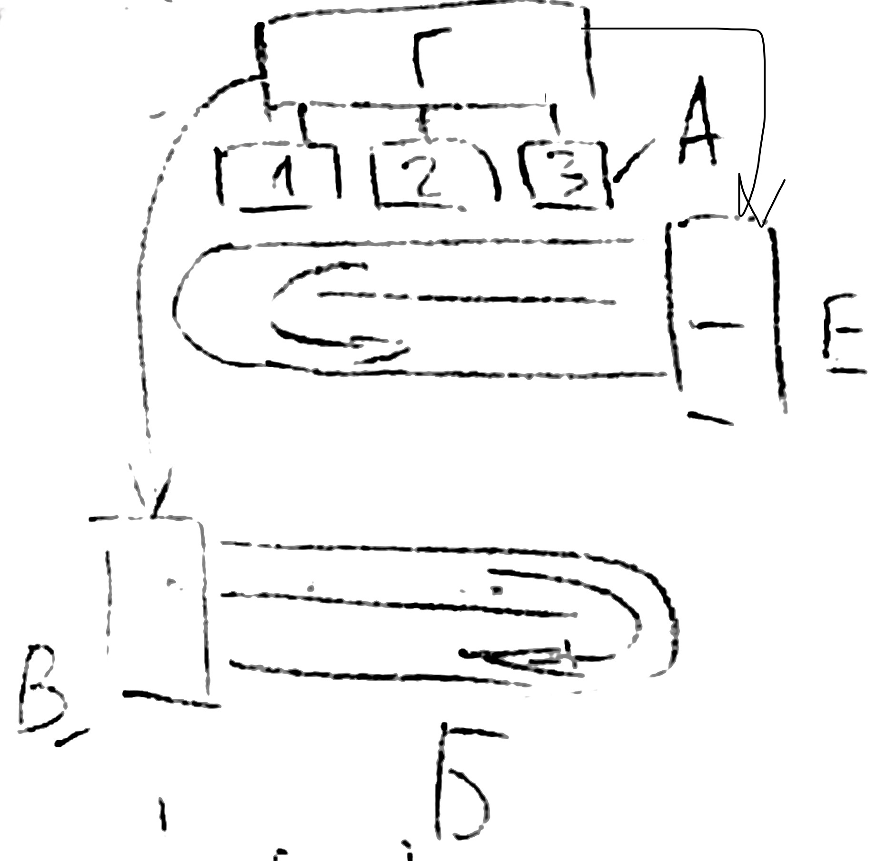

`Е` — склад (магазин) инструментов.

Таким образом, исполнительная часть ГПС состоит из станков с ЧПУ, контрольного измерительного оборудования, а также транспортно-складской системы. Система управления состоит из устройств управления станками (ЧПУ), центральной (управляющей) вычислительной машины и систем связи. Совокупность программ, реализуемых машиной в процессе управления, составляют программное обеспечение системы управления. 

Основными задачами центральной ЭВМ являются: 

- распределение хранящихся в памяти управляющих программ
- обеспечение максимальной и равномерной загрузки станков с помощью автоматизированной транспортно-складской системы
- наблюдение за ходом обработки заготовок и корректировка работы станков

#### Особенности оборудования, входящего в состав ГПС

Требования к станку как к наиболее важной части ГПС следующие: 

- точность
- автоматизм
- гибкость
- надёжность
- производительность

Для выполнения перечисленных требований принимают ряд конструктивных мер. Например, для повышения точности обработки детали станины станков делают литыми и стальными, чтобы увеличить жёсткость, шпиндели станков обеспечивают принудительным охлаждением для подшипников качения или используют шпиндели без опор качения. Для уменьшения тепловых деформаций используют принудительную циркуляцию СОЖ и измеряют деформацию шпинделя с последующей коррекцией его перемещения. Важным является точное базирование детали, отсутствие попадания стружки в направляющие станков. Для этих целей используют индикаторы контакта детали с направляющими станков.

Ряд требований необходим для автоматизма работы. Для этого станки снабжают магазинами инструментов, устройствами смены инструмента, постоянно контролируют состояние режущих кромок. Поломку инструмента обнаруживают, в основном, тремя способами: выявлением пиковой мощности на приводе шпинделя, выявлением шума при поломке инструмента, или выявлением повышенной вибрации инструментодержателя.

Контроль износа инструмента осуществляется по двум разным принципам: 

1. Заранее рассчитывается стойкость и срок службы каждого инструмента теоретически или экспериментально. Эксперимент периодически считают негодным и заменяют по истечении расчётного срока. При этом на станке должна быть такая система ЧПУ, которая позволяет заносить в память ЭВМ действительное время работы *каждого* инструмента.
2. Непрерывно контролируют износ инструмента, инструмент при этом меняют только тогда, когда этот износ достигает критического значения.

В последнее время меняется не весь инструмент и державка, а только режущая часть инструмента.

Контроль готовых деталей осуществляется либо на станке, либо вне станка, на специальных приспособлениях. 

При контроле деталей на станка надо учитывать влияние ряда факторов на погрешность измерения: наличие СОЖ и стружки на детали, температурные деформации, возможные деформации после раскрепления, погрешности самого станка. Контроль на станке используют для определения износа инструментов; при обработке деталей высокой стоимости, когда систематический контроль после каждого перехода позволяет вовремя прекратить обработку, если размеры детали вышли за допустимые пределы; при обработке чёрных заготовок, так как контроль заготовки до обработки позволяет уменьшить время обработки.

Для контроля вне станка используют специальные позиции контроля за пределами станка. Контроль осуществляется с помощью специальных измерительных устройств или с помощью координатно-измерительных машин — КИМ. Специальные измерительные устройства обычно создаются на основе индуктивных датчиков, а КИМ — материальное воплощение трёх координат — $ x, y, z $. Перемещение по трём осям при измерении осуществляется с помощью аэростатических опор. 

### Особенности систем загрузки, выгрузки и транспортирования деталей

Функции автоматической транспортной системы — автоматизация загрузки, выгрузки деталей, транспортирования и хранения их. Детали могут быть в приспособлениях-спутниках или без них. Для загрузки и выгрузки деталей, а также смены инструментов чаще всего используют промышленных роботов.

Согласно ГОСТу, **промышленный робот** — автоматическая машина, стационарная или передвижная, состоящая из исполнительного устройства в виде манипулятора, имеющего несколько степеней подвижности, и перепрограммируемого устройства программного управления для выполнения в производственном процессе двигательных и управляющих функций. То есть, если системы управления нет — это не робот.

Устройства загрузки станка должны отвечать следующим требованиям:

- точность позиционирования деталей на станке
- производительность
- гибкость — адаптация к различным типам деталей и станков
- надёжность: Вероятность отказа линии из 20 роботов, каждый из которых имеет низкую вероятность отказа $ 1 % $ — $ 18,2 % $. 

***
[date]: # (27.03.19)

По конструктивному исполнению роботы делятся на *стационарные*, *подвесные* и *передвижные*. В роботах используется различные системы коориднат: прямоугольные, цилиндрические, сферические и угловые. Основные характеристики роботов следующие: 

- грузоподъёмность
- размеры рабочей зоны
- скорость перемещения по каждой из координат
- точность позиционирования
- безопасность функционирования

#### Системы управления роботами

Существует несколько поколений систем управления роботами. 

- Роботы прямого обучения. Человек (оператор) выполняет операции, а робот запоминает и фиксирует его действия. Составляется программа, которая носит жёсткий характер; окружающая среда не воспринимается роботом, то есть датчики не требуются. 
- Адаптивные роботы. Обладают сенсорными и тактильными датчиками, то есть, зрением и осязанием. В этих роботах накапливается информация о внешней среде. Роботы снабжены процессорами, которые работают по основной программе и подпрограмме. Подпрограммы выбираются в зависимости от информации от датчиков
- Интеллектуальные роботы. Способны распознавать предметы в пространстве, вырабатывать планы решения поставленных перед ними задач, контролируют выполнение этих задач. Для интеллектуальных роботов требуются значительные вычислительные ресурсы.

Чтобы преимущества автоматизации не были утрачены, необходимо снабдить робот эффективным сменным захватом (манипулятором). Для манипуляции различными деталями целесообразно, чтобы робот имел систему автоматической смены «пальцев» и устройством переворачивания (кантования) детали. 

Программы для роботов готовят:

- методом обучения
- методом расчёта управляющих программ
- методом самообучения

При самообучении интеллектуальный робот на основе информации от внешней среды формирует программу с последующим запоминанием и оптимизацией команд.

### Транспортирование детали в цехе ГПС

Может осуществляться двояко.

- сохраняется промежуточный накопитель возле станка. Этот вариант используется в гибких производственных модулях
- с адаптацией к любой производственной системе путём транспортирования деталей тележками

Промежуточные накопители создают запас заготовок, который необходим для автономного функционирования модуля. Заготовки подаются без приспособлений-спутников (токарные станки) или предварительно закреплёнными в приспособлениях-спутниках. 

В первом случае есть несколько мест, где может быть деталь. Менять тип обрабатываемой детали в любой момент времени нельзя, поэтому обработку ведут партиями. Этот вариант простой с точки зрения управления, детали доставляются к накопителю путём, например, цепной передачи.

Когда используют приспособления-спутники, деталь, как правило, достаточно дорогая и обрабатывается на спутнике постоянно. Часто используют карусель со спутниками. 

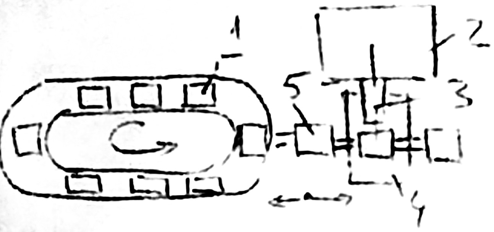

1 — спутник с деталью, 2 — станок, 3 — зона обработки, 4 — стол, 5 — челночное устройство для подачи и снятия спутников.

Обрабатываемые детали могут быть одного или различного типоразмера, и могут быть размещены на карусели в произвольном порядке. Для распознавания их используют кодирование, чаще всего — спутников. Соответствующие детали программы обработки вызываются автоматически после распознавания кода.

В качестве накопителя может выступать сама карусель, стеллажи, и, для подъёма и перемещения заготовок, штабелёры.

Для ограничения времени нахождения детали в пределах ГПС штучные накопители могут отсутствовать. Транспортировка детали на конвейерах не может быть использована, так как деталь может быть направлена по любому маршруту, в разные позиции ГПС. Расстояния могут быть значительными, особенно от склада до станков, поэтому единственным средством транспортировки становятся автоматические тележки. Они позволяют перемещать детали на разные расстояния по любым траекториям. Управлять перемещениями нескольких деталей разного типа по разным траекториям достаточно сложно, тем более, что управление должно осуществляться в реальном масштабе времени. Без вычислительной техники такое перемещение невозможно. Основные варианты транспортных тележек — рельсовые и безрельсовые.

Рельсовые тележки приводятся в движение при помощи цепей, перемещающихся либо в желобах пола, либо в подвесных конструкциях. Перемещаются тележки по рельсам. Создание путей перемещения требует дополнительных затрат, а при изменении производства необходимо менять и траектории движения. Наличие рельсов мешает движению в цехе и ухудшает безопасность. Однако, имеется ряд преимуществ: автономность перемещения, надёжность функционирования. 

Безрельсовые приводятся в движение двигателями постоянного тока; отсюда — нужны аккумуляторы, которые не должны быть громоздкими, и для подзарядки необходимы позиции в цеху. Ввиду ограниченной энергии питания, а также значительных потерь на трение из-за движения на пневматических шинах грузоподъёмность тележек ограничена и составляет не более 15 кН. Использование пневматических шин для сцепления с полом возможно лишь при относительной чистоте пола в цехе. Преимущество тележек в следующем: гибкость транспортной системы, так как изменение траектории движения тележек может быть осуществлено за несколько дней; безопасность благодаря низкой скорости и наличию буферных устройств, останавливающих тележку при малейшем касании препятствия; при соответствующем программном обеспечении в одной и той же системе может перемещаться несколько тележек; точность остановки в заданном положении составляет ± 1 см. Существует два способа управления безрельсовыми тележками.

С помощью линий, нанесённых краской или наклеенных на полу цеха:

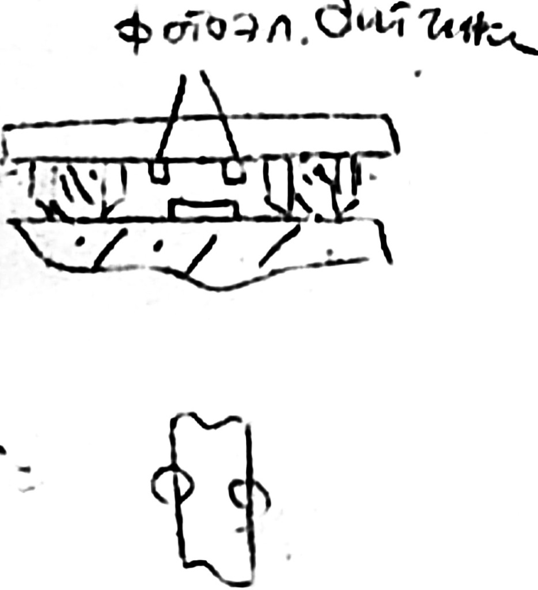

Электрические датчики устанавливают так, чтобы они фиксировали изменение направления линии. При повороте сигнал с одного датчика ослабевает, а с другого — увеличивается. Это рассогласование подаётся на механизм поворота для управления тележкой. Пол должен быть чистым.

С помощью проводов, смонтированных в полу цеха:

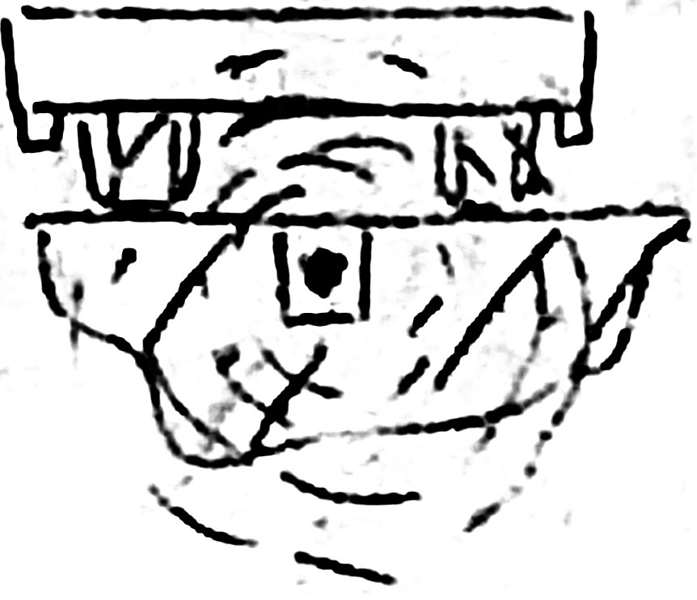

Магнитное поле вокруг проводника, уложенного в полу, меняется при повороте провода. Сигнал с одного датчика становится сильнее, с другого — слабее. Появляется рассогласование, сигнал усиливается и подаётся на механизм поворота. 

### Диспетчеризация в условиях ГПС

Под диспетчеризацией обычно понимают совокупность целенаправленных воздействий, которые управляют функционированием всех составных частей объекта управления с целью выполнения производственного задания при заданных показателях процесса производства. В условиях ГПС роль диспетчера можёт играть либо человек, либо ЭВМ. Диспетчеризация заключается в:

- координации работы отдельных единиц технологического, вспомогательного оборудования друг с другом, а также с работой транспортно-складских систем
- оперативном управлении материальными потоками заготовок, деталей, инструмента, стружки
- формировании рациональной по времени стратегии управления всеми ресурсами ГПС

Одной из особых функций АСУ ТП в ГПС является контроль и диагностика состояния оборудования и процесса обработки. Основной задачей контроля и диагностики является выявление времени и причин отказа объектов диагностирования — станков, средств вычислительной техники, вспомогательного оборудования и так далее. Нормальное функционирование объекта обычно нарушается из-за следующих причин: неисправность оборудования, ошибки обслуживающего персонала, изменение параметров внешней среды. Контроль и диагностика в АСУ ТП, как правило, осуществляются с использованием вычислительной техники.

## Технические средства АСУ ТП

К ним относят:

- управляющую вычислительную машину (УВМ)
- средства передачи информации (связи)
- исполнительные механизмы
- средства получения, сбора и формирования информации (датчики и преобразователи)

### Общая характеристика и классификация основных узлов УВМ

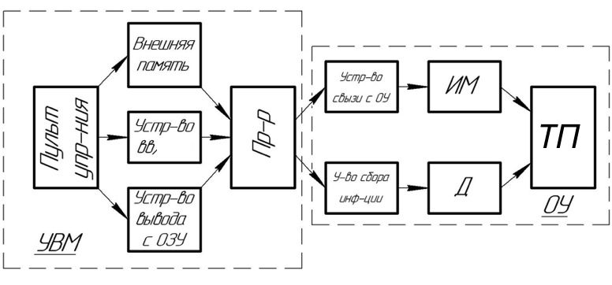

На рисунке показана структурная схема АСУ ТП, которая включает в себя следующие блоки:

- блок внешней памяти, запоминающий сведения об объекте управления и текущие задания, поступающие с пульта управления.
- блок сбора и преобразования информации о текущем состоянии объекта и возмущениях
- центральный блок — процессор, выполняющий заданные алгоритмом преобразования информации для выработки управляющих воздействий. Организует взаимодействие всех элементов УВМ
- блок связи с объектом управления

УВМ имеет также ряд вспомогательных элементов: средства связи человека с ЭВМ, средства ввода / вывода информации, дисплеи, графопостроители, и тому подобное. На вход УВМ от датчиков поступает текущая информация, которая, в основном, имеет аналоговый вид (напряжения, токи, частоты и т. п.). Так как УВМ оперирует, в основном, дискретными (цифровыми) величинами, то необходимо аналоговые сигналы преобразовать в дискретную форму. Однако, для управления исполнительными механизмами требуются непрерывные сигналы. Поэтому цифровую информацию надо перевести в аналоговую. Для этого используют аналого-цифровые и цифроаналоговые преобразователи (АЦП и ЦАП).

### Принципы организации связи УВМ с объектом управления

В основном используют три принципы: *синхронный*, *асинхронный* и *комбинированный*. 

При синхронном принципе связи процесс управления разбивается на циклы равной длительности при помощи таймеров. В каждом цикле, начинающемся с тактового импульса, происходит последовательный опрос и преобразования сигнала датчиков. После поступления очередной партии текущей информации и её запоминания происходит расчёт новых значений управляющих воздействий и передача их к исполнительным механизмам. Закончив расчёт управляющих воздействий, УВМ прерывает вычисления до прихода следующего тактового импульса. 

Для того, чтобы АСУ ТП оперативно реагировала на события, вызванные отклонением хода техпроцесса, или на возникшие аварийные ситуации, используют асинхронный принцип связи УВМ с объектом управления. Для этого вводят функцию прерывания. ЭВМ реагирует на импульс прерывания и после завершения обслуживания сигнала прерывания возвращается к выполнению прерванной программы. 

Возможно применение и комбинированного принципа связи, в котором наряду с тактовыми импульсами используют сигналы прерывания в случае аварии.

***
[date]: # (01.04.19)

### Основные режимы работы УВМ в составе АСУ ТП

В процессе работы АСУ ТП, а следователь но и УВМ, выполняет две функции — информационную и управляющую. Для выполнения информационных функций УВМ работает в двух режимах: режим сбора данных и режим «советчика». Информационная функция заключается в централизованном контроле за состоянием объекта управления, и вычислительных и логических операций информационного характера.

Режим сбора данных: АСУ ТП должна непрерывно, периодически или по вызову, отображать и регистрировать значения технологических параметров оборудования; обнаруживать, регистрировать и сигнализировать об отклонении параметров, в том числе сигнализировать о срабатывании блокировок и защит; оперативно отображать и регистрировать результаты математических и логических операций, которые выполняет УВМ. Режим сбора данных является наиболее простым. Между процессором и технологическим объектом в этом режиме может действовать оперативный персонал.

Режим «советчика» используется в начальной стадии внедрения АСУ ТП и позволяет проверить достоверность модели процесса и алгоритмы управления. Опытный оператор, управляя процессом и следя за рекомендациями УВМ, может обнаружить неправильную рекомендацию, неправильный уровень исходных данных и тем самым устранить имеющиеся ошибки. При этом необходимо помнить, что возможности человека ограничены, и, поэтому, число контролируемых параметров должно быть невелико. Кроме того, в режиме советчика осуществляется диагностика хода техпроцесса и оборудования.

Режим управления АСУ ТП. Формируются и передаются на исполнительные устройства управляющие воздействия, которые реализуют выбранный режим. УВМ не только вырабатывают управляющие воздействия, но и оперативно отслеживают их выполнение. Оперативный персонал в этом случае в управлении не участвует и только контролирует работу АСУ ТП, но если возникла аварийная ситуация или отказ УВМ, управление объектом принимает на себя оператор.

### Устройство связи УВМ с объектом управления

Поскольку центральным в системе управления является процессор, как правило он обрабатывает цифровую информацию. Исполнительные механизмы на станках, как правило, воспринимают аналоговый сигнал. Для согласования разрабатывают цифроаналоговые преобразователи (ЦАП), которые позволяют осуществить переход от цифровой к аналоговой форме. Входным сигналом в ЦАП служит цифровой код в различных системах счисления, а выходным — соответствующая аналоговая величина в виде, например, напряжений постоянного тока. Таким образом, цифроаналоговые преобразователи используются для вывода управляющей информации из ЭВМ и передачи её к объекту управления.

В процессе функционирования объекта управления с датчиков цепи обратной связи поступает информация о ходе техпроцесса. Она, как правило, имеет аналоговую форму. Для восприятия её процессором её необходимо перевести в цифровую форму. Для этого используют АЦП — аналого-цифровые преобразователи. 

### Приводы исполнительных механизмов

К приводу относят часть системы управления, преобразующую сигналы управления в механическое движение исполнительных механизмов. То есть, привод — это не только двигатель, но и различные преобразователи, усилители, передаточные механизмы и т. п. 

Приводы исполнительных механизмов можно разделить на две основные группы:

- **Сервоприводы** — вспомогательные обслуживающие приводы, обеспечивающие преобразование управляющих сигналов, как правило, маломощных, в сигналы с мощностью, необходимой для перемещения узлов. Роль их вспомогательная, но достаточно важная. Как правило, эти приводы реверсные, то есть могут вращаться в обе стороны. Имеют небольшие габариты, занимают мало объёма, могут быть разного исполнения (не обязательно электрические).
- **Двигатели** — собственно, приводы. Имеют большие диапазоны скоростей, рабочих подач, возможность ускоренных движений. Основное требование к таким приводам — точность работы и производительность станка. 

В настоящее время применяют два вида электрических приводов: на основе следящих систем, где используют высокомоментные двигатели, и на основе шаговых двигателей.

Высокомоментные двигатели обладают широким диапазоном изменения скоростей по сравнению с обычными двигателями. Принципиальных отличий по сравнению с известными двигателями эти двигатели не имеют, но применение специальных материалов для магнитной системы, замена материалов щёток и коллектора, позволили получить при малой частоте вращения ротора большие крутящие моменты. Используют возбуждение от постоянных магнитов, из-за этого меньше нагреваются. По желанию потребителя их можно изготавливать с датчиком пути и тормозом, а также встроенным тахогенератором. Имеют малую массу или объём. Позволяют отказаться от использования механических редукторов. Их можно напрямую соединять с ходовым винтом станка. Двигатели позволяют достичь большой точности обработки и получить ускоренные перемещения, сокращая вспомогательное время. 

Шаговые двигатели бывают двух видов: маломощные для использования в качестве серводвигателей и силовые для привода исполнительного узла станка без усилителей крутящего момента. Шаговый двигатель обеспечивает строго выдерживаемый угол поворота ротора относительно статора. Частота подаваемых на шаговый двигатель импульсов, меняют угловую скорость вращения ротора, и при большой частоте ротор может вращаться непрерывно. Шаг на выходном валу – $ 0,5...1,5 ° $. Ошибка в шаге от нагрузки может составлять 20 % шага, но при работе двигателя она не накапливается. 

#### Гидроприводы в исполнительных механизмах

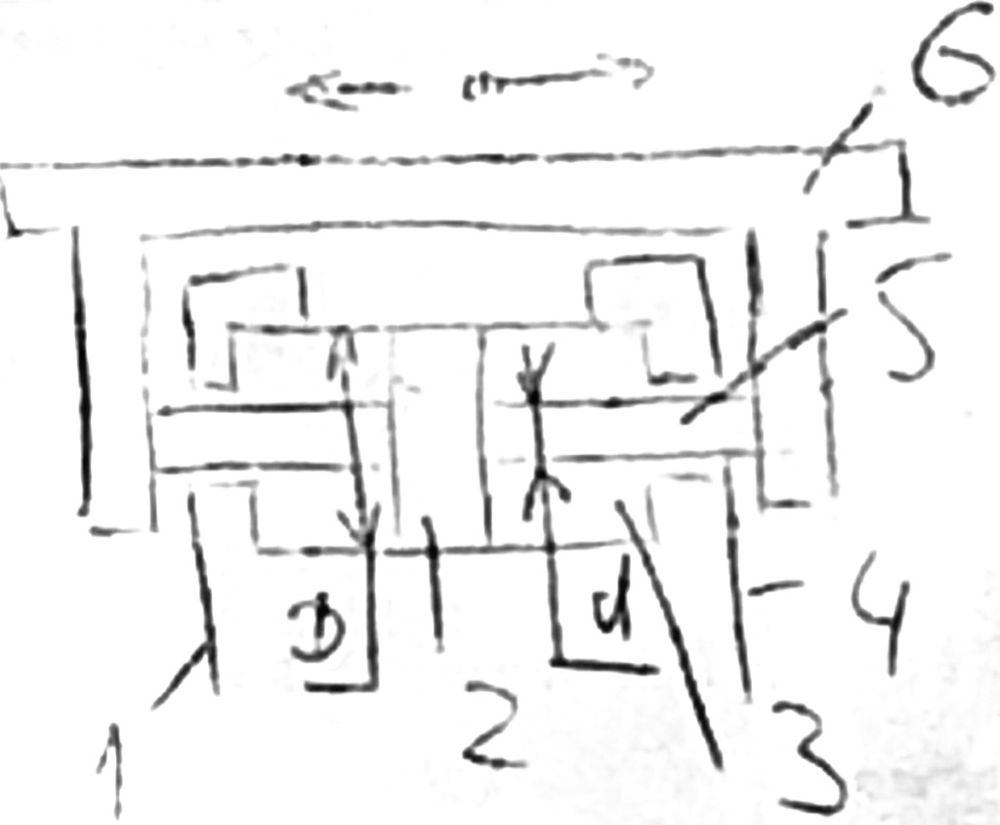

`1`, `4` — трубопроводы, `2` — поршень, `3` — гидроцилиндр, `5` — шток, `6` — стол станка.

Для свободного выхода воздуха из полости цилиндра масло по трубопроводам подают в верхние точки цилиндра. Стол совершает движения в противоположные стороны с одинаковыми скоростями. Корпус цилиндра неподвижен. Штоки, имеющие одинаковый диаметр $ d $, работают на растяжение. Требуется точно изготовить цилиндр, выполнить двойные уплотнения штоков и уплотнение поршня. При движении вправо и влево в цилиндр поступает равное количество масла в единицу времени. Скорость движения стола $ S = \frac{1000 \cdot Q}{0,785 \cdot 60 (D^2 - d^2)} \left[\frac{мм}{с}\right] $, где $ Q $ — расход масла, $ \left[\frac{л}{мин}\right] $. Данная схема применяется в станках шлифовальной группы. Кроме гидроцилиндров могут использоваться пневмоцилиндры.

### Средства получения, сбора и формирования информации

К перечисленным средствам относят:

- первичные измерительные преобразователи (датчики)
- коммутаторы сигналов внутренних линий связи
- вторичные преобразователи
- устройства регистрации информации на различных носителях

#### Первичные преобразователи (датчики)

**Датчик** — элемент, который устанавливают в технологическом оборудование и который первым воспринимает контролируемый параметр. Эти устройства осуществляют преобразование одной физической величины (силы, момента, перемещения и т. д.), неудобной для последующего использования, в другую физическую величину, пригодную для последующих преобразований с целью управления объектом. Такой величиной чаще всего является напряжение или сила тока. 

Задача датчиков — непрерывный контроль процесса обработки и сигнализация о происходящих изменениях.

Датчики — это устройства, предназначенные для выработки измерительной информации в форме, удобной для передачи, преобразования, обработки и хранения сигнала. Причём информация эта не поддаётся визуальному восприятию наблюдателя. В этом отличие датчика от измерительного прибора.

Требования, выдвигаемые к датчикам:

- возможно большая крутизна преобразования (отношение сигнала на выходе к сигналу на входе)
- исполнение датчика должно исключать влияние побочных факторов
- датчик по возможности не должен влиять на состояние контролируемого объекта, энергетический уровень на входе датчика должен быть по возможности минимальным, поэтому в дальнейшем сигнал должен пройти через усилительное устройство
- датчики должны быть простыми по конструкции, обладать высокой надёжностью и быть недорогими

Согласно государственной системе приборов, измерительные преобразователи подразделяются на:

- С унифицированным выходным сигналом.  
  Унифицированные сигналы:
    - постоянный ток
    - переменный ток
    - давление сжатого воздуха ($ 2...10 \cdot 10^4 Па $)
- С естественным выходным сигналом.  
  Естественные сигналы:
    - перемещения
    - угол поворота
    - усилия
    - время
    - постоянное напряжение
    - переменное напряжение
    - активное сопротивление
    - частота
    - электрическая ёмкость
    - и т. д.
- С дискретным (контактным) выходным сигналом. Не датчики, а конечные выключатели.

Наиболее совершенной структурой системы управления является структура с отрицательной обратной связью. Достоинство такой схемы в том, что выходной сигнал непрерывно сравнивается с входным, в результате чего вырабатывается компенсация изменений параметров процесса.

##### Датчики перемещения (пути)

Датчики устанавливаются в станках с ЧПУ для контроля пути, пройденного узлами станка. 

Для фиксации перемещения устанавливается датчик. Отсчёт показаний датчика ведётся, как правило, либо с помощью шкалы, либо с помощью штрихкода. Информация носит дискретный характер, поэтому её, как правило, преобразуют в непрерывную форму. Перемещения по шкале либо считаются, либо читаются. Иногда используют вместо дискретных и непрерывные датчики. Самый простой датчик перемещения — датчик на основе потенциометра.

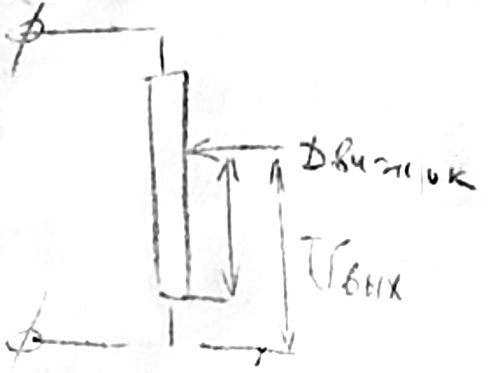

$$ U_{вых} = U \frac{x}{l} $$

***
[date]: # (02.04.19)

##### Датчики контроля мощности

Контроль потребляемой в процессе резания мощности проще всего осуществить измеряя мощность, подводимую к электродвигателю. При этом необходимо из общей мощности вычесть мощность холостого хода. Это та часть мощности, которая необходима для функционирования станка при отсутствии резания. Задачу решают следующим образом: измеряют мощность холостого хода, уровень её фиксируют, а затем вычитают этот уровень из общей подводимой мощности при резании. Оставшуюся часть считают мощностью резания. Здесь возможны ошибки, так как мощность холостого хода может меняться из-за нагрева станка, изменения условий смазки и других причин. Поэтому мощность холостого хода нужно периодически контролировать. Для контроля мощности используют различные электрические схемы. В качестве примера рассмотрим использования датчиков ЭДС Холла, которые включают по схеме двух ваттметров. Для получения информации о потребляемой мощности показания этих двух ваттметров следует просуммировать.

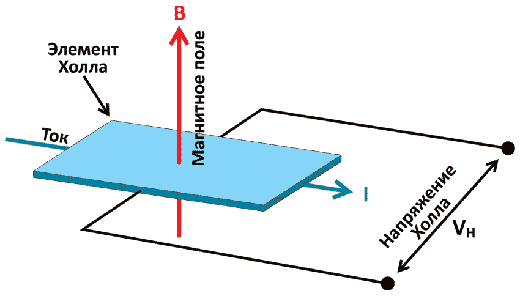

Эффект Холла заключается в следующем: если по проводнику течёт ток силой $I$, а перпендикулярно направлению тока действует магнитный поток, то на свободных гранях появляется разность потенциалов или **ЭДС Холла**. Определить её можно как $E_h = k \cdot I \cdot \Phi \cdot \cos \phi$. При этом $i = k_1 \cdot i_л$, $\Phi = k_2 \cdot V_л$.

$$ E = E'_h + E''_h = C \cdot i \cdot V_л \cdot \cos \phi $$

##### Датчики упругих перемещений

Индуктивный датчик фиксирует изменение магнитного потока. Принцип действия индуктивного датчика заключается в изменении коэффициента самоиндукции $L$ катушки с незамкнутым сердечником, если меняется воздушный зазор $h$. Катушки имеют соответственно индуктивности $L_1$ и $L_2$, между ними подвижный якорь из ферромагнитного материала. Коэффициент самоиндукции каждой катушки связан с воздушным зазором $h$. При изменении зазора $h$ меняется коэффициент самоиндукции, причём с уменьшением зазора коэффициент растёт. Если для одной катушки самоиндукция растёт, для другой она уменьшается. Самые незначительные перемещения якоря приводят к весьма заметным изменениям коэффициента самоиндукции. Возможности индуктивного метода широки. Датчики используют для контроля разных величин. Рассмотрим, например, непрерывное измерение износа режущего инструмента при точении. 

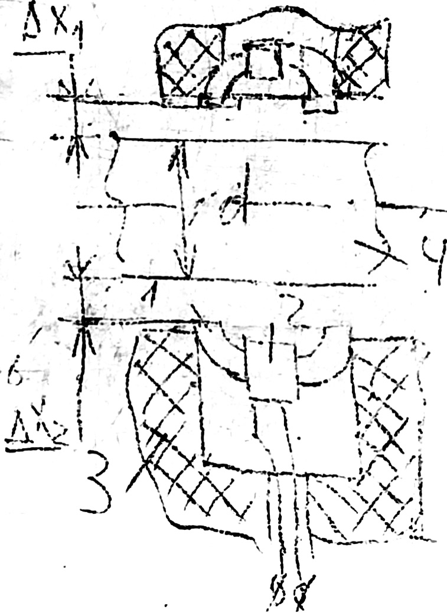

Катушку с незамкнутым ферромагнитным сердечником, расположенную в токонепроводящем корпусе `3` помещают на некотором расстоянии от контролируемой детали `4`. При прохождении по обмотке `2` переменного тока возникает магнитный поток, замыкающийся по сердечнику `1` через два зазора и тело контролируемой детали и обладающей достаточно большой магнитной проницаемостью. Диаметр вала $d$ зависит от расстояния между датчиками $L$ и от зазоров $\Delta x_1$ и $\Delta x_2$. При изменении зазоров, вызванных, например, уменьшением диаметра, меняется выходное напряжение с датчиков, меняется суммарное выходное напряжение с датчиков. По изменению этого напряжения судят об изменении диаметра, а значит и об износе инструмента. Здесь используется косвенный метод измерения, так как измеряют не непосредственно износ, а изменение диаметра вала. При измерении непосредственно резца имели бы прямое измерение. Для калибровки датчиков используют эталонный шлифованный валик с малыми ступенчатыми изменениями диаметра. 

##### Тензометрические датчики (тензодатчики)

Это датчик специальной конструкции, предназначенный для измерения статических или динамических деформаций в деталях, и преобразующий эти деформации в изменение активного сопротивления. В основу работы тензодатчиков положено свойство металлов изменять своё электрическое сопротивление под действием силы, приложенной к ним. Используют проволочные, фольговые и полупроводниковые тензодатчики.

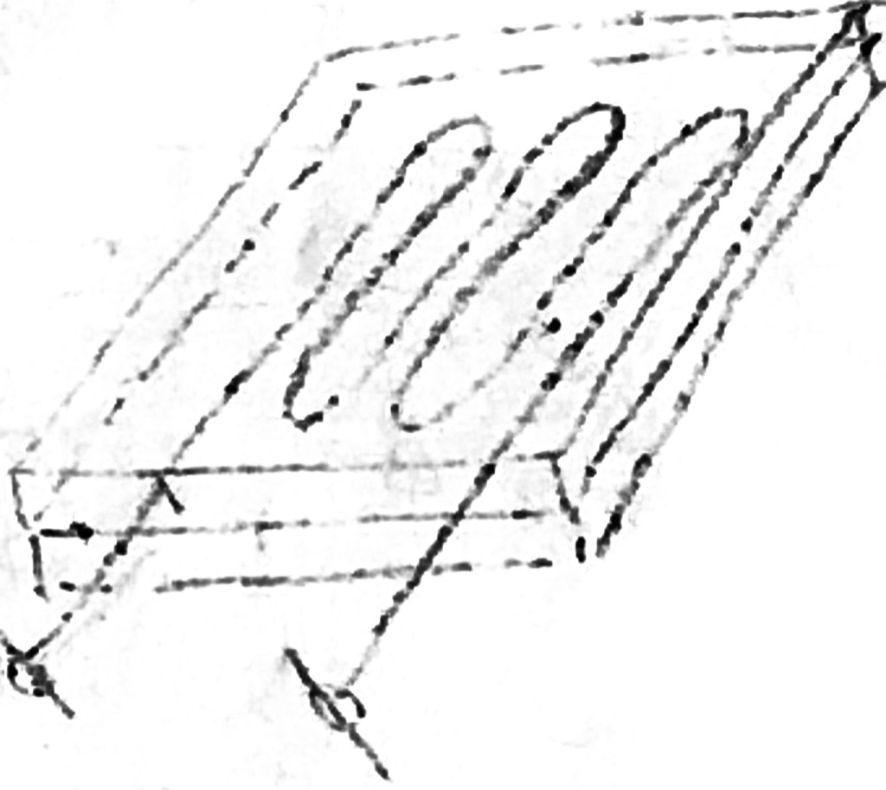

Проволока обычно изготавливается из константана — материала с большим сопротивлением диаметром от 0,015 до 0,5 мм. Датчик наклеивают на деформируемый объект, при деформации объекта меняется длина проволоки датчика, а также поперечное сечение и удельное сопротивление, а значит меняется и общее сопротивление $R$. Относительное удлинение $\frac{\Delta l}{l}$ не должно превышать 0,01. Если вместо проволоки используется фольга, то допустимо до 0,02. Концы проволоки тензодатчика подключают к электрической схеме. Тензодатчики недостаточно надёжны, поэтому используют их в основном в научных исследованиях. Тяжело использовать их на вращающихся деталях, так как необходимы токосъёмные кольца, изолированные от детали.

##### Датчики контроля крутящего момента

При нагружении валов крутящим моментом происходит их скручивание. И хотя угол скручивания невелик, оказывается возможным измерение момента на вращающихся валах с достаточной для целей управления степенью точности. 

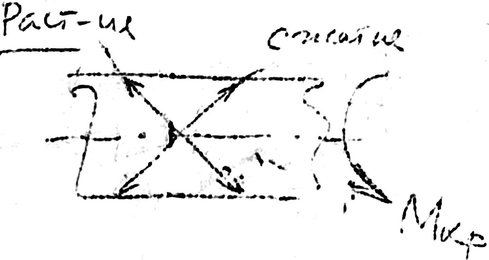

Наклеивая тензометрические датчики в сечениях сжатия и растяжения, можно определить величину угла скручивания.

Если часть вала свободна, можно контролировать крутящий момент по следующей схеме:

На некотором расстоянии друг от друга на валу `1` закрепляют пластины, к одной из которых прикрепляют длинный стержень `2` с ферромагнитным сердечником. На другой пластине монтируют высокочастотный генератор `3` с автономным питанием от батарейки с контуром, индуктивность которого меняется за счёт изменения зазора $\Delta$ между сердечником катушки и наконечником `2`. Частота генерируемых колебаний $f = \frac{1}{2 \pi \sqrt{L \cdot C}}$. С изменением $\Delta$ меняется $L$, что, в свою очередь, меняет частоту $f$. По изменению частоты $f$ можно судить об изменении крутящего момента. Использование радиосигнала позволяет передавать информацию на несколько десятков метров. Конструкция является достаточно помехозащищённой.

##### Датчики температуры

Для контроля температуры измеряют термо-ЭДС, которая возникает в термопаре «инструмент — деталь». Измеряя термо-ЭДС, которая составляет примерно $10...20 мВ$, можно судить об изменении температуры в зоне резания. Зная температуру и поддерживая её постоянный уровень, стабилизируют стойкость инструмента и скорость резания.

### Усилители и преобразователи

Усилителем принято называть устройство, повышающее энергетический уровень некоторой информационной посылки за счёт энергии постороннего источника, которая модулируется в соответствии с сигналом, поступающим на вход усилительного устройство. В отличии от датчика, такие устройства называют вторичными преобразователями. Существуют усилители-преобразователи, работающие на электрических и на неэлектрических принципах. Электрические предпочтительнее, так как позволяют получить большие коэффициенты усиления $К_у = \frac{U_{вых}}{U_{вх}}$, обладают малой инерционностью, способны складывать и вычитать сигналы. Неэлектрические усилители работают на гидравлических и пневматических принципах, позволяющих либо увеличивать силу, либо перемещение, причём перемещение можно регулировать в широком диапазоне, например, в гидроприводе — до 200 раз, а в электрическом — только в 20 раз.

Электрические усилители бывают электронные, полупроводниковые, тиристорные, магнитные.

***