# Технический контроль в машиностроении

[TOC]

***
[date]: # (11.02.19)

## Введение и задачи курса

**Технический контроль** (ТК) — важнейшая часть системы управления качеством продукции на машиностроительном предприятии. Технический контроль — неотъемлемая часть производственного процесса, отдельные его элементы разрабатываются одновременно с технологией производства.

Техническому контролю на предприятию присущи:

- разнообразие объектов контроля и контрольных параметров
- большое число методов и средств контроля
- значительные затраты на контроль
- отсутствие регламентированных процедур проектирования систем технического контроля
- противоречивость требований к проектированию систем технического контроля

Затраты на контроль в некоторых отраслях машиностроения превышают 50 % себестоимости продукции. В металлообработке затраты на контроль до 15 % затрат, причём из них 90...95 % относятся к контролю линейных размеров. Например, при изготовлении поршневого авиадвигателя выполняется 130000 операций, из них 50000 — контрольно-измерительных; на каждую тысячу наименований деталей и сборочных единиц приходится в среднем не менее 3000 операций контроля. Затраты времени на проектирование технологического контроля в зависимости от сложности детали составляют от 5...6 часов до нескольких недель. В то же время, затраты на контроль этой же детали — от 40 минут до нескольких часов. 

Из-за несовершенства контроля имеет место приёмка дефектной продукции и отнесение к браку годной, что приводит к большим экономическим потерям. Опыт производства показывает, что не весь персонал предприятия, занимающийся техническим контролем, в достаточной мере знает теорию ТК. 

В процессе контроля не создаются материальные ценности, а лишь оцениваются их состояние и соответствие установленным нормам.

Потери при проектировании и проведении операций контроля вызваны рядом причин, основные из которых следующие:

1. Недостаточная квалификация контролёров
2. Неправильное назначение средств контроля по погрешности измерения
3. Недостаточное применение прогрессивных методов и средств контроля
4. Низкий уровень автоматизации решения задач при проектировании и проведении контроля

Если в начале технический контроль позволял отделять бракованные изделия от годных, а затем стал предупреждать брак, то на современном этапе контроль должен быть полностью автоматизированным с использованием вычислительной техники.

### Основные термины и определения

**Технический контроль** — это проверка соответствия объекта установленным техническим требованиям.

**Измерение** — это нахождение физической величины опытным путём с помощью специальных технических средств.

**Испытание** — это экспериментальное определение количественной и (или) качественной характеристики свойства объекта как результата воздействия на него. Например: испытание на твёрдость, прочность и т. д. Испытание, как правило, является этапом получения первичной информации в процессе контроля.

**Объект технического контроля** — это подвергаемая контролю продукция, процессы её создания, применения, хранения и т. п., а также соответствующая техническая документация.

**Средство контроля** — это техническое устройство, вещество и (или) материал для проведения контроля.

**Метод контроля** — это правило применения определённых принципов и средств контроля.

### Принципы организации технического контроля

- *Соответствие* контроля уровню техники, технологии и организации основных техпроцессов
- *Комплексность* контроля, то есть необходимость охвата контролем всех элементов производственного процесса и всех факторов, определяющих качество продукции
- *Непрерывность*, то есть организация постоянного контроля на технологических операциях изготовления продукции и ликвидации перерывов между операциями обработки и контроля
- *Параллельность* проведения операций технического контроля и операций обработки с целью сокращения времени на пролёживание изделия в ожидании контроля 
- Принцип *профилактичности*, то есть предупреждение появления дефектов изделий в процессе производства
- Организация *бездефектного* труда
- *Независимость* органов контроля от производственных служб и подразделений
- *Экономичность*, основанная на минимизации затрат на контроль

### Место технического контроля в процессе производства

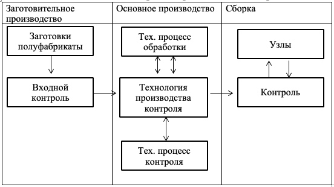

Процесс ТК необходим всегда: от заготовительного производства до сборки. Наряду с технологией обработки детали параллельно должна быть разработана технология технического контроля.

## Проектирование техпроцесса и операций технического контроля

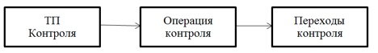

**Переход ТК** — законченная часть операции ТК, состоящая из действий контролёра и (или) средства контроля по проверке одного или нескольких одновременно контролируемых признаков. Примеры основных контрольных переходов: осмотреть, измерить, выявить, проверить, сравнить и т. д.

**Операция ТК** — законченная часть процесса ТК, выполняемая на одном рабочем месте, характеризующаяся постоянством применяемого средства контроля при проверке одного или нескольких контролируемых признаков и одного или нескольких объектов контроля.

**Техпроцесс ТК** — перечень операций ТК с перечислением средств контроля на каждой операции и числа контролёров.

Для удобства использования, а также с целью автоматизации проектирования, операции контроля классифицируются и кодируются.

В процессе проектирования разрабатывается карта контроля, которая является отчётной документацией.

## Выбор средств контроля. Основные положения

Согласно ГОСТу, выбор средств контроля основывается на обеспечении заданных показателей процесса ТК и анализа затрат на реализацию процесса контроля. Различают обязательные и дополнительные показатели.

К обязательным относят:
- **Точность контроля** — свойство контроля, определяющее близость его результатов к истинному значению контролируемого признака
- **Достоверность** (при автоматизированном ТК) — показатель степени объективности отражения результатами контроля действительного состояния объекта
- **Трудоёмкость**
- **Стоимость**

Дополнительные показатели:
- **Объём контроля** — количество объектов и совокупность контролируемых признаков, установленных для проведения контроля
- **Полнота контроля** — отношение количества контролируемых признаков объекта на данной операции к общему числу контролируемых признаков
- **Периодичность контроля** — время между двумя последовательно проводимыми процессами контроля на определённом средстве контроля
- и др.

При выборе средств контроля необходимо обеспечить повышение производительности труда, снижение трудоёмкости контроля, безопасность труда, выдачу информации в форме, удобной для использования, и обеспечение требуемой точности и экономичности производства. Предпочтение отдаётся более дешёвым, простым средствам, чтобы использовать контролёров невысокой квалификации. При определении объёма контроля необходимо, во-первых, выявить число контролируемых признаков; во-вторых, определить места контроля качества по техпроцессу; в-третьих, определить целесообразность сплошного или выборочного контроля.

## Нормальные условия выполнения линейных и угловых измерений

Нормальные значения основных влияющих на измерение величин, согласно ГОСТУ, следующие:

- температура окружающей среды $ 20 \, °С $
- атмосферное давление $ 760 \, мм \, рт. ст. $
- относительная влажность окружающего воздуха $ 38 \% $
- ускорение свободного падения $ 9,8 \, \frac{м}{с^2} $
- относительная скорость движения внешней среды $ 0 $
- значения внешних сил, кроме сил тяжести, атмосферного давления, магнитного поля Земли, $ 0 $

Допустимые отклонения приводятся в справочниках.

## Определение механических свойств металлов. Виды испытаний механических свойств

Свойства металлов устанавливаются с помощью механических испытаний образцов, изготовленных из исследуемой детали или материала детали. 

При испытаниях материалов, в различают статические, динамические, повторно-переменные способы приложения нагрузок. Каждый из этих способов может быть классифицирован также по схеме нагружения: растяжение, сжатие, кручение изгиб и др. В зависимости от времени воздействия нагрузок на образец различают длительные и кратковременные испытания.

Механические свойства определяются при нормальной, пониженной и повышенной температуре.

### Статические испытания при нормальной температуре

**Испытание на растяжение**

Машина для испытания растягивающей нагрузкой — **разрывающая машина**. Она сообщает образцу определённое удлинение и измеряет растягивающую силу. 

Разрывающие машины осуществляют растяжение при постоянной скорости деформации или при постоянной скорости нагружения. На практике чаще используют машины первого типа; машины второго типа используются для испытания особо хрупких материалов.

Механизм, создающий нагружение, может быть с механическим или гидравлическим приводом. На практике чаще всего используют машины с гидравлическим приводом. Разрывающие машины частично стандартизованы.

[date]: # (12.02.19)

Для испытания на растяжение изготавливают образец, форма которого стандартизована. 

Образец закрепляют в разрывной машине и растягивают. В результате измерений строится диаграмма. 

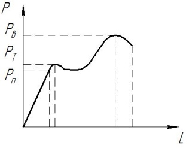

В результате можно определить:

- Предел прочности $ \sigma_B = \frac{P_B}{F_0} $
- Предел пропорциональности $ \sigma_П= \frac{P_П}{F_0} $
- Предел текучести $ \sigma_T = \frac{P_T}{F_0} $

где $ F_0 $ — площадь сечения образца до растяжения.

Показатель пластичности — относительное удлинение $ \delta = \frac{l_1 - l_0}{l_0} \cdot 100 \% $ и относительное сужение $ \psi = \frac{F_0 - F_1}{F_0} \cdot 100 \% $

**Испытание на твёрдость**

**Твёрдость** — свойство материала сопротивляться проникновению в него другого, более твёрдого, тела.

Твёрдость определяется как величина нагрузки, необходимая для начала разрушения материала. Различают *относительную* и *абсолютную* твёрдость. Относительная — твёрдость одного материала относительно другого. Абсолютная (инструментальная) определяется путём вдавливания одного материала в другой.

Твёрдость зависит:

- от природы химических свойств (валентность и т. д.)
- от хрупкости и ковкости материала
- от гибкости, упругости, вязкости материала

Самый твёрдый материал — алмаз.

Методы измерения твёрдости:

- По Бринеллю. Твёрдость определяется по диаметру отпечатка, оставленного металлическим шариком, вдавливаемым в поверхность. Твёрдость вычисляется как отношение усилия, приложенного к шарику, к площади отпечатка: $ \frac{P}{F} $. Твёрдость по Бринеллю обозначается $ HB $. Испытание проводят следующим образом: дают небольшую предварительную нагрузку, затем прилагают основную нагрузку. Образец выдерживают под нагрузкой, затем измеряют глубину внедрения. Шарик вдавливают в поверхность толщиной не менее 4 мм с регламентированным усилием. 

    Недостатки:
    - Метод можно применять только для сравнительно мягких материалов, иначе сам шарик будет раздавлен
    - Твёрдость по Бринеллю зависит от величины нагрузки, так как изменение глубины вдавливания не пропорционально площади отпечатка
    - При вдавливании на краях отпечатка образуется повышение, что затрудняет измерение глубины отпечатка
    - Метод не применяется для тонких образцов
    - Метод требует замера с помощью микроскопа
    - Желательно полировать поверхность перед началом испытания

    Достоинства:
    + Зная твёрдость по Бринеллю, можно быстро найти пределы прочности и текучести материала, что важно для инженерных задач
    + Так как метод Бринелля — один из самых старых, имеется много технической документации, в которой твёрдость уже указана по этому методу

- По Роквеллу. Твёрдость определяется по отношению глубины вдавливания металлического или алмазного конуса в поверхность тестируемого материала. Твёрдость, определяемая по этому методу, безразмерна, обозначается $ HRA, HRB, HRC $, где буквами $ A, B, C $ обозначаются шкалы. Сама твёрдость рассчитывается по формуле $ HR = 100 - k \cdot d $, где $ d $ — глубина вдавливания конуса после снятия нагрузки; $ k $ — коэффициент. Метод из-за простоты является наиболее распространённым способом проверки твёрдости. Применяют твердомеры Роквелла.

    Недостатки:
    - Метод не является универсальным, так как не даёт возможности измерять твёрдость абразивных материалов, полупроводников и тому подобных хрупких материалов
    - Иногда высокие нагрузки на испытываемый образец приводят к его разрушению
    - Для определения твёрдости используют различные шкалы, что не всегда удобно

    Достоинства:
    + Метод нашёл самое широкое распространение из-за того, что является одним из самых точных, объективных и удобных
    + Обладает высокой производительностью

- По Виккерсу. Твёрдость определяется по площади отпечатка, оставленного четырёхгранной алмазной пирамидкой, вдавливаемой в поверхность. Твёрдость вычисляют как отношение усилия, приложенного к пирамидке, к площади отпечатка. Твёрдость обозначается $ HV $. Позволяет определить твёрдость азотированных, цементированных поверхностей, а также тонких листовых материалов. Наблюдается совпадение твёрдости, измеренной по Бринеллю и Виккерсу в пределах $ 100...450 \, HB $.

- По Шору. Твёрдость определяется по глубине внедрения закалённой стальной иглы под действием пружины. Обычно используется для определения твёрдости полимеров. Обозначается $ HSA, HSD $ в зависимости от варианта измерения. Например, резина колеса имеет твёрдость $ 70 \, HSA $, ластик — $ 50 \, HSA $. Шкала $ A $ используется для мягких материалов, $ D $ — для твёрдых.

- Шкала Мооса. Набор эталонных минералов для определения относительной твёрдости методом царапания. В качестве эталонов принимают 10 минералов в порядке увеличения твёрдости. Значения шкалы $ 1...10 $ соответствуют минералам от талька до алмаза. Твёрдость определяется путём царапания. Предназначен для грубой сравнительной оценке твёрдости материалов по системе мягче — твёрже. Испытываемый материал либо царапает эталон (твёрдость выше эталона), либо царапается эталоном (твёрдость ниже эталона). Например, корунд (9/10) в два раза твёрже топаза (8/10), но почти в 4 раза менее твёрдый, чем алмаз (10/10).

**Испытание на сжатие**

В основном используется при испытании чугуна и других хрупких материалов. Используют обычно универсальные машины типа прессов.

**Испытание на изгиб**

Подвергают круглые или призматические образцы с целью определения максимального изгибного напряжения. Одновременно может измеряться деформация образца при изгибе.

**Испытание на кручение**

Цель испытания — определить сдвиг верхней плоскости относительно нижней. Диаметр образца $ d $ стандартизован.

**Испытание на срез**

Определяется сопротивление срезу: $ \tau = \frac{P}{F} $

### Динамические испытания при нормальной температуре

**Ударные испытания надрезанных образцов на изгиб**

Цель — определение так называемой ударной вязкости $ a_н $

$$ a_н = \frac{A}{F} $$

где $ A $ — работа, затраченная на излом образца; $ F $ — площадь сечения в месте надреза.

Излом осуществляется на маятниковых копрах.

**Испытания на усталость (выносливость)**

**Усталость** — разрушение металла под действием повторных или знакопеременных напряжений. 

Установлено, что знакопеременные нагрузки, например, сжатие и растяжение, повторяющиеся через определённое время, приводят к разрушению материала. За предел выносливости принимают наибольшее напряжение, при котором образец выдерживает без разрушения заданное число циклов нагружения.

Для испытания используют особые машины и образцы одинакового размера и формы. Первый образец подвергают напряжению выше предположительного предела выносливости, затем отмечают число повторных циклов, вызывающих поломку образца. Следующий образец испытывают при напряжении, более низком, чем в первом случае. Образец начинает выдерживать всё большее число циклов. Таким образом находят наибольшее напряжение образца, которое не вызывает разрушения после 10000000 повторных нагружений.

## Определение технологических свойств металлов

**Обрабатываемость резанием**

При испытании на обрабатываемость резанием выясняют, как скорость резания влияет на стойкость. Кроме скорости, могут испытывать влияние силы резания. 

Для определения обрабатываемости резанием резец оснащается пластинками из быстрорежущей стали с определённой геометрией заточки. Передний и задний углы варьируют. Затем осуществляют обработку методом продольного или торцевого точения стальных заготовок. По результатам испытания строят графики зависимости стойкости от скорости резания. Наиболее обрабатываемым резанием является материал, который обеспечивает высокую стойкости инструмента. 

Иногда используют сокращённые методы, например, метод сверления. В этом случае материал сверлят при постоянной силе подачи, определённой весом груза $ P $, действующим на шпиндель станка. Критерием обрабатываемости служит величина углубления сверла в испытываемый материал за 100 оборотов шпинделя.

**Испытание на прокаливаемость**

Прокаливаемость характеризуется глубиной проникновения закалённой зоны. За глубину прокаливания принимается расстояние от поверхности до слоя полумартенситной структуры.

**Испытание на свариваемость**

Метод позволяет выявить, как свариваемый материал склонен к образованию трещин при сварке.

**Испытание листового металла толщиной до 2 мм на вытяжку в холодном состоянии**

Образец закрепляют на матрице прибора. Пуансон с шарообразным наконечником вдавливают в образец до появления трещин. Величина перемещения пуансона служит критерием качества.

**Испытание на изгиб в холодном и нагретом состоянии**

Качество материала определяется способностью образца допускать изгиб на заданный угол вокруг оправки различной кривизны.

**Испытание на осадку в холодном состоянии**

Качество определяется свойством образца выдерживать без повреждения осаживание до заданной высоты. Применяется для образцов $ ⌀ \leq 30 \, мм $.

**Испытание на перегиб (проволоки или прутка)**

Качество материала определяется свойством образца выдерживать без повреждения заданное число перегибов в холодном состоянии на угол $ 90 ° $ попеременно в разные стороны.

**Испытание на перегиб проволоки круглого сечения диаметром 0,8...7 мм**

**Испытание на навивание проволоки диаметром не более 6 мм**

**Испытание проволоки диаметром не более 10 мм на скручивание**

**Испытание на искру**

Применяется в случаях, когда надо установить марку стали.

***
[date]: # (25.02.19)

## Выбор измерительных средств в зависимости от точности изготовления изделий (для линейных размеров)

При выборе измерительных средств необходимо установить значение допустимой погрешности измерения и, при необходимости, границы измерения. Возможны два случая:

1. Заданы  отклонения параметра. По известному номинальному размеру контролируемого параметра и допуску с помощью стандартной таблицы определяют квалитет и допустимую погрешность измерений $ \delta $. 
2. Задан квалитет. Тогда по известному номинальному размеру и квалитету по стандартной таблице определяется погрешность измерений.

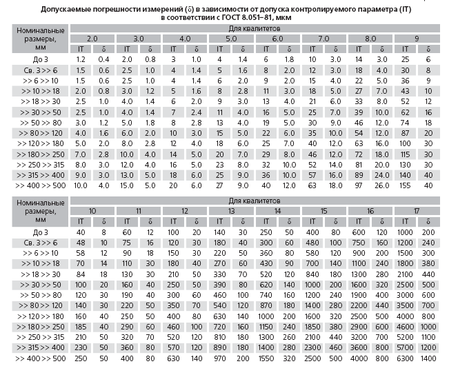

Далее допустимая погрешность сопоставляется с допуском. По результатам сопоставления выбирается номенклатура средств контроля. Обычно для грубых квалитетов (11...17) величина ДПИ составляет 20 % допуска; для точных квалитетов — 35 % допуска на изготовление размера.

Установленные стандартом погрешности измерения являются наибольшими допустимыми при измерении. Они включают как случайные так и систематические погрешности измерения (например, погрешность самого измерительного средства. Значения размеров, полученных при измерении с допустимой погрешностью, принимаются за действительные размеры. Случайная погрешность не должна превышать 0,6 допустимой погрешности измерения. Обычно её принимают равной $ 2 \sigma $, где $ \sigma $ — среднеквадратическое отклонение погрешности измерения. 

Погрешности измерения не должны нарушать взаимозаменяемость изделий и ухудшать их качество. Влияние погрешности измерений оценивают следующими параметрами: 

- $ m $ — число деталей в процентах от общего числа измеренных, имеющих размеры, выходящие за предельные, но принятые как годные (неправильно принятые)
- $ n $ — число деталей в процентах от общего числа измеренных, имеющих размеры, не превышающие предельные, но забракованные (неправильно забракованные)
- $ c $ — вероятностная величина выхода размера за предельные значения поля допуска у неправильно принятых деталей

Параметры $ m, n, c $ определяют по таблицам в зависимости от величины $ A(\sigma) = \frac{\sigma}{IT} \cdot 100 \% $ — относительной погрешности метода измерений. 

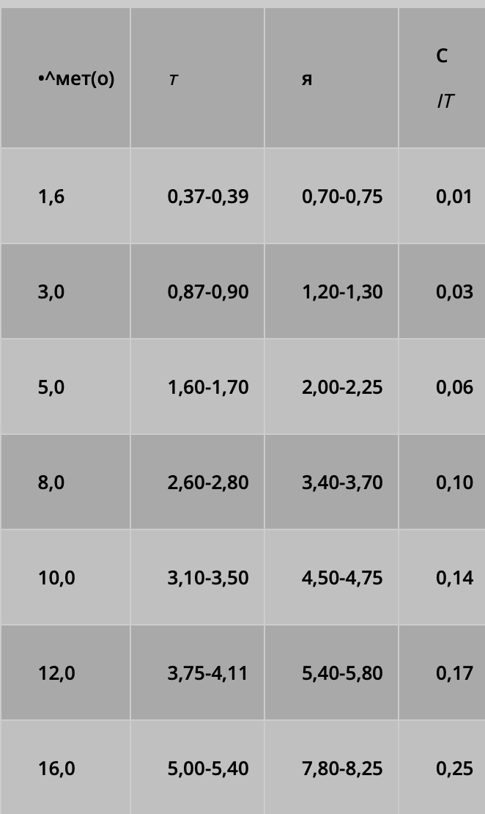

При пользовании таблицей при определении параметров $ A $ принимает следующие значения: 

- для кв. 2...7 $ A = 16 \% $
- для кв. 8...10 $ A = 12 \% $
- для кв. грубее 10 $ A = 10 \% $

### Положение приёмочных границ при контроле размера

Конструктор в начале выбирает допуск на изготовление исходя из служебного назначения детали. Далее по таблице находят допустимую погрешность измерений и определяют число неправильно принимаемых деталей, а также, возможно, величину $ c $ выхода размера неправильно принимаемых деталей. 

Например: 
$$ ⌀ 100 _{-0,022} $$
$$ ДПИ = 0,006 мм $$
$$ A(\sigma) = 16 \% $$
$$ m = 5,2 \%; c = 0,25; IT = 5,5 мкм  $$

Если конструктор допускает такое влияние погрешности измерения, то оставляет выбранный допуск и приёмочными границами будут предельные размеры детали: $ ⌀ 99,978...100,000 $. Если конструктор признаёт влияние погрешности измерения существенным и недопустимым, то существует два способа уменьшения этого влияния: 

- Выбрать другой квалитет или другое поле допуска, при котором влияние погрешности измерения допускается
- Ввести производственный допуск, когда приёмочные границы смещаются внутрь поля допуска — поле допуска становится уже

Если вводится производственный допуск, могут быть два варианта, в зависимости от того, известна или неизвестна точность техпроцесса:

- Если точность техпроцесса неизвестна, тогда предельные отклонения уменьшают у каждой границы на половину допускаемой погрешности измерения. В технических условиях на изготовление детали делается надпись: при измерении размера $ 100 $ вводится производственный допуск, и указываются размеры.
- Если точность техпроцесса известна. Тогда предельные отклонения уменьшают на величину $ c $. В технических условиях делается запись: при измерении размера $ 100 $ вводится производственный допуск, и указываются размеры.

### Другие факторы, влияющие на выбор измерительных средств

- Масштаб (тип) производства. 
    - В единичном и мелкосерийном производстве используют, в основном, универсальные измерительные средства. Контроль, как правило, пооперационный. Квалификация контролёров высокая. 
    - В серийном производстве технология, как правило, отработана, поэтому пооперационный контроль отсутствует. Контроль осуществляется после ряда операций или после окончательной обработки деталей. Используют универсальное оборудование, специализированные контрольные приспособления и т. п. 
    - В массовом и крупносерийном производстве используют высокопроизводительные, механизированные и автоматические контрольно-измерительные средства. Требуются высококвалифицированные наладчики средств контроля.
- Конструктивные особенности детали. Надо учитывать число контролируемых параметров, массу детали. Если число контролируемых параметров велико, рекомендуется применять многомерные измерительные устройства. Тонкостенные детали из лёгких сплавов предпочтительно контролировать бесконтактным методом или на приборах с малым измерительным усилием. 
- Форма контроля.
    - ручной, механизированный или автоматический
    - сплошной или выборочный
    - пассивный (после обработки) и активный (в процессе)

## Контроль качества отливок

Целью контроля является выявление дефектов в отливках, определение соответствия химического состава, определение структуры и геометрии отливок в соответствии с чертежом. Основные дефекты, встречающиеся в отливках:

- *Трещины* из-за резкого перехода поверхностей отливок от тонких к более толстым частям, а также вследствие неравномерного охлаждения
- *Пригар* формовочной смеси (песка) вследствие высоких температур заливаемого металла
- *Раковины* — усадочные, газовые, шлаковые и песочные — могут быть внутри отливок
- *Искажение геометрической формы* — коробление, разностенность и т. п.

Механические свойства материала отливок, как правило, определяют испытаниями либо отдельно изготовленных деталей, либо образцов, вырезанных из тела отливки или прилитых.

В некоторых случаях проверяют герметичность отливок, которые по условиям работы должны выдерживать повышенное давление газа или жидкости. Контроль герметичности проводят путём проведения гидро- и пневмоиспытаний при давлениях, несколько превышающих рабочие.

Методы контроля отливок разделяют на *разрушающие* и *неразрушающие*.

Разрушающему контролю подвергают обычно опытные (экспериментальные) отливки для установления соответствия их качества техническим условиям и необходимости доработки технологии литья перед запуском в серийное производство.

### Неразрушающие методы контроля отливок

В начале отливки осматривают визуально, оценивают качество поверхности и выявляют видимые дефекты.

Для выявления внутренних дефектов используют специальные методы контроля.

| Метод контроля | раковины | поры | трещины |
| --- | --- | --- | --- |
| рентген | + | + | +/- |
| гамма-дефектоскопия | + | + | +/- |
| ультразвуковая дефектоскопия | + | - | - |
| цветная дефектоскопия | - | - | + |
| люминесцентная дефектоскопия | - | - | + |

`+` говорит о высокой чувствительности.

При *рентгеновском* просвечивании сложных, с разными толщинами, стенок, их разделяют на отдельные участки и подбирают режим просвечивания для каждого из них. Если стенка одна, режим просвечивания не меняется. При не гарантируется определение мелких трещин. Для контроля используют рентгеновские аппараты, которыми можно просвечивать отливки до 60 мм переносными, до 250 м стационарными.

*Гамма-дефектоскопия* осуществляется по аналогии с просвечиванием рентгеном. Изображение просвечиваемых участков может выводиться на экраны, на фотоплёнку и бумагу.

*Ультразвуковая* дефектоскопия основывается на поглощении и отражении звуковых волн в твёрдых телах. Является производительным и качественным методом обнаружения  раковин, неметаллических включений, рыхлостей и так далее. В основном применяют для определения качества отливок несложной формы. Трудностью является то, что для ввода ультразвуковых колебаний в детали разной толщины сама головка должна иметь форму контролируемого участка. Отсюда возможность контролировать и сложные конфигурации детали. Используют наиболее часто теневой, резонансный и импульсный методы ультразвуковой дефектоскопии. 

**Теневой метод**. При прохождении ультразвуковых сигналов зондирующий щуп 1 просвечивает сигналами стенку и в месте дефекта сигналы не проходят. Получается тень, которая фиксируется приёмным щупом 2. На экране дефектоскопа будут импульс запуска и теневой импульс. Импульс также может отражаться от дефекта — «эхометод». Часть сигналов проходит мимо дефекта до стенки.

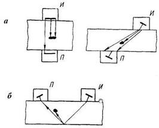 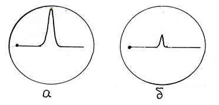

Основные характеристики акустических приборов — частота сигала, длина волны, скорость распространения. Размер дефектов, которые можно обнаружить, зависит от толщины стенки, частоты облучения и отражающей способности дефекта. 

Наиболее чувствительными методами контроля наружных дефектов являются капиллярные методы — **цветная** и **люминесцентная** дефектоскопия.

Метод цветной дефектоскопии состоит в погружении отливок в красную краску на 5-10 минут. Краска проникает в трещины и поры, затем её удаляют с поверхности и наносят тонкий слой белой краски. После подсушки в местах, где находятся трещины и поры, проявляются следы в виде красных линий и точек. Чем глубже и крупнее дефекты, тем ярче и больше красные следы. После контроля белую краску смывают растворителем.

При люминесцентном методе на поверхность отливки наносят слой раствора, способного светиться в ультрафиолетовых лучах. Раствор затекает в трещины, поры и раковины, далее его смывают водой, после сушки на заготовку наносят тонко измельчённый силикагель, который впитывает флюоресцирующий раствор, оставшийся в трещинах. Отливку помещают под источник ультрафиолетового света и по яркому свечению порошка определяют место и размеры дефектов. 

***
[date]: # (26.02.19)

### Исправление дефектов отливок

Дефекты исправляют, если это технически возможно и экономически целесообразно. В противном случае отливку бракуют. Наиболее распространены следующие способы исправления дефектов: правка, заварка, пропитка. 

Правкой исправляют коробление отливок. Для этого на неё оказывают механическое воздействие, то есть пластически деформируют на прессах или вручную, восстанавливая требуемую геометрию. 

Поверхностные дефекты исправляют дуговой или газовой сваркой. Для этого дефектное место  предварительно обрабатывают, придавая сечению в завариваемом месте V-образную форму. Дуговой сваркой без подогрева исправляют дефекты чугунных отливок, применяя при этом стальные, медно-стальные и медно-никелевые электроды. Значительно шире используют сварку с подогревом. При этом отливки нагреваются: чугунные — до 570...700 °C, алюминиевые и магниевые — до 350...400 °C. В большинстве случаев сварка осуществляется электродом или сплавом, не отличающимся по составу от сплава отливки. Для устранения напряжений после сварки отливку подвергают повторному отжигу. Дефекты механически обработанных стальных отливок исправляют пайкой. Для пайки используют твёрдые припои на основе меди. 

Пропитка является основным способом исправления пористых отливок. Для пропитки используют бакелитовые лаки, натуральную олифу, жидкое стекло и т. п. Пропитку проводят в специальных баках, как правило с подогревом и под давлением. Длительность пропитки определяется толщиной стенок, обычно — от 0,5 до 1,5 часов. 

Дефекты, существенно не влияющие на прочность отливок, заделывают пастами, состоящими из наполнителя (каменная мука, цемент, стружка), связывающего вещества (жидкое стекло, эпоксидная смола) и отвердителя. После исправления дефектов отливки снова подвергаются контролю. Перед сдачей на склад желательно отливки грунтовать или окрашивать. Отливки из магниевых сплавов проходят специальную химическую обработку для получения защитной оксидной плёнки.

## Контроль штампованных поковок

### Контроль механической прочности поковок

Включает в себя химический и металлографический анализы, механические, магнитные и другие специальные испытания, а также выявление внешних и внутренних дефектов. 

### Контроль химического состава стали

Химический анализ позволяет с наибольшей точностью определять процентное содержание любого элемента стали. Для этого берут либо стружку испытываемого материала, или специальный образец. Химический анализ проводят, как правило, выборочно. 

Если необходим сплошной контроль, применяют следующие неразрушающие методы:

**Искровой контроль**. Осуществляется переносной бормашинкой. По внешней форме и цвету искр опытный контролёр может различить содержание углерода с точностью до 0,05 % и проверить за один час 600...1000 заготовок.

**Спектральный анализ**. Основан на разложении и исследовании спектра электрической дуги или искры, возбуждаемой между испытываемым материалом поковки и разрядником. По яркости характерных линий в спектре определяют количественное содержание каждого элемента в стали.

**Метод вихревых токов**. Позволяет на основе сравнения с эталоном чётко и с высокой чувствительностью определять не только марку сплавов, но и его твёрдость, наличие трещин, структурное состояние и так далее. 

### Контроль качества термической обработки поковок

Включает в себя два этапа: контроль выполнения режимов термообработки и контроль качества поковок после неё. 

Для выполнения первого этапа термические печи оборудуют термопарами с самописцами. Температура периодически измеряется и регистрируется. Для регистрации режима термообработки ведут печной журнал в установленной форме для каждой печи. 

Второй этап осуществляется следующими методами: проба твёрдости (описана выше), металлографический контроль, механические испытания и т. д.

### Выявление дефектов

Для выявления внешних дефектов используют визуальный осмотр, магнитную дефектоскопию, люминесцентный метод. Для выявления внутренних дефектов используют ультразвуковой метод. Все перечисленные методы служат для отбраковки скрытого брака поковок.

### Измерение размеров поковок

При измерениях поковок желательно соблюдать правило единства баз. Базой для измерения обычно являются те точки или поверхности, которыми поковка фиксируется в приспособлениях для обработки резанием. Инструмент для измерения используют разный, начиная от универсального, заканчивая контрольными приспособлениями. 

Желательно разделить два момента: контроль поковок, полученных в новой конструкции штампа и контроль поковок, полученных в уже использованных штампах. Если штамп новый, необходимо тщательно осмотреть первые поковки, выявить массу облоя, проверить равномерность распределения металла в ручьях штампа, проверить макроструктуру и направление волокон в металле. Иногда используют травление первых поковок для выявления мест зажима заготовки. Проверке подлежат определение перекоса поковки по линии разъёма штампа, определение высоты и диаметра поковки, толщины стенок, радиусов закруглений, диаметров отверстий (цилиндрических, конических), определение длины поковки, кривизны поковки, параллельности и перпендикулярности плоскостей, угловых размеров, определение фактического припуска на мехобработку. Кроме обычных средств измерения при контроле могут использоваться кронциркули, скобы и шаблоны, контрольные плиты, угломеры. 

Научным методом контроля качества поковок является статистический метод, основанный на использовании теории вероятности и статистики. Он позволяет оценить большую массу продукции по результатам измерений и испытаний небольшого числа поковок, отобранных из потока или партии продукции.

## Контроль качества при обработке заготовок резанием.

В этом случае контролируются:

1. линейные размеры
2. угловые размеры
3. шероховатость и волнистость поверхностей
4. отклонение формы
5. отклонение расположения поверхностей и осей
6. элементы резьбовых соединений
7. элементы зубчатых сопряжений
8. элементы шпоночных и шлицевых соединений

### Контроль линейных размеров

Для контроля линейных размеров используют:

- меры
- калибры
- универсальные измерительные средства

**Меры для контроля линейных размеров** (плоскопараллельные концевые меры длины) имеют форму плиток или стержней с двумя взаимно параллельными измерительными плоскими поверхностями.

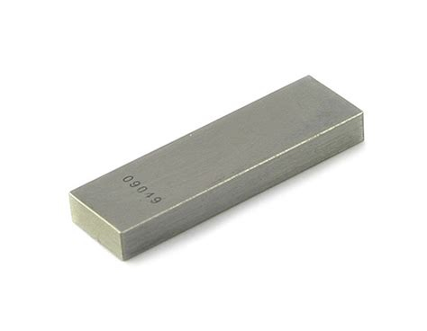

Основными их свойствами являются точность и притираемость. Толщина концевой меры гравируется на ней, причём до толщины 5,5 мм гравировка расположена на притираемых гранях. Свыше 5,5 мм — на других гранях. Концевые меры в форме плиток выпускают наборами. Наиболее распространён набор №1 с 87 мерами, набор №2 с 42 мерами и набор №6 с 10 мерами. При использовании набора №1 любой блок мер размером до 100 мм может быть составлен не более чем из 4 мер, причём точность набора будет 1 мкм. Для контроля мерами выпускают специальные принадлежности — державки, боковики, основания и т. д. По точности КМД разделяют на 4 класса: 0 — самый точный, 1, 2, 3. Частично изношенные меры переводят в дополнительные — 4 и 5 — классы. КМД применяют для непосредственных измерений или для настройки приборов на нулевую отметку и тарировки приборов. Таким образом, концевые меры на заводах служат средством хранения единицы длины.

**Калибр** — инструмент, предназначенный для определения того, выходит ли значение какого-либо параметра за нижний или верхний предел поля допуска или находится между двумя пределами. Калибр — измерительное средство, дающее заключение о годности размера. Для контроля гладких цилиндрических отверстий используют калибры-пробки, для контроля гладких цилиндрических валов — калибры-скобы. По назначению калибры делятся на рабочие, которыми пользуется рабочий при изготовлении детали, приёмные для контролёров ОТК и заказчиков и контрольные для изготовления рабочих. Иногда используют установочные калибры для настройки или регулировки рабочих.

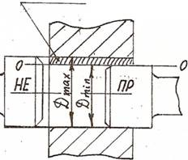 
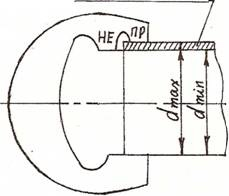

Размер проходной части пробки примерно равен наименьшему предельному размеру, а непроходной — наибольшей. Если проходная часть проходит в отверстие, а непроходная часть не проходит, то отверстие годное. Аналогично для скобы. 

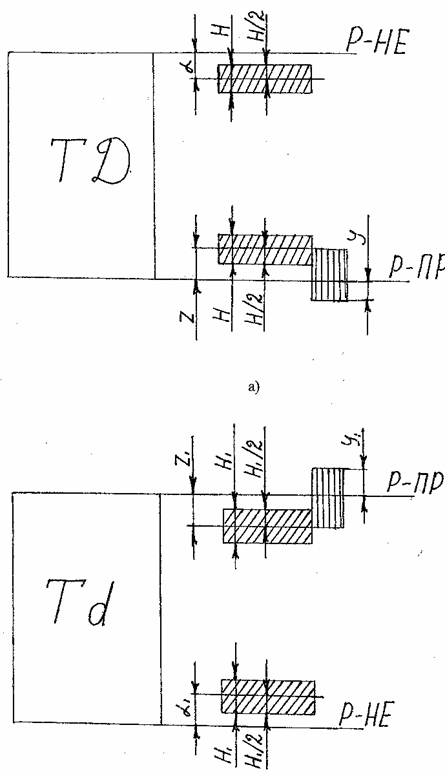

Кроме цилиндрических отверстий, калибрами контролируют резьбы, шпоночные пазы и шлицевые соединения. Калибрами (шаблонами) можно контролировать высоту выступов и глубину впадин:

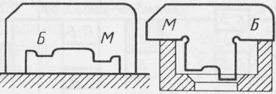

а также расположение поверхностей:

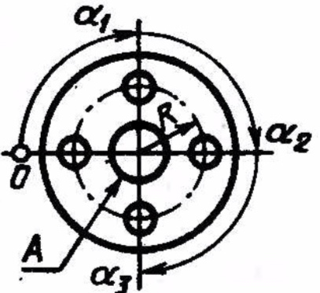

***
[date]: # (19.03.19)

#### Универсальные измерительные приборы и инструменты

Механические приборы и инструменты являются наиболее распространёнными из-за простоты, портативности, отсутствия необходимости в энергии, подводимой извне. Обладают невысокой стоимостью и высокой надёжностью, но сравнительно невысокой точностью и скоростью измерений. 

Простейшими инструментами являются поверочные лекальные линейки, угольники, поверочные плиты и т. п. Эти приборы применяются для контроля на просвет или с помощью щупа.

Штангенинструменты:

- штангенциркули 
    - с двухсторонним расположением губок, для наружных и внутренних измерений, и с линейкой для определения глубины, цена деления 0,05 мм
    - с двухсторонним расположением губок для измерения и для разметки, цена деления 0,1 или 0,05 мм
    - с односторонними губками для наружных и внутренних измерений, цена деления 0,05 или 0,1 мм  
    Современные штангенциркули имеют цифровую индикацию измерений. 
- штангенрейсмусы предназначены для разметочных работ и определения высоты деталей. Точность измерения до 0,01 мм

Микрометрические инструменты. Цена деления 0,01 мм, но ограничены пределы измерения, обычно — до 25 мм. Выпускают микрометры для измерения наружных и внутренних (нутромеры) размеров. Для измерения глубин используют глубиномеры. Существуют также специальные микрометры для измерения толщины листов, труб, зубьев, и т. п.

Приборы с зубчатой передачей (индикаторы часового типа, ИЧТ). Погрешность измерения — ±2...±10 мкм. Приборы с рычажно-зубчатой передачей, цена деления 1 или 2 мкм. Многооборотные индикаторные головки (1ИГ). Цена деления до 1 мкм.

Приборы с пружинной и пружинно-оптической передачей. К ним относят микрокаторы, микаторы, миникаторы (цену деления шкалы 0,1, 0,2, 0,5, 1, 2 мкм, диапазон измерений ±30 делений), оптикаторы (диапазон ±120 делений). Существуют и многооборотные приборы с меньшей точностью. Основной недостаток неоптических приборов — неудобство отсчёта показаний из-за слишком тонкой стрелки и вибрация стрелки при измерении. Этих недостатков лишён оптикатор. В этом приборе пружинный передаточный механизм микрокатора совмещают с увеличивающей оптической передачей.

Оптико-механические приборы:

- Оптиметры, вертикальные и горизонтальные. Цена деления 1 мкм.
- Длиномеры
- Измерительные машины, одно- и трёхкоординатные
- Интерферометры, контактные и бесконтактные, вертикальные и горизонтальные. Цена деления регулируется от 0,05 до 0,2 мкм
- Универсальные и инструментальные микроскопы. Предназначены для измерения линейных и угловых размеров
- Проекторы дают увеличенное изображение контролируемой детали. Применяются для контроля деталей со сложным профилем. 

Оптические приборы имеют высокую точность, малую цену деления, однако не отличаются простотой и требуют потребления осветительной энергии. Стоимость их сравнительно высока.

Пневматические приборы используют сжатый воздух. Применяются при контроле крупных партий деталей для измерения наружных и внутренних размеров, а также отклонений формы и расположения поверхностей. Принцип действия прибора основан на зависимости между размером проверяемого отверстия или зазором между измерительным соплом и давлением или расходом сжатого воздуха. Если фиксируется давление, то прибор называют манометрическим, если расход воздуха, то ротаметрическим. Используется бесконтактный метод измерения, приборы имеют высокую точность и быстродействия, но требуют подведения сжатого воздуха. Кроме того, перед измерением требуется тарировать и градуировать шкалы приборов. 

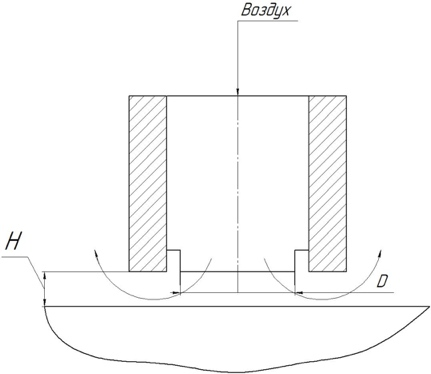

Электрические приборы:

- Электроконтактные измерительные головки и приборы со световой сигнализацией. Предназначен для контроля предельных размеров деталей. Подразделяются на пружинным и рычажно-зубчатые. Имеют цену деления 1 мкм, пределы измерения ±0,05 мм. Электроконтактные приборы со световой сигнализацией применяют для рассортировки деталей по размерам на установленные группы, например, годные — не годные. Световые приборы позволяют отбраковывать детали по отклонениям не только размера, но и формы.
- Индуктивные приборы для линейных измерений содержат индуктивные датчики с катушками индуктивности.
  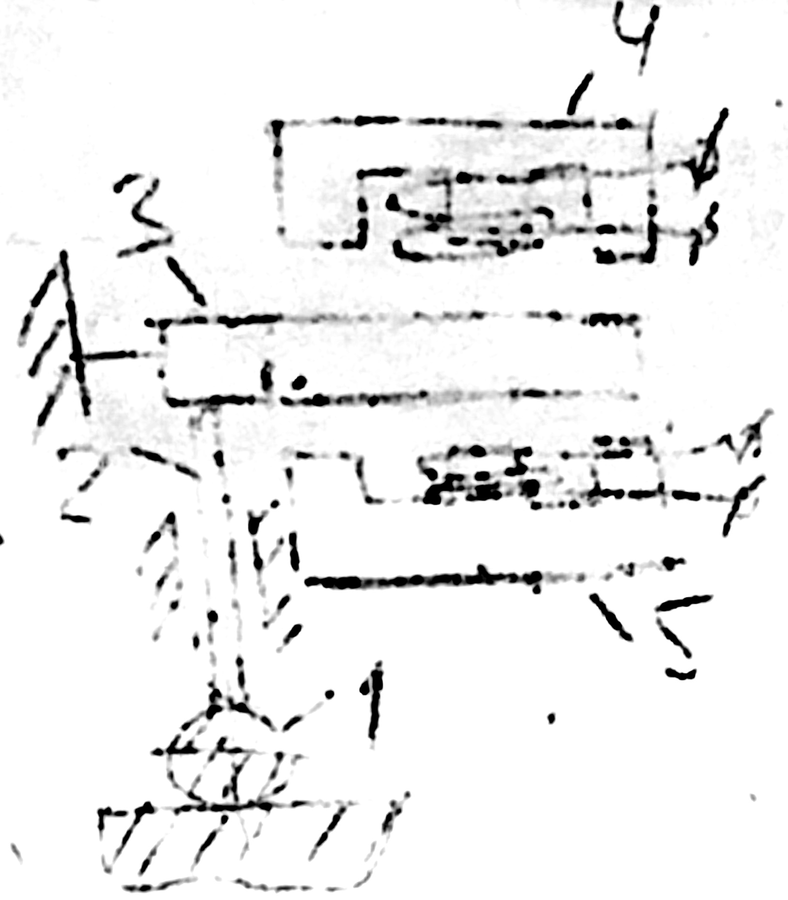
  `1` — детали с контролируемым размером, `2` — измерительный стержень, `3` — якорь, `4` — катушки индуктивности. Индуктивность катушек меняется в зависимости от измерения зазора $ \Delta $ между сердечником и катушками.
- Фотоэлектрические приборы используют фотоэффект — изменение сопротивления проводника под действием светового потока. Приборы позволяют сортировать детали по размерам на группы
- Ультразвуковые и изотопные приборы. Позволяют измерять толщины стенок и резервуаров, доступных лишь с наружной или внутренней стороны. Измеряемая толщина стенок — 1 мм и выше. 

Электрические приборы используются в автоматических измерительных приборах благодаря быстродействию, удобству, простоте передачи измерительного импульса, однако по надёжности уступают механическим приборам. 

#### Особенности контроля изделий малых и больших размеров

Контроль малых наружных размеров, в принципе, можно осуществлять обычными средствами измерения. Особенности при этом заключаются в следующем:

- Малые допуски на измеряемый размер
- Жёсткость контролируемых деталей часто бывает низкой, отсюда, необходима высокая точность измерений и уменьшенные измерительные усилия

Малые наружные диаметры контролируют рычажно-зубчатыми индикаторами (РЗИ) с ценой деления 2 и 5 мкм. Пределы измерений — 1...3  мм, усилие измерения 1 Н. Кроме того, можно контролировать наружные диаметры рычажно-зубчатыми микрометрами с ценой деления 0,5 или 1 мкм, малогабаритными пружинными головками с такой же ценой деления, а также электроконтактными измерительными головками с ценой деления 1 мкм. Возможно использование и других приборов. В массовом производстве применяют электроконтактные и рычажно-зубчатые головки. Если жёсткость деталей достаточна, можно использовать оптиметр.

При контроле диаметра малых отверстий применяют аттестованные проволочки диаметром 0,5...3 мм, пневматические приборы высокого и низкого давления с пропусканием воздуха непосредственно через отверстие при диаметрах до 0,5 мм. Для измерения отверстий диаметром 0,05...0,2 мм используют контактный оптический микроскоп с увеличением в 75 раз. Основными приборами для измерения отверстий до 1 мкм являются измерительные микроскопы и проекторы, причём увеличение микроскопов достигает 500 раз.

Большие размеры гладких цилиндрических изделий можно контролировать плоскопараллельными концевыми мерами, наборами мер 50...1000 мм. Для измерения больших размеров выпускают облегчённые конструкции универсальных измерительных инструментов. К ним относят штангенциркули с величиной отсчёта 0,1 мм и с пределами измерений 0...500 мм, 250..710, ..., 2000...4000 мм. Для контроля наружных диаметров 300...2000 мм выпускают микрометры с интервалом через 200 мм. Кроме того, используют рычажные микрометры и индикаторные скобы. 

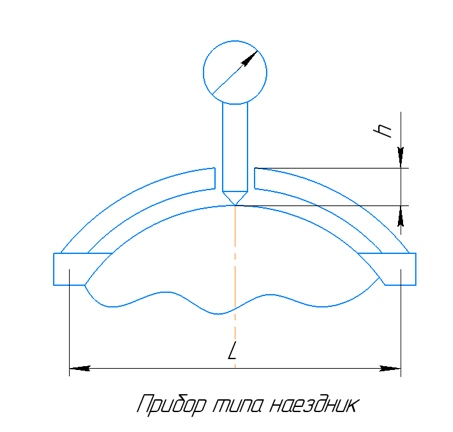

Также возможно косвенно определить диаметр с помощью штангенциркуля.

$$ D = \frac{l^2}{4h} + h $$

Косвенный метод также используется при измерении наружных диаметров рулетками. Это стальная лента длиной 10...50 м, к концам которой прикрепляют ушки для натяжения. После прилегания к измеряемой поверхности измеряют длину стальной ленты.

Для очень больших размеров наружных поверхностей используют теодолиты.

При измерении больших размеров возрастают погрешности измерения. Например, при измерении размера до 1000 мм предельная погрешность метода измерения будет равна приблизительно цене деления шкалы, а при измерении размера до 2000 мм, то погрешность будет равна двойной цене деления. Это вызвано погрешностями от температурных деформаций, а также погрешностями самих механических деформаций. 

### Контроль угловых размеров

Угловые размеры координируют оси и поверхности детали. Устанавливается несколько рядов нормальных углов. В частности, три ряда: первый включает 8, второй — 16, третий — 43 значения. Меньшие ряды предпочтительны. Допуски на угловые размеры стандартизованы, так же как и на размеры конусов общего назначения. Стандарт распространяется на длину стороны угла или образующей конуса до 2000 мм. Допуски на углы назначают в угловых (градусы, минуты, секунды) или линейных величинах. Поля допусков располагают симметрично относительно номинального значения размера угла. В некоторых случаях допускается несимметричное расположение предельных отклонений углов.

***
[date]: # (25.03.19)

Контроль углов с помощью угловых мер:

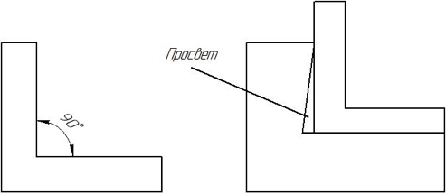

### Контроль конусов 

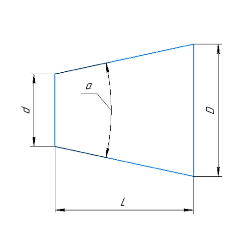

Конические соединения, в основном, служат для передачи крутящих моментов, например, инструментальные конусы (Морзе). Конусность определяется по формуле:

$$ K = \frac{D - d}{L} = 2 \tan{\alpha} $$

Средства измерения конусов:

- угловые меры угольники, а также угломеры
- конические калибры:  
  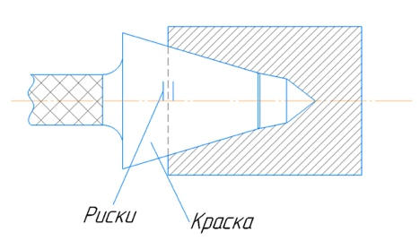        
  Положение рисок рассчитывается, по нему определяют величину конусности
- по коническому калибру с использованием краски: по числу и расположению пятен краски на контролируемой поверхности
- с помощью калиброванных шариков:  
  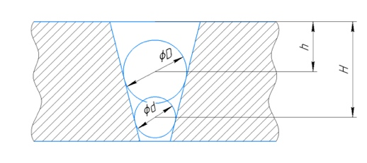
  $$ \sin{\alpha} = \frac{D - d}{2 (H - \frac{D - d}{2})} $$
  Это косвенный метод измерения конусности.
- с помощью оптических приборов

Средства контроля углов и конусов:

- угловые меры
    - призматические
    - угольники
- угломерные приборы
    - угломеры
    - уровни
    - угломерные головки
    - теодолиты
- косвенные измерения
    - синусные линейки
    - конусомеры

## Оценка качества обработки поверхности

### Общие сведения об измерении шероховатости и волнистости

Поверхность обработанной детали не является идеально ровной и геометрически правильной. Она отличается от номинальной микро- и макрогеометрическими отклонениями. Микрогеометрические отклонения определяют шероховатость поверхности, макрогеометрические характеризуют волнистость и отклонение формы. Условно, для отличия шероховатости от волнистости вводят отношение шага неровности к высоте:

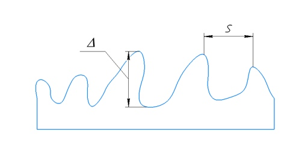
 
При $ \frac{S}{\Delta} \leq 40 $ — шероховатость,  
при $ 40 < \frac{S}{\Delta} \leq 1000 $ — волнистость,  
при $ \frac{S}{\Delta} > 1000 $ — отклонение формы.

Шероховатость поверхности зависит от многих технологических факторов: подачи, скорости резания, геометрии инструмента, наличия СОЖ и т. п., но в первую очередь шероховатость (при точении) зависит от подачи.

Шероховатость определяет эксплуатационные свойства детали — износостойкость, контактную жёсткость, сопротивление усталости, коррозионную стойкость и т. д. Характеристики шероховатости строго нормируются и подвергаются контролю в процессе производства. Трудностью при контроле шероховатости является выбор длины участка контроля. Как правило, возникает вопрос, какой длины должен быть исследуемый профиль, сколько надо обследовать участков, какие участки выбраны для измерения, и так далее. 

Шероховатость имеет высотные параметры — $ R_a $, $ R_z $, шаговые параметры — $ S $, $ S_m $, а также относительную опорную длину профиля $ t_p $. Относительная опорная длина профиля оценивает процентное содержание металла на средней глубине неровности. 

#### Методы контроля шероховатости поверхности

Самый простой и наглядный — визуальный метод контроля путём сравнения обработанной поверхности с эталонной. Изготавливают образцы эталонов для точения, фрезерования, шлифования, а затем сравнивают поверхности обработанные с поверхностью эталонов. Это метод качественного анализа шероховатости.

##### Оптические методы измерения

Параметр шероховатости измеряют оптическими приборами бесконтактными методами. К этим методами относят метод светового сечения, теневого сечения, микроинтерференционный метод, и метод с применением растров.

Схема определения шероховатости методом светового сечения:

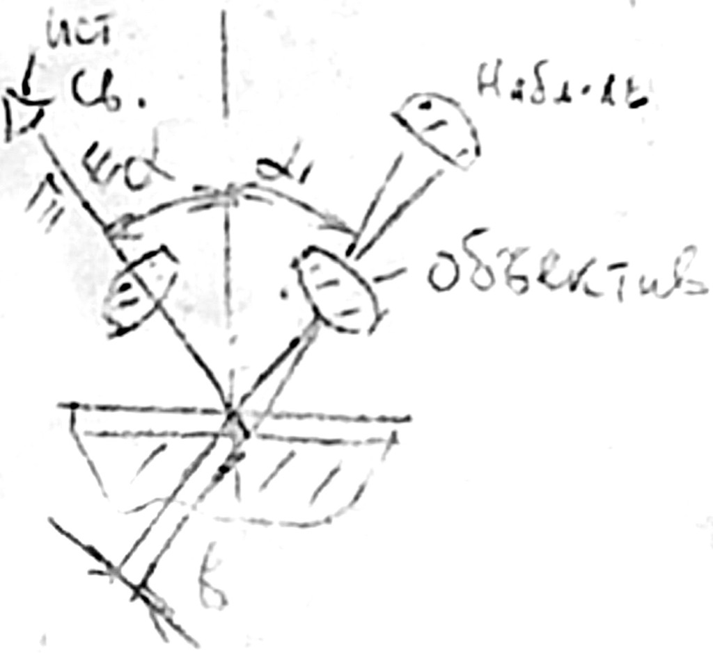
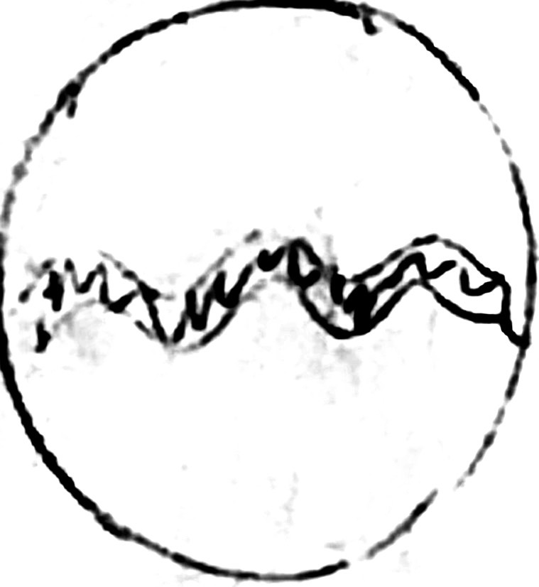

`1` — источник света, `2` — исследуемая поверхность, `3` — наблюдатель.

Свет поступает в узкую щель шириной 0,1 мм и под углом $ \alpha $ падает на контролируемую поверхность. Отражаясь, лучи через объектив переносятся в окуляр наблюдателя. Если контролируемая поверхность идеально ровная, то в окуляре будет светящаяся прямая линия. Если на поверхности имеются канавки, то в плоскости окуляра наблюдается искривлённая светящаяся линия. При глубине канавки равной $ h $ её световое сечение будет равно $ b = \frac{h}{\sin{\alpha}} $. Наблюдатель смотрит в окуляр, имеющий увеличение.

По принципу светового сечения работает двойной микроскоп МИС-11, а также прибор для измерения шероховатости ПСС-2. По принципу теневого сечения работает прибор ПТС-1. Приборы позволяют измерять неровности высотой 0,8...63 мкм. Первые два прибора позволяют определять $ R_z $, $ R_{max} $ и $ S $, а также фотографировать неровности. Прибор теневого сечения нужен для оценки шероховатости грубо обработанных поверхностей с высотой неровности $ Rz $ 80...300 мкм. Прибор накладной, что позволяет контролировать деталь без снятия со станка. Для оценки параметров шероховатости меньших размеров используют микроинтерференционный и растровый методы.

При оценке шероховатости поверхности сложной формы и в случае трудного доступа к исследуемой поверхности (например, в отверстии) используют метод слепков, заключающийся в снятии копий поверхности для последующего измерения по ним высоты неровностей. Неровности на слепках измеряют как на оптических, так и на щуповых приборах. Материалы при изготовлении слепков — легкоплавкие сплавы, воск, гипс, парафин и так далее. 

##### Щуповой метод измерения

При щуповом (контактном) методе измерения шероховатости в качестве щупа используют острозаточенную иглу, поступательно перемещающуюся по определённой траектории относительно поверхности. Ось иглы располагают по нормали к поверхности. Опускаясь во впадины и поднимаясь на выступы во время движения ощупывающей головки, игла колеблется относительно огибаемого профиля. Механические колебания иглы преобразуются, как правило, в электрические при помощи специальных преобразователей. Снятый с преобразователя сигнал усиливается, параметры его измеряются, в результате получаем профилометрирование поверхности. Если заранее выбрать вертикальный и горизонтальный масштаб, получим профилографирование — готовый график. 

Щуповые приборы, предназначенные для измерения параметров шероховатости, называют профилометрами, а такие же приборы для записи неровности поверхности — профилографами. Чаще всего приборы могут делать и то и другое и называются профилограф-профилометр.

Преобразователи могут быть индукционные, индуктивные, электронные и пьезоэлектрические. Схема индуктивного преобразователя профилометра-профилографа 201 выглядит следующим образом: 

Магнитная система представляет собой сердечник и катушку. Сердечник соединён с алмазной иглой, которая ощупывает неровности поверхности. Воздушные зазоры между якорем и сердечником меняются, меняется и напряжение на выходе катушек. Эти изменения усиливаются, подаются на записывающий прибор.

Самым распространённым является профилометр-профилограф модели 201. Имеет малое измерительное усилие, благодаря чему можно мерить шероховатость цветных металлов и неметаллических материалов. Можно оценивать $ R_a $ 0,04...4 мкм. Записывает профиль поверхности, причём погрешность записи — ± 4 %. Позволяет мерить параметры шероховатости отверстия диаметром 8...20 мм на глубину до 10 мм, а отверстия диаметром до 45 мм — глубиной до 100 мм. Прибор снабжается приспособлением для записи волнистости поверхности. 

Профилограф-профилометр модели 202 позволяет мерить шероховатость на зубьях зубчатых колёс, на шариках и роликах диаметром 1...25 мм, в отверстиях диаметром не меньше 3 мм на глубину до 5 мм.

Профилограф модели 252 обеспечивает цифровую индикацию результатов измерений. Измеряет Ra 0,02...100 мкм. Записывает профили, измеряет шероховатость в отверстии 3 мм до 5 мм глубиной. 

Профилометр модели 240 — переносной прибор для оценки шероховатости в цеховых условиях. Измеряет Ra 0,025...2,5 мкм.

Портативный профилометр модели 253 для измерения в цеховых условиях измеряет Ra 0,04...2,5 мкм.

Наряду с отечественными широко используются зарубежные профилографы-профилометры.

***
[date]: # (26.03.19)

## Методы измерения отклонения формы и расположения поверхностей

### Основные положения

Заданные в чертежах допуски формы и расположения поверхностей не предопределяют применение каких-либо методов и средств измерений. Выбор метода измерения производят с учётом погрешности измерения, погрешности размеров и с учётом конструкции измеряемой детали, а также особенностей техпроцесса. Измерения отклонений формы и расположения, ограниченных документацией и допусками, могут иметь комплексный характер (комплексный допуск), а могут быть заменены отдельными составляющими отклонениями. Например, отклонение от цилиндричности (комплексный показатель) можно заменить измерением отклонений от круглости и профиля продольного сечения. 

Методы упрощённых измерений применяют в тех случаях, когда: 

- методы и средства полного измерения отсутствуют или использование их нецелесообразно
- условия изготовления детали позволяют получить достаточно точные результаты без применения методов полного измерения
- они установлены в стандартах на правила приёмки отдельных видов продукции

Если выбранный упрощённый метод измерения позволяет выявить лишь определённый характер отклонения формы и расположения, то рекомендуется наряду с этим методом периодически использовать и контроль других отклонений. Например, выбран упрощённый метод измерения отклонения круглости, который позволяет измерять лишь овальность. Кроме неё следует периодически измерять деталь на огранку с нечётным числом граней.

#### Нормируемый участок и длина измерения

Измерение и оценка отклонений формы и расположения должны производиться на длине нормируемого участка, которая задаётся рядом с числовым значением допуска. Если нормируемый участок не задан, то контроль ведётся по всей длине нормируемой поверхности. При контроле желательно также учитывать краевые зоны. Размеры краевых зон устанавливаются либо стандартом, либо техническими требованиями на конкретные детали. Если размеры зоны не указаны, то рекомендуется принимать их в пределах $ 0,01 L $ при полном измерении или $ 0,05 L $ при упрощённом измерении.

#### Исключение влияния шероховатости поверхности

При измерении отклонений формы и расположения следует исключать влияние неровностей, относящихся к шероховатости поверхности. Для этого выбирают радиус измерительного наконечника определённого размера чтобы он не заглублялся во впадины микронеровностей.

Как правило, колебания измерительного наконечника при измерении отклонений нивелируются за счёт электрических и механических фильтров.

#### Погрешность измерения отклонений формы и расположения

В случае прямых измерений суммарная погрешность определяется по правилу квадратного корня:

$$ \Delta_{\sum} = \sqrt{\Delta_1^2 + \Delta_2^2 + \Delta_3^2 + \Delta_4^2 + \Delta_5^2} $$
где $ \Delta_1 $ — погрешность средства измерения,  
$ \Delta_2 $ — погрешность метода измерения,  
$ \Delta_3 $ — температурная погрешность,  
$ \Delta_4 $ — погрешность, связанная с измерительным усилием, 
$ \Delta_5 $ — субъективная погрешность контролёра.

По другому, с точки зрения теории вероятности, суммарную погрешность можно определить как:

$$ \Delta_{\sum} = \sqrt{\Delta_S^2 + \Delta_C^2} $$
где $ \Delta_S $ — случайная погрешность измерения,  
$ \Delta_C $ — систематическая погрешность измерения,  

$$ \Delta_s = \frac{t \cdot s}{\sqrt{n}} $$
где $ t $ — коэффициент Cтьюдента, $ 2,3 $ при доверительной вероятность $ 95 \% $,  
$ S $ — среднеквадратическое отклонение результата измерений, определённое по десяти измерениям,  
$ n $ — количество измерений, результаты которых усредняются.

#### Базы для оценки отклонений формы

Базами для отсчёта отклонения формы являются прилегающая поверхность или прилегающий профиль. Прилегающие элементы должны быть достаточно точной формы и должны быть выверенными относительно реальной поверхности. 

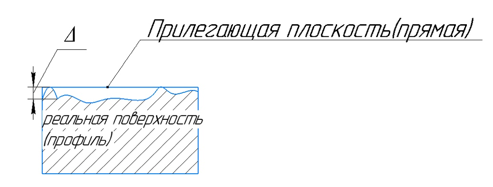

Кроме прилегающих, оценку отклонений можно вести относительно средней поверхности или среднего профиля. Средний профиль определяется по равенству площадей над и под ней.

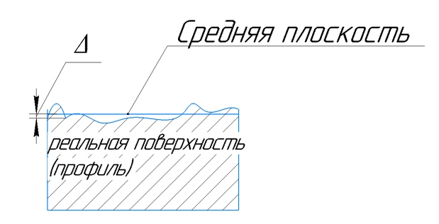

Допускается оценка отклонения формы относительно упрощённых баз. В качестве упрощённых баз можно брать прямую, проходящую через две крайние точки реального профиля; плоскость, проходящую параллельно двум прямым, соединяющим попарно точки на диагонали реальной поверхности; окружность, проходящую через три точки реального профиля. Чаще всего используют прилегающие элементы

### Методы измерения отдельных видов отклонений форм

#### Методы измерения отклонения прямолинейности

Измерение прямолинейности прибором с прецизионным прямолинейным перемещением:

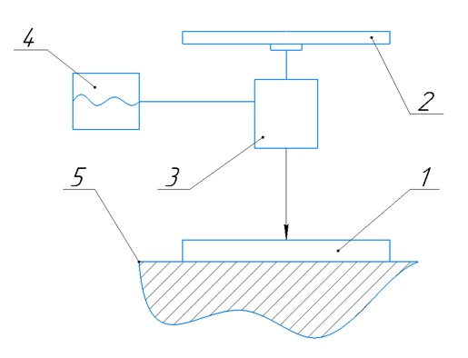

`1` — измеряемая деталь, `2` — прецизионная направляющая прямолинейного перемещения, `3` — измерительный преобразователь, `4` — самописец, `5` — стол.

Прибор (прямомер) позволяет сравнить профиль детали с траекторией точного прямолинейного перемещения. Измеряемый профиль ориентируют по направлению перемещения предметного стола или измерительного преобразователя, измеренное отклонение профиля регистрируется на самописце или вводится в ЭВМ.

Измерения методом исключения погрешностей направляющих измерительного прибора:

`1` — измеряемая деталь, `2` — направляющая, `3` — измерительный преобразователь, `4` — стойка, `5` — самописец.

Измеряемую деталь ориентируют по направлению перемещения. Измерительный преобразователь закрепляется на каретке прибора или на суппорте станка. В начале деталь измеряют в положении , показанном сплошной линией. Записанная профилограмма включает погрешности направляющей. Для исключения этих погрешностей деталь поворачивают на 180°, измерительный преобразователь помещают во второе положение (пунктиром) и измеряют профиль. Вторая профилограмма включает те же погрешности направляющей, но с обратным знаком. Усредняя значения по двум профилограммам, получаем измеренный профиль, из которого исключены погрешности направляющей.

Измерение на координатно-измерительной машине (КИМ):

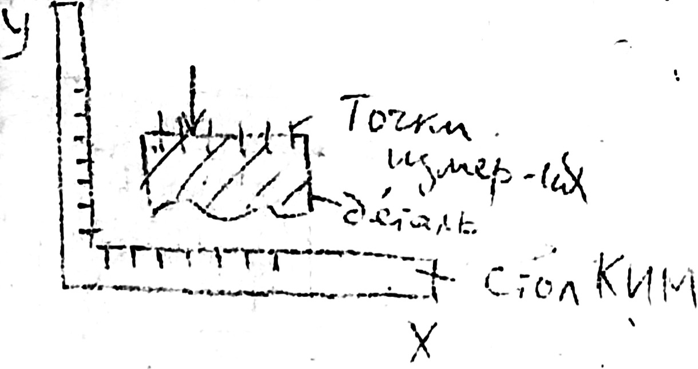

Измеряемая деталь устанавливается на столе измерительной машины и измеряются координаты отдельных точек профиля. Измеренные значения вводятся в ЭВМ для дальнейшей обработки. 

Измерение с применением поверочной плиты и измерительной головки:

`1` — измеряемая деталь, `2` — поверочная плита, `3` — измерительная стойка, `4` — измерительная головка, `5`, `6` — опоры, регулируемая и нерегулируемая.

Деталь устанавливается на опорах, измерительная головка на стойке перемещается по поверочной плите вдоль профиля детали. По показаниям головки в отдельных точках профиля строится профилограмма. 

Кроме приведённых методов, прямолинейность измеряется с помощью лазера, оптическими приборами, гидростатическими уровнями, и т. п. Самый простой метод измерения — с помощью лекальной линейки, которая прикладывается к профилю нормально к поверхности и оценивается величина просвета между линейкой и деталью.

#### Методы измерения отклонения плоскостности

Измерение отклонений от плоскостности, как правило, производят по целому ряду точек. Точки стараются расположить равномерно на плоскости:

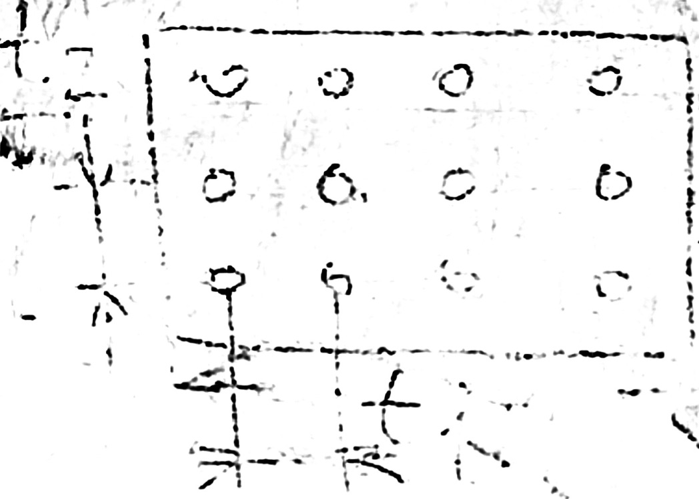

$ t_1 $, $ t_2 $ — шаг между точками измерения, желательно $ t_1 \approx t_2 $.

Измерительные приборы и измерительные мостики рекомендуется снабжать качающимися плоскими наконечниками с круглой опорной поверхностью, диаметр которой не более $ 0,1 t $.

Обработка результатов измерений может осуществляться либо непосредственно по показаниям отсчётных устройств, как разность между наибольшим и наименьшим показателями; с помощью графических методов построения прилегающей плоскости; расчётными способами — с помощью ЭВМ.

Измерение двухопорным измерительным мостиком и уровнем:

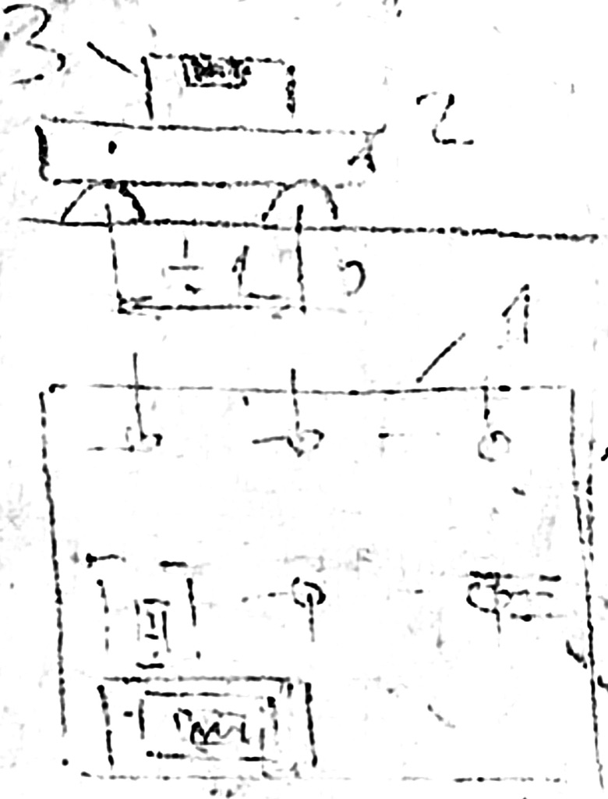

`1` — деталь с точками измерения, `2` — измерительный мостик, `3` — уровень.

Деталь выверяется приблизительно горизонтально, двухопорный мостик с установленным на нём уровнем перемещается с шагом $ t $ по взаимно-параллельному и перпендикулярному направлению. В результате получаем ряд измерений отклонений плоскости относительно эталонной плоскости. 

Измерение с помощью поверочной линейки и измерительной головки:

`1` — проверяемая деталь, `2` — поверочная линейка, `3` — измерительная головка, `4` — регулируемые опоры.

Отсчёт ведут по измерительной головке, линейка устанавливается с помощью опор по обоим диагональным сечениям. В результате можно измерить отклонение от плоскостности в нескольких точках каждой диагонали. 

Измерение с помощью гидростатических уровней, подключённых к уравнительному сосуду:

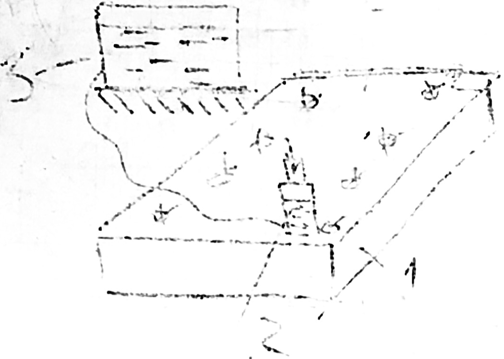

`1` — измеряемая деталь, `2` — гидростатический уровень, `3` — уравнительный сосуд.

Измеряемая поверхность располагается приблизительно горизонтально, базовой плоскостью для оценки отклонений является уровень жидкости в уравнительном сосуде, сечение которого во много раз превосходит сечение уровня. Меняя положение гидростатических уровней по точкам измерения, сравнивают положение уровня жидкости в уровне с уровнем жидкости в уравнительном сосуде. Положение точек фиксируют.

Контроль поверочной плитой на краску. На плиту наносят тонкий слой краски, кладут плиту на контролируемую поверхность и относительным перемещением растирают краску по поверхности. По величине окрашенной поверхности и распределению пятен краски судят о плоскостности контролируемой поверхности. Этот метод даёт только качественную оценку.

***
[date]: # (03.04.19)

#### Методы измерения отклонения от круглости

Плоскости, в которых измеряют отклонение от круглости, могут быть заданы на чертеже или не заданы. Если не заданы, то количество и расположение плоскостей измерения определяется по таблице: 

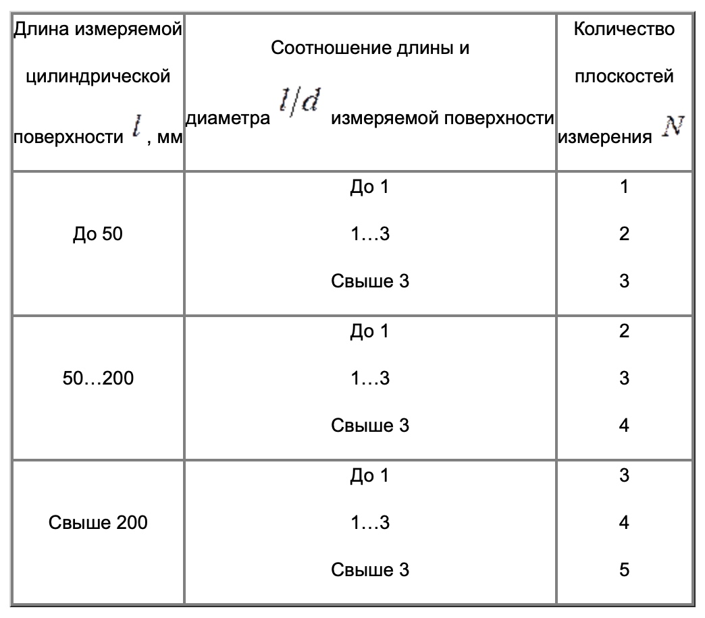

За отклонение от круглости для поверхности принимается наибольшее отклонение от номинальной поверхности, измеренное в разных сечениях. Наряду с отклонением от круглости можно измерять волнистость с помощью тех же приборов. Согласно рекомендациям, измеряют шаг и высоту волны. Для разделения волнистости и отклонения от круглости при измерениях используют специальные фильтры. Отсчёт отклонения от круглости осуществляется следующими способами: 

Непосредственно по показаниям отсчётного устройства: определяется алгебраическая разность между наибольшим и наименьшим показаниям, делится пополам, получается отклонение от круглости. 

С помощью обработки профилограммы: отсчёт можно вести по наружной или внутренней прилегающей окружности или по средней поверхности. Иногда изготавливают прозрачные шаблоны с концентричными окружностями и прикладывают к профилограмме. 

Также можно померить отклонение с помощью ЭВМ (как правило, относительно средней или прилегающей окружности). 

Схема прибора для оценки круглости и волнистости:

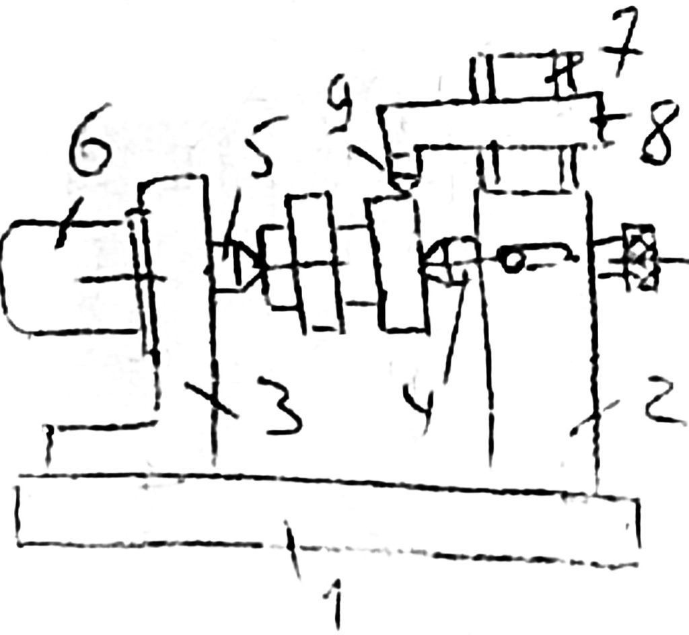

`1` — основание, `2`, `3` — кронштейны для крепления центров, `4`, `5` — плавающий и жёсткий центр, `6` — преобразователь угловых перемещений, `7` — стойка, `8` — преобразователь, `9` — датчик с ощупывающим устройством. 

Первичный преобразователь `6` вращает измеряемую деталь, причём за один оборот её регистрируется до 25000 измерений. Зарегистрированные сигналы от индукционного датчика сначала сохраняются в виде отдельных файлов, затем по специальным программам обрабатываются для получения профилограммы или развёртки профилограммы. Измеряют отклонение от вписанной окружности, описанной окружности реального профиля, средней окружности. Разность показаний, в зависимости от метода, не превышают 10 %. Если обработка ведётся с помощью ЭВМ, то, в основном, измеряют отклонение от средней окружности. Для устранения влияния волнистости устанавливают фильтры, которые отсекают отклонения от волнистости, оставляя только отклонения от круглости.

Кругломер:

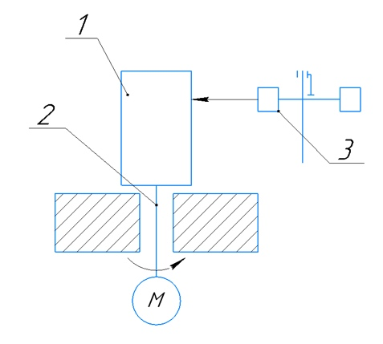

`1` — деталь, `2` — высокоточный шпиндель, `3` — измерительный преобразователь.

На приборе реальный профиль детали сравнивается с траекторией точного вращения шпинделя прибора. Вращаться может стол с деталью, преобразователь быть неподвижен, или наоборот, вращаться преобразователь, а стол — быть неподвижен. Перед измерением деталь необходимо тщательно центрировать и нивелировать относительно оси шпинделя. Измерение осуществляется за один оборот. Профиль регистрируется и может обрабатываться вручную или на ЭВМ. 

`1` — измеряемая деталь, `2` — измерительный преобразователь, `3` — центра.

Деталь устанавливается в центрах, вращается с постоянной скоростью и в течении одного оборота регистрирует изменение радиуса детали. Наибольшая разность показаний прибора за оборот даст отклонение от круглости.

Измерение круглости средствами измерения диаметров (двухточечное измерение):

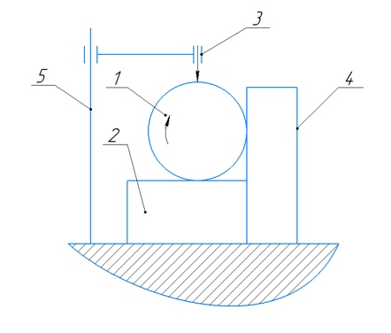

`1` — деталь, `2` — неподвижная опора, `3` — измерительная головка, `4` — боковой упор, `5` — стойка.

Возможны два варианта измерения: при непрерывном вращении детали или измеряя диаметры по отдельным сечениям. Деталь должна быть повёрнута не менее чем на 180°, фиксируется разница между наибольшим и наименьшим диаметром, отклонение от круглости считается как половина этой разницы. По этой схеме можно определить овальность детали и огранку с чётным числом граней. Если деталь устанавливается в призму, то измерение будет трёхточечным.

#### Методы измерения отклонения от цилиндричности

Измерение осуществляется путём измерения ограниченного количества отдельных точек или профилей, лежащих на проверяемой поверхности. Чем больше измеряемых точек или линий, тем полнее результат измерения. Измерение можно производить на кругломере, если кроме вращательного движения перемещать измерительный преобразователь вдоль цилиндра. Деталь перед измерением нужно центрировать. Можно измерять отклонение от цилиндричности и на приборе для контроля радиального биения, если измерительную головку перемещать вдоль цилиндра.

Измерение отклонения от цилиндричности средствами контроля диаметра (двухточечное измерение):

Определяют разность между наибольшим и наименьшим диаметром во всех измеренных точках. Потом разность делится пополам, получается отклонение от цилиндричности.

#### Методы измерения отклонений профиля продольного сечения

Измерения отклонения профиля прямоугольного сечения рекомендуется производить не менее чем в трёх расположенных равномерно по окружности продольных сечениях. В каждом продольном сечении измеряют обе образующие непрерывным или дискретным методом. За отклонение профиля продольного сечения принимают наибольшую из величин, измеренных в разных сечениях. 

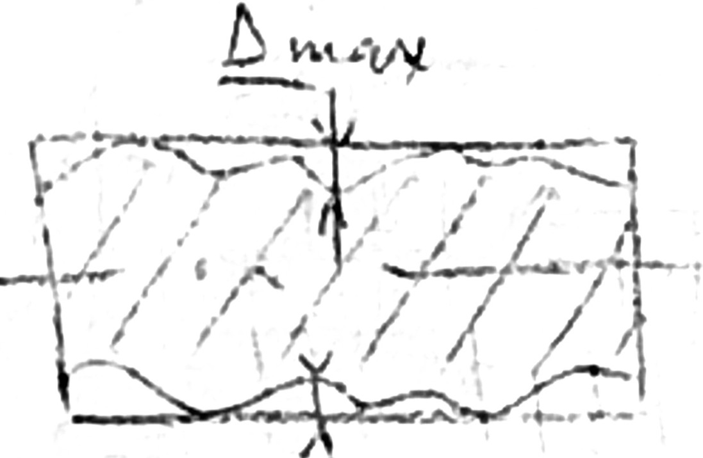

Оценка производится с помощью ЭВМ или вручную по профилограмме. Схема измерения как при измерении цилиндричности, но без вращательного движения. 

#### Методы измерения отклонения от параллельности

Различают методы измерения отклонения от параллельности плоскостей, отклонений оси (прямой) относительно плоскости, прямых плоскости, и осей в пространстве. Во многих методах измерения отклонения от параллельности необходимо исключать влияние отклонений формы (от плоскостности и прямолинейности).

##### Методы измерения отклонения от параллельности плоскостей

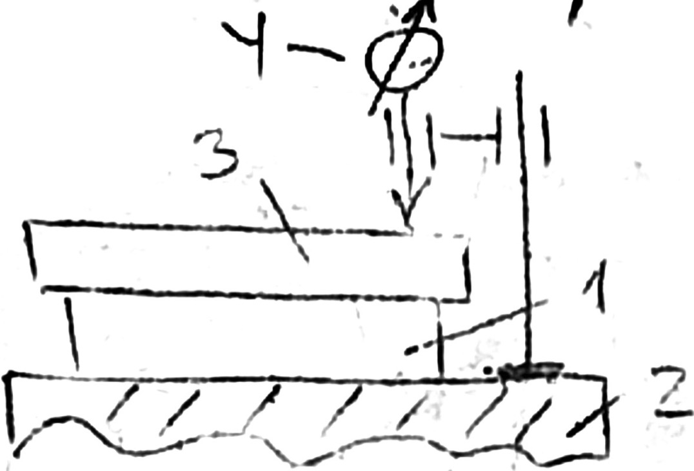

`1` — измеряемая деталь, `2` — плита для плоскости сравнения, `3` — плоскопараллельная пластина, `4` — измерительная головка.

Деталь базовой поверхностью устанавливается на поверочную плиту, для исключения влияния отклонения формы на неё накладывают плоскопараллельную пластину. С помощью измерительной головки, закреплённой на стойке, производят непрерывное измерение по поверхности пластины или по отдельным точкам. Отклонение от параллельности определяют как разность наибольшего и наименьшего показаний прибора (измерительной головки).

##### Методы измерения отклонения от параллельности оси и плоскости

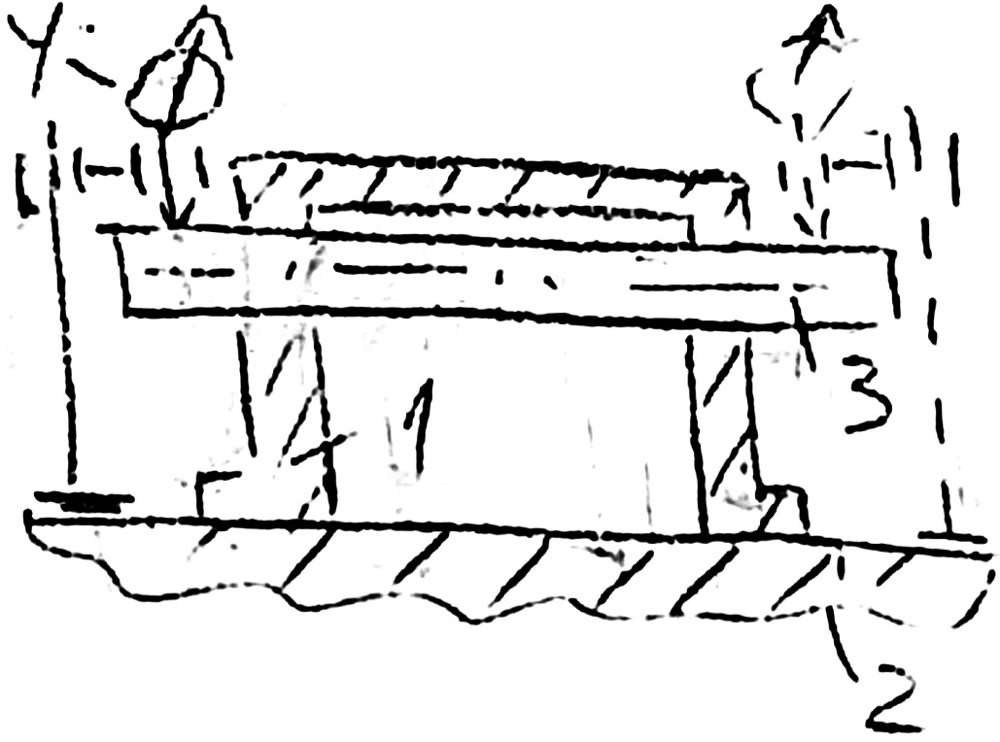

`1` — деталь, `2` — плита с плоскостью сравнения, `3` — цилиндрическая оправка, `4` — измерительная головка.

Деталь базовой поверхностью устанавливается на поверочную плиту. Ось измеряемого отверстия материализуется оправкой, цилиндрической или с малой конусностью. Положение оправки измеряется в двух точках на определённом расстоянии $L$. Разность показаний головки в первом и втором положении и будет отклонением от параллельности на длине $L$.

С применением уровней: ось отверстия также материализуется оправкой, устанавливают уровень на плиту и на отправку, показания сравнивают. Получают разность наклонов уровней. Эта разность характеризует отклонение от параллельности.

##### Измерение отклонения от параллельности осей

Также можно воспользоваться уровнями:

Детали устанавливают так, чтобы общая плоскость осей располагалась сначала горизонтально. Оси отверстий материализуют оправками, выступающими так, чтобы можно было установить уровень. С помощью уровней определяют наклон оправок, разность которых является мерой перекоса осей. Затем деталь поворачивают на 90°, повторно устанавливают уровни и определяют отклонение параллельности осей в их общей плоскости. 

***
[date]: # (08.04.19)

### Измерения на координатно-измерительных машинах

КИМ используются как для измерения размеров детали, так и для измерения отклонений формы и расположения. Их можно использовать как на этапе освоения выпуска продукции, так и при серийном выпуске деталей. Они позволяют проконтролировать практически все параметры и в лаборатории, и в цеховых условиях. Основное преимущество КИМ — возможность полной автоматизации как на этапе реализации  координатного метода измерений, так и на этапе обработки результатов измерений. На координатно-измерительных машинах измеряются только координаты отдельных точек в пространстве. Значения размеров элементов и параметров геометрии рассчитываются по измеренным координатам. Измерения осуществляются в трёх режимах: ручном, полуавтоматическом и автоматическом.

В ручном режиме датчик контакта машины перемещается к измеряемой точке вручную, с помощью пульта, рычагами которого управляет оператор. При полуавтоматическом режиме управление перемещениями датчика контакта осуществляется оператором при помощи пульта. Измерение осуществляется в диалоговом режиме с ЭВМ. Вызов программ, сравнение рассчитанных данных с допускаемыми, выполняется автоматически по заданным программам.

В автоматическом режиме все действия, необходимые для измерения детали, осуществляются по заданной программе, и управление перемещением датчика контакта также выполняется с помощью ЗВМ, без участия оператора. При любом режиме составляется программа измерения конкретной детали. При ручном режиме эта программа составляется и реализуется самим оператором. Программа для измерения включает в себя решение о последовательности измерения точек и отдельных элементов детали, о числе точек, которые должны быть измерены, а также параметры геометрической точности, которые необходимо рассчитать. В программу входят зафиксированные результаты измерения. Программы эти не связаны с конкретными размерами измеряемой поверхности, зависят только от параметров, которые необходимо выяснить. Например, диаметр окружности, отклонение от соосности и т. д.

Если необходимо измерить одну измеряемую деталь и далее детали измеряться не будут, то измерение выполняют в полуавтоматическом режиме при диалоге с ЭВМ. Например, оператор указывает, что надо определить соосность двух цилиндрических отверстий. ЗВМ запрашивает число точек измерения, что принять за базу при измерении, как задан допуск (зависимый, независимый) и так далее. Запрашиваемые сведения необходимы для решения. После того, как запрашиваемые данные введены в ЭВМ оператор измеряет координаты точек и вызывает протокол со сведениями, которые он запросил при составлении программы.

Когда необходимо измерить партию деталей или детали, которые потом будут повторяться, измерение производят в автоматическом режиме. Составляется программа на конкретный типоразмер детали. В этой программе указывают последовательность проведения измерений, число точек, а также последовательность вызова подпрограмм из ЭВМ для обработки полученных значений. Если режим измерения автоматический, деталь устанавливается в определённое место пространства КИМ и после подвода наконечника датчика к исходной точке дальнейший процесс осуществляется автоматически.

Подготовка управляющих программ может быть осуществлена либо с помощью самообучения, либо дистанционным программированием. Самообучающееся программирование заключается в том, что программа составляется одновременно с измерением первой из партии детали. Эти первые измерения осуществляют в полуавтоматическом режиме с помощью оператора. Далее программа используется автоматически. Дистанционное программирование заключается в том, что программа составляется по чертежу детали, когда она ещё не изготовлена. Как правило, для этого используется программист с компьютерным оснащением. В случае сложных деталей наиболее трудные места не включают в программу и программа дополняется при измерении первой изготовленной детали. Здесь исправляются возможные ошибки при программировании.

Программирование самообучением обладает тем достоинством, что программист не требуется, но недостатком является то, что машина будет занята программированием. При дистанционном программировании недостаток в том, что требуется квалифицированный программист и, как правило, необходима дополнительная отладка программы.

### Контроль отклонения расположения поверхностей детали

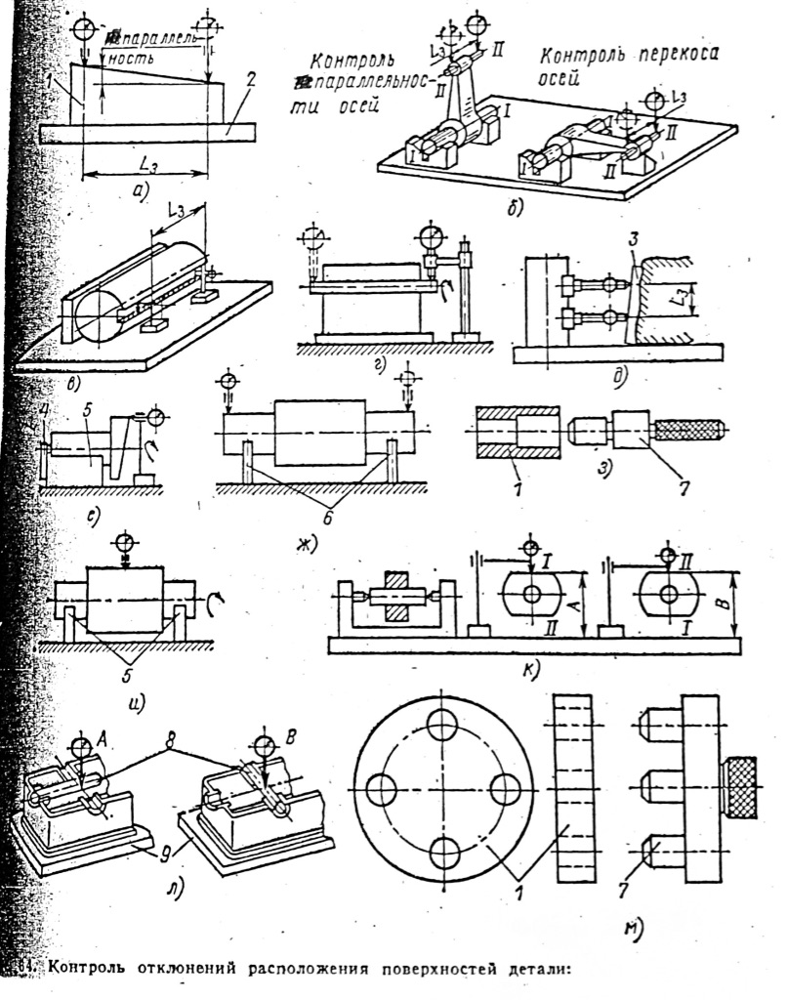

`а)` — контроль отклонения от параллельности, `1` — деталь, `2` — поверочная плита.  
`б)` — контроль отклонения от параллельности и перекоса осей. На поверочную плиту устанавливают призмы и выверяют их так, чтобы ось $I — I$ была параллельна плоскости поверочной плиты, причём расположение оси определяют по образующей цилиндрической поверхности, а затем относительно оси $I — I$ производят с помощью индикатора контроль расположения оси $II — II$.  
`в)` — измерение отклонения от параллельности оси и плоскости. Отклонение от параллельности оценивают по разности показаний измерительной головки на заданной длине $L_з$.  
`г)` — измерение отклонение от параллельности оси отверстия и плоскости. Оправка вводится в отверстия и измеряется разность показаний индикатора в двух положениях.  
`д)` — измерение отклонения от перпендикулярности. На стойке укрепляют измерительную головку, которую можно перемещать вверх и вниз. Для исключения влияния отклонений формы на поверхность детали устанавливают линейку `3`. Разность показаний головки на расстоянии $L_з$ даст отклонение от перпендикулярности.  
`е)` — контроль торцевого биения. Деталь устанавливается в призму `5` с упором `4` и вращается вокруг оси. Торцевое биение находят по разности между наибольшим и наименьшим показанием головки.  
`ж)` — контроль отклонения от соосности шеек вала. Деталь устанавливается на ножевые опоры `6` и с помощью измерительной головки, вращая вал, определяют разницу отклонений.  
`з)` — контроль отклонения от соосности двух отверстий с помощью ступенчатого калибра `7`.  
`и)` — контроль радиального биения. Деталь устанавливается в призмы `5` и вращается вокруг оси. Разность показаний индикатора за один оборот даст величину радиального биения.  
`к)` — контроль отклонения от симметричности с помощью измерительной головки. Деталь устанавливают в центрах на плите, делают измерение, поворачивают на $180 °$ и делают второе измерение. Полуразность расстояний $A$ и $B$ укажет на отклонение от симметричности плоскостей $I$ и $II$.  
`л)` — отклонение от пересечения осей. Деталь устанавливают на поверочную плиту и производят измерением с помощью головок и оправок. измеряют высоту образующей оправки над базовой поверхностью в точках $A$ и $B$. Разность показаний головки даст отклонение от пересечения осей с учётом диаметров применяемых оправок.  
`м)` — контроль предельного смещения осей или плоскости симметрии от номинального расположения. Для контроля изготавливают калибр `7` с четырьмя пробками, который контролирует расположение четырёх отверстий относительно центральной оси.

#### Калибры для контроля расположения поверхностей

Проводят оценку изделий по признаку «годное» — «брак». При этом действительное отклонение формы и расположения не устанавливается. Калибры можно изготавливать для контроля соосности, симметричности, пересечения осей, перпендикулярности, наклона осей и для контроля позиционных допусков.

Калибры для контроля расположения проектируются проходными. Изделие считается годным если калибр соединяется с ним (входит в отверстие) по всем контролируемым поверхностям. Перед контролем расположения необходимо проверить размер. Это позволит предварительно отбраковать детали по размерам.

Схемы `з)` и `м)` — калибры для контроля поверхностей. Другие примеры:

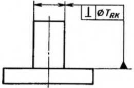
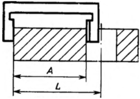
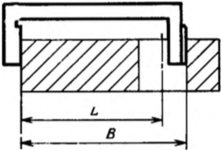
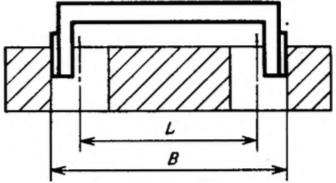

Калибр для контроля перпендикулярности, калибры для контроля расстояния от плоскости до отверстия, калибр для контроля расстояния между поверхностями. Изделие считается годным, если в него проходят оба калибра, входящие в комплект.

### Методы и средства контроля резьбовых соединений

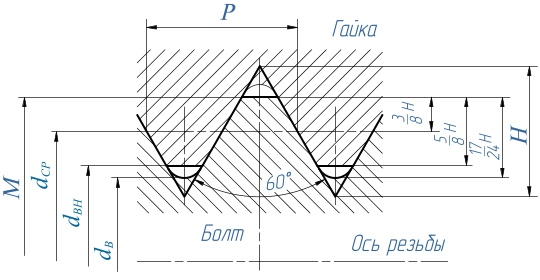

Различают дифференцированный (поэлементный) или комплексный контроль резьб. 

При **дифференцированном контроле** каждый отдельный параметр резьбы контролируют. Отдельно контролируют средний диаметр, шаг, половину угла профиля. Заключение о годности также дают по каждому параметру отдельно. Метод это трудоёмкий, а потому его используют для контроля, в основном, точных резьб, например, у резьбообразующего режущего инструмента. Годность резьбовых изделий в основном определяют по среднему диаметру резьбы.

Например, для измерения среднего диаметра резьбы болта можно использовать:

Резьбовой микрометр:

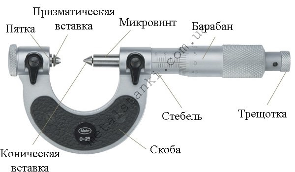

Измерение методом трёх (двух) проволочек:

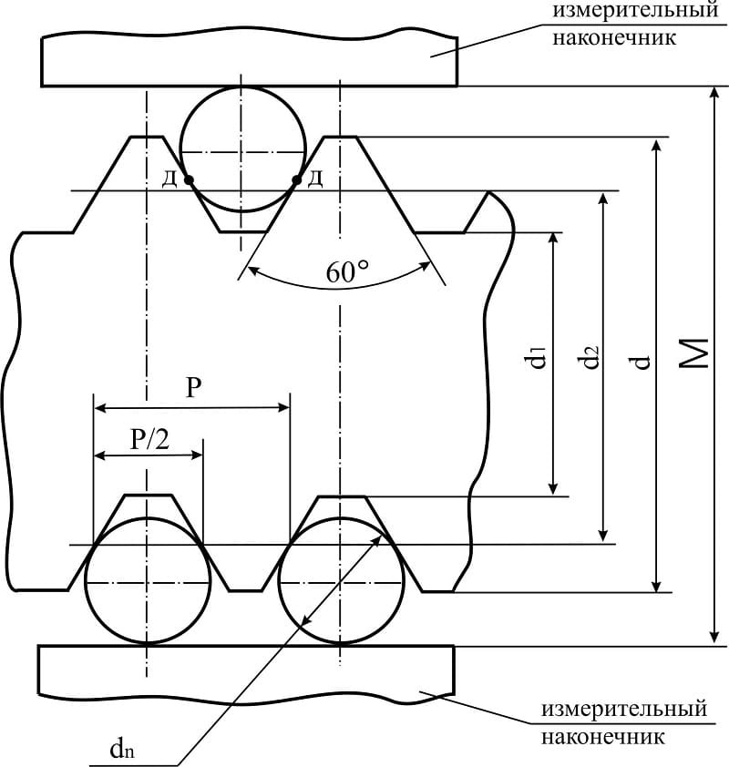

Для измерения шага резьбы используют шагомеры с индикаторной головкой или для измерения на просвет. 

Наружный диаметр наружной резьбы можно измерить микрометром или штангенциркулем.

При **комплексном методе** одновременно контролируется шаг, угол профиля и средний диаметр, а также наружный и внутренний диаметры. Для этого используют резьбовые калибры. Для гаек или резьбовых отверстий — резьбовые пробки, а для наружных резьб — резьбовые кольца. Комплект включает в себя проходную и непроходную часть. Проходной калибр должен свинчиваться с контролируемым изделием по всей длине; непроходной может свинчиваться не более чем на два оборота. На точность контроля среднего диаметра резьбы могут оказывать влияние погрешность шага и угла профиля, поэтому влияние погрешности шага ослабляют, выполняя непроходной калибр с числом витков не менее трёх, а погрешности профиля избегают путём изготовления калибров с укороченным профилем. Для этого уменьшают наружный диаметр у пробок и прорезают канавки у впадин. 

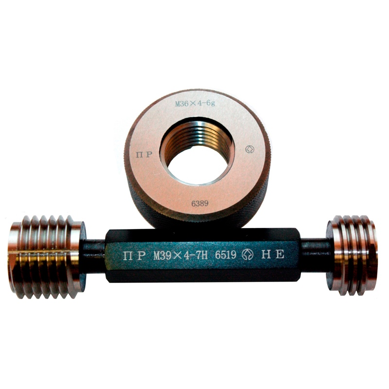

Для представителей заказчика и контролёров применяют изношенные проходные и непроходные калибры.

***
[date]: # (09.04.19)

### Контроль зубчатых колёс и передач

#### Общие сведения

По назначению зубчатые колёса и передачи можно разделить на:

- кинематические (отсчётные), основное требование к которым — высокая кинематическая точность, то есть, эта зубчатая передача должна обеспечить согласованность углов поворота ведущего и ведомого колеса. Как правило, имеют мелкий модуль, работают при малых нагрузках и скоростях.
- скоростные, окружные скорости в которых могут достигать 60 м/с и выше. Передаваемая мощность тоже значительна. В этих передачах главное — плавность работы, то есть, отсутствие погрешностей, многократно повторяющихся за один оборот колеса. С ростом скорости вращения у передач с погрешностью появляется шум и вибрации. 
- силовые, основное требование к ним — передача больших моментов и сил. Эти передачи работают при малом числе оборотов, модуль достаточно большой. Главное точностное требование — наибольшее пятно контакта зубьев.
- передачи общего назначения, к которым не предъявляются требования по точности.

#### Система допусков цилиндрических зубчатых передач

Помимо трёх норм точности (кинематическая точность, плавность и полнота контакта) у зубчатых колёс и передач существуют степени точности. Они обозначаются цифрами от 1 до 12, самая точная — 1. Зубья 1 и 2 степени практически не изготавливаются.

Помимо степеней точности в ГОСТе указывают виды сопряжения в зубьях, которые описывают величину минимального бокового зазора в зубчатой передаче. Минимальный боковой зазор $J_{n \, min}$ необходим для компенсации температурных деформаций при нагреве зубчатых колёс передачи и для прохождения смазки в процессе эксплуатации передачи.

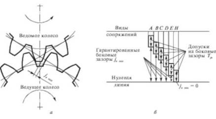

В процессе сборки передачи зазор выставляется по щупу, например, за счёт изменения межцентрового расстояния передачи.

Кроме видов сопряжений, которые обозначаются большими буквами, существует ещё восемь видов допусков на боковой зазор: с `a` по `e` — основные, `x`, `y`, `z` — дополнительные. Если вид сопряжения соответствует виду допуска, то он не пишется в обозначении.

Обозначение зубчатых передач на чертежах, например:

`7-C` — все нормы точности по 7 степени, зазор `C`;  
`7-8-9-Bc` — кинематическая точность `7`, плавность `8`, полнота контакта `9`, зазор `B`, вид допуска `c`,  
`7-7-8-500x` — минимальный боковой зазор $500\ мкм$.

Сводная таблица системы допусков имеет следующий вид:

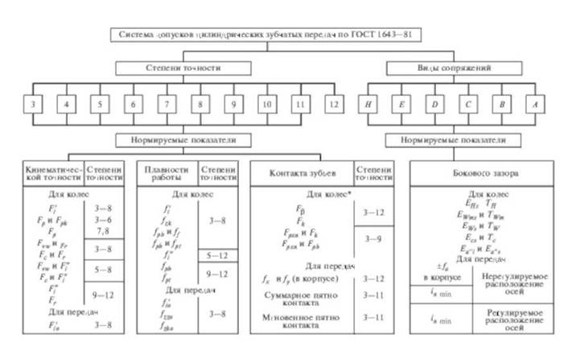

#### Методы и средства контроля зубчатых колёс

Как и у резьб, контроль зубчатых колёс можно вести поэлементно или комплексно.

Если контроль поэлементный, измеряют толщину зуба, длину общей нормали, окружные и основные шаги, радиальное биение зубьев, погрешность профиля зуба, и так далее. Для поэлементного контроля создаются специальные средства измерения, например, зубомеры, штангензубомеры, зубомерные микрометры, нормалемеры и так далее.

Комплексный контроль. Для проверки кинематической точности установлено девять комплексно контролируемых параметров, для оценки плавности — 8 и так далее (см. табл.). Например, 1...3 комплексы контроля кинематической точности проверяют колёса с третьей по восьмую степени точности. Четвёртый комплекс — для колёс 3...6 степени точности. Полноту контакта зубьев рекомендуется оценивать суммарным или мгновенным пятном контакта. Методы и средства комплексного контроля позволяют получить информацию более полную и достоверную, чем при поэлементном контроле. Обычно комплексный контроль применяют с 3 по 5 степень точности (для достаточно точных колёс).

Приборы для измерения зубчатых колёс (цилиндрических, конических, червячных) стандартизованы.

В зависимости от поставленной цели контроль зубчатых колёс делят на приёмочный (окончательный) и технологический. При приёмочном контроле устанавливают соответствие точности колеса предъявляемым требованиям, которые зависят от назначения передачи. При этом желательно совмещение измерительной базы детали с эксплуатационной (монтажной базой). Предпочтительным является комплексный контроль. Если средства для него отсутствуют, применяют поэлементный контроль. Технологический контроль используют при наладке операций зубонарезания и для выявления причин брака. Здесь измерительную базу совмещают с технологической. 

Прямой поэлементный контроль зубчатых колёс достаточно трудоёмкий, требует большого числа приборов, поэтому применяется только в индивидуальном и серийном производстве. Желательно заменить прямой контроль косвенным. В этом случае контролируют погрешности самого станка, инструмента, приспособлений, по которым судят о точности зубчатых колёс. Косвенный контроль сокращает трудоёмкость контрольных операций, и потребность в измерительных средствах. Иногда применяют активный контроль зубчатых колёс (контроль в процессе обработки), результаты которого используют для управления ходом техпроцесса. Например, подключают прибор, который является, как бы, подналадчиком, к зубофрезерному станку. Прибор контролирует смещение исходного контура зубьев и изменение поверхности у корня зуба. Результаты контроля используют для радиального заглубления и осевого перемещения червячной фрезы. Контроль кинематической точности, плавности работы обычно осуществляют на специальных приборах, которые могут быть стационарными и накладными. Последние можно использовать на рабочих местах.

Полноту контакта обычно оценивают по пятну контакта. На эталонное колесо наносят тонкий слой краски, а затем соединяют с проверяемым и вращают с лёгким торможением. В результате на проверяемом колесе остаются пятна краски. Оценивая величину этих пятен, можно судить о полноте контакта зубьев. Определяют отношение длины и ширины пятна контакта к общей длине и ширине зуба. Размеры пятен обычно оценивают на глаз.

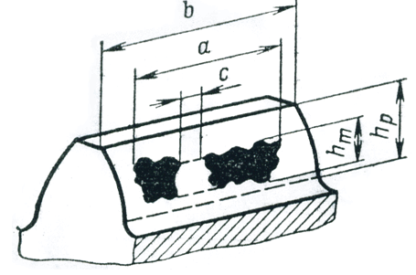

Боковой зазор проверяют только в собранной передаче. Для косвенного контроля можно использовать измерение толщины зуба, смещения исходного контура зубьев и другие показатели. Величина зазора обычно регулируется изменением межосевого расстояния передачи. 

***
[date]: # (15.04.19)

### Контроль шпоночных соединений

Основное назначение шпоночных соединений — передача крутящего момента. Точность центрирования соединяемых деталей невысокая. Размеры, допуски, посадки разных типов шпонок и пазов стандартизованы.

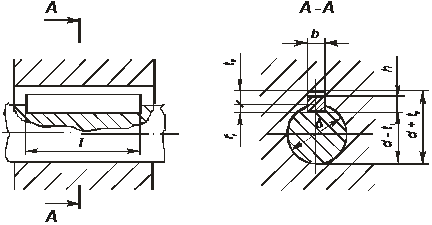

Самым важным размером с точки зрения изготовления является размер $b$. Контроль шпоночного соединение осуществляется по нему. Для массового и серийного производства используют предельные калибры для контроля шпоночного соединения.

Для проверки ширины паза $b$ используют пластины:

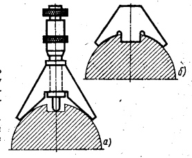

Для проверки размера $d + t_2$ используют пробку, а для проверки глубины паза на валу $t_1$ могут использоваться кольца со стержнем.

Обязательно необходима проверка симметричности расположения паза относительно осевой плоскости соединения.

### Контроль шлицевых соединений

#### Характеристика шлицевых соединений

Недостаток шпоночных соединений в том, что они не могут передавать большие крутящие моменты. Кроме того, из-за неточности изготовления возможен перекос вала относительно втулки. Поэтому шпоночные соединения вытесняются шлицевыми. Они передают бо́льшие крутящие моменты, имеют бо́льшую усталостную прочность, высокую точность центрирования. В зависимости от профиля зубьев шлицевые соединения делятся на прямобочные, эвольвентные и треугольные. 

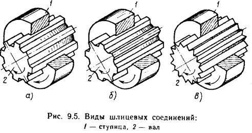

Прямобочные соединения имеют чётные числа зубьев. Высота и число зубьев выбираются в зависимости от передаваемого крутящего момента. Прямобочные передачи делят на лёгкие, средние и тяжёлые. 

Шлицевые соединения с эвольвентным профилем имеют модель от 0,5 до 10 мм, диаметр от 4 до 500 мм, число зубьев от 6 до 82. Угол профиля $\alpha = 30 \deg$. Шлицевые соединения с эвольвентным профилем зубьев имеют ряд преимуществ перед прямобочными: передают бо́льшие крутящие моменты, имеют меньшую концентрацию напряжений у оснований зубьев, повышенную долговечность и прочность и лучшее центрирование. С точки зрения изготовления эти соединения проще, так как их можно изготавливать на зубофрезерных станках.

Высота зуба у треугольных соединений малая. Их применяют, чаще всего, взамен посадок с натягом, а также в тонкостенных втулках для передачи небольших крутящих моментов. Центрируются треугольные шлицевые соединения только по боковым сторонам зубьев. Стандарта на соединение с треугольным профилем нет, есть лишь нормативные рекомендации. 

Изготовление шлицевых соединений во многом определяется видом центрирования втулки относительно вала. 

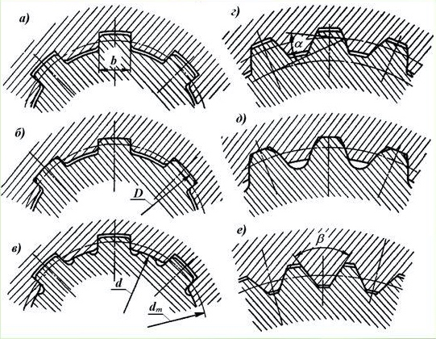

У прямобочных шлицевых соединений различают три способа центрирования: по диаметрам $D$, $d$ и по боковым поверхностям зубьев (по размеру $b$). Если к шлицевому соединению предъявляются высокие требования по кинематической точности, применяется центрирование по одному из диаметров. Центрирование по $b$ применяют при знакопеременных нагрузках (когда вал вращается то в одну, то в другую сторону) и при больших крутящих моментах. Центрирование по $d$ целесообразно тогда, когда втулка имеет высокую твёрдость и обработать её протяжкой нельзя. Тогда её шлифуют на обычном внутришлифовальном станке, а вал изготавливают достаточно точно, но с учётом того, чтобы не было его искривления после термообработки. Способ обеспечивает достаточно точное центрирование, его применяют обычно для подвижных соединений. В этом случае зазор по диаметру $d$ между втулкой и валом отсутствует. Центрирование по $D$ рекомендуют когда втулка термически не обработана, тогда её калибруют протяжкой, а вал фрезеруют до окончательных размеров зубьев. После этого его шлифуют по диаметру $D$ на обычном круглошлифовальном станке. Этот способ очень простой и не требует больших затрат. Его применяют для неподвижных соединений или для подвижных, но воспринимающих небольшие нагрузки. Зазор по диаметру $D$ в этом случае отсутствует. Центрирование по размеру $b$ позволяет равномерно распределить нагрузку между зубьями, но не обеспечивает высокой точности, поскольку есть зазоры и по $D$ и по $d$.

#### Контроль шлицевых соединений

Шлицевые соединения, как правило, контролируют комплексными проходными калибрами, то есть, осуществляется комплексный контроль. Наряду с ним, может быть и поэлементный контроль (в мелкосерийном, серийном производстве). Комплексный контроль осуществляется с помощью калибров.

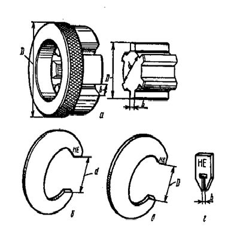

Шлицевое отверстие считается годным, если комплексный калибр-пробка проходит, а диаметр и ширина паза не выходят за установленные верхние пределы. Вал считается годным если комплексный калибр-кольцо проходит, а диаметры и толщина зуба не выходят за установленные нижние пределы. Калибры выполняются также по своим стандартам.

Помимо комплексного контроля, можно контролировать шлицевые валы и отверстия поэлементно, с помощью универсальных измерительных средств. Например, толщину зубьев измеряют микрометром, горизонтальным оптиметром, плоскопараллельными концевыми мерами и тому подобное. Впадины между зубьями чаще всего контролируют блоком концевых мер. Для контроля отклонения формы и расположения зубьев и зубчатых пазов можно использовать поверочную плиту в сочетании с индикатором или делительной головкой. Контролируемую поверхность зуба устанавливают в плоскости, параллельной плоскости плиты, а стрелочный индикатор настраивают на высоту центров, а затем по шкале стрелочного прибора (индикатора) отсчитывают отклонение расположения. 

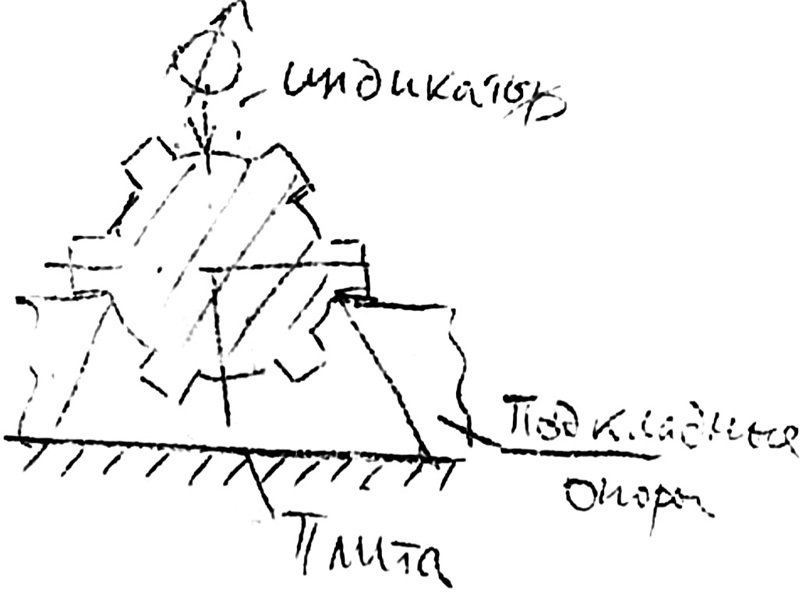

По шкале индикатора отсчитывают отклонение расположения оси, а перемещая вал относительно измерительного наконечника, можно обнаружить отклонение формы.

Шаг зубьев можно проконтролировать с помощью измерительных роликов:

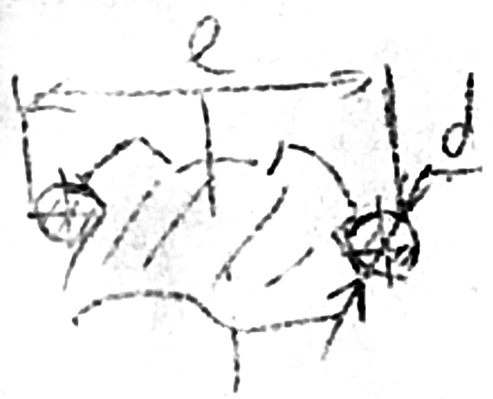

Контроль соосности цилиндрических поверхностей $D$ и $d$:

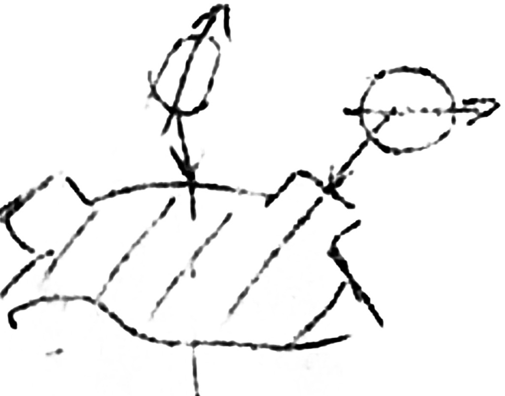

Вал устанавливается в центрах на поверочной плите, контроль осуществляют с помощью двух индикаторов, закреплённых на стойках. Первый прибор настраивают на нулевое положение по вершине зуба (диаметру $D$), а второй — по плиткам на величину, меньшую и равную высоте зуба, то есть, по впадине. Разность показаний приборов указывает на величину отклонения от соосности при последовательном измерении каждого зуба.

Сложнее измерять шлицевые втулки. В этом случае индикаторы снабжают дополнительными рычагами для установления контакта с боковыми поверхностями впадин.

Шлицевые соединения эвольвентного и треугольного профиля контролируют калибрами и универсальными измерительными средствами. Боковые стороны зубьев с эвольвентным профилем контролируют эвольвентомерами, а при треугольном профиле — также как и при прямобочном. Толщину зубьев валов и ширину впадин отверстий контролируют с помощью измерительных роликов. Ролики закладывают во впадины между зубьями и измеряют размер между противолежащими роликами. Размеры роликов стандартные. Направление зубьев у эвольвентного профиля проверяется также как направление зубьев у зубчатых колёс. Для контроля используют также комплексные калибры, для отверстий — калибры-пробки, а для валов — калибры-кольца. Размеры калибров также стандартизованы.

***
[date]: # (16.04.19)

## Проектирование контрольно-измерительных приспособлений

Контрольно-измерительные приспособления относятся к технологической оснастке. Это специальные производственные средства измерения и контроля, представляющие собой сочетание базирующих, зажимных и измерительных устройств. Основные требования к приспособлениям — обеспечение оптимальной точности и производительности операций технического контроля. Кроме того, приспособление должно быть удобно в эксплуатации, технологично в изготовлении а также должно быть экономически целесообразным. Целесообразность приспособления характеризуется повышением качества продукции с одновременным уменьшением брака. Сюда же можно отнести сокращение числа контролёров и снижение требований к их квалификации.

Контрольно-измерительные приспособления подразделяются:

1. По принципу работы и характеру используемых измерительных устройств:
    - отсчётные — со шкальными измерителями: индикаторы, с помощью которых определяют численные значения величин
    - предельные — с бесшкальными измерителями: щупы, калибры и т. п., используются для рассортировки деталей на годные и негодные по мере контроля проверяемого размера. 
    - с комбинированными измерителями: электроконтактные датчики с отсчётными шкалами. Дают возможность не только сортировать детали по размеру, но и оценивать действительные значения этих размеров.
2. По габаритам, условиям работы, числу контролируемых параметров:
    - стационарные
    - переносные
    - одномерные
    - многомерные
3. По технологическому назначению:
    - операционного контроля
    - приёмочные, для приёмки готовых деталей и сборочных единиц
    - активного контроля
    - приспособления для контроля правильности наладки и протекания технологического процесса

### Составляющие погрешности измерения

На точность показаний контрольно-измерительных приспособлений оказывают влияние следующие погрешности:

1. Погрешность базирования детали на установочных элементах $\Delta_{уэ}$. Является постоянной систематической ошибкой и определяется непосредственным измерением при аттестации приспособления.
    - Погрешность базирования детали на установочных элементах приспособлений $\Delta_б$. Зависит от допуска погрешности базирования; от зазоров между измерительной базой детали и поверхностью установочного элемента. Является систематически-переменной.
    - Погрешность совмещения измерительной базы контролируемой детали с рабочей поверхностью установочного элемента $\Delta_{ус}$. Обуславливается деформацией стыков, наличием микронеровностей, перекосов при установке и тому подобным. Является случайной величиной и определяется как случайная величина
2. Погрешность передаточных устройств $\Delta_р$. Погрешность возникает вследствие неточности изготовления рычагов для измерения и других деталей. Является систематической.
    - При работе передаточных устройств кроме систематической может возникать случайная погрешность $\Delta_п$, которая возникает из-за неточности изготовления рычагов и других деталей. Погрешность случайная, определяется расчётным или экспериментальным путём.
3. Погрешность установочных мер, используемых для настройки измерительных средств (это концевые меры). Они состоят из систематических отклонений $\Delta_{ум}$ и случайных погрешностей $\Delta_{умс}$. Эти погрешности возникают при настройке прибора концевыми мерами.
4. Случайные свойственные данному методу измерения погрешности $\Delta_м$, возникающие из-за неточности отсчёта по шкале измерительного прибора, температурных колебаний, непостоянного зажимного усилия и тому подобного.
5. Если приспособление использует зажимные элементы, может появиться погрешность закрепления $\Delta_з$, причиной которой являются колебания величины приложенной силы. Является случайной независимой величиной. 

#### Определение суммарной погрешности измерения

Точность показаний контрольно-измерительных приспособлений определяется суммарной погрешностью, составляющими которой являются систематические и случайные погрешности. Случайные погрешности подчиняются закону нормального распределения и суммируются по правилу квадратного корня. Систематические погрешности суммируются алгебраически с учётом их знака. Составляющие суммарной погрешности могут определяться расчётом по справочным данным или экспериментально.

Окончательно имеем суммарную погрешность измерения в приспособлении:

$$ \Delta_{\sum} = \Delta_{уэ} + \Delta_р + \Delta_{ум} + \sqrt{\Delta_б^2 + \Delta_{ус}^2 + \Delta_п^2 + \Delta_{умс}^2 + \Delta_м^2 + \Delta_з^2} $$

Суммарная погрешность может составлять $8...30 \%$ допуска контролируемого параметра.

### Показатели точности наладки контрольного приспособления

Самым важным показателем наладки является стабильность показаний. Это систематическая повторяемость или близкое совпадение характеристик измерений, полученных при многократных повторных измерениях одной и той же величины.

Если стабильность высокая, то размах показаний должен быть минимальным:

$$ W = (x_{max} - x_{min}) \to \min $$

Кроме размаха стабильность измерения характеризуется стабильностью выборочной средней при измерении и стабильностью среднеквадратического отклонения.

Приспособление поступает в эксплуатацию после того как прошло аттестацию. В процессе аттестации устанавливают систематические погрешности, которые должны быть исключены или учтены при контроле размеров; периодичность проверки приспособлений; объёмы малых выборок для аттестации. Проведение аттестации позволяет определить точность и устойчивость показаний контрольных приспособлений на период их эксплуатации.

***