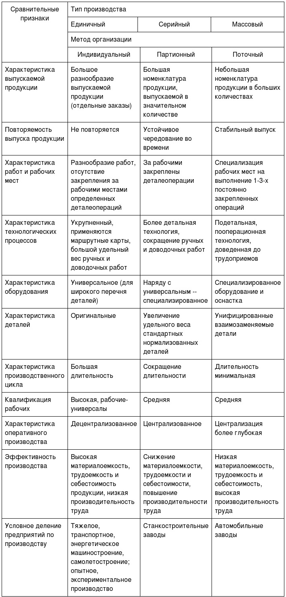

# Экономика

[TOC]

***
[date]: # (11.02.2019) 

## Экономика предприятия

### Понятия и юридические основы деятельности промышленных предприятий

**Юридическое лицо** — это организация, которая имеет обособленное имущество и отвечает им по своим обязательствам, может от своего имени приобретать и осуществлять гражданские права и нести гражданские обязанности, быть истцом и ответчиком в суде. (51-ФЗ, ст. 48).

Юридическое лицо характеризуют следующие признаки:

1. Юридическое лицо имеет своё наименование, содержащее указание на организационно-правовую форму
2. Юридическое лицо должно быть зарегистрировано в едином государственном реестре юридических лиц (ЕГРЮЛ)
3. Юридическое лицо имеет гражданские права, соответствующие целям деятельности, предусмотренным в его учредительном документе, и нести связанные с этой деятельности обязанности
4. Юридическое лицо получает специальное разрешение — лицензию — на занятие определёнными видами деятельности, если оно требуется
5. Юридическое лицо ведёт самостоятельный бухгалтерский баланс
6. Юридическое лицо имеет юридический адрес
7. Юридическое лицо имеет печать и счёт в банке

#### Организационно-правовые формы

По целям деятельности организации можно разделить на две большие группы: *коммерческие* и *некоммерческие*. 

**Коммерческие предприятия** — это юридические лица, преследующие извлечение прибыли в качестве основной цели деятельности и распределяющие полученную прибыль между своими участниками.

**Некоммерческие предприятия** — это юридические лица, не преследующие извлечение прибыли в качестве основной цели деятельности и не распределяющие полученную прибыль между своими участниками.

Юридические лица, учредители которых обладают правом участия в них, формируют их высший орган, называются **корпоративные юридические лица**.

Юридические лица, учредители которых не становятся их участниками и не приобретают в них прав членства, называются **унитарные юридические лица**.

```
Юридические лица {
    некоммерческие {};
    коммерческие {
        корпоративные {
            производственный кооператив;
            хозяйственные товарищества {
                полные товарищества;
                товарищества на вере;
            };
            хозяйственные общества {
                ООО;
                АО {
                    ПАО;
                    АО;
                };
            };
        };
        унитарные {
            муниципальные унитарные предприятия;
            государственные унитарные предприятия;
            казённые предприятия;
        };
    }; 
};
```

##### Производственный кооператив (артель)

 Деятельность регламентируется ГК РФ (часть первая) от 30.11.1994 51-ФЗ; 41-ФЗ «О производственных кооперативах».
 
**Производственный кооператив** — это добровольное объединение граждан на основе членства для совместной производственной или иной хозяйственной деятельности, основанной на из личном трудовом и ином участии. 

Члены кооператива образуют паевой фонд, который определяет минимальный размер имущества кооператива.

Учредительным документом кооператива является устав, утверждённый общим собранием его членов. Устав должен содержать следующие сведения: 

- фирменное наименование кооператива и слова «производственный кооператив» или «артель»;
- место нахождения кооператива;
- условия о размере паевых взносов членов кооператива;
- о составе и порядке внесения паевых взносов членами кооператива и об их ответственности за нарушение обязательств по внесению указанных взносов;
- о характере и порядке трудового и иного участия членов кооператива в его деятельности и об их ответственности за нарушение обязательств по личному трудовому и иному участию;
- о порядке распределения прибыли и убытков кооператива;
- о размере и об условиях субсидиарной ответственности кооператива по его долгам;
- о составе и компетенции органов управления кооперативом и порядке принятия ими решений, в том числе по вопросам, решения по которым принимаются единогласно или квалифицированным большинством голосов;
- о порядке выплаты стоимости пая или выдачи соответствующего ему имущества лицу, прекратившему членство в кооперативе;
- о порядке вступления в кооператив новых членов;
- о порядке выхода из кооператива;
- об основаниях и о порядке исключения из членов кооператива;
- о порядке образования имущества кооператива;
- о перечне филиалов и представительств кооператива;
- о порядке реорганизации и ликвидации кооператива.

Число членов кооператива — не менее 5 человек. Прибыль кооператива распределяется между его членами в соответствии с их трудовым участием, если иной порядок не предусмотрен законом и уставом кооператива. В таком же порядке распределяется имущество, оставшееся после ликвидации кооператива и удовлетворения требований его кредиторов. Высшим органом управления кооператива является общее собрание его членов.

К исключительной компетенции общего собрания относится: 

- изменение устава кооператива
- образование наблюдательного совета и прекращение полномочий его членов, а также образование и прекращение полномочий исполнительных органов кооператива, если это право по уставу не принадлежит наблюдательному совету
- приём и исключение членов кооператива
- утверждение годовых отчётов и бухгалтерских балансов кооператива, распределение его прибыли и убытков
- решение о реорганизации и ликвидации кооператива

Член кооператива имеет один голос при принятии решений общим собранием. Он вправе по своему усмотрению выйти из кооператива. В этом случае ему должна быть выплачена стоимость пая или выделено имущество, соответствующее его паю, а также осуществлены другие выплаты, предусмотренные уставом кооператива. 

Производственный кооператив может быть добровольно реорганизован в хозяйственное товарищество или общество по единогласному решению его членов или ликвидирован.

##### Хозяйственные товарищества и общества

Деятельность регламентируется ГК РФ (часть первая) от 30.11.1994 51-ФЗ.

**Хозяйственные товарищества и общества** — корпоративные коммерческие организации с разделённым на доли (вклады) учредителей (участников) уставным (складочным) капиталом. Имущество, созданное за счёт вкладов учредителей (участников), а также произведённое и приобретённое хозяйственным товариществом или обществом в процессе деятельности, принадлежит на праве собственности хозяйственному товариществу или обществу.

Хозяйственные товарищества могут создаваться в организационно-правовой форме полного товарищества или товарищества на вере (коммандитного товарищества).

Хозяйственные общества могут создаваться в организационно-правовой форме акционерного общества или общества с ограниченной ответственностью.

###### Полное товарищество

**Полное товарищество** — товарищество, участники которого (полные товарищи) в соответствии с заключённым между ними договором занимаются предпринимательской деятельности от имени товарищества и несут ответственность по его обязательствам принадлежащим им имуществом.

Документ, на основе которого осуществляется деятельность полного товарищества — **учредительный договор**, который подписывается всеми участниками товарищества. Он должен, помимо сведений, обязательных для всех юридических лиц, содержать:

- условия о размере и составе складочного капитала товарищества;
- о размере и порядке изменения долей каждого из участников в складочном капитале;
- о размере, составе, сроках и порядке внесения ими вкладов;
- об ответственности участников за нарушение обязанностей по внесению вкладов.

Участниками полных товариществ могут быть индивидуальные предприниматели и коммерческие организации.

Лицо может быть участником только одного полного товарищества. Фирменное наименование полного товарищества должно содержать имена (наименование) одного, нескольких или всех участников и слова «полное товарищество».

Управление деятельностью полного товарищества осуществляется по общему согласию всех участников. Учредительным договором товарищества могут быть предусмотрены случаи, когда решение принимается большинством голосов участников. Каждый участник полного товарищества имеет один голос, если учредительным договором не предусмотрен иной порядок определения количества голосов его участников. Каждый участник товарищества независимо от того, уполномочен ли он вести дела товарищества, вправе получать всю информацию о деятельности товарищества и знакомиться со всей документацией по ведению дел.

Прибыль и убытки полного товарищества распределяются между его участниками пропорционально их долям в складочном капитале, если иное не предусмотрено учредительным договором или иным соглашением участников. 

Участники полного товарищества солидарно несут субсидиарную ответственность своим имуществом по обязательствам товарищества.

Участник полного товарищества вправе выйти из него, заявив об отказе от участия в товариществе. Отказ от участия в полном товариществе, учреждённом без указания срока, должен быть заявлен участником не менее чем за шесть месяцев до фактического выхода из товарищества. Участнику, выбывшему из полного товарищества, выплачивается стоимость части имущества товарищества, соответствующей доле этого участника в складочном капитале, если иное не предусмотрено учредительным договором.
 
Участник полного товарищества вправе с согласия остальных его участников передать свою долю в складочном капитале или её часть другому участнику товарищества либо третьему лицу.

Полное товарищество ликвидируется в случае, когда в товариществе остаётся единственный участник. Такой участник вправе в течение шести месяцев с момента, когда он стал единственным участником товарищества, преобразовать такое товарищество в хозяйственное общество.

###### Товарищество на вере

**Товарищество на вере** (коммандитное товарищество) — товарищество, в котором наряду с участниками, осуществляющими от имени товарищества предпринимательскую деятельность и отвечающими по обязательствам товарищества своим имуществом (полными товарищами), имеется один или несколько участников-вкладчиков (коммандитистов), которые несут риск убытков, связанных с деятельностью товарищества, в пределах сумм внесённых ими вкладов и не принимают участия в осуществлении товариществом предпринимательской деятельности.

К товариществу на вере применяются правила ГК РФ о полном товариществе, не противоречащие правилам о товариществе на вере.

Учредительный договор должен содержать:

- условия о размере и составе складочного капитала товарищества;
- о размере и порядке изменения долей каждого из полных товарищей в складочном капитале;
- о размере, составе, сроках и порядке внесения ими вкладов, их ответственности за нарушение обязанностей по внесению вкладов; 
- о совокупном размере вкладов, вносимых вкладчиками.

Полными товарищами в товариществах на вере могут быть индивидуальные предприниматели и коммерческие организации. Вкладчиками в товариществах на вере могут быть граждане и юридические лица, а также публично-правовые образования.

Лицо может быть полным товарищем только в одном товариществе на вере. Участник полного товарищества не может быть полным товарищем в товариществе на вере. Полный товарищ в товариществе на вере не может быть участником полного товарищества. Число коммандитистов в товариществе на вере не должно превышать двадцать. В противном случае оно подлежит преобразованию в хозяйственное общество в течение года, а по истечении этого срока — ликвидации в судебном порядке, если число его коммандитистов не уменьшится до указанного предела.

Управление деятельностью товарищества на вере осуществляется полными товарищами. Вкладчики не вправе участвовать в управлении и ведении дел товарищества на вере, выступать от его имени иначе, как по доверенности. Они не вправе оспаривать действия полных товарищей по управлению и ведению дел товарищества.

Вкладчик товарищества на вере обязан внести вклад в складочный капитал. Внесение вклада удостоверяется свидетельством об участии, выдаваемым вкладчику товариществом. Вкладчик товарищества на вере имеет право:

- получать часть прибыли товарищества, причитающуюся на его долю в складочном капитале, в порядке, предусмотренном учредительным договором;
- знакомиться с годовыми отчётами и балансами товарищества;
- по окончании финансового года выйти из товарищества и получить свой вклад в порядке, предусмотренном учредительным договором;
- передать свою долю в складочном капитале или её часть другому вкладчику или третьему лицу. Вкладчики пользуются преимущественным перед третьими лицами правом покупки доли (её части) применительно к условиям и порядку, предусмотренным пунктом 2 статьи 93 настоящего Кодекса. Передача всей доли иному лицу вкладчиком прекращает его участие в товариществе.

Товарищество на вере ликвидируется при выбытии всех участвовавших в нем вкладчиков. Однако полные товарищи вправе вместо ликвидации преобразовать товарищество на вере в полное товарищество. Товарищество на вере сохраняется, если в нем остаются по крайней мере один полный товарищ и один вкладчик. При ликвидации товарищества на вере, в том числе в случае банкротства, вкладчики имеют преимущественное перед полными товарищами право на получение вкладов из имущества товарищества, оставшегося после удовлетворения требований его кредиторов.

###### Общество с ограниченной ответственностью (ООО)

Деятельность регламентируется ГК РФ (часть первая) от 30.11.1994 51-ФЗ; 14-ФЗ от 08.02.1998 «Об обществах с ограниченной ответственностью».

**Общество с ограниченной ответственностью** — хозяйственное общество, уставный капитал которого разделён на доли; участники общества с ограниченной ответственностью не отвечают по его обязательствам и несут риск убытков, связанных с деятельностью общества, в пределах стоимости принадлежащих им долей.

Учредительным документом общества с ограниченной ответственностью является его **устав**. Устав общества с ограниченной ответственностью должен содержать сведения о:

- фирменном наименовании общества и месте его нахождения, 
- размере его уставного капитала,
- составе и компетенции его органов,
- порядке принятия ими решений
- иные сведения, предусмотренные законом об обществах с ограниченной ответственностью.

Участниками общества могут быть граждане и юридические лица. Общество может быть учреждено одним лицом, которое становится его единственным участником. Общество может впоследствии стать обществом с одним участником. Число участников общества не должно быть более пятидесяти. В случае, если число участников общества превысит установленный настоящим пунктом предел, общество в течение года должно преобразоваться в открытое акционерное общество или в производственный кооператив. 

Учредители общества с ограниченной ответственностью заключают между собой договор об учреждении общества с ограниченной ответственностью, определяющий порядок осуществления ими совместной деятельности по учреждению общества, размер уставного капитала общества, размер их долей в уставном капитале общества и иные установленные законом об обществах с ограниченной ответственностью условия. Договор об учреждении общества с ограниченной ответственностью заключается в письменной форме.

Высшим органом общества является общее собрание участников общества. Общее собрание участников общества может быть очередным или внеочередным. Все участники общества имеют право присутствовать на общем собрании участников общества, принимать участие в обсуждении вопросов повестки дня и голосовать при принятии решений. К компетенции общего собрания участников общества относятся:

- определение основных направлений деятельности общества, а также принятие решения об участии в ассоциациях и других объединениях коммерческих организаций;
- утверждение устава общества, внесение в него изменений или утверждение устава общества в новой редакции, принятие решения о том, что общество в дальнейшем действует на основании типового устава, либо о том, что общество в дальнейшем не будет действовать на основании типового устава, изменение размера уставного капитала общества, наименования общества, места нахождения общества;
- образование исполнительных органов общества и досрочное прекращение их полномочий, а также принятие решения о передаче полномочий единоличного исполнительного органа общества управляющему, утверждение такого управляющего и условий договора с ним, если уставом общества решение указанных вопросов не отнесено к компетенции совета директоров (наблюдательного совета) общества;
- избрание и досрочное прекращение полномочий ревизионной комиссии (ревизора) общества;
- утверждение годовых отчётов и годовых бухгалтерских балансов;
- принятие решения о распределении чистой прибыли общества между участниками общества;
- утверждение (принятие) документов, регулирующих внутреннюю деятельность общества (внутренних документов общества);
- принятие решения о размещении обществом облигаций и иных эмиссионных ценных бумаг;
- назначение аудиторской проверки, утверждение аудитора и определение размера оплаты его услуг;
- принятие решения о реорганизации или ликвидации общества;
- назначение ликвидационной комиссии и утверждение ликвидационных балансов;
- решение иных вопросов, предусмотренных настоящим Федеральным законом или уставом общества.

Уставом общества может быть предусмотрено образование совета директоров (наблюдательного совета) общества.

Общество вправе ежеквартально, раз в полгода или раз в год принимать решение о распределении своей чистой прибыли между участниками общества. Решение об определении части прибыли общества, распределяемой между участниками общества, принимается общим собранием участников общества. Часть прибыли общества, предназначенная для распределения между его участниками, распределяется пропорционально их долям в уставном капитале общества. Уставом общества может быть установлен иной порядок распределения прибыли между участниками общества. 

Общество несёт ответственность по своим обязательствам всем принадлежащим ему имуществом. Общество не отвечает по обязательствам своих участников. В случае несостоятельности (банкротства) общества по вине его участников, на указанных участников или других лиц в случае недостаточности имущества общества может быть возложена субсидиарная ответственность по его обязательствам.

Общество ведёт список участников общества с указанием сведений о каждом участнике общества, размере его доли в уставном капитале общества и её оплате, а также о размере долей, принадлежащих обществу, датах их перехода к обществу или приобретения обществом.

Участники общества вправе продать или осуществить отчуждение иным образом своей доли или части доли в уставном капитале общества одному или нескольким участникам данного общества либо другому лицу, или выйти из общества путём отчуждения своей доли обществу, если такая возможность предусмотрена уставом общества, или потребовать приобретения обществом доли.

Общество может быть добровольно реорганизовано. Реорганизация общества может быть осуществлена в форме слияния, присоединения, разделения, выделения и преобразования. Общество может быть ликвидировано добровольно или по решению суда.

###### Акционерное общество (АО, ПАО)

Деятельность регламентируется ГК РФ (часть первая) от 30.11.1994 51-ФЗ; 208-ФЗ от 26.12.1995 «Об акционерных обществах».

**Акционерное общество** — хозяйственное общество, уставный капитал которого разделён на определённое число акций; участники акционерного общества (акционеры) не отвечают по его обязательствам и несут риск убытков, связанных с деятельностью общества, в пределах стоимости принадлежащих им акций.

Общество может быть *публичным* или *непубличным*, что отражается в его уставе и фирменном наименовании.

Публичное общество вправе проводить размещение акций и эмиссионных ценных бумаг, конвертируемых в его акции, посредством открытой подписки. Акции непубличного общества и эмиссионные ценные бумаги, конвертируемые в его акции, не могут размещаться посредством открытой подписки или иным образом предлагаться для приобретения неограниченному кругу лиц.

Учредительным документом акционерного общества является его **устав**. Устав общества с ограниченной ответственностью должен содержать следующие сведения:

- полное и сокращённое фирменные наименования общества;
место нахождения общества;
- количество, номинальную стоимость, категории (обыкновенные, привилегированные) акций и типы привилегированных акций, размещаемых обществом;
- права акционеров — владельцев акций каждой категории (типа);
- размер уставного капитала общества;
- структуру и компетенцию органов управления общества и порядок принятия ими решений;
- порядок подготовки и проведения общего собрания акционеров, в том числе перечень вопросов, решение по которым принимается органами управления общества квалифицированным большинством голосов или единогласно;
- иные положения, предусмотренные настоящим Федеральным законом и иными федеральными законами.

Уставом непубличного общества могут быть установлены ограничения количества акций, принадлежащих одному акционеру, и их суммарной номинальной стоимости, а также максимального числа голосов, предоставляемых одному акционеру. 

Устав публичного общества также должен содержать:
- указание на публичный статус общества;
- указание на наличие в структуре органов управления общества совета директоров (наблюдательного совета), его компетенцию и порядок принятия им решений.

Высшим органом управления общества является общее собрание акционеров. Общество обязано ежегодно проводить годовое общее собрание акционеров. К компетенции общего собрания акционеров относятся:
- внесение изменений и дополнений в устав общества или утверждение устава общества в новой редакции;
- реорганизация общества;
- ликвидация общества, назначение ликвидационной комиссии и утверждение промежуточного и окончательного ликвидационных балансов;
- определение количественного состава совета директоров (наблюдательного совета) общества, избрание его членов и досрочное прекращение их полномочий;
- определение количества, номинальной стоимости, категории (типа) объявленных акций и прав, предоставляемых этими акциями;
- увеличение уставного капитала общества путём увеличения номинальной стоимости акций или путём размещения дополнительных акций, если уставом общества в соответствии с настоящим Федеральным законом увеличение уставного капитала общества путём размещения дополнительных акций не отнесено к компетенции совета директоров (наблюдательного совета) общества;
- уменьшение уставного капитала общества путём уменьшения номинальной стоимости акций, путём приобретения обществом части акций в целях сокращения их общего количества, а также путём погашения приобретённых или выкупленных обществом акций;
- образование исполнительного органа общества, досрочное прекращение его полномочий;
- избрание членов ревизионной комиссии общества и досрочное прекращение их полномочий;
- утверждение аудитора общества;
- утверждение годового отчёта, годовой бухгалтерской (финансовой) отчётности общества;
- распределение прибыли (в том числе выплата дивидендов) и убытков общества по результатам отчётного года;
- определение порядка ведения общего собрания акционеров;
- избрание членов счётной комиссии и досрочное прекращение их полномочий;
- дробление и консолидация акций;
- принятие решений о согласии на совершение или о последующем одобрении сделок;
- принятие решений о согласии на совершение или о последующем одобрении крупных сделок;
- приобретение обществом размещённых акций;
- принятие решения об участии в финансово-промышленных группах, ассоциациях и иных объединениях коммерческих организаций;
- утверждение внутренних документов, регулирующих деятельность органов общества.

Вопросы, отнесённые к компетенции общего собрания акционеров, не могут быть переданы на решение исполнительному органу общества или совету директоров (наблюдательному совету) общества, если иное не предусмотрено Федеральным законом.

Совет директоров (наблюдательный совет) общества осуществляет общее руководство деятельностью общества, за исключением решения вопросов, отнесённых к компетенции общего собрания акционеров. В обществе с числом акционеров — владельцев голосующих акций менее пятидесяти устав общества может предусматривать, что функции совета директоров общества (наблюдательного совета) осуществляет общее собрание акционеров.

Общество обязано выплатить объявленные по акциям каждой категории дивиденды. Дивиденды выплачиваются деньгами, а в случаях, предусмотренных уставом общества, — иным имуществом. Источником выплаты дивидендов является прибыль общества после налогообложения. Чистая прибыль общества определяется по данным бухгалтерской (финансовой) отчётности общества.

Общество несёт ответственность по своим обязательствам всем принадлежащим ему имуществом. Общество не отвечает по обязательствам своих акционеров. Если несостоятельность общества вызвана действиями (бездействием) его акционеров или других лиц, которые имеют право давать обязательные для общества указания либо иным образом имеют возможность определять его действия, то на указанных акционеров или других лиц в случае недостаточности имущества общества может быть возложена субсидиарная ответственность по его обязательствам.

Общество может быть добровольно реорганизовано, преобразовано  ООО или в производственный кооператив, либо ликвидировано добровольно или по решению суда. Ликвидация общества влечёт за собой его прекращение без перехода прав и обязанностей в порядке правопреемства к другим лицам.


##### Унитарные предприятия

Деятельность регламентируется ГК РФ (часть первая) от 30.11.1994 51-ФЗ; 161-ФЗ от 14.11.2002 «О государственных и муниципальных унитарных предприятиях».

**Унитарное предприятие** — коммерческая организация, не наделённая правом собственности на закреплённое за ней собственником имущество. Имущество унитарного предприятия является неделимым и не может быть распределено по вкладам (долям, паям), в том числе между работниками предприятия.

В организационно-правовой форме унитарных предприятий действуют *государственные* и *муниципальные* предприятия. Имущество государственного или муниципального унитарного предприятия находится в государственной или муниципальной собственности и принадлежит такому предприятию на праве хозяйственного ведения или оперативного управления.

В случаях и в порядке, которые предусмотрены законом о государственных и муниципальных унитарных предприятиях, на базе государственного или муниципального имущества может быть создано *унитарное казённое предприятие*. Казённое предприятие вправе распоряжаться принадлежащим ему имуществом, в том числе с согласия собственника такого имущества, только в пределах, не лишающих его возможности осуществлять деятельность, предмет и цели которой определены уставом такого предприятия. Деятельность казённого предприятия осуществляется в соответствии со сметой доходов и расходов, утверждаемой собственником имущества казённого предприятия.

Учредительным документом унитарного предприятия является его **устав**, утверждаемый уполномоченным государственным органом или органом местного самоуправления. Устав унитарного предприятия должен содержать сведения о его фирменном наименовании и месте его нахождения, предмете и целях его деятельности. Устав унитарного предприятия, не являющегося казённым, должен содержать также сведения о размере уставного фонда унитарного предприятия.

Единоличным исполнительным органом унитарного предприятия является руководитель предприятия, который назначается уполномоченным собственником органом и ему подотчётен. Руководитель унитарного предприятия организует выполнение решений собственника имущества унитарного предприятия.

Государственное или муниципальное предприятие ежегодно перечисляет в соответствующий бюджет часть прибыли, остающейся в его распоряжении после уплаты налогов и иных обязательных платежей, в порядке, в размерах и в сроки, которые определяются Правительством Российской Федерации, уполномоченными органами государственной власти субъектов Российской Федерации или органами местного самоуправления. Порядок распределения доходов казённого предприятия определяется Правительством Российской Федерации, уполномоченными органами государственной власти субъектов Российской Федерации или органами местного самоуправления.

Унитарное предприятие отвечает по своим обязательствам всем принадлежащим ему имуществом.
Унитарное предприятие не несёт ответственность по обязательствам собственника его имущества.
Собственник имущества унитарного предприятия, за исключением собственника имущества казённого предприятия, не отвечает по обязательствам своего унитарного предприятия. Собственник имущества казённого предприятия несёт субсидиарную ответственность по обязательствам такого предприятия при недостаточности его имущества. Руководитель унитарного предприятия несёт ответственность за убытки, причинённые унитарному предприятию его виновными действиями (бездействием), в том числе в случае утраты имущества унитарного предприятия.

Унитарное предприятие может быть реорганизовано по решению собственника его имущества, ликвидировано по решению собственника его имущества или по решению суда.

***
[date]: # (18.02.2019)

### Основные фонды промышленного предприятия

#### Понятие основных фондов и их структура

Средства производства, выраженные в денежной форме, называются **производственные фонды предприятия**, основные и оборотные. При этом в вещественном виде *основные производственные фонды* выступают как средство труда, а *оборотные производственные фонды* — как предмет труда

**Основные производственные фонды** (ОПФ) — это совокупность средств труда, многократно участвующих в производственном процессе и переносящих свою стоимость на себестоимость готовой продукции с целью реновации (обновления).

Для ведения бухгалтерского учёта применяются **положения по бухгалтерскому учёту** (ПБУ). Согласно ПБУ 6/01 «Учёт основных средств», активы предприятия будут учитываться в качестве основных средств, если выполняют следующие условия:

- объект предназначен для использования в производстве продукции, при выполнении работ или оказании услуг, для управленческих нужд организации, либо для предоставлении организации за плату во временное владение и пользование
- объект предназначен для использования в течении длительного времени, то есть, срока продолжительностью свыше 12 месяцев или обычного операционного цикла, если он превышает 12 месяцев
- организация не предполагает последующую перепродажу данного объекта
- объект способен приносить организации экономические выгоды (доход) в будущем

Выделяют следующие группы и подгруппы основных производственных фондов на машиностроительных предприятиях:

- Здания: цеха, складские помещения, производственные лаборатории и др.
- Сооружения: эстакады, тоннели, дороги и др.
- Передаточные устройства: электросети, теплосети, трубы и др.
- Машины и оборудование: силовые машины, рабочие машины, измерительные и регулирующие приборы и устройства и др.
- Транспортные средства: автомобили, кары, тележки и др.
- Инструмент и технологическая оснастка долговременного пользования
- Производственный инвентарь и принадлежности: рабочие столы, верстаки, тара, стеллажи и др.
- Хозяйственный инвентарь: шкафы, вешалки, сейфы и др.

В структуре основных фондов, в зависимости от конкретной их роли, принято выделять активную и пассивную часть. К *активной* части основных фондов относятся те, которые непосредственно участвуют в процессе производства — оборудование и инструменты. К *пассивной* части относятся основные фонды, которые создают условия для нормального течения производственных процессов: здания, сооружения и т. д.

#### Виды стоимостной оценки основных производственных фондов предприятия

Существуют следующие виды стоимостной оценки основных фондов:

1. *Оценка по первоначальной стоимости*, то есть по фактическим затратам, произведённым в момент создания или приобретения, включая доставку, монтаж, в ценах того года, в котором они изготовлены или приобретены. Первоначальная стоимость основных средств может меняться в случаях достройки, дооборудования, реконструкции, модернизации, технического перевооружения, частичной ликвидации соответствующих объектов и по иным аналогичным основаниям (п. 2, ст. 257 НК РФ).
2. *Оценка по восстановительной стоимости*, то есть по стоимости воспроизводства основных фондов на момент переоценки. Эта стоимость показывает, во сколько обошлось бы создание или приобретение на данный момент ранее созданных или приобретённых основных фондов.
3. *Остаточная стоимость основных фондов*, которая рассчитывается как первоначальная (или восстановительная) стоимость за вычетом начисленного износа (амортизационные отчисления): \\[С_{ост} = С_{пер \, (вос)} - A_м\\]
4. *Среднегодовая стоимость основных фондов*, которая рассчитывается при движении ОПФ (убытие, покупка, создание) по следующей формуле: \\[С_{ср.год.} = С_{н.г.} + С_{вв.} \frac{n_1}{12} - С_{выб.} \frac{n_2}{12},\\] где \\(С_{н.г.}\\) — стоимость на начало года; \\(С_{вв.}\\) — стоимость введённых фондов; \\(С_{выб.}\\) — стоимость выбывших фондов; \\(n_1\\) и \\(n_2\\) — количество _полных_ месяцев до конца года введённых и выбывших фондов соответственно.
5. *Ликвидационная стоимость* — стоимость реализации изношенных и снятых с производства основных фондов (стоимость металлолома).

#### Износ основных производственных фондов

Существует два вида износа — *физический* и *моральный*.

**Физический износ** — утрата основными фондами своих технических параметров. Различают физический износ *эксплуатационный* и *естественный*. 

**Моральный износ**, сущность которого состоит в том, что средства труда обесцениваются, утрачивают стоимость до окончания срока своей физической службы. Моральный износ бывает двух видов:    
*Первого вида* — обесценивание машин той же конструкции, что выпускались и раньше вследствие удешевления их производства в современных условия. Рассчитывается по следующей формуле: \\[МИ_1 = \frac{С_{пер} - С_{вос}}{С_{пер}}\\]   
*Второго вида* — отражает снижение эффективности использования существующего оборудования вследствие появления новых, более прогрессивных, производительных и экономичных конструкций машин. Рассчитывается по формуле: \\[МИ_2 = \left[1 - \left(\frac{C_{пер.н.}}{Q_н \cdot T_н} - \frac{С_{пер.б.}}{Q_б \cdot T_б}\right)\right],\\] где \\(C_{пер.н.}\\), \\(С_{пер.б.}\\) — стоимость морально устаревшей новой и базовой машины, \\(Q_н\\), \\(Q_б\\) — производительность морально устаревшей новой и базовой, \\(T_н\\), \\(T_б\\) — срок службы морально устаревшей новой и базовой машины.

#### Амортизация основных производственных фондов

**Амортизация** — это постепенное перенесение стоимости основных производственных фондов на себестоимость продукции в целях накопления денежных средств для их восстановления и реновации. Денежным выражением размера амортизации являются амортизационные отчисления, которые соответствуют степени износа основных фондов.

Величина амортизационных отчислений выражается в норме амортизации, представляющей собой годовой процент перенесения стоимости основных производственных фондов на себестоимость продукции: \\[Н_А = \frac{1}{T} \cdot 100\%,\\] где \\(T\\) — срок полезного использования амортизируемого имущества.

**Срок полезного использования** — период, в течении которого объект основных средств служит для выполнения целей деятельности предприятия.

Для тех видов основных средств, которые не указаны в амортизационных группах, срок полезного использования устанавливается бухгалтером самостоятельно, основываясь на следующих данных:

- ожидаемый срок использования этого объекта в соответствии с производительностью или мощностью
- ожидаемый физический износ, зависящий от режима эксплуатации, естественных условий и влияния агрессивной среды, системы проведения ремонта
- нормативно-правовых и других ограничений использования этого объекта.

Постановление правительства РФ от 01.01.2002 №1 в редакции от 07.07.2016 «О классификации основных средств, включаемых в амортизационные группы»: Срок полезного использования определяется бухгалтером самостоятельно на дату ввода в эксплуатацию данного объекта амортизируемого имущества с учётом классификации основных средств.

***
[date]: # (21.02.2019)

##### Методы начисления амортизации

Начисление амортизации на объекты основных средств производится одним из методов, указанных в ПБУ 6/01:

- Линейный метод
- Метод уменьшаемого остатка (нелинейный метод)
- Метод списания стоимости по сумме чисел лет срока полезного использования
- Метод списания стоимости пропорционально объёму продукции (работ)

В налоговом учёте применяют два метода начисления амортизации — линейный и метод уменьшаемого остатка (нелинейный) (п. 1, ст. 259 НК РФ). 

Не подлежат амортизации объекты основных средств, потребительские свойства которых с течением времени не меняются (земельные участки и объекты природопользования; объекты, отнесённые к музейным ценностям). 

В течении отчётного года амортизационные отчисления по объектам основных средств начисляются ежемесячно, независимо от применяемого способа, в размере \\(\frac{1}{12}\\) от годовой суммы. 

Начисление амортизационных отчислений по объекту основных средств начинается с первого числа месяца, следующего за месяцем принятия этого объекта к бухгалтерскому учёту и производится до полного погашения стоимости этого объекта либо списания этого объекта с бухгалтерского учёта.

Начисление амортизации может быть приостановлено в следующих случаях:

- за период консервации основного средства продолжительностью более 3 месяцев
- за период восстановления (реконструкции, ремонта или модернизации) основного средства продолжительностью более 12 месяцев

Начисление амортизационных отчислений по объекту основных средств прекращается с первого числа месяца, следующего за месяцем полного погашения стоимости этого объекта либо списания этого объекта с бухгалтерского учёта.

###### Линейный метод начисления амортизации

При использовании линейного метода годовая сумма амортизационных начислений определяется исходя из первоначальной (восстановительной) стоимости объекта основных средств и нормы амортизации, исчисленной из срока полезного использования данного объекта.

Суть этого метода заключается в равномерном по годам начислении амортизации в течении всего срока полезного использования.

\\[S_{ам \, год} = С_{пер \, (вос)} \cdot Н_А\\]

где \\(С_{пер \,(вос)}\\) — первоначальная (восстановительная) стоимость ОПФ, \\(Н_А\\) — норма амортизации.

*Пример:*

Приобретён объект основных средств стоимостью 50000 руб. Срок полезного использования объекта составляет 5 лет.

\\[Т = 5 \cdot С_{пер} = 50000 \, руб\\]
\\[Н_А = \frac{1}{5} \cdot 100 \% = 20 \%\\]
\\[S_{ам \, год} = 50 \cdot 20 \% = 10000 \, руб\\]
\\[С_{ост \, 5} = 0 \, руб\\]

###### Метод уменьшаемого остатка (нелинейный)

При использовании нелинейного метода начисления амортизации годовая сумма амортизационных отчислений определяется исходя из остаточной стоимости объекта основных средств на начало отчётного года нормы амортизации, исчисленной из срока полезного использования объекта, и коэффициента ускорения не выше 3. 

\\[S_{ам \, год} = К_{уск} \frac{Н_А}{100 \%} \cdot С_{ост \, i}\\]

где \\(С_{ост \, i} \\) — остаточная стоимость объекта основных средств в этом году

*Пример:*

Коэффициент ускорения — \\(К_{уск} = 2\\).

\\[S_{ам \, 1} = 2 \cdot 20 \% \cdot 50000 = 20000 \, руб\\]
\\[S_{ам \, 2} = 2 \cdot 20 \% \cdot (50000 - 20000) = 12000 \, руб\\]
\\[S_{ам \, 3} = 2 \cdot 20 \% \cdot (30000 - 12000) = 7200 \, руб\\]
\\[S_{ам \, 4} = 2 \cdot 20 \% \cdot (18000 - 7200) = 4300 \, руб\\]
\\[С_{ост \, 4} = 6500 \, руб\\]

Для последнего года:
\\[S_{ам \, 5} = 6500 \, руб\\]
\\[С_{ост \, 5} = 6500 - 6500 = 0 \, руб\\]

###### Метод списания стоимости по сумме чисел лет срока полезного использования

Расчёт амортизационных отчислений данным методом производится исходя из первоначальной (восстановительной) стоимости основного средства и соотношения числа лет, остающихся до конца срока полезного использования объекта, к сумме чисел лет срока полезного использования объекта.

\\[S_{ам \, год \, i} = С_{пер \, (вос)} \frac{Т_{ост}}{Т \frac{Т+1}{2}}\\]

где \\(Т_{ост}\\) — количество лет, оставшихся до окончания срока полезного использования, \\(Т\\) — сумму чисел лет срока полезного использования: \\(5 + 4 + 3 + 2 + 1 = 15 лет\\)


| \\(i\\) | \\(S_{ам \, год \, i}, \, руб\\)  | \\(C_{ост \, на \, к.г.}, \, руб \\)|
| --- | --- | --- |
| 1 | \\(50 \cdot \frac{5}{15} = 16666,67\\) | \\(33333,34\\) |
| 2 | \\(50 \cdot \frac{4}{15} = 13333,34\\) | \\(20000\\) |
| 3 | \\(50 \cdot \frac{3}{15} = 10000\\) | \\(10000\\) |
| 4 | \\(50 \cdot \frac{2}{15} = 6666,67\\)  | \\(3333,34\\)  |
| 5 | \\(50 \cdot \frac{1}{15} = 3333,34\\)  | \\(0\\) |


###### Метод списания стоимости пропорционально объёму продукции или работ

Расчёт ведётся исходя из натурального показателя объёма продукции (работ) в планово-отчётном периоде и предполагаемого объёма продукции (работ)за весь срок полезного использования объекта амортизации. 

\\[S_{ам \, год \, i} = С_{пер \, (вос)} \frac{Q_{фi}}{Q_{пi}}\\]

\\(Q_{фi}\\) — фактический объём продукции в этом году, \\(Q_{пi}\\) — объём продукции за весь срок полезного использования объекта.

*Пример:*

Первоначальная стоимость грузового автомобиля — 2400000 руб. Предполагаемый пробег за весь срок полезного использования составляет 600000 км. В 2016 г. фактический пробег автомобиля в январе составил 1600 км, в феврале — 900 км. Необходимо рассчитать амортизационные отчисления.

\\[S_{ам \, янв16} = 2400 \cdot \frac{1,6}{600} = 6400 \, руб\\]
\\[S_{ам \, фев16} = 2400 \cdot \frac{0,9}{600} = 3600 \, руб\\]

***
[date]: # (25.02.19)

#### Виды фондов времени работы оборудования

*Календарный* фонд времени характеризуется максимально возможным временем работы оборудования и рассчитывается как \\(365 (366) \cdot 24 = 8760 ч\\).

*Режимный* (номинальный) фонд времени каждой единицы оборудования меньше календарного фонда времени на праздничные и выходные дни, а также на внесменное время.

*Действительный* (располагаемый, эффективный) фонд рабочего времени оборудования равен режимному фонду времени за вычетом времени на планово-предупредительный ремонт, на модернизацию оборудования и на пребывание оборудования в резерве.

*Фактический* фонд времени меньше действительного на величину простоев оборудования, не предусмотренных технологическим процессом производства.

#### Показатели эффективности использования основных производственных фондов

Основные показатели эффективности использования ОПФ можно объединить в две группы:

- *Обобщающие показатели* отражают конечный результат использования основных фондов
    - **Фондоотдача** показывает, сколько выручки приходится на один рубль стоимости ОПФ:
     \\[Ф_о = \frac{В}{С_{cр. \, год}}\\]
     где \\(В\\) — выручка, \\(С_{cр. \, год}\\) — среднегодовая стоимость ОПФ
    - **Фондоёмкость** — это величина обратная фондоотдаче, показывает долю стоимости основных фондов, приходящуюся на каждый рубль выпускаемой продукции, то есть сколько средств необходимо вложить в производственные фонды чтобы получить необходимый объём выпуска продукции.
      \\[Ф_ё = \frac{1}{Ф_о} = \frac{С_{cр. \, год}}{В}\\]
    - **Фондовооружённость** труда показывает, какой величиной стоимости основных средств располагает в посредстве производства один работник. Рассчитывается по формуле:
      \\[Ф_в = \frac{С_{cр. \, год}}{С_{cр. \, год \, ппп}}\\]
      где \\(С_{cр. \, год \, ппп}\\) — среднегодовая численность промшыленно-производственного персонала предприятия
    - **Фондорентабельность** — характеризует величину прибыли, получаемую с рубля основных фондов.
      \\[Ф_р = \frac{Пр}{С_{cр. \, год}}\\]
      где \\(Пр\\) — прибыль
- *Частные показатели* отражают уровни использования ОПФ по времени и по мощности
    - **Коэффициент экстенсивного использования оборудования** определяется как отношение фактического количества часов работы оборудования к количеству часов работы по норме. Показывает уровень использования оборудования по времени.
      \\[К_{экс} = \frac{t_{факт}}{t_{действ}}\\]
      *Пример:* Продолжительность смены 8 часов. Время ремонтно-профилактических работ 0,5 часа. Фактическое время работы станка 5 часов.
      \\[К_{экс} = \frac{8}{8 - 0,5} = 67 \%\\]
    - **Коэффициент сменности работы оборудования** характеризует количество смен, отработанных каждой единицей оборудования за определённый промежуток времени.
      \\[К_{см} = \frac{f_1 + f_2 + f_3}{n}\\]
      где \\(f_1, f_2, f_3\\) — число фактически отработанных машино-смен в первую, вторую и третью смену соответственно; \\(n\\) — общее количество наличных станков.   
      *Пример:* В цехе установлено 55 станков. В первую смену работало 47 станков. Во вторую смену — 42 станка. Определить коэффициент сменности работы оборудования.
      \\[К_{см} = \frac{47 + 42}{55} = 1,62\\]
    - **Коэффициент интенсивного использования оборудования** определяется как отношение фактической производительности оборудования к нормативной. Показывает уровень использования оборудования по производительности.
      \\[К_{инт} = \frac{Q_{ср}}{Q_{пл}}\\]
      *Пример:* Фактическая производительность в смену — 130 единиц изделий. Нормативная (плановая) производительность за тот же период — 190 единиц изделий.
      \\[К_{инт} = \frac{130}{190} = 68 \%\\]
      
Важное значение имеет анализ технического состояния основных средств. 

- **Коэффициент ввода** показывает, какая доля из совокупности всех объектов основных средств, числящихся на предприятии на конец года, была введена в рассматриваемый период.
  \\[К_{вв} = \frac{С_{вв}}{С_{к.г.}}\\]
  где \\(С_{вв}\\) — стоимость вновь введённых средств за анализируемый период; \\(С_{к.г.}\\) — стоимость основных средств на конец анализируемого периода
- **Коэффициент выбытия** показывает, какая часть основных средств, числящихся на предприятии на начало отчётного периода, выбыла из учёта по причине износа.
  \\[К_{выб} = \frac{С_{выб}}{С{н.г.}}\\]
  где \\(С_{выб}\\) — стоимость выбывших средств за анализируемый период; \\(С_{н.г.}\\) — стоимость основных средств на начало анализируемого периода
- **Коэффициент прироста** показывает, насколько предприятие увеличило количество основных производственных фондов за счёт обновления.
  \\[К_{пр} = \frac{С_{вв} - С_{выб}}{С_{к.г.}}\\]
- **Коэффициент износа** позволяет установить, какую часть составляют изношенные объекты по отношению к общему объёму основных средств.
  \\[К_{изн} = \frac{С_{изн}}{С_{пер}}\\]
  где \\(С_{изн}\\) — стоимость износа всех основных средств или их отдельных видов; \\(С_{пер}\\) — первоначальная стоимость этих средств
- **Коэффициент годности**
  \\[К_г = \frac{С_{пер} - С_{изн}}{С_{пер}} = 1 - К_{изн}\\]
  Нормативное значение для коэффициента годности \\(\geq 0,5\\)
  
#### Производственная мощность

**Производственная мощность** — максимально возможный объём выпуска продукции за единицу времени (год) при заданных номенклатуре и ассортименте с учётом наилучшего использования всех ресурсов, имеющихся на предприятии.

Расчёт производственной мощности ведётся в тех же единицах, в каких планируется и учитывается производство продукции.

Производственная мощность — величина не постоянная, в течении года может меняться. 

К основным факторам, определяющим величину производственной мощности предприятия, относятся:

- состав и количество установленных машин, агрегатов и так далее
- технико-экономические нормы использования машин, механизмов, агрегатов
- степень «старости» техники и технологии производства
- фонд времени работы оборудования
- уровень организации производства и труда
- производственная площадь предприятия (основных цехов)
  
***

[date]: # (28.02.19)

Различают *входящую*, *исходящую* и *среднегодовую* мощность. 

Под входящей понимают мощность на начало планового года. Исходящей является мощность на конец планового года. Среднегодовая мощность определяется по формуле:

\\[М_{cр.г} = М_{вх} + \frac{М_{вв} \cdot Т_{вв}}{12} - \frac{М_{выб} \cdot Т_{выб}}{12}\\]

\\(М_{вх}\\) — мощность входящая, \\(М_{вв}, М_{выб}\\) — вводимая и выбывшая мощность в течении года, \\(Т_{вв}, Т_{выб}\\) — время в целых месяцах с момента ввода (выбытия) мощности до конца года.

Расчёт мощности предприятия выполняется для обоснования производственной программы предприятия. 

**Производственная программа** — это план, в котором определяется объём изготовления продукции по номенклатуре, ассортименту и качеству. В натуральном и стоимостном выражении должна обеспечивать безусловное выполнение всех договоров и заказов по всем параметрам (объёму и сроку).

При расчёте производственной мощности не принимают во внимание простои оборудование, вызванные отсутствием сырья, материалов, электроэнергии или организационными причинами, а также потеря времени, связанная с исправлением брака при изготовлении продукции. 

Основные критерии выявления узких мест:

- наименьшая мощность
- наивысшая загрузка людей и оборудования
- очереди и заторы

Выявленные узкие места подлежат ликвидации. 

Производственная мощность предприятия определяется в расчёте на год по мощности ведущих цехов, участков или агрегатов. К ведущим цехам, участкам и агрегатам относятся, как правило, такие, которые задействованы на основных технологических операциях по изготовлении продукции и выполняют наибольший объём работ. 

Порядок расчёта производственной мощности предприятия

1. По мощности ведущей группы оборудования устанавливается производственная мощность участка
2. По мощности ведущего участка — мощность цеха
3. По мощности ведущего цеха или цехов — мощность предприятия в целом

Производственная мощность определяется по следующей формуле:

\\[ПМ = Пр \cdot Q_{ст} \cdot t_{эф}\\]

Где \\(Пр\\) — производительность единицы оборудования в натуральных единицах; \\(Q_{ст}\\) — количество единиц оборудования; \\(t_{эф}\\) — эффективный фонд работы оборудования в часах

Коэффициент мощности:
\\[К_м = \frac{Q_{год. ВП}}{М_{ср.г.}}\\]

\\(Q_{ВП}\\) — годовой объём валовой продукции

Типы производства:



***
[date]: # (04.03.19)

### Оборотные средства промышленного предприятия

**Оборотные средства** — это совокупность денежных и материальных средств, авансированных в средство производства, однократно участвующих в производственном цикле, изменяя при этом свою материально-вещественную форму и полностью переносящих свою стоимость на готовый продукт. 

Деление оборотных средств на оборотные производственные фонды и фонды обращения определяется особенностями их использования и распределения в сферах производства продукции и её реализации.

По источникам формирования оборотные средства подразделяются на *собственные*, *заёмные* и *привлечённые* оборотные средства.

**Собственные оборотные средства** — средства, постоянно находящиеся в распоряжении предприятия, и формирующиеся за счёт собственных ресурсов (нераспределённая прибыль, уставный, резервный, добавочный капитал). Обеспечивают финансовую устойчивость — возможность работы предприятия без привлечения заёмных средств.

**Заёмные средства** — кредит, ссуда. Выдаются на условия платности, возвратности и срочности.

**Привлечённые оборотные средства** — временно свободные средства предприятия другого назначения, используемые для пополнения оборотного капитала (все виды кредиторской задолженности).

Оборотные *производственные* фонды:

- *производственные запасы* — предметы труда: сырьё, вспомогательные материалы, топливо
- *незавершённое производство* — предметы труда, вступившие в производственный процесс, находящиеся в процессе обработки или сборки, а также полуфабрикаты собственного изготовления, подлежащие дальнейшей обработке: материалы, детали, полуфабрикаты
- *расходы будущих периодов* — средства, которые накапливаются сейчас, а будут списываться в будущем: средства на подготовку и освоение будущей продукции, совершенствование технологии производства, НИОКР и прочее

Фонды *обращения*:

- *готовая продукция* — продукция, законченная производством и принятая ОТК, находящаяся на складе
- *дебиторская задолженность* отражает сумму долгов, причитающихся предприятию со стороны юридических и физических лиц
- *денежные средства* на расчётных счетах и в кассе

**Нормирование оборотных средств** — определение обоснованных норм и нормативов, связанных с использованием ресурсов предприятия.

На практике применяют три основных метода нормирования оборотных средств:

1. аналитический — !
2. коэффициентный — !
3. метод прямого счёта — !

**Норма оборотных средств** — относительная величина, соответствующая минимальному экономически обоснованному объёму запасов товарно-материальных ценностей. Устанавливается, как правило, в днях запаса.

**Норматив оборотных средств** устанавливает минимальную расчётную сумму, постоянно необходимую предприятию для работы.

Норматив по отдельным элементам оборотных средств рассчитывается по формуле:

\\[N = Н \cdot G_{сут}\\]

где \\(Н\\) — норма оборотных средств по элементу;   
\\(G_{сут}\\) — суточная потребность в данном элементе. 

Нормируются: производственные запасы, незавершённое производство, расходы будущих периодов, готовая продукция.

**Нормирование оборотных средств производственных запасов**

Норма оборотных средств производственных запасов включает следующие элементы:

- *текущий запас* — время нахождения на складе в виде сменного дневного запаса
- *страховой запас* — время нахождение на складе в виде гарантийного запаса
- *транспортный запас* — время нахождения материалов в пути
- *технологический запас* — время на приёмку, разгрузку, сортировку, складирование и подготовку к производству

\\[Н_{общ} = Н_{тек} + Н_{стр} + Н_{тр} + Н_{техн}\\]

**Текущий запас** — это постоянный запас материалов, полностью подготовленных к запуску в производство и предназначенных для бесперебойной работы предприятия. Его величина зависит от среднесуточного потребления материала, интервала между очередными поставками, размера партий поставок и партий запуска в производство.

Среднесуточное потребление устанавливается делением общей потребности в данном материале в плановом периоде на количество календарных дней за тот же период.

! Рассказать про способы оценки материально-производственных запасов при отпуске в производство, плюсы и минусы

- по себестоимости каждой единицы — !
- по средней себестоимости — !
- по способу FIFO — !
- по способу LIFO — !

***
[date]: # (11.03.19)

**Страховой запас** (гарантийный) создаётся на случай возможных срывов поставок во времени, задержек в пути, поступления некачественных материалов и тому подобное. 

Определяется по формуле:

\\[Н_{стр} = G_{сут} \cdot \Delta T_{пост}\\]

где \\(\Delta T\\) — отклонение от интервала поставок

Норма страхового запаса устанавливается чаще всего в пределах \\(30...50 \%\\) от нормы текущего запаса.

**Транспортный запас** создаётся на предприятиях на те поставки, по которым возникает разрыв между сроками поступления платёжных документов и материалов. Он определяется как превышение сроков грузооборота (время доставки товара от поставщика к покупателю над сроками документооборота).

*Пример:* Движение груза от поставщика к покупателю занимает 20 дней. Почтовый пробег расчётных документов — 7 дней. Обработка документов у поставщика в отделении банка осуществляется в течении 4 дней. Срок акцепта — 3 дня. Определить грузовой запас.

\\[20 - (7 + 4 + 5) = 6 \, дней\\]

Транспортный запас считается по фомруле:

\\[Н_{тр} = G_{сут} \cdot Н \cdot 0,5\\]

где \\(Н\\) — разрыв в поставках

**Технологический запас** необходим для подготовки материалов и полуфабрикатов к производству.

Норма рассчитывается по формуле:

\\[Н_{техн} = G_{сут} \cdot T_{ц}\\]

где \\(T_ц\\) — длина технологического цикла.

Норматив производственного запаса определяется по формуле:

\\[N = Н_{общ} \cdot Ц_м\\]

**Нормирование незавершённого производства**

Размер незавершённого производства определяется следующими факторами:

- объём выпускаемой продукции
- длительность производственного цикла
- себестоимость продукции
- характер нарастания затрат в процессе производства
    
В процессе производства все затраты подразделяются на единовременные и нарастающие. Единовременные затраты учитываются сразу в начале производственного цикла, например, сырьё, материалы, покупные полуфабрикаты. Нарастающие добавляются в процессе производства, например, затраты на заработную плату, вспомогательные материалы, инструмент. Нарастание затрат может быть равномерным и неравномерным на протяжении всего производственного цикла. Коэффициент нарастания затрат характеризует уровень готовности продукции в составе незавершённого производства.

При равномерном нарастании затрат:

\\[К_{нз} = \frac{З_{ед} \cdot З_{нар}}{З_{ед} + З_{нар}}\\]

При неравномерном нарастании:

\\[К_{нз} = \frac{\sum_{i=1}^n З_i}{S \cdot T_ц}\\]

где \\(З_i\\) — затраты за i-й период времени нарастающим итогом,   
\\(S\\) — плановая себестоимость изделия,   
\\(T_ц\\) — длительность производственного цикла изделия,   

*Пример:* Себестоимость продукции 2000 ₽. Длительность производственного цикла — 5 дней. Затраты в 1 день — 500 ₽, во второй — 400 ₽, в третий — 400 ₽, в четвёртый — 300 ₽, в пятый — 100 ₽. Необходимо определить коэффициент нарастания затрат.

\\[К_{нз} = \frac{500 + 900 + 1300 + 1600 + 1700}{2000 \cdot 5} = 0,6\\]

Норма оборотных средств в незавершённом производстве рассчитывается по предприятию в целом или по подразделениям с последующим суммированием.

\\[Н = T_ц \cdot К_{нз}\\]

Норматив незавершённого производства:

\\[N_{нз} = Н_{нз} \cdot G_{сут}\\]

**Нормирование расходов будущих периодов**

\\[N_{рсб} = \sum З_{нг} + \sum З_{пл} - \sum З_{сп}\\]

**Нормирование готовой продукции**

Норма оборотных средств на готовую продукцию определяется временем с момента приёмки продукции на склад до её оплаты заказчиком и зависит от ряда факторов:

- порядок отгрузки и времени, необходимого для приёмки готовых изделий из цехов
- времени, необходимого для комплектования и подбора изделий, до величины отгружаемой партии и в ассортименте соответственно заказам, нарядам и договорам
- времени, необходимого для упаковки, маркировки продукции
- времени, необходимого для доставки упакованной продукции, со склада предприятия до железнодорожных станций, пристаней и прочее

Норматив готовой продукции определяется по формуле:

\\[N_{гп} = S_{изд} \cdot Q_{изд} \cdot T_{отгр}\\]

где \\(S_{изд}\\) — себестоимость изделий,   
\\(Q_{изд}\\) — количество изделий,   
\\(T_{отгр}\\) — периодичность отгрузки

### Показатели эффективности использования оборотных средств

**Коэффициент оборачиваемости** показывает количество оборотов, совершаемых оборотными средствами за временной период (месяц, квартал, год).

\\[К_{об} = \frac{Q_{рп}}{С_{об. \, ср.}}\\]

где \\(Q_{рп}\\) — объём реализуемой продукции за расчётный период,   
\\(С_{об. \, ср.}\\) — остаток оборотных средств за тот же период

*Пример:* Выручка от реализации продукции за год — 200 М₽. Среднегодовой остаток оборотных средств — 50 М₽. \\(К_{об} = 4\\). Это значит, что за год каждый рубль, вложенный в оборотные средства, совершил 4 оборота.

**Показатель длительности одного оборота** (в днях) находится делением количества дней в периоде на коэффициент оборачиваемости:

\\[T_{дн} = \frac{T}{К_{об}}\\]

где \\(T\\) — продолжительность периода (месяц — 30, квартал — 90, год — 360).

**Коэффициент загрузки оборотных средств** — обратный показатель коэффициенту оборачиваемости. Характеризует сумму оборотных средств, затраченных на один рубль реализованной продукции.

\\[К_з = \frac{1}{К_{об}}\\]

*Пример:* \\(К_з = 0,25\\): на один рубль выручки от реализации продукции приходится 25 копеек стоимости запасов оборотных средств.

Высвобождение оборотных средств в результате ускорения оборачиваемости может быть абсолютным и относительным. 

**Абсолютное высвобождение** отражает прямое уменьшение потребности в оборотных средствах и имеет место в том случае, если фактические остатки оборотных средств меньше норматива или остатков предшествующего периода при сохранении или превышении объёма реализации за рассматриваемый период.

\\[В_{абс} = \frac{Q_{р.\, пл.}}{К_{об. \, пл.}} - \frac{Q_{р.\, ф.}}{К_{об. \, ф.}}\\]

где \\(Q_{р.\, пл.}\\), \\(Q_{р.\, ф.}\\) — плановый и фактический объем оборачиваемой продукции,   
\\(К_{об. \, пл.}\\), \\(К_{об. \, ф.}\\) — плановый и фактический коэффициент оборачиваемости

**Относительное высвобождение** имеет место в том случае, когда относительная оборачиваемость оборотных средств происходит одновременно с ростом объёма производства на предприятии. Высвобожденные при этом средства не могут быть изъяты из оборота, так как они помещены в запасы товарно-материальных ценностей, обеспечивающих рост производства.

\\[В_{отн} = \frac{Q_{р.\, ф.}}{К_{об. \, пл.}} - \frac{Q_{р.\, ф.}}{К_{об. \, ф.}}\\]

В соответствии со стадиями кругооборота оборотных средств можно выделить три направления ускорения оборачиваемости:

- на стадии создания производственных запасов
    - установление прогрессивных норм расхода сырья, материалов, топлива и т. д.
    - систематическая проверка состояния складских запасов
    - замена дорогостоящих материальных ресурсов более дешёвыми без снижения качества
- на производственной стадии
    - сокращение производственных потерь
    - использование или реализация отходов производства
    - сокращение длительности производственного цикла
- на стадии обращения (реализации)
    - организация маркетинговых исследований
    - сокращение кредиторской задолженности


## Система материально-технического обеспечения 

!

Определение

Основные задачи

Основные проблемы

!

## Трудовые ресурсы промышленного предприятия

**Персонал предприятия** — совокупность работников, входящих в его списочный состав. Основными характеристиками персонала предприятия является его численность и структура.

При определении численности работников предприятия рассчитывают их *явочное* и *списочное* количество. 

**Структура персонала** — совокупность отдельных групп работников, объединённых по ряду признаков и категорий. В зависимости от участия в производственном процессе выделяют следующие категории персонала:

- *промышленный производственный персонал* — работники, связанные непосредственно с производством и его обслуживанием. В зависимости от характера трудовых функций, промышленно-производственный персонал подразделяется на:
    - руководители
    - рабочие
        - основные производственные рабочие — непосредственно занятые при создании продукции
        - вспомогательные рабочие
        - обслуживающие рабочие
    - специалисты
- *непромышленный персонал*, занятый в социальной сфере деятельности предприятия: работники торговли, питания, медицинских, строительных подразделений

***
