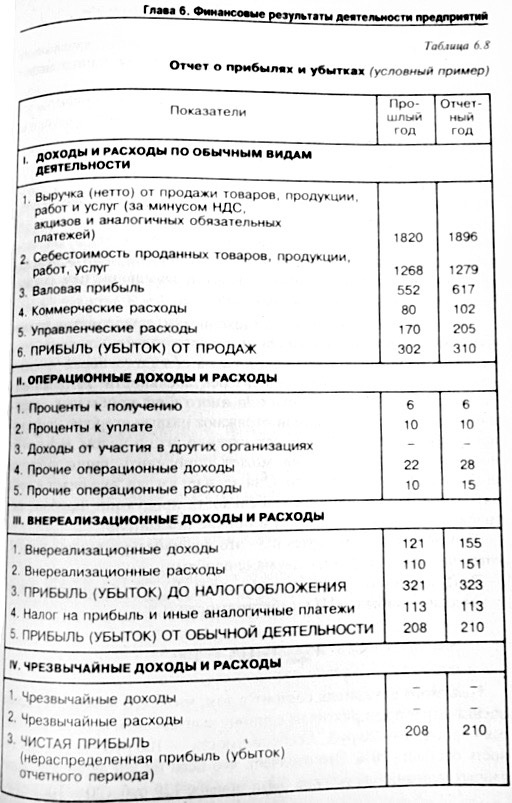

<!--
    ---
    title: Экономика
    toc:
      depth_from: 1
      depth_to: 5
      ordered: false
    export_on_save:
      html: true
    ---
-->

# Экономика

[TOC]

***
[date]: # (11.02.2019)

## Экономика предприятия

### Понятия и юридические основы деятельности промышленных предприятий

**Юридическое лицо** — это организация, которая имеет обособленное имущество и отвечает им по своим обязательствам, может от своего имени приобретать и осуществлять гражданские права и нести гражданские обязанности, быть истцом и ответчиком в суде. (51-ФЗ, ст. 48).

Юридическое лицо характеризуют следующие признаки:

1. Юридическое лицо имеет своё наименование, содержащее указание на организационно-правовую форму
2. Юридическое лицо должно быть зарегистрировано в едином государственном реестре юридических лиц (ЕГРЮЛ)
3. Юридическое лицо имеет гражданские права, соответствующие целям деятельности, предусмотренным в его учредительном документе, и нести связанные с этой деятельности обязанности
4. Юридическое лицо получает специальное разрешение — лицензию — на занятие определёнными видами деятельности, если оно требуется
5. Юридическое лицо ведёт самостоятельный бухгалтерский баланс
6. Юридическое лицо имеет юридический адрес
7. Юридическое лицо имеет печать и счёт в банке

#### Организационно-правовые формы

По целям деятельности организации можно разделить на две большие группы: *коммерческие* и *некоммерческие*.

**Коммерческие предприятия** — это юридические лица, преследующие извлечение прибыли в качестве основной цели деятельности и распределяющие полученную прибыль между своими участниками.

**Некоммерческие предприятия** — это юридические лица, не преследующие извлечение прибыли в качестве основной цели деятельности и не распределяющие полученную прибыль между своими участниками.

Юридические лица, учредители которых обладают правом участия в них, формируют их высший орган, называются **корпоративные юридические лица**.

Юридические лица, учредители которых не становятся их участниками и не приобретают в них прав членства, называются **унитарные юридические лица**.

```code
Юридические лица {
    некоммерческие {};
    коммерческие {
        корпоративные {
            производственный кооператив;
            хозяйственные товарищества {
                полные товарищества;
                товарищества на вере;
            };
            хозяйственные общества {
                ООО;
                АО {
                    ПАО;
                    АО;
                };
            };
        };
        унитарные {
            муниципальные унитарные предприятия;
            государственные унитарные предприятия;
            казённые предприятия;
        };
    };
};
```

##### Производственный кооператив (артель)

 Деятельность регламентируется ГК РФ (часть первая) от 30.11.1994 51-ФЗ; 41-ФЗ «О производственных кооперативах».

**Производственный кооператив** — это добровольное объединение граждан на основе членства для совместной производственной или иной хозяйственной деятельности, основанной на из личном трудовом и ином участии.

Члены кооператива образуют паевой фонд, который определяет минимальный размер имущества кооператива.

Учредительным документом кооператива является устав, утверждённый общим собранием его членов. Устав должен содержать следующие сведения:

- фирменное наименование кооператива и слова «производственный кооператив» или «артель»;
- место нахождения кооператива;
- условия о размере паевых взносов членов кооператива;
- о составе и порядке внесения паевых взносов членами кооператива и об их ответственности за нарушение обязательств по внесению указанных взносов;
- о характере и порядке трудового и иного участия членов кооператива в его деятельности и об их ответственности за нарушение обязательств по личному трудовому и иному участию;
- о порядке распределения прибыли и убытков кооператива;
- о размере и об условиях субсидиарной ответственности кооператива по его долгам;
- о составе и компетенции органов управления кооперативом и порядке принятия ими решений, в том числе по вопросам, решения по которым принимаются единогласно или квалифицированным большинством голосов;
- о порядке выплаты стоимости пая или выдачи соответствующего ему имущества лицу, прекратившему членство в кооперативе;
- о порядке вступления в кооператив новых членов;
- о порядке выхода из кооператива;
- об основаниях и о порядке исключения из членов кооператива;
- о порядке образования имущества кооператива;
- о перечне филиалов и представительств кооператива;
- о порядке реорганизации и ликвидации кооператива.

Число членов кооператива — не менее 5 человек. Прибыль кооператива распределяется между его членами в соответствии с их трудовым участием, если иной порядок не предусмотрен законом и уставом кооператива. В таком же порядке распределяется имущество, оставшееся после ликвидации кооператива и удовлетворения требований его кредиторов. Высшим органом управления кооператива является общее собрание его членов.

К исключительной компетенции общего собрания относится:

- изменение устава кооператива
- образование наблюдательного совета и прекращение полномочий его членов, а также образование и прекращение полномочий исполнительных органов кооператива, если это право по уставу не принадлежит наблюдательному совету
- приём и исключение членов кооператива
- утверждение годовых отчётов и бухгалтерских балансов кооператива, распределение его прибыли и убытков
- решение о реорганизации и ликвидации кооператива

Член кооператива имеет один голос при принятии решений общим собранием. Он вправе по своему усмотрению выйти из кооператива. В этом случае ему должна быть выплачена стоимость пая или выделено имущество, соответствующее его паю, а также осуществлены другие выплаты, предусмотренные уставом кооператива.

Производственный кооператив может быть добровольно реорганизован в хозяйственное товарищество или общество по единогласному решению его членов или ликвидирован.

##### Хозяйственные товарищества и общества

Деятельность регламентируется ГК РФ (часть первая) от 30.11.1994 51-ФЗ.

**Хозяйственные товарищества и общества** — корпоративные коммерческие организации с разделённым на доли (вклады) учредителей (участников) уставным (складочным) капиталом. Имущество, созданное за счёт вкладов учредителей (участников), а также произведённое и приобретённое хозяйственным товариществом или обществом в процессе деятельности, принадлежит на праве собственности хозяйственному товариществу или обществу.

Хозяйственные товарищества могут создаваться в организационно-правовой форме полного товарищества или товарищества на вере (коммандитного товарищества).

Хозяйственные общества могут создаваться в организационно-правовой форме акционерного общества или общества с ограниченной ответственностью.

###### Полное товарищество

**Полное товарищество** — товарищество, участники которого (полные товарищи) в соответствии с заключённым между ними договором занимаются предпринимательской деятельности от имени товарищества и несут ответственность по его обязательствам принадлежащим им имуществом.

Документ, на основе которого осуществляется деятельность полного товарищества — **учредительный договор**, который подписывается всеми участниками товарищества. Он должен, помимо сведений, обязательных для всех юридических лиц, содержать:

- условия о размере и составе складочного капитала товарищества;
- о размере и порядке изменения долей каждого из участников в складочном капитале;
- о размере, составе, сроках и порядке внесения ими вкладов;
- об ответственности участников за нарушение обязанностей по внесению вкладов.

Участниками полных товариществ могут быть индивидуальные предприниматели и коммерческие организации.

Лицо может быть участником только одного полного товарищества. Фирменное наименование полного товарищества должно содержать имена (наименование) одного, нескольких или всех участников и слова «полное товарищество».

Управление деятельностью полного товарищества осуществляется по общему согласию всех участников. Учредительным договором товарищества могут быть предусмотрены случаи, когда решение принимается большинством голосов участников. Каждый участник полного товарищества имеет один голос, если учредительным договором не предусмотрен иной порядок определения количества голосов его участников. Каждый участник товарищества независимо от того, уполномочен ли он вести дела товарищества, вправе получать всю информацию о деятельности товарищества и знакомиться со всей документацией по ведению дел.

Прибыль и убытки полного товарищества распределяются между его участниками пропорционально их долям в складочном капитале, если иное не предусмотрено учредительным договором или иным соглашением участников.

Участники полного товарищества солидарно несут субсидиарную ответственность своим имуществом по обязательствам товарищества.

Участник полного товарищества вправе выйти из него, заявив об отказе от участия в товариществе. Отказ от участия в полном товариществе, учреждённом без указания срока, должен быть заявлен участником не менее чем за шесть месяцев до фактического выхода из товарищества. Участнику, выбывшему из полного товарищества, выплачивается стоимость части имущества товарищества, соответствующей доле этого участника в складочном капитале, если иное не предусмотрено учредительным договором.

Участник полного товарищества вправе с согласия остальных его участников передать свою долю в складочном капитале или её часть другому участнику товарищества либо третьему лицу.

Полное товарищество ликвидируется в случае, когда в товариществе остаётся единственный участник. Такой участник вправе в течение шести месяцев с момента, когда он стал единственным участником товарищества, преобразовать такое товарищество в хозяйственное общество.

###### Товарищество на вере

**Товарищество на вере** (коммандитное товарищество) — товарищество, в котором наряду с участниками, осуществляющими от имени товарищества предпринимательскую деятельность и отвечающими по обязательствам товарищества своим имуществом (полными товарищами), имеется один или несколько участников-вкладчиков (коммандитистов), которые несут риск убытков, связанных с деятельностью товарищества, в пределах сумм внесённых ими вкладов и не принимают участия в осуществлении товариществом предпринимательской деятельности.

К товариществу на вере применяются правила ГК РФ о полном товариществе, не противоречащие правилам о товариществе на вере.

Учредительный договор должен содержать:

- условия о размере и составе складочного капитала товарищества;
- о размере и порядке изменения долей каждого из полных товарищей в складочном капитале;
- о размере, составе, сроках и порядке внесения ими вкладов, их ответственности за нарушение обязанностей по внесению вкладов;
- о совокупном размере вкладов, вносимых вкладчиками.

Полными товарищами в товариществах на вере могут быть индивидуальные предприниматели и коммерческие организации. Вкладчиками в товариществах на вере могут быть граждане и юридические лица, а также публично-правовые образования.

Лицо может быть полным товарищем только в одном товариществе на вере. Участник полного товарищества не может быть полным товарищем в товариществе на вере. Полный товарищ в товариществе на вере не может быть участником полного товарищества. Число коммандитистов в товариществе на вере не должно превышать двадцать. В противном случае оно подлежит преобразованию в хозяйственное общество в течение года, а по истечении этого срока — ликвидации в судебном порядке, если число его коммандитистов не уменьшится до указанного предела.

Управление деятельностью товарищества на вере осуществляется полными товарищами. Вкладчики не вправе участвовать в управлении и ведении дел товарищества на вере, выступать от его имени иначе, как по доверенности. Они не вправе оспаривать действия полных товарищей по управлению и ведению дел товарищества.

Вкладчик товарищества на вере обязан внести вклад в складочный капитал. Внесение вклада удостоверяется свидетельством об участии, выдаваемым вкладчику товариществом. Вкладчик товарищества на вере имеет право:

- получать часть прибыли товарищества, причитающуюся на его долю в складочном капитале, в порядке, предусмотренном учредительным договором;
- знакомиться с годовыми отчётами и балансами товарищества;
- по окончании финансового года выйти из товарищества и получить свой вклад в порядке, предусмотренном учредительным договором;
- передать свою долю в складочном капитале или её часть другому вкладчику или третьему лицу. Вкладчики пользуются преимущественным перед третьими лицами правом покупки доли (её части) применительно к условиям и порядку, предусмотренным пунктом 2 статьи 93 настоящего Кодекса. Передача всей доли иному лицу вкладчиком прекращает его участие в товариществе.

Товарищество на вере ликвидируется при выбытии всех участвовавших в нем вкладчиков. Однако полные товарищи вправе вместо ликвидации преобразовать товарищество на вере в полное товарищество. Товарищество на вере сохраняется, если в нем остаются по крайней мере один полный товарищ и один вкладчик. При ликвидации товарищества на вере, в том числе в случае банкротства, вкладчики имеют преимущественное перед полными товарищами право на получение вкладов из имущества товарищества, оставшегося после удовлетворения требований его кредиторов.

###### Общество с ограниченной ответственностью (ООО)

Деятельность регламентируется ГК РФ (часть первая) от 30.11.1994 51-ФЗ; 14-ФЗ от 08.02.1998 «Об обществах с ограниченной ответственностью».

**Общество с ограниченной ответственностью** — хозяйственное общество, уставный капитал которого разделён на доли; участники общества с ограниченной ответственностью не отвечают по его обязательствам и несут риск убытков, связанных с деятельностью общества, в пределах стоимости принадлежащих им долей.

Учредительным документом общества с ограниченной ответственностью является его **устав**. Устав общества с ограниченной ответственностью должен содержать сведения о:

- фирменном наименовании общества и месте его нахождения,
- размере его уставного капитала,
- составе и компетенции его органов,
- порядке принятия ими решений
- иные сведения, предусмотренные законом об обществах с ограниченной ответственностью.

Участниками общества могут быть граждане и юридические лица. Общество может быть учреждено одним лицом, которое становится его единственным участником. Общество может впоследствии стать обществом с одним участником. Число участников общества не должно быть более пятидесяти. В случае, если число участников общества превысит установленный настоящим пунктом предел, общество в течение года должно преобразоваться в открытое акционерное общество или в производственный кооператив.

Учредители общества с ограниченной ответственностью заключают между собой договор об учреждении общества с ограниченной ответственностью, определяющий порядок осуществления ими совместной деятельности по учреждению общества, размер уставного капитала общества, размер их долей в уставном капитале общества и иные установленные законом об обществах с ограниченной ответственностью условия. Договор об учреждении общества с ограниченной ответственностью заключается в письменной форме.

Высшим органом общества является общее собрание участников общества. Общее собрание участников общества может быть очередным или внеочередным. Все участники общества имеют право присутствовать на общем собрании участников общества, принимать участие в обсуждении вопросов повестки дня и голосовать при принятии решений. К компетенции общего собрания участников общества относятся:

- определение основных направлений деятельности общества, а также принятие решения об участии в ассоциациях и других объединениях коммерческих организаций;
- утверждение устава общества, внесение в него изменений или утверждение устава общества в новой редакции, принятие решения о том, что общество в дальнейшем действует на основании типового устава, либо о том, что общество в дальнейшем не будет действовать на основании типового устава, изменение размера уставного капитала общества, наименования общества, места нахождения общества;
- образование исполнительных органов общества и досрочное прекращение их полномочий, а также принятие решения о передаче полномочий единоличного исполнительного органа общества управляющему, утверждение такого управляющего и условий договора с ним, если уставом общества решение указанных вопросов не отнесено к компетенции совета директоров (наблюдательного совета) общества;
- избрание и досрочное прекращение полномочий ревизионной комиссии (ревизора) общества;
- утверждение годовых отчётов и годовых бухгалтерских балансов;
- принятие решения о распределении чистой прибыли общества между участниками общества;
- утверждение (принятие) документов, регулирующих внутреннюю деятельность общества (внутренних документов общества);
- принятие решения о размещении обществом облигаций и иных эмиссионных ценных бумаг;
- назначение аудиторской проверки, утверждение аудитора и определение размера оплаты его услуг;
- принятие решения о реорганизации или ликвидации общества;
- назначение ликвидационной комиссии и утверждение ликвидационных балансов;
- решение иных вопросов, предусмотренных настоящим Федеральным законом или уставом общества.

Уставом общества может быть предусмотрено образование совета директоров (наблюдательного совета) общества.

Общество вправе ежеквартально, раз в полгода или раз в год принимать решение о распределении своей чистой прибыли между участниками общества. Решение об определении части прибыли общества, распределяемой между участниками общества, принимается общим собранием участников общества. Часть прибыли общества, предназначенная для распределения между его участниками, распределяется пропорционально их долям в уставном капитале общества. Уставом общества может быть установлен иной порядок распределения прибыли между участниками общества.

Общество несёт ответственность по своим обязательствам всем принадлежащим ему имуществом. Общество не отвечает по обязательствам своих участников. В случае несостоятельности (банкротства) общества по вине его участников, на указанных участников или других лиц в случае недостаточности имущества общества может быть возложена субсидиарная ответственность по его обязательствам.

Общество ведёт список участников общества с указанием сведений о каждом участнике общества, размере его доли в уставном капитале общества и её оплате, а также о размере долей, принадлежащих обществу, датах их перехода к обществу или приобретения обществом.

Участники общества вправе продать или осуществить отчуждение иным образом своей доли или части доли в уставном капитале общества одному или нескольким участникам данного общества либо другому лицу, или выйти из общества путём отчуждения своей доли обществу, если такая возможность предусмотрена уставом общества, или потребовать приобретения обществом доли.

Общество может быть добровольно реорганизовано. Реорганизация общества может быть осуществлена в форме слияния, присоединения, разделения, выделения и преобразования. Общество может быть ликвидировано добровольно или по решению суда.

###### Акционерное общество (АО, ПАО)

Деятельность регламентируется ГК РФ (часть первая) от 30.11.1994 51-ФЗ; 208-ФЗ от 26.12.1995 «Об акционерных обществах».

**Акционерное общество** — хозяйственное общество, уставный капитал которого разделён на определённое число акций; участники акционерного общества (акционеры) не отвечают по его обязательствам и несут риск убытков, связанных с деятельностью общества, в пределах стоимости принадлежащих им акций.

Общество может быть *публичным* или *непубличным*, что отражается в его уставе и фирменном наименовании.

Публичное общество вправе проводить размещение акций и эмиссионных ценных бумаг, конвертируемых в его акции, посредством открытой подписки. Акции непубличного общества и эмиссионные ценные бумаги, конвертируемые в его акции, не могут размещаться посредством открытой подписки или иным образом предлагаться для приобретения неограниченному кругу лиц.

Учредительным документом акционерного общества является его **устав**. Устав общества с ограниченной ответственностью должен содержать следующие сведения:

- полное и сокращённое фирменные наименования общества;
место нахождения общества;
- количество, номинальную стоимость, категории (обыкновенные, привилегированные) акций и типы привилегированных акций, размещаемых обществом;
- права акционеров — владельцев акций каждой категории (типа);
- размер уставного капитала общества;
- структуру и компетенцию органов управления общества и порядок принятия ими решений;
- порядок подготовки и проведения общего собрания акционеров, в том числе перечень вопросов, решение по которым принимается органами управления общества квалифицированным большинством голосов или единогласно;
- иные положения, предусмотренные настоящим Федеральным законом и иными федеральными законами.

Уставом непубличного общества могут быть установлены ограничения количества акций, принадлежащих одному акционеру, и их суммарной номинальной стоимости, а также максимального числа голосов, предоставляемых одному акционеру.

Устав публичного общества также должен содержать:

- указание на публичный статус общества;
- указание на наличие в структуре органов управления общества совета директоров (наблюдательного совета), его компетенцию и порядок принятия им решений.

Высшим органом управления общества является общее собрание акционеров. Общество обязано ежегодно проводить годовое общее собрание акционеров. К компетенции общего собрания акционеров относятся:

- внесение изменений и дополнений в устав общества или утверждение устава общества в новой редакции;
- реорганизация общества;
- ликвидация общества, назначение ликвидационной комиссии и утверждение промежуточного и окончательного ликвидационных балансов;
- определение количественного состава совета директоров (наблюдательного совета) общества, избрание его членов и досрочное прекращение их полномочий;
- определение количества, номинальной стоимости, категории (типа) объявленных акций и прав, предоставляемых этими акциями;
- увеличение уставного капитала общества путём увеличения номинальной стоимости акций или путём размещения дополнительных акций, если уставом общества в соответствии с настоящим Федеральным законом увеличение уставного капитала общества путём размещения дополнительных акций не отнесено к компетенции совета директоров (наблюдательного совета) общества;
- уменьшение уставного капитала общества путём уменьшения номинальной стоимости акций, путём приобретения обществом части акций в целях сокращения их общего количества, а также путём погашения приобретённых или выкупленных обществом акций;
- образование исполнительного органа общества, досрочное прекращение его полномочий;
- избрание членов ревизионной комиссии общества и досрочное прекращение их полномочий;
- утверждение аудитора общества;
- утверждение годового отчёта, годовой бухгалтерской (финансовой) отчётности общества;
- распределение прибыли (в том числе выплата дивидендов) и убытков общества по результатам отчётного года;
- определение порядка ведения общего собрания акционеров;
- избрание членов счётной комиссии и досрочное прекращение их полномочий;
- дробление и консолидация акций;
- принятие решений о согласии на совершение или о последующем одобрении сделок;
- принятие решений о согласии на совершение или о последующем одобрении крупных сделок;
- приобретение обществом размещённых акций;
- принятие решения об участии в финансово-промышленных группах, ассоциациях и иных объединениях коммерческих организаций;
- утверждение внутренних документов, регулирующих деятельность органов общества.

Вопросы, отнесённые к компетенции общего собрания акционеров, не могут быть переданы на решение исполнительному органу общества или совету директоров (наблюдательному совету) общества, если иное не предусмотрено Федеральным законом.

Совет директоров (наблюдательный совет) общества осуществляет общее руководство деятельностью общества, за исключением решения вопросов, отнесённых к компетенции общего собрания акционеров. В обществе с числом акционеров — владельцев голосующих акций менее пятидесяти устав общества может предусматривать, что функции совета директоров общества (наблюдательного совета) осуществляет общее собрание акционеров.

Общество обязано выплатить объявленные по акциям каждой категории дивиденды. Дивиденды выплачиваются деньгами, а в случаях, предусмотренных уставом общества, — иным имуществом. Источником выплаты дивидендов является прибыль общества после налогообложения. Чистая прибыль общества определяется по данным бухгалтерской (финансовой) отчётности общества.

Общество несёт ответственность по своим обязательствам всем принадлежащим ему имуществом. Общество не отвечает по обязательствам своих акционеров. Если несостоятельность общества вызвана действиями (бездействием) его акционеров или других лиц, которые имеют право давать обязательные для общества указания либо иным образом имеют возможность определять его действия, то на указанных акционеров или других лиц в случае недостаточности имущества общества может быть возложена субсидиарная ответственность по его обязательствам.

Общество может быть добровольно реорганизовано, преобразовано  ООО или в производственный кооператив, либо ликвидировано добровольно или по решению суда. Ликвидация общества влечёт за собой его прекращение без перехода прав и обязанностей в порядке правопреемства к другим лицам.

##### Унитарные предприятия

Деятельность регламентируется ГК РФ (часть первая) от 30.11.1994 51-ФЗ; 161-ФЗ от 14.11.2002 «О государственных и муниципальных унитарных предприятиях».

**Унитарное предприятие** — коммерческая организация, не наделённая правом собственности на закреплённое за ней собственником имущество. Имущество унитарного предприятия является неделимым и не может быть распределено по вкладам (долям, паям), в том числе между работниками предприятия.

В организационно-правовой форме унитарных предприятий действуют *государственные* и *муниципальные* предприятия. Имущество государственного или муниципального унитарного предприятия находится в государственной или муниципальной собственности и принадлежит такому предприятию на праве хозяйственного ведения или оперативного управления.

В случаях и в порядке, которые предусмотрены законом о государственных и муниципальных унитарных предприятиях, на базе государственного или муниципального имущества может быть создано *унитарное казённое предприятие*. Казённое предприятие вправе распоряжаться принадлежащим ему имуществом, в том числе с согласия собственника такого имущества, только в пределах, не лишающих его возможности осуществлять деятельность, предмет и цели которой определены уставом такого предприятия. Деятельность казённого предприятия осуществляется в соответствии со сметой доходов и расходов, утверждаемой собственником имущества казённого предприятия.

Учредительным документом унитарного предприятия является его **устав**, утверждаемый уполномоченным государственным органом или органом местного самоуправления. Устав унитарного предприятия должен содержать сведения о его фирменном наименовании и месте его нахождения, предмете и целях его деятельности. Устав унитарного предприятия, не являющегося казённым, должен содержать также сведения о размере уставного фонда унитарного предприятия.

Единоличным исполнительным органом унитарного предприятия является руководитель предприятия, который назначается уполномоченным собственником органом и ему подотчётен. Руководитель унитарного предприятия организует выполнение решений собственника имущества унитарного предприятия.

Государственное или муниципальное предприятие ежегодно перечисляет в соответствующий бюджет часть прибыли, остающейся в его распоряжении после уплаты налогов и иных обязательных платежей, в порядке, в размерах и в сроки, которые определяются Правительством Российской Федерации, уполномоченными органами государственной власти субъектов Российской Федерации или органами местного самоуправления. Порядок распределения доходов казённого предприятия определяется Правительством Российской Федерации, уполномоченными органами государственной власти субъектов Российской Федерации или органами местного самоуправления.

Унитарное предприятие отвечает по своим обязательствам всем принадлежащим ему имуществом.
Унитарное предприятие не несёт ответственность по обязательствам собственника его имущества.
Собственник имущества унитарного предприятия, за исключением собственника имущества казённого предприятия, не отвечает по обязательствам своего унитарного предприятия. Собственник имущества казённого предприятия несёт субсидиарную ответственность по обязательствам такого предприятия при недостаточности его имущества. Руководитель унитарного предприятия несёт ответственность за убытки, причинённые унитарному предприятию его виновными действиями (бездействием), в том числе в случае утраты имущества унитарного предприятия.

Унитарное предприятие может быть реорганизовано по решению собственника его имущества, ликвидировано по решению собственника его имущества или по решению суда.

***
[date]: # (18.02.2019)

### Основные фонды промышленного предприятия

#### Понятие основных фондов и их структура

Средства производства, выраженные в денежной форме, называются **производственные фонды предприятия**, основные и оборотные. При этом в вещественном виде *основные производственные фонды* выступают как средство труда, а *оборотные производственные фонды* — как предмет труда

**Основные производственные фонды** (ОПФ) — это совокупность средств труда, многократно участвующих в производственном процессе и переносящих свою стоимость на себестоимость готовой продукции с целью реновации (обновления).

Для ведения бухгалтерского учёта применяются **положения по бухгалтерскому учёту** (ПБУ). Согласно ПБУ 6/01 «Учёт основных средств», активы предприятия будут учитываться в качестве основных средств, если выполняют следующие условия:

- объект предназначен для использования в производстве продукции, при выполнении работ или оказании услуг, для управленческих нужд организации, либо для предоставлении организации за плату во временное владение и пользование
- объект предназначен для использования в течении длительного времени, то есть, срока продолжительностью свыше 12 месяцев или обычного операционного цикла, если он превышает 12 месяцев
- организация не предполагает последующую перепродажу данного объекта
- объект способен приносить организации экономические выгоды (доход) в будущем

Выделяют следующие группы и подгруппы основных производственных фондов на машиностроительных предприятиях:

- Здания: цеха, складские помещения, производственные лаборатории и др.
- Сооружения: эстакады, тоннели, дороги и др.
- Передаточные устройства: электросети, теплосети, трубы и др.
- Машины и оборудование: силовые машины, рабочие машины, измерительные и регулирующие приборы и устройства и др.
- Транспортные средства: автомобили, кары, тележки и др.
- Инструмент и технологическая оснастка долговременного пользования
- Производственный инвентарь и принадлежности: рабочие столы, верстаки, тара, стеллажи и др.
- Хозяйственный инвентарь: шкафы, вешалки, сейфы и др.

В структуре основных фондов, в зависимости от конкретной их роли, принято выделять активную и пассивную часть. К *активной* части основных фондов относятся те, которые непосредственно участвуют в процессе производства — оборудование и инструменты. К *пассивной* части относятся основные фонды, которые создают условия для нормального течения производственных процессов: здания, сооружения и т. д.

#### Виды стоимостной оценки основных производственных фондов предприятия

Существуют следующие виды стоимостной оценки основных фондов:

1. *Оценка по первоначальной стоимости*, то есть по фактическим затратам, произведённым в момент создания или приобретения, включая доставку, монтаж, в ценах того года, в котором они изготовлены или приобретены. Первоначальная стоимость основных средств может меняться в случаях достройки, дооборудования, реконструкции, модернизации, технического перевооружения, частичной ликвидации соответствующих объектов и по иным аналогичным основаниям (п. 2, ст. 257 НК РФ).
2. *Оценка по восстановительной стоимости*, то есть по стоимости воспроизводства основных фондов на момент переоценки. Эта стоимость показывает, во сколько обошлось бы создание или приобретение на данный момент ранее созданных или приобретённых основных фондов.
3. *Остаточная стоимость основных фондов*, которая рассчитывается как первоначальная (или восстановительная) стоимость за вычетом начисленного износа (амортизационные отчисления):
   $$ С_{ост} = С_{пер \, (вос)} - A_м $$
4. *Среднегодовая стоимость основных фондов*, которая рассчитывается при движении ОПФ (убытие, покупка, создание) по следующей формуле:
   $$ С_{ср.год.} = С_{н.г.} + С_{вв.} \frac{n_1}{12} - С_{выб.} \frac{n_2}{12} $$
   где $С_{н.г.}$ — стоимость на начало года,  
   $С_{вв.}$ — стоимость введённых фондов,  
   $С_{выб.}$ — стоимость выбывших фондов,  
   $n_1$ и $n_2$ — количество _полных_ месяцев до конца года введённых и выбывших фондов соответственно.
5. *Ликвидационная стоимость* — стоимость реализации изношенных и снятых с производства основных фондов (стоимость металлолома).

#### Износ основных производственных фондов

Существует два вида износа — *физический* и *моральный*.

**Физический износ** — утрата основными фондами своих технических параметров. Различают физический износ *эксплуатационный* и *естественный*.

**Моральный износ**, сущность которого состоит в том, что средства труда обесцениваются, утрачивают стоимость до окончания срока своей физической службы. Моральный износ бывает двух видов:  
*Первого вида* — обесценивание машин той же конструкции, что выпускались и раньше вследствие удешевления их производства в современных условия. Рассчитывается по следующей формуле:
$$ МИ_1 = \frac{С_{пер} - С_{вос}}{С_{пер}} $$
*Второго вида* — отражает снижение эффективности использования существующего оборудования вследствие появления новых, более прогрессивных, производительных и экономичных конструкций машин. Рассчитывается по формуле:
$$ МИ_2 = \left[1 - \left(\frac{C_{пер.н.}}{Q_н \cdot T_н} - \frac{С_{пер.б.}}{Q_б \cdot T_б}\right)\right] $$
где $C_{пер.н.}$, $С_{пер.б.}$ — стоимость морально устаревшей новой и базовой машины,  
$Q_н$, $Q_б$ — производительность морально устаревшей новой и базовой,  
$T_н$, $T_б$ — срок службы морально устаревшей новой и базовой машины.

#### Амортизация основных производственных фондов

**Амортизация** — это постепенное перенесение стоимости основных производственных фондов на себестоимость продукции в целях накопления денежных средств для их восстановления и реновации. Денежным выражением размера амортизации являются амортизационные отчисления, которые соответствуют степени износа основных фондов.

Величина амортизационных отчислений выражается в норме амортизации, представляющей собой годовой процент перенесения стоимости основных производственных фондов на себестоимость продукции:
$$ Н_А = \frac{1}{T} \cdot 100\% $$
где $T$ — срок полезного использования амортизируемого имущества.

**Срок полезного использования** — период, в течении которого объект основных средств служит для выполнения целей деятельности предприятия.

Для тех видов основных средств, которые не указаны в амортизационных группах, срок полезного использования устанавливается бухгалтером самостоятельно, основываясь на следующих данных:

- ожидаемый срок использования этого объекта в соответствии с производительностью или мощностью
- ожидаемый физический износ, зависящий от режима эксплуатации, естественных условий и влияния агрессивной среды, системы проведения ремонта
- нормативно-правовых и других ограничений использования этого объекта.

Постановление правительства РФ от 01.01.2002 №1 в редакции от 07.07.2016 «О классификации основных средств, включаемых в амортизационные группы»: Срок полезного использования определяется бухгалтером самостоятельно на дату ввода в эксплуатацию данного объекта амортизируемого имущества с учётом классификации основных средств.

***
[date]: # (21.02.2019)

##### Методы начисления амортизации

Начисление амортизации на объекты основных средств производится одним из методов, указанных в ПБУ 6/01:

- Линейный метод
- Метод уменьшаемого остатка (нелинейный метод)
- Метод списания стоимости по сумме чисел лет срока полезного использования
- Метод списания стоимости пропорционально объёму продукции (работ)

В налоговом учёте применяют два метода начисления амортизации — линейный и метод уменьшаемого остатка (нелинейный) (п. 1, ст. 259 НК РФ).

Не подлежат амортизации объекты основных средств, потребительские свойства которых с течением времени не меняются (земельные участки и объекты природопользования; объекты, отнесённые к музейным ценностям).

В течении отчётного года амортизационные отчисления по объектам основных средств начисляются ежемесячно, независимо от применяемого способа, в размере $\frac{1}{12}$ от годовой суммы.

Начисление амортизационных отчислений по объекту основных средств начинается с первого числа месяца, следующего за месяцем принятия этого объекта к бухгалтерскому учёту и производится до полного погашения стоимости этого объекта либо списания этого объекта с бухгалтерского учёта.

Начисление амортизации может быть приостановлено в следующих случаях:

- за период консервации основного средства продолжительностью более 3 месяцев
- за период восстановления (реконструкции, ремонта или модернизации) основного средства продолжительностью более 12 месяцев

Начисление амортизационных отчислений по объекту основных средств прекращается с первого числа месяца, следующего за месяцем полного погашения стоимости этого объекта либо списания этого объекта с бухгалтерского учёта.

###### Линейный метод начисления амортизации

При использовании линейного метода годовая сумма амортизационных начислений определяется исходя из первоначальной (восстановительной) стоимости объекта основных средств и нормы амортизации, исчисленной из срока полезного использования данного объекта.

Суть этого метода заключается в равномерном по годам начислении амортизации в течении всего срока полезного использования.

$$ S_{ам \, год} = С_{пер \, (вос)} \cdot Н_А $$
где $С_{пер \,(вос)}$ — первоначальная (восстановительная) стоимость ОПФ,  
$Н_А$ — норма амортизации.

*Пример:* Приобретён объект основных средств стоимостью 50000 руб. Срок полезного использования объекта составляет 5 лет.
$$ Т = 5 \cdot С_{пер} = 50000 \, руб $$
$$ Н_А = \frac{1}{5} \cdot 100 \% = 20 \% $$
$$ S_{ам \, год} = 50 \cdot 20 \% = 10000 \, руб $$
$$ С_{ост \, 5} = 0 \, руб $$

###### Метод уменьшаемого остатка (нелинейный)

При использовании нелинейного метода начисления амортизации годовая сумма амортизационных отчислений определяется исходя из остаточной стоимости объекта основных средств на начало отчётного года нормы амортизации, исчисленной из срока полезного использования объекта, и коэффициента ускорения не выше 3.

$$ S_{ам \, год} = К_{уск} \frac{Н_А}{100 \%} \cdot С_{ост \, i} $$
где $С_{ост \, i} $ — остаточная стоимость объекта основных средств в этом году

*Пример:* Коэффициент ускорения — $К_{уск} = 2$.
$$ S_{ам \, 1} = 2 \cdot 20 \% \cdot 50000 = 20000 \, руб $$
$$ S_{ам \, 2} = 2 \cdot 20 \% \cdot (50000 - 20000) = 12000 \, руб $$
$$ S_{ам \, 3} = 2 \cdot 20 \% \cdot (30000 - 12000) = 7200 \, руб $$
$$ S_{ам \, 4} = 2 \cdot 20 \% \cdot (18000 - 7200) = 4300 \, руб $$
$$ С_{ост \, 4} = 6500 \, руб $$
Для последнего года:
$$ S_{ам \, 5} = 6500 \, руб $$
$$ С_{ост \, 5} = 6500 - 6500 = 0 \, руб $$

###### Метод списания стоимости по сумме чисел лет срока полезного использования

Расчёт амортизационных отчислений данным методом производится исходя из первоначальной (восстановительной) стоимости основного средства и соотношения числа лет, остающихся до конца срока полезного использования объекта, к сумме чисел лет срока полезного использования объекта.

$$ S_{ам \, год \, i} = С_{пер \, (вос)} \frac{Т_{ост}}{Т \frac{Т+1}{2}} $$
где $Т_{ост}$ — количество лет, оставшихся до окончания срока полезного использования,  
$Т$ — сумма чисел лет срока полезного использования: $5 + 4 + 3 + 2 + 1 = 15 \, лет$

| $i$ | $S_{ам \, год \, i}, \, руб$  | $C_{ост \, на \, к.г.}, \, руб $|
| --- | --- | --- |
| 1 | $50 \cdot \frac{5}{15} = 16666,67$ | $33333,34$ |
| 2 | $50 \cdot \frac{4}{15} = 13333,34$ | $20000$ |
| 3 | $50 \cdot \frac{3}{15} = 10000$ | $10000$ |
| 4 | $50 \cdot \frac{2}{15} = 6666,67$  | $3333,34$  |
| 5 | $50 \cdot \frac{1}{15} = 3333,34$  | $0$ |

###### Метод списания стоимости пропорционально объёму продукции или работ

Расчёт ведётся исходя из натурального показателя объёма продукции (работ) в планово-отчётном периоде и предполагаемого объёма продукции (работ)за весь срок полезного использования объекта амортизации.

$$ S_{ам \, год \, i} = С_{пер \, (вос)} \frac{Q_{фi}}{Q_{пi}} $$
где $Q_{фi}$ — фактический объём продукции в этом году,  
$Q_{пi}$ — объём продукции за весь срок полезного использования объекта.

*Пример:* Первоначальная стоимость грузового автомобиля — 2400000 руб. Предполагаемый пробег за весь срок полезного использования составляет 600000 км. В 2016 г. фактический пробег автомобиля в январе составил 1600 км, в феврале — 900 км. Необходимо рассчитать амортизационные отчисления.
$$ S_{ам \, янв16} = 2400 \cdot \frac{1,6}{600} = 6400 \, руб $$
$$ S_{ам \, фев16} = 2400 \cdot \frac{0,9}{600} = 3600 \, руб $$

***
[date]: # (25.02.19)

#### Виды фондов времени работы оборудования

*Календарный* фонд времени характеризуется максимально возможным временем работы оборудования и рассчитывается как $365 (366) \cdot 24 = 8760 ч$.

*Режимный* (номинальный) фонд времени каждой единицы оборудования меньше календарного фонда времени на праздничные и выходные дни, а также на внесменное время.

*Действительный* (располагаемый, эффективный) фонд рабочего времени оборудования равен режимному фонду времени за вычетом времени на планово-предупредительный ремонт, на модернизацию оборудования и на пребывание оборудования в резерве.

*Фактический* фонд времени меньше действительного на величину простоев оборудования, не предусмотренных технологическим процессом производства.

#### Показатели эффективности использования основных производственных фондов

Основные показатели эффективности использования ОПФ можно объединить в две группы:

- *Обобщающие показатели* отражают конечный результат использования основных фондов
    - **Фондоотдача** показывает, сколько выручки приходится на один рубль стоимости ОПФ:
      $$ Ф_о = \frac{В}{С_{cр. \, год}} $$
      где $В$ — выручка,  
      $С_{cр. \, год}$ — среднегодовая стоимость ОПФ
    - **Фондоёмкость** — это величина обратная фондоотдаче, показывает долю стоимости основных фондов, приходящуюся на каждый рубль выпускаемой продукции, то есть сколько средств необходимо вложить в производственные фонды чтобы получить необходимый объём выпуска продукции.
      $$ Ф_ё = \frac{1}{Ф_о} = \frac{С_{cр. \, год}}{В} $$
    - **Фондовооружённость** труда показывает, какой величиной стоимости основных средств располагает в посредстве производства один работник. Рассчитывается по формуле:
      $$ Ф_в = \frac{С_{cр. \, год}}{С_{cр. \, год \, ппп}} $$
      где $С_{cр. \, год \, ппп}$ — среднегодовая численность промшыленно-производственного персонала предприятия
    - **Фондорентабельность** — характеризует величину прибыли, получаемую с рубля основных фондов.
      $$ Ф_р = \frac{Пр}{С_{cр. \, год}} $$
      где $Пр$ — прибыль
- *Частные показатели* отражают уровни использования ОПФ по времени и по мощности
    - **Коэффициент экстенсивного использования оборудования** определяется как отношение фактического количества часов работы оборудования к количеству часов работы по норме. Показывает уровень использования оборудования по времени.
      $$ К_{экс} = \frac{t_{факт}}{t_{действ}} $$
      *Пример:* Продолжительность смены 8 часов. Время ремонтно-профилактических работ 0,5 часа. Фактическое время работы станка 5 часов.
      $$ К_{экс} = \frac{8}{8 - 0,5} = 67 \% $$
    - **Коэффициент сменности работы оборудования** характеризует количество смен, отработанных каждой единицей оборудования за определённый промежуток времени.
      $$ К_{см} = \frac{f_1 + f_2 + f_3}{n} $$
      где $f_1, f_2, f_3$ — число фактически отработанных машино-смен в первую, вторую и третью смену соответственно;  
      $n$ — общее количество наличных станков.  
      *Пример:* В цехе установлено 55 станков. В первую смену работало 47 станков. Во вторую смену — 42 станка. Определить коэффициент сменности работы оборудования.
      $$ К_{см} = \frac{47 + 42}{55} = 1,62 $$
    - **Коэффициент интенсивного использования оборудования** определяется как отношение фактической производительности оборудования к нормативной. Показывает уровень использования оборудования по производительности.
      $$ К_{инт} = \frac{Q_{ср}}{Q_{пл}} $$
      *Пример:* Фактическая производительность в смену — 130 единиц изделий. Нормативная (плановая) производительность за тот же период — 190 единиц изделий.
      $$ К_{инт} = \frac{130}{190} = 68 \% $$

Важное значение имеет анализ технического состояния основных средств.

- **Коэффициент ввода** показывает, какая доля из совокупности всех объектов основных средств, числящихся на предприятии на конец года, была введена в рассматриваемый период.
  $$ К_{вв} = \frac{С_{вв}}{С_{к.г.}} $$
  где $С_{вв}$ — стоимость вновь введённых средств за анализируемый период,  
  $С_{к.г.}$ — стоимость основных средств на конец анализируемого периода
- **Коэффициент выбытия** показывает, какая часть основных средств, числящихся на предприятии на начало отчётного периода, выбыла из учёта по причине износа.
  $$ К_{выб} = \frac{С_{выб}}{С{н.г.}} $$
  где $С_{выб}$ — стоимость выбывших средств за анализируемый период,  
  $С_{н.г.}$ — стоимость основных средств на начало анализируемого периода
- **Коэффициент прироста** показывает, насколько предприятие увеличило количество основных производственных фондов за счёт обновления.
  $$ К_{пр} = \frac{С_{вв} - С_{выб}}{С_{к.г.}} $$
- **Коэффициент износа** позволяет установить, какую часть составляют изношенные объекты по отношению к общему объёму основных средств.
  $$ К_{изн} = \frac{С_{изн}}{С_{пер}} $$
  где $С_{изн}$ — стоимость износа всех основных средств или их отдельных видов,  
  $С_{пер}$ — первоначальная стоимость этих средств
- **Коэффициент годности**
  $$ К_г = \frac{С_{пер} - С_{изн}}{С_{пер}} = 1 - К_{изн} $$
  Нормативное значение для коэффициента годности $\geq 0,5$

#### Производственная мощность

**Производственная мощность** — максимально возможный объём выпуска продукции за единицу времени (год) при заданных номенклатуре и ассортименте с учётом наилучшего использования всех ресурсов, имеющихся на предприятии.

Расчёт производственной мощности ведётся в тех же единицах, в каких планируется и учитывается производство продукции.

Производственная мощность — величина не постоянная, в течении года может меняться.

К основным факторам, определяющим величину производственной мощности предприятия, относятся:

- состав и количество установленных машин, агрегатов и так далее
- технико-экономические нормы использования машин, механизмов, агрегатов
- степень «старости» техники и технологии производства
- фонд времени работы оборудования
- уровень организации производства и труда
- производственная площадь предприятия (основных цехов)

***
[date]: # (28.02.19)

Различают *входящую*, *исходящую* и *среднегодовую* мощность.

Под входящей понимают мощность на начало планового года. Исходящей является мощность на конец планового года. Среднегодовая мощность определяется по формуле:
$$ М_{cр.г} = М_{вх} + \frac{М_{вв} \cdot Т_{вв}}{12} - \frac{М_{выб} \cdot Т_{выб}}{12} $$
где $М_{вх}$ — входящая мощность,  
$М_{вв}, М_{выб}$ — вводимая и выбывшая мощность в течении года,  
$Т_{вв}, Т_{выб}$ — время в целых месяцах с момента ввода (выбытия) мощности до конца года.

Расчёт мощности предприятия выполняется для обоснования производственной программы предприятия.

**Производственная программа** — это план, в котором определяется объём изготовления продукции по номенклатуре, ассортименту и качеству. В натуральном и стоимостном выражении должна обеспечивать безусловное выполнение всех договоров и заказов по всем параметрам (объёму и сроку).

При расчёте производственной мощности не принимают во внимание простои оборудование, вызванные отсутствием сырья, материалов, электроэнергии или организационными причинами, а также потеря времени, связанная с исправлением брака при изготовлении продукции.

Основные критерии выявления узких мест:

- наименьшая мощность
- наивысшая загрузка людей и оборудования
- очереди и заторы

Выявленные узкие места подлежат ликвидации.

Производственная мощность предприятия определяется в расчёте на год по мощности ведущих цехов, участков или агрегатов. К ведущим цехам, участкам и агрегатам относятся, как правило, такие, которые задействованы на основных технологических операциях по изготовлении продукции и выполняют наибольший объём работ.

Порядок расчёта производственной мощности предприятия

1. По мощности ведущей группы оборудования устанавливается производственная мощность участка
2. По мощности ведущего участка — мощность цеха
3. По мощности ведущего цеха или цехов — мощность предприятия в целом

Производственная мощность определяется по следующей формуле:
$$ ПМ = Пр \cdot Q_{ст} \cdot t_{эф} $$
где $Пр$ — производительность единицы оборудования в натуральных единицах,  
$Q_{ст}$ — количество единиц оборудования,  
$t_{эф}$ — эффективный фонд работы оборудования в часах

Коэффициент мощности:
$$ К_м = \frac{Q_{год. ВП}}{М_{ср.г.}} $$
где $Q_{ВП}$ — годовой объём валовой продукции

Типы производства:


***
[date]: # (04.03.19)

### Оборотные средства промышленного предприятия

**Оборотные средства** — это совокупность денежных и материальных средств, авансированных в средство производства, однократно участвующих в производственном цикле, изменяя при этом свою материально-вещественную форму и полностью переносящих свою стоимость на готовый продукт.

Деление оборотных средств на оборотные производственные фонды и фонды обращения определяется особенностями их использования и распределения в сферах производства продукции и её реализации.

По источникам формирования оборотные средства подразделяются на *собственные*, *заёмные* и *привлечённые* оборотные средства.

**Собственные оборотные средства** — средства, постоянно находящиеся в распоряжении предприятия, и формирующиеся за счёт собственных ресурсов (нераспределённая прибыль, уставный, резервный, добавочный капитал). Обеспечивают финансовую устойчивость — возможность работы предприятия без привлечения заёмных средств.

**Заёмные средства** — кредит, ссуда. Выдаются на условия платности, возвратности и срочности.

**Привлечённые оборотные средства** — временно свободные средства предприятия другого назначения, используемые для пополнения оборотного капитала (все виды кредиторской задолженности).

Оборотные *производственные* фонды:

- *производственные запасы* — предметы труда: сырьё, вспомогательные материалы, топливо
- *незавершённое производство* — предметы труда, вступившие в производственный процесс, находящиеся в процессе обработки или сборки, а также полуфабрикаты собственного изготовления, подлежащие дальнейшей обработке: материалы, детали, полуфабрикаты
- *расходы будущих периодов* — средства, которые накапливаются сейчас, а будут списываться в будущем: средства на подготовку и освоение будущей продукции, совершенствование технологии производства, НИОКР и прочее

Фонды *обращения*:

- *готовая продукция* — продукция, законченная производством и принятая ОТК, находящаяся на складе
- *дебиторская задолженность* отражает сумму долгов, причитающихся предприятию со стороны юридических и физических лиц
- *денежные средства* на расчётных счетах и в кассе

#### Нормирование оборотных средств

**Нормирование оборотных средств** — определение обоснованных норм и нормативов, связанных с использованием ресурсов предприятия.

На практике применяют три основных метода нормирования оборотных средств:

1. Аналитический. Применяется в том случае, когда в планируемом периоде не предусмотрено существенных изменений в условиях работы предприятия по сравнению с предшествующим. В этом случае расчёт норматива оборотных средств осуществляется укрупнено, учитывая соотношение между темпами роста объёма производства и размера нормируемых оборотных средств в предшествующем периоде.
2. Метод прямого счёта. Заключается в том, что сначала определяется величина авансирования оборотных средств в каждый элемент, затем их суммированием определяется общая сумма норматива.
3. Коэффициентный. Новый норматив определяется на базе старого путём внесения в него изменений с учётом условий производства, снабжения, реализации продукции (работ, услуг), расчётов.

**Норма оборотных средств** — относительная величина, соответствующая минимальному экономически обоснованному объёму запасов товарно-материальных ценностей. Устанавливается, как правило, в днях запаса.

**Норматив оборотных средств** устанавливает минимальную расчётную сумму, постоянно необходимую предприятию для работы.

Норматив по отдельным элементам оборотных средств рассчитывается по формуле:
$$ N = Н \cdot G_{сут} $$
где $Н$ — норма оборотных средств по элементу,  
$G_{сут}$ — суточная потребность в данном элементе.

Нормируются: производственные запасы, незавершённое производство, расходы будущих периодов, готовая продукция.

##### Нормирование оборотных средств производственных запасов

Норма оборотных средств производственных запасов включает следующие элементы:

- *текущий запас* — время нахождения на складе в виде сменного дневного запаса
- *страховой запас* — время нахождение на складе в виде гарантийного запаса
- *транспортный запас* — время нахождения материалов в пути
- *технологический запас* — время на приёмку, разгрузку, сортировку, складирование и подготовку к производству

$$ Н_{общ} = Н_{тек} + Н_{стр} + Н_{тр} + Н_{техн} $$

**Текущий запас** — это постоянный запас материалов, полностью подготовленных к запуску в производство и предназначенных для бесперебойной работы предприятия. Его величина зависит от среднесуточного потребления материала, интервала между очередными поставками, размера партий поставок и партий запуска в производство.

Среднесуточное потребление устанавливается делением общей потребности в данном материале в плановом периоде на количество календарных дней за тот же период.

***
[date]: # (11.03.19)

**Страховой запас** (гарантийный) создаётся на случай возможных срывов поставок во времени, задержек в пути, поступления некачественных материалов и тому подобное.

Определяется по формуле:
$$ Н_{стр} = G_{сут} \cdot \Delta T_{пост} $$
где $\Delta T$ — отклонение от интервала поставок

Норма страхового запаса устанавливается чаще всего в пределах $30...50 \%$ от нормы текущего запаса.

**Транспортный запас** создаётся на предприятиях на те поставки, по которым возникает разрыв между сроками поступления платёжных документов и материалов. Он определяется как превышение сроков грузооборота (время доставки товара от поставщика к покупателю над сроками документооборота).

*Пример:* Движение груза от поставщика к покупателю занимает 20 дней. Почтовый пробег расчётных документов — 7 дней. Обработка документов у поставщика в отделении банка осуществляется в течении 4 дней. Срок акцепта — 3 дня. Определить грузовой запас.

$$ 20 - (7 + 4 + 5) = 6 \, дней $$

Транспортный запас считается по формуле:
$$ Н_{тр} = G_{сут} \cdot Н \cdot 0,5 $$
где $Н$ — разрыв в поставках

**Технологический запас** необходим для подготовки материалов и полуфабрикатов к производству.

Норма рассчитывается по формуле:
$$ Н_{техн} = G_{сут} \cdot T_{ц} $$
где $T_ц$ — длина технологического цикла.

Норматив производственного запаса определяется по формуле:
$$ N = Н_{общ} \cdot Ц_м $$

##### Нормирование незавершённого производства

Размер незавершённого производства определяется следующими факторами:

- объём выпускаемой продукции
- длительность производственного цикла
- себестоимость продукции
- характер нарастания затрат в процессе производства

В процессе производства все затраты подразделяются на единовременные и нарастающие. Единовременные затраты учитываются сразу в начале производственного цикла, например, сырьё, материалы, покупные полуфабрикаты. Нарастающие добавляются в процессе производства, например, затраты на заработную плату, вспомогательные материалы, инструмент. Нарастание затрат может быть равномерным и неравномерным на протяжении всего производственного цикла. Коэффициент нарастания затрат характеризует уровень готовности продукции в составе незавершённого производства.

При равномерном нарастании затрат:
$$ К_{нз} = \frac{З_{ед} \cdot З_{нар}}{З_{ед} + З_{нар}} $$
$$ К_{нз} = \frac{З_{ед} + 0,5 \cdot З_{нар}}{З_{ед} + З_{нар}} $$

При неравномерном нарастании:
$$ К_{нз} = \frac{\sum_{i=1}^n З_i}{S \cdot T_ц} $$
где $З_i$ — затраты за i-й период времени нарастающим итогом,  
$S$ — плановая себестоимость изделия,  
$T_ц$ — длительность производственного цикла изделия,  

*Пример:* Себестоимость продукции 2000 ₽. Длительность производственного цикла — 5 дней. Затраты в 1 день — 500 ₽, во второй — 400 ₽, в третий — 400 ₽, в четвёртый — 300 ₽, в пятый — 100 ₽. Необходимо определить коэффициент нарастания затрат.
$$ К_{нз} = \frac{500 + 900 + 1300 + 1600 + 1700}{2000 \cdot 5} = 0,6 $$

Норма оборотных средств в незавершённом производстве рассчитывается по предприятию в целом или по подразделениям с последующим суммированием.
$$ Н = T_ц \cdot К_{нз} $$

Норматив незавершённого производства:
$$ N_{нз} = Н_{нз} \cdot G_{сут} $$

##### Нормирование расходов будущих периодов

$$ N_{рсб} = \sum З_{нг} + \sum З_{пл} - \sum З_{сп} $$

##### Нормирование готовой продукции

Норма оборотных средств на готовую продукцию определяется временем с момента приёмки продукции на склад до её оплаты заказчиком и зависит от ряда факторов:

- порядок отгрузки и времени, необходимого для приёмки готовых изделий из цехов
- времени, необходимого для комплектования и подбора изделий, до величины отгружаемой партии и в ассортименте соответственно заказам, нарядам и договорам
- времени, необходимого для упаковки, маркировки продукции
- времени, необходимого для доставки упакованной продукции, со склада предприятия до железнодорожных станций, пристаней и прочее

Норматив готовой продукции определяется по формуле:
$$ N_{гп} = S_{изд} \cdot Q_{изд} \cdot T_{отгр} $$
где $S_{изд}$ — себестоимость изделий,  
$Q_{изд}$ — количество изделий,  
$T_{отгр}$ — периодичность отгрузки

#### Способы оценки материально-производственных запасов при отпуске в производство

- Способ FIFO. Предполагает, что материалы должны списываться по себестоимости соответствующих партий в хронологическом порядке их поступления. В условиях инфляции он обусловливает занижение стоимости отпущенных в производство ресурсов, завышение их остатка в балансе, а следовательно — завышение финансового результата от основной деятельности и улучшение показателей ликвидности. Целесообразно использовать организациям, планирующим осуществление капитальных вложений за счёт собственных средств и пользующимся при этом соответствующими льготами по налогу на прибыль.
- Способ LIFO. Предполагает первоочередное списание материалов по себестоимости последних партий. Данный метод обеспечивает завышение стоимости отпущенных ценностей, занижение их остатка на конец месяца, а значит снижение прибыли и ухудшение ликвидности. Его рекомендуется использовать тем организациям, которые имеют цель минимизировать налог на прибыль.
- По средней себестоимости. Даёт возможность оценивать отпускаемые ресурсы по среднепокупной себестоимости. Он является умеренным с точки зрения влияния на прибыль и ликвидность по сравнению с методами FIFO и LIFO.
- По себестоимости каждой единицы. Основан на индивидуальной оценке материальных запасов. Это относится прежде всего к запасам, используемым организацией в особом порядке (драгоценным металлам, драгоценным камням и т.д.), и запасам, которые не могут обычным образом заменять друг друга.

Выбранный метод должен быть закреплён в учётной политики организации, действует на протяжении всего отчётного года. Метод должен быть единым для группы материалов.

### Показатели эффективности использования оборотных средств

**Коэффициент оборачиваемости** показывает количество оборотов, совершаемых оборотными средствами за временной период (месяц, квартал, год).

$$ К_{об} = \frac{Q_{рп}}{С_{об. \, ср.}} $$
где $Q_{рп}$ — объём реализуемой продукции за расчётный период,  
$С_{об. \, ср.}$ — остаток оборотных средств за тот же период

*Пример:* Выручка от реализации продукции за год — 200 М₽. Среднегодовой остаток оборотных средств — 50 М₽. $К_{об} = 4$. Это значит, что за год каждый рубль, вложенный в оборотные средства, совершил 4 оборота.

**Показатель длительности одного оборота** (в днях) находится делением количества дней в периоде на коэффициент оборачиваемости:

$$ T_{дн} = \frac{T}{К_{об}} $$
где $T$ — продолжительность периода (месяц — 30, квартал — 90, год — 360).

**Коэффициент загрузки оборотных средств** — обратный показатель коэффициенту оборачиваемости. Характеризует сумму оборотных средств, затраченных на один рубль реализованной продукции.

$$ К_з = \frac{1}{К_{об}} $$

*Пример:* $К_з = 0,25$: на один рубль выручки от реализации продукции приходится 25 копеек стоимости запасов оборотных средств.

Высвобождение оборотных средств в результате ускорения оборачиваемости может быть абсолютным и относительным.

**Абсолютное высвобождение** отражает прямое уменьшение потребности в оборотных средствах и имеет место в том случае, если фактические остатки оборотных средств меньше норматива или остатков предшествующего периода при сохранении или превышении объёма реализации за рассматриваемый период.

$$ В_{абс} = \frac{Q_{р.\, пл.}}{К_{об. \, пл.}} - \frac{Q_{р.\, ф.}}{К_{об. \, ф.}} $$
где $Q_{р.\, пл.}$, $Q_{р.\, ф.}$ — плановый и фактический объем оборачиваемой продукции,  
$К_{об. \, пл.}$, $К_{об. \, ф.}$ — плановый и фактический коэффициент оборачиваемости

**Относительное высвобождение** имеет место в том случае, когда относительная оборачиваемость оборотных средств происходит одновременно с ростом объёма производства на предприятии. Высвобожденные при этом средства не могут быть изъяты из оборота, так как они помещены в запасы товарно-материальных ценностей, обеспечивающих рост производства.

$$ В_{отн} = \frac{Q_{р.\, ф.}}{К_{об. \, пл.}} - \frac{Q_{р.\, ф.}}{К_{об. \, ф.}} $$

В соответствии со стадиями кругооборота оборотных средств можно выделить три направления ускорения оборачиваемости:

- на стадии создания производственных запасов
    - установление прогрессивных норм расхода сырья, материалов, топлива и т. д.
    - систематическая проверка состояния складских запасов
    - замена дорогостоящих материальных ресурсов более дешёвыми без снижения качества
- на производственной стадии
    - сокращение производственных потерь
    - использование или реализация отходов производства
    - сокращение длительности производственного цикла
- на стадии обращения (реализации)
    - организация маркетинговых исследований
    - сокращение кредиторской задолженности

## Система материально-технического обеспечения

**Материально-техническое обеспечение** (МТО) — система организации обращения и использования средств труда, основных и оборотных фондов предприятия (материалов, сырья, полуфабрикатов, машин и оборудования). МТО также отвечает и за их распределение по структурным подразделениям и бизнес-единицам и потребление в производственном процессе.

Основной целью служит предоставление материальных ресурсов производствам предприятий, в определённое договором место.

Система МТО имеет ряд функций, следуя которым, она поддерживает производительность труда и эффективность производства:

1. планирование потребности в материальных ресурсах. Это значит, что МТО на основе имеющихся данных о таких показателях производства, как материалоёмкость и фондоотдача, определяет оптимальное количество ресурсов, которые необходимы для осуществления одного производственного цикла и выпуска определённой партии товаров и услуг;
2. заготовительная функция. МТО ведёт на предприятии оперативно-заготовительные работы в соответствии с планами потребностей, контролирует процесс заключения договоров, обрабатывает все «ошибки» производства;
3. хранение заготовленного сырья и материалов, т. е. организация складского характера. Кроме того, МТО разрабатывает указания, принципы и инструкции, в соответствии с которыми хранение и использование запасов должны осуществляться;
4. осуществление учёта и строгого контроля над выдачей сырья и материалов производству и пр.

Система МТО является необходимым условием развития производства, поскольку осуществляет общий контроль над заготовительными и производственными работами, а также позволяет адекватно оценивать реальные возможности и резервы фирмы.

Можно выделить три наиболее часто встречающиеся проблемы.

1. Отсутствие практики детального планирования. При правильно организованной работе подразделения заявки на приобретение материально-технических ресурсов в определённый плановый период формируются заблаговременно: организовывается централизованный сбор информации о потребностях всех структурных образований и материально-ответственных лиц компании. Заявки содержат информацию о количестве, стоимости и всех характеристиках необходимых ТМЦ. При отсутствии подробного плана закупки часто производятся в оперативном авральном режиме. В результате период времени, отведённый на поставку ресурсов, оказывается недопустимо малым, что не позволяет оценить рынок и провести конкурс среди поставщиков должным образом. Как итог, вероятность приобретения предприятием ТМЦ неудовлетворительного качества по завышенным ценам существенно увеличивается.
2. Отсутствие единого классификатора материальных ресурсов на всех этапах МТО. Следствием становится рассогласованность при передаче информации из одного подразделения в другое, ошибки в процессах (при планировании потребности заказывается один вид номенклатуры, а оформление договорных документов и поставка могут быть осуществлена без сверки и согласования по другим позициям), получение некорректной аналитической отчётности.
3. Децентрализованные закупки, когда едва ли не каждое подразделение самостоятельно обеспечивает себя ТМЦ: ищет поставщиков, осуществляет закуп, производит хранение и ведёт учёт товаров, — источник немалых финансовых потерь для большинства крупных предприятий. У разных подразделений не всегда есть возможность поделиться свежей информацией о рынке поставщиков, наличных запасах ТМЦ друг друга и т. д. В результате они повторно осуществляют поиск наиболее выгодных предложений, закупая товары, аналоги которых уже давно хранятся невостребованными на складе соседей.

## Трудовые ресурсы промышленного предприятия

**Персонал предприятия** — совокупность работников, входящих в его списочный состав. Основными характеристиками персонала предприятия является его численность и структура.

При определении численности работников предприятия рассчитывают их *явочное* и *списочное* количество.

**Структура персонала** — совокупность отдельных групп работников, объединённых по ряду признаков и категорий. В зависимости от участия в производственном процессе выделяют следующие категории персонала:

- *промышленный производственный персонал* — работники, связанные непосредственно с производством и его обслуживанием. - *непромышленный персонал*, занятый в социальной сфере деятельности предприятия: работники торговли, питания, медицинских, строительных подразделений

***
[date]: # (18.03.19)

В зависимости от характера трудовых функций, промышленно-производственный персонал подразделяется на:

- руководители
    - высшего уровня
    - среднего
    - низового
- рабочие
    - основные производственные рабочие — непосредственно занятые при создании продукции
    - вспомогательные рабочие
    - обслуживающие рабочие
- специалисты
    - инженеры
    - технологи
    - экономисты
- служащие
    - секретари
    - кассиры
    - экспедиторы
- работники охраны
- младший обслуживающий персонал
- ученики

Функциональное разделение труда обуславливает группирование персонала по профессиям и специальностям. 

Уровень качества персонала определяется его квалификационным составом. Квалификация работника определяется уровнем специальных знаний, практических навыков и умений выполнять работу соответствующего уровня сложности и ответственности. 

### Оплата труда на предприятии

**Заработная плата** — вознаграждение за труд в зависимости от квалификации работника, сложности, количества, качества и условий выполняемой работы, а также компенсационные выплаты (доплаты и надбавки компенсационного характера, в том числе за работу в условиях, отклоняющихся от нормальных, работу в особых климатических условий и на территориях, подвергшихся радиоактивному загрязнению) и стимулирующие выплаты (премии и иные поощрительные выплаты). (ТК РФ № 197-ФЗ от 30.12.2001)

Основные положения по оплате труда работников предприятия:

1. Предприятия всех форм собственности получают равные права в выборе форм, систем и размеров оплаты труда рабочих. 
2. Государство гарантирует ежемесячную оплату труда работников не ниже МРОТ, установленного на территории РФ.
3. Вопросы оплаты труда оговариваются в коллективном договоре.

**Коллективный договор** — правовой акт, регулирующий социально-трудовые отношения на предприятии и заключаемый между работниками и работодателями в лице их представителей. Заключается на срок не более трёх лет, вступает в силу со дня его подписания, либо со дня, установленного коллективным договором.

В РФ применяют тарифную и бестарифную систему оплаты труда.

**Система тарифного нормирования** — система нормативных материалов, на основании которых устанавливается уровень заработной платы работников предприятия в зависимости от квалификации работника, условий труда, географического расположения и других отраслевых особенностей.

**Тариф** означает ставку платы за какие-либо услуги, в том числе и ставку заработной платы.

Тарифная система включает тарифную ставку, тарифную сетку и тарифно-квалификационные справочники.

**Тарифная сетка** — это шкала разрядов, каждому из которых присвоен свой коэффициент по оплате труда.

**Тарифная ставка** — выраженный в денежной форме абсолютный размер оплаты труда в единицу рабочего времени.

**Тарифно-квалификационный справочник** — сборник нормативных документов, содержащий квалификационные характеристики работников. Он служит для определения разряда работ по профессиям в зависимости от сложности, точности, условий их выполнения и требований относительно профессиональных знаний и практических навыков.

В рамках тарифной системы оплаты труда используют две формы: сдельную и повременную.

**Сдельная оплата труда** рассчитывается за количество произведённой продукции (работ) по установленным сдельным расценкам:

$$ ЗП_{сд} = Р_{ед} \cdot Q_ф $$
где $ЗП_{д}$ — заработная плата,  
$Р_{ед}$ — оплата за единицу продукции,  
$Q_ф$ — фактическая выработка за месяц
 
Сдельную форму подразделяют на:
 
- Прямая сдельная.
- Сдельно-премиальная. Рассчитывается по прямым сдельным расценкам и дополнительно работник получает премию за количественные и качественные показатели работ.  
  *Пример:* фактическая выработка в месяц — 200 деталей. План — 176 деталей. Норма времени на одно изделие — 1 час. Часовая тарифная ставка 5 разряда — 35 рублей. Премия начисляется по шкале 1,2 % за каждый процент перевыполнения плана. Необходимо рассчитать заработную плату рабочего-сдельщика 5 разряда.
  $$ Р_{ср} = 1 \cdot 35 = 35 ₽ $$
  $$ ЗП_ф = 35 \cdot 200 = 7000 ₽ $$
  $$ \frac{200 - 176}{176} = 13,6 % $$
  $$ 13,6 \cdot 1,2 = 16,3 % $$
  $$ ПР = 7000 ₽ \cdot 16,3 % = 1141 ₽ $$
  $$ ЗП_н = 7000 + 1141 = 8141 ₽ $$
- Сдельно-прогрессивная. Рассчитывается по прямым сдельным расценкам в предела выполнения норм, а при выработке сверх норм — по повышенным расценкам.
- Косвенно-сдельная. Применяется для материального вознаграждения вспомогательных рабочих, занятых обслуживанием основных рабочих мест.
- Аккордно-сдельная. Расценки устанавливаются на весь объём работы на основе действующих норм времени или норм выработки и расценок. Рабочие премируются за сокращение сроков выполнения работ, что усиливает стимулирующую роль этой формы оплаты труда в росте производительности.  
  ! пример
- Бригадная. Применяется тогда, когда в достижении эффективных конечных результатов труда заинтересована как бригада в целом, так и каждый её участник. Объём работ устанавливается на бригаду, выплаты работников зависят от квалификации и коэффициента трудового участия.
  $$ ЗП_б = Р_{ср. б.} \cdot Q_{фм} $$
  где $Р_{ср. б.}$ — средняя бригадная расценка,  
  $Q_{фм}$ — общая выработка за месяц.  
  Расчёт ведётся на весь период работы.  
  *Пример:* Бригаде за месяц начислена заработная плата 60000 ₽. Состав бригады — 5 человек. Бригадир 5  разряда, он же — слесарь-сборщик 5 разряда, два слесаря-сборщика 4 разряда, два слесаря-сборщика 3 разряда. Из фонда времени 176 часов недоработали в связи с болезнью: слесарь-сборщик 4 разряда — 40 часов и слесарь-сборщик 3 разряда — 48 часов. Тарифные коэффициенты: 5 — 1,8, 4 — 1,6, 3 — 1,4. Бригадиру за руководство доплачивают 10 %. Необходимо посчитать заработную плату каждому работнику бригады.

| Состав бригады |       Кф        | Отработанное время, ч |        Коэффициент-часы, ч        |      Стоимость кф-часа, ₽      | Зарплата, ₽ |
|:--------------:|:---------------:|:---------------------:|:---------------------------------:|:------------------------------:|:-----------:|
| Бригадир, 5 р. | $1,8 \cdot 1,1$ |         $176$         | $176 \cdot 1,8 \cdot 1,1 = 348,8$ | $\frac{60000}{1273,3} = 47,1 $ |  $ 16421 $  |
| Слесарь, 4 р.  |      $1,6$      |         $176$         |      $176 \cdot 1,6 = 281,6$      |           $\uparrow$           |  $ 13263 $  |
| Слесарь, 4 р.  |      $1,6$      |      $176 - 40$       | $( 176 - 40 ) \cdot 1,6 = 217,6$  |           $\uparrow$           |  $ 10253 $  |
| Слесарь, 3 р.  |      $1,4$      |         $176$         |      $176 \cdot 1,4 = 246,4$      |           $\uparrow$           |  $ 11610 $  |
| Слесарь, 3 р.  |      $1,4$      |      $176 - 48$       |  $(176 - 48) \cdot 1,4 = 179,2$   |           $\uparrow$           |  $ 8 440 $  |
|     $\sum$     |                 |                       |             $1273,3$              |                                |             |

***
[date]: # (21.03.19)

**Повременная форма оплаты труда** — оплата труда за отработанное время, но не календарное, а нормативное. В основе лежат время и тарифная ставка.

**Повременно-премиальная форма**

***
[date]: # (28.03.19)

Показатели уровня производительности труда — выработка и трудоёмкость.

**Выработка** — это количество продукции, произведённое в единицу рабочего времени.

$$ В = \frac{Q}{T} $$
$Q$ — объем произведённой продукции за анализируемый период,  
$T$ — затраты рабочего времени на производство продукции.

или
$$ В = \frac{Q}{Ч} $$
где $Ч$ — среднесписочная численность рабочих. 

**Трудоёмкость** — обратный показатель уровня производительности труда, который характеризует количество рабочего времени, израсходованного на производство единицы продукции, работ, услуг.

$$ Тр = \frac{1}{В} $$

*Пример:* Эффективный фонд времени работы одного рабочего в год — 1860 часов. Коэффициент выполнения норм — 1,1. Выработка изделия А — 1000 шт/год, Б — 2400 шт/год, трудоёмкость изделия А — 75 чч, Б — 100 чч. Необходимо рассчитать численность рабочих цеха. 

$$ Ч = \frac{1000 \cdot 75 + 2400 \cdot 100}{1860 \cdot 1,1} = 1422 $$

*Пример:* В результате проведённой работы сократилась трудоёмкость изготовления продукции с 3 до 2,5 часов. Эффективный фонд рабочего времени одного работника — 1820 часов. Норма времени выполняется на 1,25. Производственная программа выпуска деталей — 25000 шт. Определить рост производительности труда, экономию рабочей силы и число рабочих в цехе.

$$ Ч_1 = \frac{3 \cdot 25000}{1820 \cdot 1,25} = 33 $$
$$ Ч_2 = \frac{2,5 \cdot 25000}{1820 \cdot 1,25} = 28 $$
$$ Ч_1 - Ч_2 = 33 - 28 = 5 $$
$$ \Delta T = \frac{3 - 2,5}{2,5} = 20 \% $$

***
[date]: # (25.03.19)

## Понятие и виды себестоимости промышленной продукции

### Определение, классификация и группировка издержек

**Издержки** — это стоимостное выражение всех затрат производственных факторов, необходимых предприятию для своей деятельности.

Существуют различные возможности классификации и группировки издержек.

1. По участию в процессе производства
    - *производственные*
    - *коммерческие*
    - *управленческие*, например, аренда помещения общехозяйственного назначения, расходы на информационные, аудиторские, консультационные услуги
2. По способу включения в себестоимость готовой продукции
    - *прямые* — часть расходов предприятия на производство продукции, которая непосредственно связана с процессом изготовления и может быть включена в себестоимость отдельных видов изделий прямым методом учёта. Например: основные материалы и покупные полуфабрикаты, заработная плата, основная и дополнительная, производственных рабочих, и пр.
    - *косвенные* — затраты, которые невозможно или сложно точно измерить и отнести на себестоимость конкретного продукта, выпускаемого предприятием; они распределяются между отдельными изделиями согласно принятой на предприятии методике и заранее установленным признакам, например, косвенные затраты могут распределяться пропорционально основной заработной плате, количеству отработанных машино-часов, объёму выпуска, производственным площадям. Например: отопление, освещение, амортизационные отчисления, заработная плата вспомогательных рабочих и административно-управленческого персонала
3. По отношению к технологическому процессу изготовления продукции
    - *основные* — затраты всех видов ресурсов, которые непосредственно связаны с выпуском продукции: сырьё, материалы, амортизационные отчисления, заработная плата основных рабочих
    - *накладные* — связанные с обеспечением условий для непрерывного процесса производства продукции: общепроизводственные и общехозяйственные расходы !примеры
4. По отношению к объёму производства
    - *переменные*
    - *условно-постоянные*

### Себестоимость продукции. Калькуляция себестоимости

**Себестоимость** — это выраженные в денежной форме затраты предприятия на производство и реализацию продукции.

#### Расчёт по калькуляционным статьям затрат

**Калькулирование** — расчёт издержек по определённому объекту.

Затраты, включаемые в себестоимость продукции классифицируются и группируются по целевому назначению:

1. **Сырьё и материалы** — в эту статью включается стоимость основных и вспомогательных материалов, необходимых для изготовления единицы продукции по установленным нормам.
   $$ S_м = \sum_{i=1}^n Н_{pi} Ц_i $$
   где $Н_{pi}$ — норма расходов материала $i$-го вида,  
   $Ц_i$ — цена материала.
2. **Покупные полуфабрикаты и комплектующие изделия** — к этой статье относится стоимость приобретаемых готовых изделий и полуфабрикатов для укомплектования выпускаемой продукции, требующих затрат труда по их обработке или сборке.
   $$ S_п = \sum_{j=1}^m Н_{kj} Ц_i $$
   где $Н_{kj}$ — норма расхода комплектующих на единицу продукции,  
   $Ц_i$ — отпускная цена за единицу $j$-го вида комплектующих.
3. **Транспортно-заготовительные расходы**, например, транспортировка и страховка груза, таможенные платежи и т. д. Расчёт ведётся в процентах от суммы пунктов 1 и 2 — $8—12 \%$. 
4. **Отходы возвратные** — отходы, используемые на самом предприятии или реализуемые на сторону. Оценка их величины влияет на себестоимость продукции: чем выше стоимость используемых отходов, тем ниже себестоимость продукции. Считается в процентах от пункта 1, вычитается $0,5—2 \%$ из статьи «Сырьё и материалы».
5. **Полуфабрикаты собственного производства** — материалы, подвергшиеся определённой обработке на законченном технологическом переделе, которые могут быть использованы либо для дальнейшей обработки на этом же предприятии, либо реализованы на сторону. Учитывается по производственной себестоимости.  
**Сумма пунктов 1—5** — материальные затраты
6. **Основная заработная плата производственных рабочих** — в эту статью включаются расходы на оплату труда производственных рабочих, непосредственно связанных с изготовлением продукции, выполнением работ и услуг.
   $$ S_{осн} = \sum_{i=1}^m С_{час i} Т_i $$
   где $С_{час i}$ — стоимость одного часа,  
   $T_i$ — трудоёмкость работы
1. **Дополнительная заработаня плата производственных рабочих** считается в процентах от пункта 6 и составляет $12—15 \%$
2. **Страховые взносы** — $30 \%$ от суммы пунктов 6 и 7. Из них $22 \%$ — страховые взносы в ПФР, $5,1 \%$ — в ФОМС, $2,9 \%$ — в ФСС.  
  [date]: # (01.04.19) 
9. **Расходы по эксплуатации и содержанию оборудования** — РСО.  
    1. Составляется смета расходов по содержанию и эксплуатации оборудования с цехе за год.  
       В состав РСО включается:  
           - амортизация оборудования
           - затраты на наладку, ремонт и прочее техобслуживание оборудования
           - износ инструментов и приспособлений
           - потребляемое оборудованием топливо и энергия
           - стоимость вспомогательных материалов  
    2. Рассчитывается коэффициент РСО:
       $$ K_{РСО} = \frac{\text{cумма РСО по смете за год}}{\text{сумма основной заработной платы производственных рабочих цеха за год}} \cdot 100 \% $$
    3. Рассчитывается РСО, приходящееся на каждое выпускаемое изделие в цехе
       $$ S_{РСО} = \frac{K_{РСО}}{100 \%} \cdot S_{осн i} $$
       где $S_{осн i}$ — основная заработная плата по $i$-му изделию
10. **Цеховые накладные расходы** — ЦНР.  
    1. Составляется смета ЦНР.  
       В состав ЦНР включается:  
           - амортизация цеховых зданий
           - ремонт цеховых зданий
           - содержание цеховых зданий (отопление, освещение)
           - зарплата аппаратоуправления цеха со всеми начислениями
           - расходы по технике безопасности и охране труда в цехе
    2. Рассчитывается коэффициент ЦНР:
       $$ K_{ЦНР} = \frac{\text{cумма ЦНР по смете за год}}{\text{сумма основной заработной платы производственных рабочих цеха за год}} \cdot 100 \% $$
    3. Рассчитывается ЦНР, приходящееся на каждое выпускаемое изделие в цехе
       $$ S_{ЦНР} = \frac{K_{ЦНР}}{100 \%} \cdot S_{осн i} $$
**Сумма пунктов 1—10** — цеховая себестоимость
11. **Заводские накладные расходы** — ЗНР
    1. Составляется смета ЗНР.  
       В состав ЗНР включается:  
           - амортизация заводских зданий
           - ремонтнотехническое обслуживание и содержание общезаводских зданий
           - зарплата аппарату заводоуправления с начислениями
           - содержание легкового автотранспорта
           - командировочные расходы
           - и пр.
    2. Рассчитывается коэффициент ЗНР:
       $$ K_{ЗНР} = \frac{\text{cумма ЗНР по смете за год}}{\text{сумма основной заработной платы производственных рабочих цеха за год}} \cdot 100 \% $$
    3. Рассчитывается ЗНР, приходящееся на каждое выпускаемое изделие в цехе
       $$ S_{ЗНР} = \frac{K_{ЗНР}}{100 \%} \cdot S_{осн i} $$
12. **Прочие производственные расходы**, считаются в процентах от основной заработной платы. 
**Сумма пунктов 1—12** — производственная (заводская) себестоимость
13. **Внепроизводственные расходы**, на эту статью относят затраты, связанные с реализацией готовой продукции. — расходы по таре и упаковке, расходы по доставке продукции на станцию отправления и прочее. Считаются в процентах от заводской себестоимости, $3—7 \%$.
**Сумма пунктов 1—13** — полная (коммерческая) себестоимость

**Технологическая себестоимость** — это сумма всех затрат на производство продукции, связанных с осуществлением технологического процесса в составе технологической себестоимости следует учитывать только те статьи, которые изменяются при изменении техпроцесса. 

В состав технологической себестоимости входят следующие затраты:

1. Материалы
2. Амортизация оборудования, инструментов, приспособлений
3. Затраты на потребляемое топливо и энергию
4. Затраты на вспомогательные материалы
5. Основная заработная плата производственных рабочих
6. Затраты на наладку оборудования
7. Амортизация спецоборудования

#### Метод калькулирования себестоимости Direct Costing

Основан на классификации затрат на постоянные и переменные. Себестоимость продукции учитывается и планируется только в части переменных затрат. Постоянные затраты собираются на отдельном счёте и списываются непосредственно на счёт финансовых результатов. При использовании данного метода размер прибыли определяется уровнем переменных производственных затрат, ценами продажи, и величиной постоянных издержек производства.

Система Direct Costing позволяет определить форму зависимости затрат от объёма производства, рассчитать критическую точку объёма продаж, принимать управленческие решения в условиях ограниченности какого-либо ресурса, проводить эффективную ценовую политику.

**Точка безубыточности** — `BEP`, (break-even point), показывает в какой момент времени доходы предприятия равны его расходам. Может быть рассчитана в натуральном и стоимостном выражении. 

В натуральном выражении:
$$ BEP = \frac{TFC}{P - AVC} $$
где $TFC$ — total fixed cost, постоянные расходы,  
$P$ — price, цена реализации,  
$AVC$ — average variable cost, переменные расходы на единицу продукции.

В стоимостном выражении:  

1. Рассчитывается маржинальный доход — разница между выручкой и переменными расходами
2. Вычисляется коэффициент маржинального дохода в общем объёме выручки — отношение маржинального дохода к выручке
3. Рассчитывается точка безубыточности в стоимостном выражении: отношение постоянных затрат к коэффициенту маржинального дохода

Также есть такие методы как Standard Cost, ABC.
!

В России применяются попередельный, позаказный метод
!

## Основы ценообразования на промышленную продукцию

**Цена** — это денежное выражение стоимости товара.

Функции цены:

- учётная
- стимулирующая
- распределительная
- функция сбалансированности спроса и предложения

Различают три основных вида цен:

- **Отпускная цена предприятия** — цена, по которой предприятия реализуют свою продукцию друг другу и посредническим организациям. Включает в себя полную (коммерческую) себестоимость плюс прибыль предприятия, размер акцизного сбора и размер налога НДС. Налоги делятся на *прямые* и *косвенные*. Прямые налоги взимаются с экономических агентов за доходы от факторов производства — с доходов от заработной платы, прибыли, процентов по вкладу, или с имущества (земли, строений). Косвенные включаются в цену товара.
- **Продажная цена оптового посредника** — отпускная цена предприятия плюс наценка посреднических (сбытовых) организаций (издержки и прибыль) и НДС посредника.

***
[date]: # (08.04.19)

### Ценовые стратегии

**Стратегия снятия сливок** — высокие первоначальные цены, получение прибыли. Предприятия получают доход за счёт покупателей, для которых новый товар имеет большую ценность, готовых платить высокую цену. Преимущество стратегии заключается в получении высоких прибылей и быстром возмещении издержек на освоение производства продукции и окупаемость инвестиций.

**Стратегия низких цен**, «цены прорыва», преимущества — минимизация риска неудачи за счёт использования низких цен на этапе внедрения товара на рынок; перспектива завоевания доминирующего положения на рынке, укрепление будущей позиции предприятия в сфере ценовой конкуренции. Политика низких цен связана с продолжительным снижением окупаемости затрат. Она предполагает наличие у предприятия достаточных финансовых ресурсов.

Особое внимание уделяется тактике ценообразованию по жизненному циклу товара.

### Методы ценообразования

В зависимости от состава исходной информации, сложности вычислительных процедур, сфер применения, существуют различные методы ценообразования, которые подразделяются на три основные группы: *затратные*, *параметрические*, *рыночные*.

Методы **затратного ценообразования** предполагают определение цены товара исходя из издержек и прибыли предприятия. К достоинствам методов затратного ценообразования относится:

- простота сбора информации и расчётов
- надёжность метода
- справедливость по отношению к покупателям

Недостатки:

- при обосновании цены не принимают во внимание внешние факторы, такие как спрос на товар, конкуренция, товары-субституты
- производители игнорируют то, что цена может не находиться в прямой зависимости от издержек производства

Затратные методы:

- **Метод полных затрат**. Расчёт цены данным методом основан на разделении издержек производства на прямые и косвенные. Цена рассчитывается как сумма затрат и надбавки, соответствующей норме прибыли, принятой в данной отрасли или равной желаемому доходу.
- **Метод прямых затрат**. Постоянные затраты не включаются в цену, а возмещаются за счёт прибыли. Определение цен на базе только переменных затрат позволяет предприятию в условиях жёсткой конкуренции установить более низкий уровень цен на товар и за счёт этого увеличить продажи и получение прибыли. Преимущество данного метода состоит в том, что обеспечивается полное возмещение постоянных затрат и максимизируется прибыль.
- **Метод учёта рентабельности инвестиций**. **Рентабельность инвестиций** — показатель, характеризующий объём прибыли, которую получает предприятие с каждой вложенной в него денежной единицы, направленной на формирование активов. Основная задача данного метода состоит в том, чтобы оценить полные затраты при различных программах производства товара, определить объём выпуска, реализация которого по определённой цене позволит окупить соответствующие капиталовложения. Цена считается как:
$$ \text{удельные полные издержки} + \frac{\text{целевая рентабельность} \cdot \text{сумма инвестиций}}{\text{плановые продажи}} $$
*Пример:* потребность предприятия в инвестициях — 10 М₽, годовой выпуск продукции — 7000 шт., рентабельность инвестиций - 7 %. Удельные полные издержки — 700 ₽. Надо посчитать цену на товар:
$$ P = 700 + \frac{10000000 \cdot 0,07}{7000} $$

**Параметрические способы** — способ установления цен на параметрический ряд изделий на основе выявления зависимости между ценой, затратами на производство и потребительскими свойствами товара. Они очень эффективны при назначении цены на новый товар, на стадии проектирования и конструирования, когда точные затраты неизвестны, но определены основные параметры изделия, а также существует чёткая зависимость между ценой и параметрами аналогичных изделий, которые берут за основу.

Параметрические методы:

- **Балльный метод**. Целесообразно применять при установлении цен на товары, параметры которых разнообразны и не всегда поддаются количественному измерению. Сущность балльного метода ценообразования заключается в использовании экспертных оценок значимости технико-экономических и потребительских параметров изделий, входящих в определённый параметрический ряд аналогичной продукции. Недостатком данного метода считается субъективизм при начислении баллов. Чтобы его избежать необходимо несколько экспертов. Расчёт цены осуществляется в следующем порядке:
    1. Отбор основных параметров товара
    2. Балльная оценка каждого параметра нового и базового товаров
    3. Суммирование баллов по новому и базовому товару
    4. Расчёт цены нового товара по соотношению суммы баллов нового и базового товара.
Формула расчёта следующая:
$$ P_н = P_б \cdot \frac{\sum Б^н_i \cdot У_i}{\sum Б^б_i \cdot У_i} $$
$Б^н_i$— балльная оценка $i$-го параметра нового товара,  
$У_i$— значимость $i$-го параметра товара, $\sum У_i = 1$
*Пример:* Цена базового товара — 1500 ₽.

| Показатель         | 1   | 2   | 3   | 4    | 5    |
|:-------------------|:----|:----|:----|:-----|:-----|
| БТ                 | 4   | 3   | 5   | 0    | 8    |
| НТ                 | 7   | 6   | 6   | 9    | 7    |
| Значение параметра | 0,4 | 0,1 | 0,3 | 0,17 | 0,13 |

!
- **Агрегатный метод**. Применяется при определении цен на сложные, многофункциональные изделия, представленные базовой моделью и отдельными конструктивными деталями и узлами.
$$ P_н = P_б + P_{агр} $$
где $P_б$ — цена базового изделия,  
$P_{агр}$ — цена каждого отдельного агрегата из дополняющих базовую комплектацию изделия.
- **Метод удельной цены**. Предусматривает установление цены на основании одного основного параметра качества товара. Основной параметр, как правило, отражает потребительские свойства продукции, её качество, определяет уровень цены, себестоимости или отдельных элементов затрат. К таким параметрам могут быть отнесены производительность, мощность, ёмкость и т. д.
$$ P_у = \frac{P_б}{T_б} $$
где $P_б$ — уровень цены выбранного базового аналогичного изделия, входящего в параметрический ряд,  
$T_б$ — количественное значение основного параметра базового изделия.
$$ P_н = P_у \cdot T_н $$
*Пример:* Предприятие готовит выпуск нового двигателя мощностью 25 кВт. Базовый серийный электродвигатель имеет мощность 17 кВт и продаётся по цене 12000 ₽. Необходимо определить цену нового электродвигателя.
$$ P_у = \frac{12000}{17} = 705 \frac{₽}{кВт} $$
$$ P_н = 25 \cdot 705 = 17625 ₽ $$
- **Корреляционный метод**. Предполагает нахождение взаимосвязи цен с величиной основных технико-экономических и потребительских параметров изделия. Цены изделия являются функцией от параметров.
$$ P = f(x_1, x_2, ..., x_n) $$
где $x_1, x_2, ..., x_n$ — набор технико-экономических параметров изделия.  
Применение корреляционного метода предполагает наличие определённых условий:
    1. Изделие должно быть классифицировано. Достоверность расчёта цен повышается, если в параметрический ряд включено более трёх товаров.
    2. В каждой параметрический группе продукции необходимо выявить технико-экономические и потребительские параметры, которые оказывают наибольшее влияние на себестоимость и цену изделия.
    3. Для каждой параметрической группы продукции определяется зависимость между ценой и параметрами.
Совокупность отобранных параметров должна достаточно полно характеризовать конструктивные, технологические и эксплуатационные свойства изделий, входящих в параметрический ряд, и иметь тесную корреляционную связь с ценой. В противном случае использование данного метода не будет достоверным.

Рыночные методы ценообразования
!

***
[date]: # (15.04.19)

## Прибыль и рентабельность как основные показатели эффективности промышленного предприятия

**Прибыль** — это часть добавленной стоимости, которая получена в результате реализации продукции, выполнения работ, оказания услуг.

ПБУ 9/99 «Доходы организации», ПБУ 10/99 «Расходы организации». 

**Доходами организации** признаётся увеличение экономических выгод в результате поступления активов (денежных средств или иного имущества) и / или погашения обязательств, приводящие к увеличению капитала этой организации за исключением вкладов участников.

**Расходами организации** признаётся уменьшение экономических выгод в результате выбытия активов (денежных средств, иного имущества) и / или возникновения обязательств, приводящие к уменьшению капитала этой организации за исключением уменьшения вкладов по решению участников.

В зависимости от характера, условий получения и направлений деятельности организации доходы подразделяются на:

- *доходы от обычных видов деятельности:* 
    + выручка от продажи продукции и товаров;
    + поступления, связанные с выполнением работ, оказанием услуг;
- *операционные доходы:*
    + проценты и дивиденды к получению;
    + роялти;
    + арендная плата;
    + поступления, получение которых связано с предоставлением за плату во временное пользование своих активов, интеллектуальной собственности и прочее, когда это не является предметом деятельности организации;
    + поступления от продажи основных средств;
    + нереализованная прибыль, полученная вследствие переоценки рынчоных ценных бумаг
- *внереализационные доходы:* 
    + штрафы, пени, неустойки за нарушение условий договоров;
    + активы, полученные безвозмездно, в том числе по договору дарения;
    + поступления в возмещение причинённых организациями убытков;
    + прибыль прошлых лет, признанная в отчётном году
    + сумма кредиторской задолженности, по которым истёк срок исковой давности;
    + курсовые разницы;
    + сумма дооценки активов (за исключением внеоборотных активов);
    + прочие доходы;
- *чрезвычайные доходы* — страховые возмещения в случае чрезвычайных обстоятельств.

расходы также подразделяются по группам:

- *расходы на обычные виды деятельности* — все расходы, связанные с производством продукции;
- *операционные расходы:*
    + расходы, связанные с предоставлением за плату во временное пользование активов организации;
    + расходы, связанные с предоставлением за плату прав, истекающих из патентов на изобретения;
    + расходы, связанные с участием в уставных капиталах кредитных организаций;
    + расходы, связанные с продажей, выбытием и прочим списанием основных средств;
    + проценты, уплачиваемые организации за пользование денежными средствами (кредиты, займы);
- *внереализационные расходы;*
- *чрезвычайные расходы.*



**Валовая прибыль или убыток** — разница между

**Прибыль (убыток) от продаж** — разница между валовой прибылью и суммой коммерческих и управленческих расходов. 

**Прибыль (убыток) до налогообложения** (балансовая прибыль) — прибыль (убыток от продаж) плюс операционные и внереализационные доходы минус операционные и внереализационные расходы.

**Чистая прибыль (убыток) компании** — часть балансовой прибыли предприятия, остающаяся в его распоряжении после уплаты налогов, сборов, отчислений и других обязательных платежей. Распределяется согласно уставу предприятия.

Предприятия имеют право распределять чистую прибыль ежеквартально, раз в полгода или раз в год на любые цели, не противоречащие законодательству РФ. Порядок распределения чистой прибыли должен быть зафиксирован в уставе предприятия. Решение о распределении чистой прибыли на конкретные цели оформляется протоколом общего собрания участников, который служит основанием для внесения соответствующих записей в бухгалтерский учёт. Чистая прибыль может быть направлена на развитие производства, выплату дивидендов и других доходов учредителям и собственникам, увеличение уставного капитала и так далее.

- *фонд накопления:* денежные средства используются для технического развития предприятия;
- *фонд потребления* необходим для материальной мотивации работников предприятия;
- *фонд финансового резерва* необходим для самокредитования предприятия;

### Рентабельность

**Рентабельность** — это относительный показатель эффективности производства, характеризующий уровень отдачи затрат и степень использования ресурса.

Рентабельность рассчитывается как:

$$ P_{пр} = \frac{Пр}{S} \cdot 100 \% $$

Роль этого показателя состоит в том, что с его помощью даётся оценка затрат предприятия на единицу выпускаемой продукции.

Рентабельность продаж (return on sales):

$$ ROS = \frac{Пр}{В} \cdot 100 \% $$
где $ROS$ — рентабельность продаж,  
$Пр$ — прибыль от продаж,  
$В$ — выручка от продаж

Рост этого показателя может отражать рост цен на продукцию при постоянных затратах или увеличение спроса и, соответственно, затрат на единицу продукции. Уменьшение этого показателя отражает обратные тенденции.

Данный показатель можно рассчитать на основе чистой прибыли, тогда он будет называться коэффициентом чистой прибыли

Рентабельность активов (доход на инвестиции) (return on assets, return on investments):

$$ ROA (ROI) = \frac{Пр}{\text{средняя величина активов}} $$

Этот показатель отражает эффективность вложенных в предприятие денежных средств.

Рентабельность собственного капитала является важным коэффициентом для оценки инвестиционной ценности предприятия и показывает, какую прибыль приносит каждый рубль, вложенный в бизнес его владельцем.

$$ Р_{ск} = \frac{Пр_ч}{СК} $$
где $ПР_ч$ — чистая прибыль,  
$СК$ — собственный капитал

Рентабельность совокупного капитала, показывает, сколько прибыли получает предприятие на рубль совокупного капитала, вложенного в его активы:

$$ \frac{Пр + \text{проценты за кредит}}{\text{совокупный капитал}} $$

## Основы бухгалтерского учёта на предприятии. Оценка финансового состояния предприятия

**Бухгалтерский учёт** представляет собой упорядоченную систему сбора, регистрации и обобщения информации об имуществе, обязательствах предприятия и их движении путём сплошного непрерывного и документального учёта всех хозяйственных операций.

План счетов состоит из 99 счетов первого порядка (например, счёт 50 — касса, счёт 51 — расчётный счёт). Счета подразделяются на активные, пассивные и пассивно-активные.

### Содержание и структура бухгалтерской отчётности

Состав, содержание и методическое основы формирования бухгалтерской отчётности предприятия регулируются ПБУ 4/99 «Бухгалтерская отчётность организации». Годовая бухгалтерская отчётность российских предприятий включает:

- бухгалтерский баланс (форма №1)
- отчёт о финансовых результатов
- отчёт об изменениях капитала
- отчёт о движении денежных средств
- приложение к бухгалтерскому балансу
- отчёт о целевом использовании денежных средств
- пояснительная записка и аудиторское заключение

**Бухгалтерский баланс** — свод информации о стоимости имущества и обязательствах предприятия. Представлены в табличной форме, по которой можно судить о его финансовом состоянии. 

Каждый из пяти раздел баланса состоит из совокупных статей, данные по которым приводятся по двум оценкам — на начало и на конец отчётного периода.

Бухгалтерская отчётность составляется ежеквартально и в качестве даты конца отчётного периода принимается первое число следующего квартала. 

Балансовые показатели отдельных видов средств и источников их образования называются статьями баланса, которые в соответствии с их экономическим содержанием сгруппированы в активе и пассиве в пяти разделах.

Укрупнённый баланс:

| Актив баланса          | Пассив баланса                  |
|:-----------------------|:--------------------------------|
| I. внеоборотные активы | III. капиталорезервы            |
| II. оборотные активы   | IV. долгосрочные обязательства  |
|                        | V. короткосрочные обязательства |

***
[date]: # (22.04.19)

Основным признаком группировки статей актива баланса является степень их ликвидности. Пассив баланса группируется по степени нарастания срочности погашения обязательств.

**Ликвидность** — это способность активов предприятия быстро преобразовываться в денежные средства с целью обеспечения необходимого уровня платёжеспособности. Анализ ликвидности баланса основан на сравнении средств по активу, сгруппированных по степени их ликвидности и расположенных в порядке её убывания; с обязательствами по пассиву, сгруппированных по сроку их погашения и расположенными в порядке возрастания срочности.

По степени ликвидности активы делятся на:

- наиболее ликвидные активы (НЛА): сумма денежных средств и краткосрочных финансовых вложений предприятия
- быстро реализуемые активы (БРА): сумма дебеторской задолженности со сроком погашения менее года и прочие активы
- медленно реализуемые активы (МРА): сумма дебеторской задолженности со сроком погашения более года, запасов за исключением расходов будущих периодов, НДС по приобретённым ценностям и долгосрочные финансовые вложения
- трудно реализуемые активы (ТРА): внеоборотные активы за вычетом долгосрочных финансовых вложений

По срочности обязательств пассивы подразделяются на:

- наиболее срочные обязательства (НСО): сумма кредиторской задолженности и прочих краткосрочных пассивов
- краткосрочные пассивы (КСП): краткосрочные займы и кредиты
- долгосрочные пассивы (ДСП): итог четвёртого раздела пассива баланса (долгосрочные обязательства)
- постоянные пассивы (ПСП): сумма капитала и резервов, доходы будущих периодов, резервов предстоящих расходов и платежей, скорректированные на величину расходов будущих периодов

Должны соблюдаться неравенства:

$$ НЛА \ge НСО $$
$$ БРА \ge КСП $$
$$ МРА \ge ДСП $$
$$ ТРА \le ПСП $$

Первые два неравенства характеризуют текущую ликвидность, а последние — перспективную. 

Показатели ликвидности:

**Коэффициент абсолютной ликвидности** характеризует мгновенную платёжеспособность предприятия и показывает, какую часть краткосрочной задолженности может покрыть предприятия за счёт имеющихся денежных средств и краткосрочных финансовых вложений.

$$ K_{абс} = \frac{\text{краткосрочные финансовые вложения} + \text{денежные средства}}{\text{краткосрочные обязательства}} = \frac{стр\ 1240 + стр\ 1250}{стр\ 1520 + стр\ 1510 + стр\ 1550} $$

Нормативное значение $K_{абс} \ge 0,2$. Оно говорит о том, что для поддержания нормального уровня ликвидности предприятия величина денежных средств должна покрывать $20 \%$ от его обязательств.

**Коэффициент текущей ликвидности** показывает, какую часть текущих обязательств предприятия можно покрыть в ближайшей перспективе за счёт только оборотных активов

$$ K_{тек} = \frac{\text{оборотные активы}}{\text{краткосрочные обязательства}} = \frac{стр\ 1200}{стр\ 1520 + стр\ 1510 + стр\ 1550} $$

Нормативное значение текущей ликвидности $K_{абс} = 1,5 \ldots 2,5$. 

**Коэффициент срочной ликвидности** показывает, какая часть краткосрочных обязательств может быть погашена немедленно за счёт средств на счетах. Показывает способность предприятия покрывать свои краткосрочные обязательства, реализуя высоколиквидные активы.

$$ K_{ср} = \frac{\text{краткосрочная дебеторская задолженность} + \text{краткосрочные финансовые вложения} + \text{денежные средства}}{\text{краткосрочные обязательства}} = \frac{стр\ 1230 + стр\ 1240 + стр\ 1250}{стр\ 1520 + стр\ 1510 + стр\ 1550} $$

Нормативное значение текущей ликвидности $K_{ср} = 1$.

**Платёжеспособность** — внешнее проявление *финансовой устойчивости*. Это способность предприятия обеспечивать собственными и заёмными источниками платежи по основным и оборотным производственным фондам для непрерывного процесса производства. Платёжеспособность определяется степенью обеспеченности запасов и затрат источниками формирования.

Показатели финансовой устойчивости:

**Коэффициент автономии** (независимости) показывает степень независимости предприятия от кредитов.

$$ K_{авт} = \frac{\text{собственный капитал}}{\text{активы компании}} $$

Общепринятое значение — $K_{авт} = 1,5$. 

**Коэффициент соотношения собственных и заёмных средств** показывает, сколько заёмных средств приходится на один рубль собственных.

$$ \frac{\text{заёмный}}{\text{собственный капитал}} $$

Нормативное значение — $< 1$. 

**Коэффициент обеспеченности запасов и затрат собственными оборотными средствами** показывает долю оборотных активов, финансируемых за счёт собственных средств предприятия. 

$$ \frac{\text{собственные оборотные средства}}{\text{все оборотные средства}} $$

Нормативное значение — $> 0,1$. 

Четыре типа финансовой устойчивости:

1. *абсолютная* устойчивость финансового состояния — наличие у предприятия излишка собственных источников формирования запасов: $СОС \ge 0$. Собственные источники — итог третьего раздела пассива баланса (капиталорезервы) минус итог раздела 1 актива баланса (внеоборотные активы) минус запасы предприятия с учётом НДС.
2. *нормальная* устойчивость финансового состояния — запасы обеспечиваются суммой собственных средств предприятия и долгосрочных заёмных средств: $СОС < 0$, $СДС \ge 0$. Долгосрочные заёмные средства — СОС плюс итог четвёртого раздела пассива баланса (долгосрочные обязательства). 
3. *неустойчивое* финансовое состояние — запасы обеспечиваются за счёт собственных и заёмных средств (долгосрочных и краткосрочных): $СОС < 0$, $СДС < 0$, $СЗС \ge 0$. СЗС — СДС плюс краткосрочные займы и кредиты.
4. *кризисное* финансовое состояние — предприятие на грани банкротства, запасы не обеспечиваются источниками формирования $СОС < 0$, $СДС < 0$, $СЗС < 0$.

Отчёт о финансовых результатах — табличное представление финансовых результатов деятельности предприятия за определённый период. Показатели в данном отчёте считаются нарастающим итогом с начала года.

***
